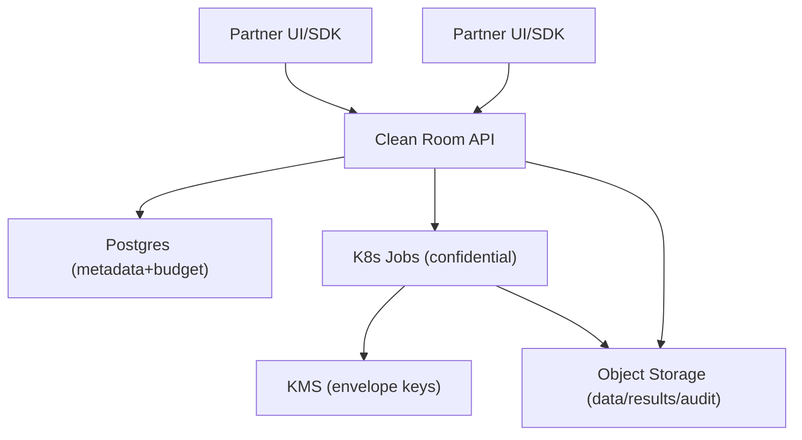
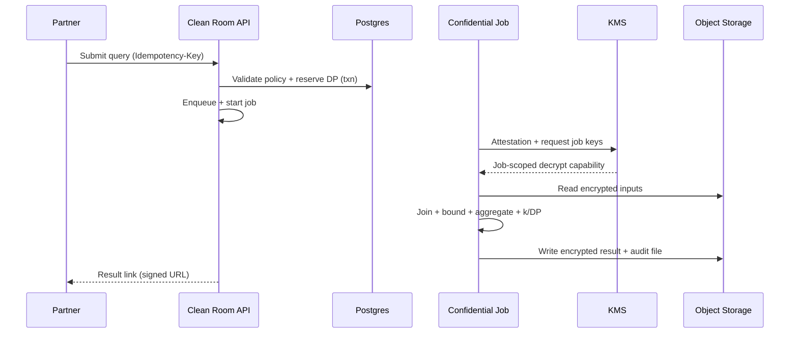

# Data Clean Room

## Overview

A data clean room lets multiple parties join and analyze datasets while preventing row-level disclosure and minimizing operator access to plaintext. The core of the system is governed execution: only approved aggregate queries can run, privacy loss is accounted for over time, outputs are filtered for small cohorts, and decryption is permitted only inside an attested confidential environment with tightly controlled egress.

This design uses a small set of building blocks:
- A single **control service** for identity, governance, budgeting, orchestration, and auditing.
- A **confidential compute job** image that performs joins, contribution bounding, aggregation, and output checks.
- **Postgres** for strongly consistent metadata and differential-privacy budgeting.
- **Object storage** for encrypted datasets, results, and append-only audit files.
- A managed **KMS** for envelope encryption and job-scoped key release.

## Requirements

### Functional Requirements
- Ingest partner datasets (batch; optional incremental) into tenant-isolated namespaces.
- Support privacy-safe joins on approved keys (email/phone/device ID) with deterministic normalization and tokenization.
- Provide a constrained query interface (templates or restricted SQL) that returns **aggregates only**.
- Enforce per-collaboration policies: allowed joins, dimensions, metrics, minimum cohort size (`k`), time windows, retention, and approved egress destinations.
- Enforce differential privacy (DP) budgeting (epsilon/delta) across queries; block when depleted.
- Deliver results only to approved destinations via signed URLs / short-lived credentials.
- Provide full auditability: identity, policy hash, budget consumption, suppression decisions, attestation evidence, and result release.
- Support collaboration workflows: dataset approvals, policy negotiation, time-bounded grants, and revocation.

### Non-Functional Requirements (Target)
- Tenants: **100–500**
- Total data: **1–5 PB** in object storage
- Control-plane traffic: **100–300 QPS sustained**, **1k QPS burst**
- Compute: **50–200 concurrent jobs typical**, **500 burst**
- Availability: Control plane **99.95%** (multi-AZ, single-region); compute **99.9%**
- Strong consistency for: policies, approvals, budgets, query state, audit ordering

## Simplified Architecture

### High-Level Diagram

### Responsibilities by Component

#### 1) Clean Room API (Control Service)
A single service (modular monolith) that provides:
- AuthN/AuthZ (OIDC/SAML integration; tenant isolation; RBAC/ABAC)
- Dataset registration, approvals, and schema/version metadata
- Policy lifecycle (draft → approvals → active; versioned with hashes)
- Query admission (template validation, dimension/metric allowlists, time windows)
- DP budgeting (transactional enforcement using a ledger in Postgres)
- Job orchestration (enqueue + start confidential jobs; track state transitions)
- Audit emission (append-only events to object storage + queryable index in Postgres)
- Result release (signed URLs / short-lived credentials; retention enforcement)

#### 2) Confidential Compute Jobs
A single job image running on confidential-capable nodes (e.g., SEV-SNP/TDX) that:
- Reads encrypted inputs from object storage
- Normalizes and tokenizes join keys inside the confidential boundary
- Executes joins and applies contribution bounding (per-identity caps)
- Computes aggregates for approved query templates only
- Enforces output rules (minimum `k`, allowlisted dimensions/metrics)
- Applies DP noise (when enabled) using defined query classes and bounds
- Writes encrypted results and audit signals to object storage only

Egress is restricted at the platform level (network policies + IAM): the job can reach only object storage and KMS endpoints required for the workload.

#### 3) Postgres (Metadata + DP Ledger)
One strongly consistent database for:
- Tenants, principals, datasets, versions, join-key specs
- Policies, approvals, access grants
- Queries (idempotency keys, canonical hashes, state machine)
- DP budget accounts + append-only budget ledger entries
- Audit event index (pointers/hashes for fast investigations)

Multi-AZ HA + backups provide the control-plane durability target.

#### 4) Object Storage (Encrypted Artifacts)
One durable store with separate prefixes for:
- Raw ingested datasets (encrypted)
- Query outputs (encrypted; time-limited access via signed URLs)
- Append-only audit files (WORM-capable retention where available)
- Attestation evidence blobs and job manifests (as audit artifacts)

#### 5) KMS (Envelope Encryption + Job-Scoped Access)
A managed KMS is used to:
- Encrypt per-dataset data keys (envelope encryption)
- Gate job-scoped decryption based on workload identity and attestation evidence
- Issue short-lived credentials or wrapped keys for a specific `query_id`

## Core Privacy & Security Model

### Constrained Query Surface
Queries are submitted as **templates** with validated parameters (dates, allowlisted dimensions, allowlisted metrics). Templates define:
- Join keys allowed for the collaboration
- Permitted GROUP BY columns and filters
- DP query class (count/sum/mean/histogram) and sensitivity assumptions
- Contribution bounds required for the template

### Tokenization for Joins
Join keys are handled as follows:
- Deterministic normalization (email lower/trim; phone E.164; device ID canonical form)
- Deterministic tokenization inside confidential compute:
  - `token = HMAC(policy_secret, normalized_identifier)`
- The `policy_secret` is derived per collaboration/policy and released only to attested jobs.

### Output Enforcement (k + DP)
Each job enforces:
- Minimum cohort size (`k`) per output cell, with suppression/merging as defined by policy
- DP noise addition (when enabled) using template-specific contribution bounds and composition rules
- Canonical query hashing to support repeat-query handling (including “sticky noise” per canonical query where configured)

### Budget Accounting
- Each admitted query computes an `epsilon_cost` (template-defined or parameter-dependent).
- Budget enforcement is a single Postgres transaction:
  - Verify remaining budget
  - Insert an immutable ledger debit for `query_id`
  - Transition query state to `ADMITTED`

## Data Flow (Query Execution)

## Data Model (Minimal)

### Key Tables (Postgres)
- `tenants(tenant_id, name, status, created_at)`
- `principals(principal_id, tenant_id, external_id, role, status, created_at)`
- `datasets(dataset_id, tenant_id, name, created_at, status)`
- `dataset_versions(version_id, dataset_id, schema_json, location_uri, created_at, status)`
- `policies(policy_id, name, participants_json, rules_json, min_k, dp_config_json, retention_days, policy_hash, status, created_at)`
- `policy_approvals(policy_id, tenant_id, approved_by, approved_at, status)`
- `dp_budget_accounts(account_id, policy_id, epsilon_total, delta, reset_period, status, created_at)`
- `dp_budget_ledger(entry_id, account_id, query_id, epsilon_debit, created_at)` (append-only)
- `queries(query_id, policy_id, template_id, params_json, canonical_hash, epsilon_cost, status, idempotency_key, created_at, started_at, finished_at)`
- `results(result_id, query_id, output_uri, output_schema_json, row_count, suppressed_cells, dp_applied, released_at, expires_at)`
- `audit_index(event_id, tenant_id, type, subject_id, event_hash, object_uri, created_at)` (points to immutable audit files)

### Object Storage Layout
- `lake/tenant={tenant_id}/dataset={dataset_id}/version={version_id}/...`
- `results/policy={policy_id}/query={query_id}/result.parquet`
- `audit/date=YYYY-MM-DD/events.ndjson` (append-only; hash-chained per file)

## API Design (Control Plane)

### Conventions
- All mutating endpoints require `Idempotency-Key`.
- Every response that makes an authorization/privacy decision returns `policy_hash` and `decision_id`.
- Results are never streamed inline; only delivered via signed URLs / warehouse sinks.

### Core Endpoints (REST)
- `POST /v1/datasets`
- `POST /v1/datasets/{dataset_id}/versions` (register manifest + location)
- `POST /v1/policies` and `POST /v1/policies/{policy_id}:approve`
- `POST /v1/queries` (template + params)
- `GET /v1/queries/{query_id}`
- `GET /v1/queries/{query_id}/result`

## Operations (Minimal but Sufficient)

- **SLOs**: API availability 99.95%, admission P99 < 1s, job start P99 < 5 min (cold), audit durability on write.
- **Security monitoring**: attestation failures, key-release counts, denied admissions, unexpected egress attempts, suppressed-cell spikes, budget anomalies.
- **Fail-closed controls**: attestation/key-release/budget/output enforcement failures block result release.
- **DR**: Postgres backups + WAL archiving; object storage replication for audit/results as needed.

## Simplification Notes

- Removed `API Gateway`; acceptable because a single service behind a standard L7 load balancer covers routing, auth integration, and rate limiting at this scale.
- Merged `AuthN/AuthZ`, `Policy Service`, `DP Budget Service`, `Orchestrator/Queue`, and `Attestation Verifier` into `Clean Room API`; acceptable because these functions share the same strongly consistent metadata and can be implemented as modules with one deployment boundary.
- Removed `Key Broker`; acceptable because managed `KMS` + job-scoped credentials/keys provides envelope encryption and controlled key release with fewer moving parts.
- Merged `Output Guard` into the confidential job image; acceptable because outputs are produced only inside the confidential boundary and written only to controlled object storage locations, with the same enforcement logic applied before any release.
- Removed a dedicated `Append-only Audit Log` database; acceptable because immutable audit files in object storage (WORM where available) plus a lightweight Postgres index provide tamper-evidence and practical queryability.
- Reduced caching layers to optional in-process TTL caches (policy/template compilation); acceptable because Postgres-backed admission remains within the stated control-plane latency targets.
- Complexity that remains: confidential execution + attestation, DP accounting, contribution bounding, and strict output enforcement; necessary to meet “aggregates only”, repeated-query protection, and minimized operator trust requirements.