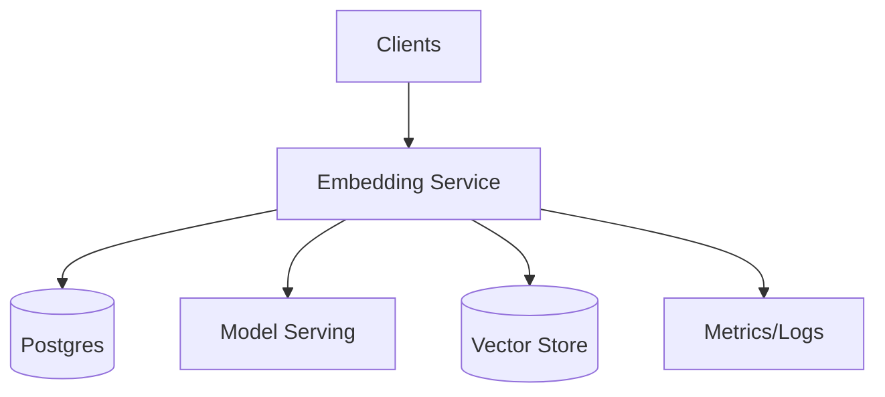

## Overview

Search, recommendations, and RAG rely on embeddings that are *derived data* from documents plus a specific embedding stack (model + tokenizer + preprocessing). As models evolve, embeddings must be safely regenerated while serving traffic.

This design treats embeddings as **versioned, recomputable artifacts**:

- **Immutable model versions**: a `model_version` pins model artifact, tokenizer, preprocessing, dims, and normalization.
- **Alias-based serving**: `active` and `shadow` aliases enable rollout, shadow evaluation, and instant rollback.
- **SQL-led control plane**: PostgreSQL is the source of truth for documents, embedding status, jobs, and shard leases.
- **Background processing built into the service**: one deployable service runs both the APIs and the worker loops.

---

## Requirements

### Functional
- Document CRUD with embedding status per alias/version.
- Full backfill for a `model_version` over a large corpus.
- Incremental embedding for changed docs.
- Serve queries against an alias (`active` by default) while building other versions.
- Job progress, shard health, and error reporting.
- Drift/quality checks that gate promotion.
- Safe rollout and rollback with no downtime.
- End-to-end idempotency across retries.

### Non-Functional Targets
- Corpus: 10–50M docs initially; plan to 200M.
- Updates: 200–2,000 docs/sec bursty (tenant-aware throttling).
- Embedding dims: 768–3,072; store float16 when supported.
- Availability: vector search reads 99.99%, pipeline 99.9%.
- Consistency: strong for metadata/jobs (SQL), eventual for embeddings (async upserts).

---

## Simplified Architecture

### High-Level Diagram

**Embedding Service** is a modular monolith that provides:
- Data-plane APIs: document CRUD and search
- Control-plane APIs: model versions, aliases, backfills
- Background workers: incremental embedding and backfill shard processing

---

## Components

### 1) Embedding Service (API + Workers)
**Responsibilities**
- Document CRUD and metadata validation (PII-safe handling, token caps).
- Search endpoint: embed query for resolved alias and call vector search.
- Control plane: create model versions, manage aliases, start/pause/cancel backfills.
- Background loops:
  - incremental embedding from per-doc tasks
  - backfill execution from shard tasks

**Key behaviors**
- **Single transactional write**: document update + enqueue work in PostgreSQL in one transaction.
- **Idempotent embedding**: embeddings are keyed by `(tenant_id, doc_id, model_version, content_hash)`; if already `ready`, work is skipped.
- **Priority scheduling**: incremental tasks are higher priority than bulk backfill tasks.

---

### 2) PostgreSQL (Documents + Control Plane + Work Queue)
**Responsibilities**
- Strongly consistent source of truth for:
  - documents and their `content_hash`
  - model versions and aliases
  - per-document embedding state
  - backfill jobs, shards, and leases
  - task queue for doc/shard work

**Operational notes**
- PITR enabled; partitions for the largest tables (typically `doc_embeddings` and `work_items`).
- Row-level locking (`FOR UPDATE SKIP LOCKED`) for safe task leasing and retries.

---

### 3) Model Serving
**Responsibilities**
- Serve a pinned `model_version` embedding endpoint with stable dims and normalization.
- Support batching and mixed precision to optimize tokens/sec.

**Safety**
- Startup self-checks: tokenizer/preprocess versions, output dims, normalization mode.

---

### 4) Vector Store
**Responsibilities**
- Store embeddings and support ANN search with metadata filters (tenant, visibility, language, doc_type).
- Keep versions isolated via **one collection/index per `model_version`** (preferred), enabling safe cutover and rollback via aliases.

---

### 5) Observability
- Metrics: tokens/sec, queue depth, job/shard completion, error rates, inference latency, vector upsert latency.
- Logs/traces: request IDs, task IDs, model_version, tenant_id, failure reasons.

---

## Data Model (PostgreSQL)

**`documents`**
- `tenant_id`, `doc_id` (PK)
- `content` (or `content_ref` if using external storage)
- `content_hash` (hash of normalized content + preprocess_version)
- `metadata_json` (language, visibility, doc_type, etc.)
- `updated_at`, `deleted_at`

**`model_versions`**
- `model_version` (PK), `model_name`
- `tokenizer_version`, `preprocess_version`
- `dims`, `normalize`
- `status` (`staged|shadow|active|retired`)
- `created_at`

**`model_aliases`**
- `alias` (PK: `active`, `shadow`)
- `model_version`, `updated_at`

**`doc_embeddings`**
- `tenant_id`, `doc_id`, `model_version` (PK)
- `content_hash`
- `embedding_ref` (vector ID or `{tenant_id}:{doc_id}` pointer)
- `status` (`pending|ready|failed`)
- `last_error`, `attempts`, `updated_at`

**`backfill_jobs`**
- `job_id` (PK), `model_version`
- `scope` (`full|incremental|drift_triggered`)
- `state` (`running|paused|completed|failed|canceled`)
- `rate_limit_tokens_per_sec`
- `created_at`, `updated_at`

**`backfill_shards`**
- `job_id`, `shard_id` (PK)
- `state` (`pending|running|completed|failed`)
- `lease_owner`, `lease_expires_at`
- `attempts`, `last_error`

**`work_items`** (single queue for both doc and shard tasks)
- `work_id` (PK)
- `priority` (e.g., `online > bulk`)
- `type` (`doc_embed|shard_run`)
- `tenant_id` (nullable for shard work), `doc_id` (nullable), `job_id`/`shard_id` (nullable)
- `available_at`, `locked_by`, `lock_expires_at`
- `attempts`, `last_error`, `created_at`

---

## Data Flow

### Incremental Update (Doc Changed)
1. `PUT /docs/{doc_id}` writes `documents` and sets `doc_embeddings` to `pending` for the relevant aliases/versions.
2. Same transaction inserts `work_items(type=doc_embed, priority=online)`.
3. Worker claims work via `FOR UPDATE SKIP LOCKED`, fetches doc content, preprocesses, batches by tokens, calls model serving.
4. Worker upserts vectors, then marks `doc_embeddings` as `ready` (or `failed` with error).

### Full Backfill (Shard-Based)
1. `POST /backfills` creates `backfill_jobs` and `backfill_shards`.
2. Service enqueues shard work as `work_items(type=shard_run, priority=bulk)`.
3. Workers lease shards via `backfill_shards.lease_*`, page through docs, embed, upsert, and update `doc_embeddings`.
4. When all shards complete, the job is marked `completed` and becomes eligible for promotion gates.

### Query Path (Alias-Aware)
1. Client calls `POST /search` with `model_alias=active`.
2. Service resolves alias → `model_version` in PostgreSQL.
3. Service embeds query via model serving (pinned version).
4. Service queries vector store (collection for `model_version`, with tenant + filters).
5. Response includes `model_version` used.

---

## API Design

### Control Plane
- `POST /v1/models/versions`
- `PUT /v1/models/aliases/{alias}`
- `POST /v1/backfills`
- `GET /v1/backfills/{job_id}`
- `POST /v1/backfills/{job_id}:pause|:resume|:cancel`

**Promotion gates (typical defaults)**
- `ready_ratio >= 0.999` for targeted scope/tenants
- offline eval checks recorded as `pass`
- vector index for target version is warmed/healthy

### Data Plane
- `PUT /v1/tenants/{tenant_id}/docs/{doc_id}`
- `GET /v1/tenants/{tenant_id}/docs/{doc_id}/embeddings`
- `POST /v1/tenants/{tenant_id}/search`

---

## Scaling & Performance

- Plan capacity in **tokens/sec**; enforce hard caps on tokens per document and per batch.
- Separate worker concurrency pools by priority (`online` vs `bulk`) within the same service deployment.
- Batch embeddings by token budget to maximize GPU throughput while protecting tail latency.
- Vector ingestion:
  - bulk upserts for backfills
  - smaller batches for online updates
- PostgreSQL:
  - partitions for `doc_embeddings` by `model_version`
  - indexes for `status IN ('pending','failed')`
  - keep hot control-plane queries small and well-indexed

---

## Failure Modes & Mitigations

1. **Model serving latency/errors**
   - Circuit-breaker and backoff; workers retry with jitter; bulk work is throttled first.
2. **Vector store write failures**
   - Retry with smaller batches; mark per-doc failures in `doc_embeddings`; continue shard processing.
3. **Worker crash mid-task**
   - Lock expiry returns work to the queue; idempotent checks prevent duplication from corrupting state.
4. **Bad inputs / poison documents**
   - Per-doc failure recorded with reason; work item stops retrying after a max attempt threshold and remains visible for remediation.

---

## Operations

- Dashboards: tokens/sec, work queue depth, shard completion, error rates, inference P95/P99, vector upsert latency, search latency.
- Alerts: online queue delay, inference error rate, vector upsert rejection, stalled backfill shards, promotion gate failures.
- Backups/DR: PostgreSQL PITR + snapshots; embeddings remain recomputable with a bounded RPO target.

---

## Simplification Notes

- **Removed**: Event bus/queue and outbox; work dispatch is handled by `work_items` in PostgreSQL with transactional enqueue, leasing, and retries.
- **Removed**: Separate backfill orchestrator service; shard planning and job lifecycle run inside the Embedding Service control-plane module.
- **Removed**: Dead letter queue; terminal failures are tracked in `work_items.last_error` and `doc_embeddings.status=failed` for review and replay tooling.
- **Merged**: Document store and metadata store into PostgreSQL (with optional `content_ref` pattern if large content must live outside SQL).
- **Merged**: Query embedder and vector search router into the Embedding Service; query embedding is a direct call to model serving and search is a direct call to the vector store.
- **Complexity kept**: Aliases (`active`/`shadow`) for safe rollout/rollback, shard-based backfills for throughput, and idempotent keys for correctness under retries.