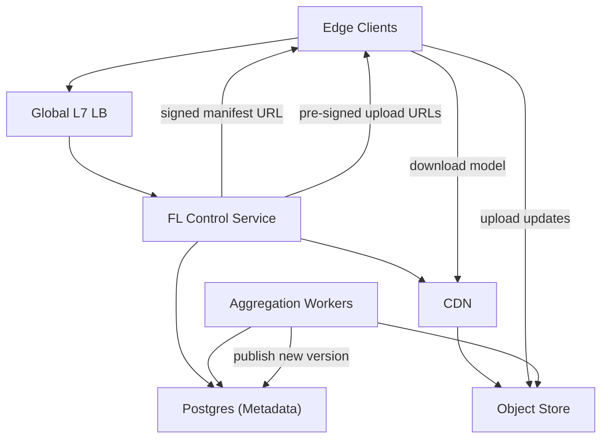
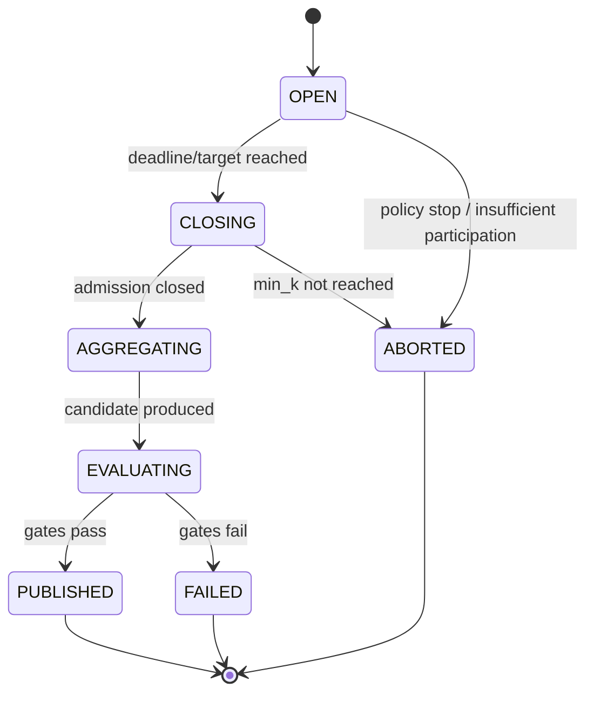

## Overview

This federated learning (FL) system trains models across millions of edge devices without centralizing raw user data. Devices download a signed training task (model + config), run local training, and upload encrypted/masked updates. The server coordinates rounds and produces a new global model using **secure aggregation** so only an aggregate is revealed. Optionally, it enforces **differential privacy (DP)** at publish time so released models resist inference about any single participant.

The design keeps a small set of managed building blocks:
- A single **control service** (API + policy + scheduling + registry) for correctness-critical state.
- An **object store + CDN** for all large artifacts.
- An **aggregation worker pool** for secure aggregation, evaluation gates, and publishing.
- A single **strongly consistent metadata database** for round state and audit.

---

## Requirements

### Functional
- Serve a training task (manifest + artifact URLs + training/privacy config).
- Admit eligible devices into a round, enforce quotas/limits, and issue upload authorization.
- Accept encrypted/masked updates and aggregate-only metrics.
- Aggregate into a new global model and publish atomically (single visible version).
- Multi-tenant isolation for policies, quotas, storage paths, and observability.
- Audit round configs, thresholds, aggregate counts, and publish history.
- Mitigate malformed/adversarial behavior with protocol compliance checks and evaluation gates.
- Safe rollouts/rollbacks for models and training configs.

### Non-Functional Targets
- Task fetch (regional): P50 ≤ 50 ms, P99 ≤ 200 ms
- Join decision: P99 ≤ 250 ms
- Upload path: direct-to-object-store; server-side processing P99 ≤ 300 ms per request (excluding transfer)
- Round completion: 5–30 minutes
- Availability: APIs 99.95%, aggregation/publish 99.9%
- Published artifacts: RPO = 0 with replication/versioning
- Metadata DB: RPO ≤ 5 minutes, RTO ≤ 30 minutes
- Consistency: strong consistency for round transitions and publish; eventual for telemetry/analytics

---

## Simplified Architecture

### Major Consolidations (as part of the design)
- A single **FL Control Service** owns APIs, policy enforcement, scheduling, and the model registry to keep round correctness and audit in one place.
- **CDN + object store** handle all large downloads/uploads to keep the API off the bandwidth path.
- **Aggregation workers** run secure aggregation, evaluation gates, and publishing as one pipeline per round.

---

## Components

### 1) FL Control Service (stateless)
Responsibilities:
- `GET /v1/tenants/{t}/models/{m}/task`: returns a signed manifest URL + short-lived join token.
- `POST /v1/tenants/{t}/models/{m}/rounds:join`: validates eligibility, admits a participant, returns participant token + pre-signed upload URLs.
- `POST /v1/tenants/{t}/models/{m}/rounds/{r}:uploadComplete`: records completion with artifact hash/size (idempotent).
- Admin endpoints for model/config rollout, rollback (pin version), and policy updates (audited).

Key behaviors:
- Strongly consistent writes for admission and state transitions (transactions + conditional updates).
- Short-lived scoped tokens for join and upload completion authorization.
- Lightweight in-process caching (seconds) for “current round pointer” and policy snapshots.

### 2) Postgres Metadata DB (strong consistency)
Stores:
- model versions and the “current” published version pointer
- round state machine and thresholds
- participants (pseudonymous) and upload status
- append-only audit events (publish decisions, config versions, DP budget consumption)

Operational posture:
- Managed Postgres with PITR, automated backups, and a cross-region replica for failover.

### 3) Object Store + CDN (data plane)
- **Models/manifests**: immutable, versioned, cacheable via CDN.
- **Client uploads**: direct multipart/resumable uploads to the object store using pre-signed URLs.
- **Lifecycle policies**: TTL for per-round artifacts; long-lived retention for published versions with explicit deletion workflows.

### 4) Aggregation Workers
A worker pool processes rounds:
- Claims rounds ready for aggregation (threshold met or deadline reached).
- Runs secure aggregation phases (as configured for the protocol version).
- Validates artifacts (hash/size/schema) and enforces `min_k`.
- Produces aggregate + candidate model artifact.
- Runs evaluation gates (offline metrics, holdout checks, canary rules).
- If approved, publishes atomically by advancing DB state and updating the model’s current version pointer, then writes the new signed manifest.

Round readiness is driven by the DB (no separate event bus required):
- Workers periodically scan indexed “OPEN/CLOSING” rounds and claim work via transactional locks/conditional updates.

---

## Privacy & Security Model

### Secure Aggregation (required)
- Clients follow a dropout-resilient secure aggregation protocol with a minimum threshold `k`.
- The server learns only the aggregate (sum/average) and aggregate-only metrics.
- Rounds abort cleanly if `min_k` is not met.

Server-side enforcement:
- Round configs include protocol version, timeouts, size caps, and `min_k`.
- Aggregation workers only proceed when thresholds are satisfied and all artifacts pass integrity checks.

### Differential Privacy at Release (optional)
If enabled per model/tenant:
- Enforce clipping (client-side and/or library-enforced constraints).
- Add calibrated noise during aggregation/publish.
- Track DP budget consumption in the metadata DB; block publish when budget is insufficient.
- Record DP parameters and accounting outputs in the audit log for each published version.

### Authenticity & Integrity
- Manifests and training configs are signed; clients verify signatures.
- Uploads are verified using hashes and strict size caps before aggregation.
- Rate limiting and abuse controls at the load balancer/WAF; tenant quotas enforced in the control service.

---

## Data Model (minimal)

### Tables (Postgres)
**`models`**
- `tenant_id`, `model_id` (pk)
- `current_version_id`
- `policy_version_id`
- `dp_budget_state` (nullable)
- timestamps

**`model_versions`**
- `tenant_id`, `model_id`, `version_id` (pk)
- `manifest_uri`, `model_uri`
- `created_at`, `created_by`

**`rounds`**
- `tenant_id`, `model_id`, `round_id` (pk)
- `state` (`OPEN | CLOSING | AGGREGATING | EVALUATING | PUBLISHED | FAILED | ABORTED`)
- `min_k`, `target_n`, `deadline_at`
- `policy_snapshot` (or `policy_version_id`)
- `aggregate_uri`, `candidate_model_uri`, `published_version_id`
- timestamps

**`participants`** (bounded retention)
- `tenant_id`, `model_id`, `round_id`, `participant_id` (pk)
- `status` (`JOINED | UPLOADED | DROPPED | REJECTED`)
- `artifact_uri`, `artifact_sha256`, `size_bytes`, `uploaded_at`
- TTL/retention: 7–30 days

**`audit_events`**
- `event_id` (pk), `tenant_id`, `model_id`, `round_id` (nullable), `type`, `payload`, `created_at`

### Object store layout
- Updates: `.../tenant={t}/model={m}/round={r}/participant={p}/update.bin`
- Aggregates: `.../tenant={t}/model={m}/round={r}/aggregate.bin`
- Models: `.../tenant={t}/model={m}/version={v}/model.bin`
- Manifests: `.../tenant={t}/model={m}/version={v}/manifest.json` (signed)

---

## Round State Machine

All transitions are conditional updates in Postgres (transaction + expected state), ensuring no double publish.

---

## Core Flows

### Task fetch + join
1. Client calls `task` with device signals (no long-lived raw identifiers).
2. Control service returns:
   - signed manifest URL (CDN cacheable, versioned)
   - short-lived join token scoped to (tenant, model, round)
3. Client calls `rounds:join` with join token and capabilities.
4. Control service:
   - enforces policy (quotas, min app version, max upload size, region rules)
   - creates/returns `participant_id` (pseudonymous) and participant token
   - issues pre-signed upload URLs to the object store

### Upload + aggregation + publish
1. Client uploads update to object store (multipart/resumable).
2. Client calls `uploadComplete` with artifact URI + hash + size (idempotent).
3. Aggregation workers claim ready rounds, run secure aggregation, run evaluation gates, then publish:
   - write immutable model artifact + signed manifest
   - atomically advance DB state and update `models.current_version_id`

---

## Scaling, Availability, and Operations

### Performance approach
- CDN serves manifests and model downloads; versioned URLs maximize cache hit rate.
- Direct-to-object-store uploads handle bandwidth spikes elastically.
- Postgres is the correctness anchor; write paths remain O(1) per join/uploadComplete with proper indexes and partitioning by `(tenant_id, model_id)`.

### Multi-region posture (minimal)
- Global load balancer routes clients to the nearest API region.
- Control service writes to a primary Postgres region; a warm cross-region replica supports failover (RPO/RTO targets).
- Object store uses versioning and cross-region replication for published artifacts (RPO = 0).

### Monitoring essentials
- Join funnel: task → join → uploadComplete → aggregated → published
- Upload: bytes/sec, failure/throttle rates, completion time
- Rounds: time in state, min_k attainment rate, abort/fail rates
- Publish safety: any publish without min_k (should be impossible), DP budget blocks, evaluation failures

---

## Simplification Notes

- Removed: separate Policy/Privacy service by embedding policy snapshots and DP accounting into the `FL Control Service` and Postgres, keeping a single source of truth and a single audit trail.
- Removed: dedicated Round Scheduler service by making round creation/closing part of the control service and using worker-driven round claiming based on DB state.
- Removed: external event bus by having aggregation workers discover/claim work from Postgres using indexed queries and conditional state transitions.
- Removed: Redis/eligibility cache as a required component by relying on CDN caching for immutable artifacts and short-lived in-process caching for hot metadata reads.
- Removed: upload proxy by using direct object store uploads with pre-signed URLs and enforcing limits via tokens, size caps, and load-balancer/WAF controls.
- Merged: Model Registry into the control service + `model_versions` table + signed manifests stored in the object store.
- Remaining complexity: secure aggregation (multi-phase, min_k, dropout handling) and optional DP accounting, both necessary to meet the privacy requirements; strong consistency for publish to guarantee a single authoritative model version.