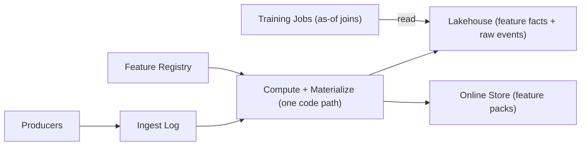

## Overview

A feature store is a contract: “given an entity key and a timestamp, return the feature values that were known at that time.” The offline store is the source of truth (time-versioned feature facts); the online store is a low-latency projection of those same semantics.

The system is intentionally small: a feature registry that pins definitions, one canonical offline fact table that enforces “known at the time,” and an online store that serves an atomic “feature pack” per entity and feature set.

## What Makes This Hard

Naive implementations leak data by joining labels with “latest features,” and they drift by computing online and offline features with different code paths. Late events make this worse: you need “as of label time” for correctness and “as of dataset cutoff” for reproducibility.

## Requirements

### Functional Requirements
- Serve online features by `(entity_id, feature_set)` with p95 single-digit milliseconds.
- Generate training datasets with point-in-time correctness: for each training row at time `t`, use only feature values with `event_time <= t` and only values recorded before the dataset’s cutoff.
- Support feature versioning and safe evolution (schema, transformation changes) without silently changing training data.
- Handle late-arriving events and backfills without violating point-in-time semantics.
- Enforce a single definition of each feature across offline and online serving.

### Scale Targets
- **Entities:** 100M distinct entity IDs (users, items, accounts).
- **Features:** 5k total features, 100–300 used per model.
- **Online QPS:** 50k reads/sec peak; 95% of requests are multi-feature fetches for a single entity.
- **Freshness:** P99 feature staleness under 60s for “online-critical” features.
- **Offline training joins:** 1–10B training rows/day with 50–200 features joined per row.

## Key Design Decisions

- **What we chose:** Store feature values as bitemporal facts in the lakehouse: `(entity_id, feature_name, event_time, record_time, value, feature_version)`, and read them with a single deterministic “as-of” rule.
  - **Why:** `event_time` makes point-in-time correct; `record_time` (ingestion/correction time) makes training datasets reproducible under late data and backfills.

- **What we chose:** Serve online reads from an atomic **feature pack** per `(entity_id, feature_set, feature_set_version)` rather than fetching 100–300 individual features.
  - **Why:** One key read gives consistent multi-feature responses and a hard bound on fanout under traffic spikes.

- **What we chose:** Keep the registry as a control plane (definitions are versioned, compiled, and pinned); serving and materialization run on cached/pinned artifacts.
  - **Why:** Registry downtime should block publishes, not break inference or streaming.

**What We Removed**
- Raw-vs-offline split as separate “stores” (raw events and feature facts live in the same lakehouse).
- A custom “training builder service” (training datasets are a standard as-of join template + job).
- Per-feature online reads (feature packs are the default).
- Live registry lookups on the hot path (pinned definitions are cached and shipped).

## Architecture

### Components

- **Ingest Log (Kafka/PubSub):** Durable event ingestion with replay.
  - **Justification:** Without replay, you can’t re-materialize online state or backfill deterministically.

- **Lakehouse (Iceberg/Delta on object storage):** Canonical history for raw events and feature facts with time travel.
  - **Justification:** Without an append-friendly, queryable history, point-in-time training and backfills become guesswork.

- **Feature Registry (Postgres):** Feature contracts and versions (keys, TTL, allowed lateness, owners), plus pinned “published” artifacts.
  - **Justification:** Without version pinning and a single contract, online/offline skew and silent training-data changes become normal.

- **Compute + Materialize (Spark/SQL + streaming):** Runs the same feature definitions to (1) append feature facts and (2) update online feature packs.
  - **Justification:** Without one code path, you reintroduce skew; without materialization, you miss online latency targets.

- **Online Store (Redis Cluster / DynamoDB):** Key-value reads for inference: `entity_id + feature_set_version -> pack`.
  - **Justification:** Without a low-latency KV store, p95 single-digit milliseconds is not realistic at 50k QPS.

## Deep Dive: Point-in-Time Correctness (As-Of Joins Without Leakage)

The system enforces one deterministic read rule for training datasets:

- Build a **training spine** with `(entity_id, label, label_time)`; `label_time` is the “pretend prediction time.”
- Store feature facts with both timestamps:
  - `event_time`: when the value became true in the world
  - `record_time`: when the value was recorded (ingested or corrected)
- Generate a dataset with two constraints and a tie-breaker:
  - **Correctness:** `event_time <= label_time`
  - **Reproducibility:** `record_time <= dataset_cutoff`
  - **Determinism:** pick the row with max `event_time`, then max `record_time`, for each `(entity_id, feature_name)` at each `label_time`

Late events and backfills are handled the same way: they append new facts with a later `record_time`. Training builds include them only if they were recorded before the dataset cutoff (typically `build_time - allowed_lateness`), and that cutoff is stored with the dataset metadata.

## Trade-offs

| Optimized For | Sacrificed |
|--------------|------------|
| No leakage + reproducible rebuilds | Two timestamps and stricter join logic |
| Consistent low-latency online reads | Write amplification when feature packs change |
| One semantics/code path for offline+online | Less freedom for “special-case fast features” |

## Failure Modes

- **Registry down for 5 minutes:** Online reads and materialization continue on pinned/cached definitions; publish/version changes are blocked until recovery.
- **Late events change aggregates:** Corrections append new facts with later `record_time`; datasets only include records with `record_time <= cutoff`, and online packs converge as materialization catches up.
- **Rebuild accidentally includes “future-known” data:** Training joins always apply `record_time <= dataset_cutoff`, and the cutoff is recorded with the dataset.
- **Online store/network partition:** Materialization retries; packs are written atomically per `(entity_id, feature_set_version)` and reads return the last-good pack (or defaults) when freshness is violated.
- **Traffic spikes 10×:** One KV read per entity per feature set; enforce request limits and degrade by dropping non-critical feature sets rather than fanning out per feature.

## What I'd Do Differently At...

- **10x scale:** Precompute and cache the most common feature packs, and cluster offline facts by `entity_id` to reduce join shuffle.
- **100x scale:** Split feature facts into a few domain tables with separate SLAs, and shard online packs by entity type + hash.

## Operational Notes

- Track three SLOs per feature/pack: **freshness**, **completeness**, and **lateness** (`record_time - event_time`).
- Treat materialization as replayable state: checkpoint offsets, idempotent writes, and atomic pack updates are the only guarantees you need.
- Record dataset build inputs: feature versions, lakehouse snapshot IDs, and `dataset_cutoff`; rebuilds use those pins, not “latest.”
- Run canary inference requests that fetch packs and validate invariants (ranges, monotonic timestamps) before promoting a new feature version.
