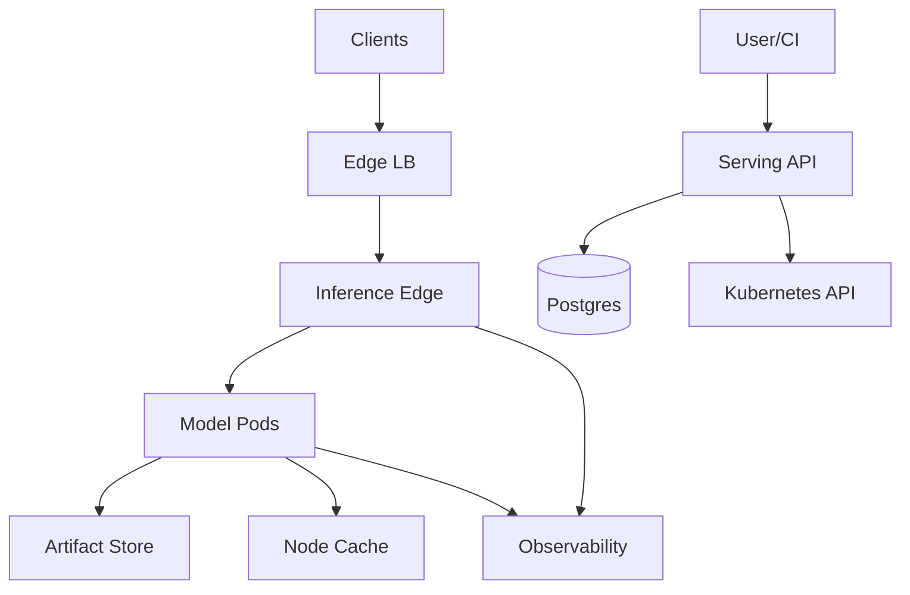
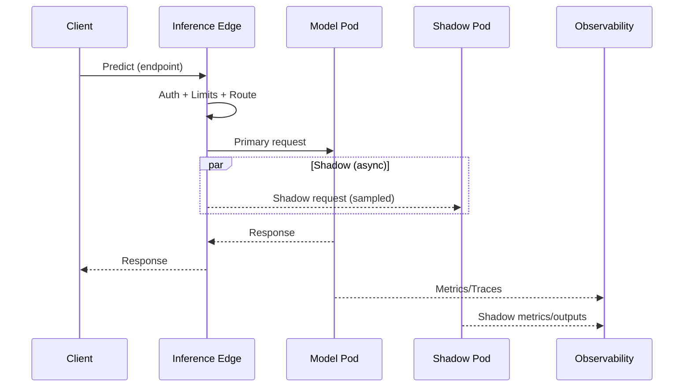
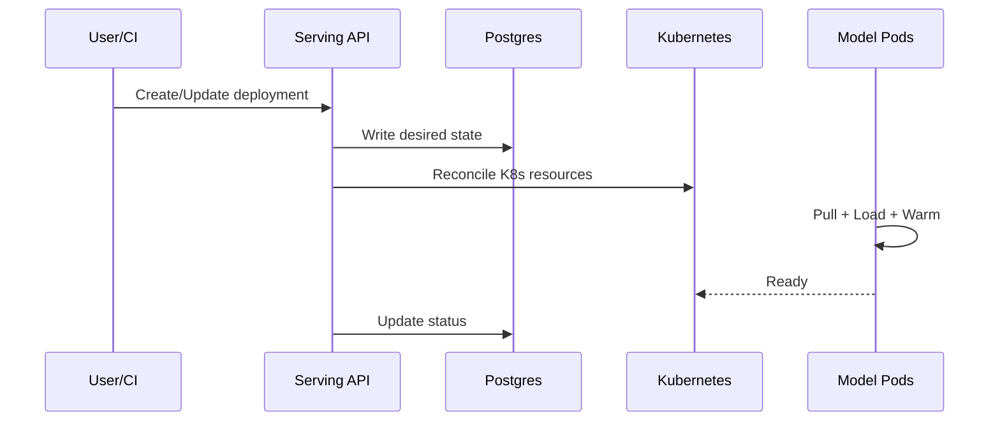

## Overview

This platform serves **thousands of heterogeneous ML models** (CPU, single-GPU, and multi-GPU LLMs) with strict tail-latency SLOs, predictable GPU cost, and safe rollout mechanisms (canary, blue/green, shadow). The design keeps the request path fast and resilient by separating:

- A **control plane** that stores model/deployment intent and reconciles it onto Kubernetes.
- A **data plane** that performs authentication, traffic policy enforcement, and low-latency routing from a **locally cached** view of control-plane state.

Cold starts are handled explicitly with **warm minimums**, **node-local artifact caching**, and **load-budgeted rollouts** to prevent IO storms and tail-latency collapses during deployments.

---

## Requirements

### Functional Requirements
- Register and version models (artifacts + metadata), with immutable versions and provenance.
- Create and manage deployments (resources, runtime, env, secrets, autoscaling).
- Route inference traffic with weighted splits (A/B, canary), blue/green switching, and shadow duplication.
- GPU-aware placement: run replicas on compatible accelerators (type, memory, MIG), enforce quotas and priorities.
- Autoscale based on latency/queueing/GPU utilization; support scale-to-zero for low-traffic endpoints.
- Reduce cold-start latency via warm pools, artifact caching, and controlled concurrent loads.
- Observability: per-model latency/error/throughput, GPU metrics, and shadow comparison reports.
- Multi-tenant isolation: authN/authZ, quotas, audit logs, and usage metering.

### Non-Functional Requirements (Targets)
#### Scale (Concrete)
- Model catalog: **5,000–20,000** model versions.
- Active endpoints: **~1,000**.
- Traffic:
  - “Small/medium” models: **50k QPS avg**, **200k QPS peak**.
  - LLM endpoints: **~500 QPS** aggregate peak (streaming).
- Concurrency: **10k** concurrent clients.
- Artifacts: **10–50 TB** total; individual artifacts **50 MB–200 GB**.

#### Latency (SLOs)
- Small/medium warmed inference:
  - **P50: 20–50 ms**, **P99: 150–250 ms**
- LLM streaming (warmed):
  - **TTFT P50 300–800 ms**, **P99 1.5–3.0 s**
  - Throughput target **20–150 tok/s** per replica (model/GPU dependent)
- Cold start:
  - Small models: **<3 s** target (cache hit), **<10 s** acceptable (miss)
  - Large models: **<20–90 s** depending on artifact size and GPU availability

#### Availability
- Data plane (routing + warmed inference): **99.99%** per region.
- Control plane APIs: **99.9%**.

#### Consistency
- **Strong**: registry metadata, deployment intent, traffic policy, authZ configuration, quotas.
- **Eventual**: metrics aggregation, shadow analysis, usage/billing rollups.

#### Durability
- Artifacts: **11 9s** (object storage).
- Metadata RPO: **≤ 1 minute**; RTO: **≤ 30 minutes**.

### Constraints & Assumptions
- Kubernetes-based deployment with NVIDIA GPUs; optional MIG.
- Encryption in transit/at rest; auditability; tenant isolation.
- GPU utilization is a key KPI; quotas and priorities are required.

---

## Simplified Architecture

**Key properties**
- The **Inference Edge** serves requests from an **in-memory routing/policy snapshot** and continues operating during control-plane incidents.
- The **Serving API** is the single control-plane entry point and reconciles desired state onto Kubernetes.

---

## Components

### Serving API (Control Plane)
**Responsibilities**
- Model registry: models, immutable versions, runtime requirements, provenance pointers.
- Deployments/endpoints: desired state, rollout configuration, traffic policy, quotas, status.
- Reconciliation: create/update Kubernetes resources (Deployments/StatefulSets/HPAs, Services, ConfigMaps/Secrets references).

**Design**
- Postgres is the source of truth for metadata and rollout state.
- A single service runs both the API and controllers (modular codebase, independent worker loops).
- Routers/edges subscribe to policy updates via a lightweight watch API (stream or long-poll), and always keep a last-known-good snapshot.

**Async work (no external bus required)**
- Postgres tables provide an **outbox/job queue** for:
  - shadow output comparison jobs
  - usage aggregation
  - audit export
- Workers poll with `FOR UPDATE SKIP LOCKED` for reliable, simple dispatch.

---

### Inference Edge (Data Plane)
**Responsibilities**
- AuthN/authZ, tenant identification, rate limiting, request validation, tracing.
- Endpoint resolution, weighted routing, sticky routing (optional), and shadow duplication.
- Backpressure: bounded queues, deadlines, and load shedding to protect tail latency.

**Design**
- Maintains an in-memory routing table (endpoints → backends + weights + shadow rules) refreshed from the Serving API watch.
- Shadow is implemented as an asynchronous fork with independent timeouts; it never blocks primary responses.
- Includes minimal admission control: per-tenant and per-endpoint max inflight + RPS limits.

---

### Model Pods (Runtime)
**Responsibilities**
- Load artifacts, warm models, batch requests, execute inference on CPU/GPU.

**Runtime standardization**
- **Triton** for “classical” CPU/GPU inference (ONNX/TensorRT/TF/PyTorch backends).
- **vLLM or TGI** for LLMs (streaming, continuous batching, KV cache management).

**Cold-start controls**
- Readiness only flips when the model is fully loaded and optionally warmed.
- Per-node “load budget” limits concurrent large loads to avoid IO saturation (implemented via a node-local lock/lease or a shared limiter in the Serving API).

---

### Artifact Store + Node Cache
**Responsibilities**
- Artifacts live in object storage (S3/GCS/MinIO) and are referenced by digest.
- A node-local cache (NVMe) reduces repeated downloads and stabilizes cold-start time.

**Design**
- Content-addressed layout: `/<digest>/...` enables safe reuse and simple invalidation.
- Cache is managed by a DaemonSet (pull-through + LRU eviction + size budget).
- Model pods verify digest on load.

---

### Observability
**Scope**
- Prometheus metrics + OpenTelemetry traces.
- Centralized logs (Loki/ELK-style stack).

**Minimum metrics**
- Per endpoint/deployment: RPS, error rate, latency p50/p95/p99, queue time, ready replicas.
- GPU: utilization, memory, throttling, DCGM health indicators.
- Policy propagation: current policy version in use per Inference Edge.

---

## Data Model (Control Plane)

### Core Tables
**tenants**
- `tenant_id`, `name`, `created_at`

**models**
- `model_id`, `tenant_id`, `name`, `task_type`, `created_at`, `updated_at`

**model_versions**
- `version_id`, `model_id`
- `artifact_uri`, `artifact_digest`
- `runtime` (triton, vllm, tgi, custom)
- `signature` (json)
- `requirements` (json: min_gpu_mem_gb, gpu_type_allowlist, mig_profile, gpu_count)
- `created_by`, `created_at`

**endpoints**
- `endpoint_id`, `tenant_id`, `name`
- `auth_config` (json: audience/issuer/required_scopes or RBAC refs)
- `created_at`

**deployments**
- `deployment_id`, `endpoint_id`, `version_id`
- `resources` (json: cpu/mem/gpu_count/gpu_type/mig_profile)
- `min_warm_replicas`, `max_replicas`
- `autoscaling_policy` (json)
- `rollout_policy` (json: surge/unavailable/load_budget)
- `status`, `created_at`, `updated_at`

**traffic_policies**
- `endpoint_id` (PK/FK)
- `primary_weights` (json: deployment_id → weight)
- `shadow` (json: deployment_id, sample_rate, timeout_ms, headers)
- `sticky_key` (nullable)
- `version` (int), `updated_at`

**quotas**
- `tenant_id` (PK)
- `max_gpu`, `max_qps`, `max_endpoints`, `priority_class`, `updated_at`

**audit_log** (append-only)
- `ts`, `tenant_id`, `actor`, `action`, `resource_type`, `resource_id`, `diff`

### Async Jobs (Outbox)
**jobs**
- `job_id`, `type` (shadow_diff, usage_rollup, export_audit)
- `payload` (json), `run_after`, `status`, `attempts`, `created_at`

---

## Request & Control Flows

### Inference (Primary + Shadow)

### Deploy / Rollout (Desired → Actual)

---

## API Design

### Register Model Version
`POST /v1/models/{modelName}/versions`
- Request includes `artifact_uri`, `artifact_digest`, `runtime`, `signature`, `requirements`
- Response: `201 { "version_id": "...", "model_id": "..." }`

### Create/Update Deployment
`PUT /v1/endpoints/{endpointId}/deployments/{deploymentId}`
- Includes resources, warm minimums, autoscaling, rollout policy
- Response: `202 { "deployment_id": "...", "status": "pending" }`

### Set Traffic Policy (Canary/Shadow)
`PUT /v1/endpoints/{endpointId}/traffic` with `If-Match`
- `primary_weights` and optional `shadow` config
- Response: `200 { "version": 42 }`

### Predict
`POST /v1/endpoints/{endpointId}:predict`
- Supports JSON and Protobuf; streaming for LLMs where applicable
- Response headers: `x-request-id`, `x-deployment-id`, `x-model-version-id`

---

## Scheduling, Scaling, and Performance

### GPU placement (practical and Kubernetes-native)
- GPU types are mapped to **node pools** (labels per GPU SKU/MIG profile).
- Pods request `nvidia.com/gpu` (and MIG resources where enabled) plus node affinity for compatibility.
- Fair sharing uses namespaces per tenant with Kubernetes `ResourceQuota` and `PriorityClass`.

Multi-GPU LLMs run as single pods requesting multiple GPUs on a single node, with node selection for NVLink-capable SKUs when needed.

### Autoscaling
- Inference Edge: HPA on CPU/RPS.
- Model pods: HPA/KEDA using queue time, latency, and GPU utilization (custom metrics via Prometheus adapter).
- Scale-to-zero is enabled per deployment with explicit cold-start budgets and warm minimum overrides for critical endpoints.

### Cold start controls
- Node cache + digest addressing for fast downloads.
- Rollout load budgets: cap concurrent “load+warm” per node to prevent saturation.
- Prewarming: keep a small warm floor for frequently hit models; optionally schedule warm-up requests.

---

## Security, Privacy, and Multi-Tenancy

- AuthN: OIDC/JWT at the Inference Edge; mTLS internally.
- AuthZ: tenant- and endpoint-scoped rules stored in Postgres and enforced in the Inference Edge and Serving API.
- Quotas: tenant GPU/QPS/endpoints enforced at control plane (admission) and data plane (rate limits).
- Artifact integrity: digest verification; optional signature verification for provenance.
- Inference logging: configurable sampling and retention; pluggable redaction for PII.

---

## Operational Considerations

### Reliability
- Data plane remains available using cached policy snapshots; policy refresh tolerates Serving API downtime.
- Postgres uses streaming replication and WAL archiving; restore runbooks target RPO/RTO requirements.

### Monitoring (minimum set)
- Endpoint SLOs: p99 latency, 5xx, timeouts, queue time.
- Capacity: ready replicas, GPU utilization/memory, throttling.
- Cold starts: time-to-ready, cache hit rate, download/load time.
- Control plane: Postgres health/lag, reconciliation errors, watch disconnect rate.

---

## Simplification Notes

- Removed: external event bus; async work runs via Postgres outbox/jobs for shadow analysis and usage rollups.
- Removed: separate policy engine; authZ/quota rules are stored in Postgres and enforced in the Serving API and Inference Edge with versioned configs.
- Removed: separate gateway and router; merged into a single **Inference Edge** to reduce hops and operational overhead.
- Removed: dedicated shadow service; shadow is a traffic policy feature that targets a regular deployment and runs asynchronously.
- Removed: mandatory result cache; artifact caching remains essential, while response caching stays optional and tenant-controlled.
- Merged: control-plane API, controllers, and rollout orchestration into one **Serving API** service (modular monolith).
- Complexity kept: cached routing/policy snapshots (required so inference survives control-plane incidents while meeting 99.99% data-plane availability).