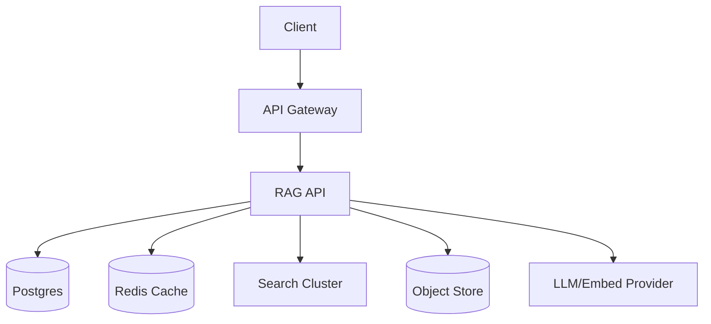
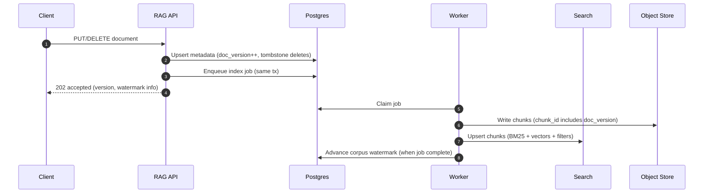
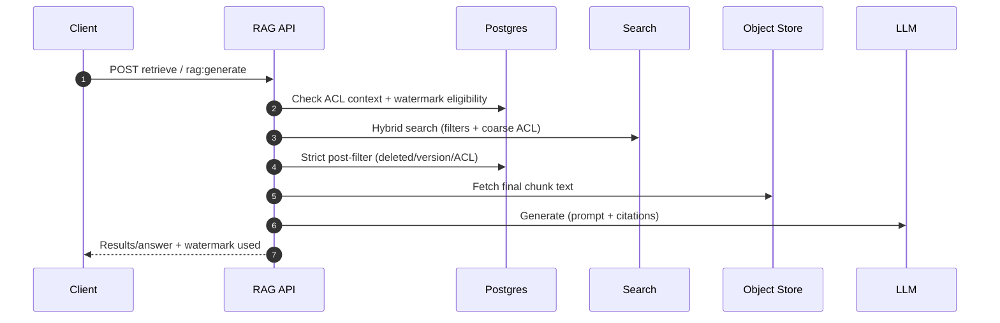

## Overview

Retrieval-Augmented Generation (RAG) improves LLM accuracy by grounding responses in retrieved, domain-specific context (wikis, tickets, runbooks, logs). In production, the hard problems are operational: ingestion throughput, embedding cost, relevance quality, strict security filtering, token-budget packing, and measurable freshness guarantees.

Freshness is a contract: **a query must either** (a) retrieve only content indexed up to a stated watermark, **or** (b) fail/degrade explicitly when the contract cannot be met. This requires explicit watermarks, versioned documents, and query-time policies that prevent silently serving stale or unauthorized content.

---

## Requirements

### Functional Requirements
- Ingest documents (create/update/delete) with metadata: tenant, corpus, ACLs, timestamps, source/URI.
- Chunk documents, generate embeddings, and support re-embedding (model upgrades, new chunking).
- Retrieve context via **hybrid search** (vector + keyword) with strict metadata and ACL filtering.
- Rerank candidates and assemble prompts within a strict token budget with citations.
- Enforce per-request freshness policies (max staleness; optional read-your-writes).
- Provide explainability/debugging: retrieved chunk IDs, scores, index version, watermark, filters applied.
- Support multi-tenancy isolation (quotas, rate limits, noisy-neighbor controls).
- Audit logging for access to retrieved content and LLM requests (with redaction controls).
- Support compliance deletion (GDPR): prevent retrieval immediately after delete is accepted; purge from indexes within SLA.

### Non-Functional Requirements (Concrete Targets)
**Traffic / Data**
- Tenants: up to **1,000**
- Retrieval peak: **10,000 QPS** (retrieve-only)
- RAG generation peak: **1,000 QPS** (retrieve + rerank + LLM)
- Ingestion burst: **10,000 docs/min**
- Corpus size: **500M chunks**
- Chunking target: **150–400 tokens** per chunk for retrieval/packing efficiency.

**Latency (per request, steady state)**
- Retrieve-only endpoint: **P50 80 ms**, **P99 250 ms**
- RAG generate endpoint: **P50 1.2 s**, **P99 4.0 s**

**Availability**
- Retrieval data plane: **99.99%** (explicit degraded modes allowed)
- Ingestion APIs: **99.95%**

**Consistency**
- **Strong** for document metadata and ACL decisions (authoritative).
- **Bounded eventual** for index contents with explicit watermarks.
- Optional **read-your-writes** tier: ≤ **10 seconds** for recent edits (scoped and lower QPS).

**Durability**
- Metadata DB: **RPO ≤ 1 minute** (PITR), **RTO ≤ 2 hours**
- Chunk storage: object store durability; indexes rebuildable from stored chunks + metadata + embedding model versioning.

---

## Simplified Architecture

### High-Level



### Components

#### API Gateway
- AuthN/Z (OIDC/JWT), tenant routing, WAF, and rate limiting (separate limits for ingestion vs retrieval).
- Propagates `tenant_id`, `user_id`, and auth context to the RAG API.

#### RAG API (single service, modular)
One deployable service with three internal modules:
- **Ingestion**: validates docs, versions them, records deletes, enqueues background work.
- **Retrieval/RAG**: query embedding, hybrid search, strict filtering, rerank, prompt packing, citations.
- **Background workers**: chunking, embedding, indexing, purge/rebuild tasks (run as the same codebase in worker mode).

#### Postgres (authoritative system of record)
Stores:
- Document metadata, versions, and delete tombstones (strong consistency).
- ACL policies and policy hashes.
- Per-corpus watermarks (`indexed_through_ts`) per embedding model and chunker version.
- Audit logs (IDs/hashes by default; optional raw text gated by policy).
- Background job queue (simple `jobs` table + `SKIP LOCKED` workers) and an outbox for reliable job creation.

#### Search Cluster (single hybrid index)
A single search technology for hybrid retrieval:
- **Keyword**: BM25 over chunk text (or a truncated field) plus metadata filters.
- **Vector**: ANN over embeddings in the same index, using the same filters.
- Stores only retrieval fields (chunk_id, doc_id/doc_version, tenant/corpus, timestamps, coarse ACL tags/policy hash, small snippet).

This keeps filtering and ranking in one place while still allowing strict enforcement via Postgres on the final candidates.

#### Object Store
- Stores canonical chunk text (and optional normalized source text) keyed by `chunk_id` (which includes `doc_version`).
- Enables index rebuilds without requiring the original upstream sources.

#### Redis (single shared cache)
- Query embedding cache (keyed by normalized query + embed model).
- Document state cache (`deleted_at`, `doc_version`, `acl_hash`) to avoid per-candidate DB reads.
- Optional short-lived retrieval cache keyed by `(tenant, filters, watermark_bucket, strategy)`.

---

## Data Flow

### Ingestion (create/update/delete)



**Versioning**
- `doc_version` increments per `(tenant_id, doc_id)`.
- `chunk_id` embeds `doc_version` so stale chunks are naturally distinct and can be purged asynchronously.

**Deletes (GDPR/compliance)**
- Delete is accepted only after `deleted_at` is committed in Postgres.
- Retrieval blocks immediately using authoritative metadata (and cache).
- Purge job removes corresponding chunks from the search index and object store within SLA.

### Retrieval and RAG generation



**Strict filtering**
- Search applies coarse filters (tenant/corpus, timestamps, coarse ACL tags, policy hash).
- Postgres remains authoritative for: deletes, latest doc_version validity, and fine-grained ACL decisions.

---

## Freshness Model

### Watermarks
For each `(tenant_id, corpus_id, embed_model, chunker_version)`:
- `indexed_through_ts`: “All document updates with `updated_at` ≤ this timestamp are reflected in the search index.”

### Query-time policy
Requests specify:
- `maxStalenessSeconds`: requires `indexed_through_ts >= now - maxStalenessSeconds`.
- Optional `requireReadYourWrites`: for interactive edits.

If the policy cannot be met:
- Return `503 freshness_not_met`, or
- Use explicitly permitted degraded modes (e.g., keyword-only or cached results) and report the watermark used.

### Read-your-writes (interactive tier)
- For the interactive tier, the ingestion path supports **fast indexing** for small updates: the worker prioritizes these jobs and targets a ≤10s end-to-end watermark lag.
- Queries requiring read-your-writes include a `caller_write_token` (or request ID), and the RAG API can (a) wait briefly for the corresponding job completion within a timeout, or (b) fail with `freshness_not_met` for strict callers.

---

## Data Model (Postgres)

**`documents`**
- `tenant_id`, `doc_id` (PK)
- `doc_version` (monotonic)
- `source`, `uri`, `content_hash`
- `updated_at`, `deleted_at`
- `corpus_id`
- `acl_policy_id`
- `metadata_json`

**`chunks`**
- `tenant_id`, `doc_id`, `doc_version`, `chunk_id` (PK)
- `chunk_uri` (object store pointer)
- `token_count`, `start_offset`, `end_offset`
- `created_at`, `deleted_at`

**`acl_policies`**
- `acl_policy_id` (PK)
- `type`, `rules_json`, `updated_at`

**`corpus_watermarks`**
- `tenant_id`, `corpus_id`, `embed_model`, `chunker_version` (PK)
- `indexed_through_ts`, `updated_at`

**`jobs`**
- `job_id` (PK), `type` (`index_doc`, `purge_doc`, `reembed_corpus`, …)
- `tenant_id`, `doc_id`, `doc_version`, `corpus_id`
- `priority`, `run_after`, `state`, `attempts`, `last_error`, `created_at`, `updated_at`

**`query_audit`**
- `tenant_id`, `user_id`, `request_id` (PK)
- `query_hash`
- `watermark_required_ts`, `watermark_used_ts`
- `retrieved_chunk_ids` (jsonb)
- `model_id`, `model_params_json`
- `created_at`

---

## Search Index Shape (Hybrid)

Per chunk record:
- ID: `chunk_id`
- Text fields: chunk text (or truncated), title/source fields
- Vector field: embedding
- Filters: `tenant_id`, `corpus_id`, `doc_id`, `doc_version`, `updated_at`, `deleted_at`, `embed_model`, `chunker_version`, coarse ACL tags/policy hash

This supports:
- Keyword-only search (fast fallback)
- Vector-only search
- Hybrid fusion (e.g., weighted sum or reciprocal rank fusion) within one query path

---

## API

### Ingestion

`PUT /v1/tenants/{tenantId}/documents/{docId}`

Request (JSON):
```json
{
  "content": "string (inline) or omitted if uri is provided",
  "uri": "s3://bucket/key (optional)",
  "contentType": "text/markdown",
  "metadata": { "product": "billing", "env": "prod" },
  "acl": { "type": "rbac", "groups": ["oncall", "billing-eng"] },
  "updatedAt": "2025-01-01T12:34:56Z",
  "idempotencyKey": "client-generated-uuid"
}
```

Response:
```json
{ "docId": "123", "version": 42, "status": "accepted" }
```

`DELETE /v1/tenants/{tenantId}/documents/{docId}`
- Commits `deleted_at` immediately in Postgres.
- Enqueues purge; retrieval blocks immediately.

### Retrieval / RAG

`POST /v1/tenants/{tenantId}/retrieve`

`POST /v1/tenants/{tenantId}/rag:generate`

`GET /v1/tenants/{tenantId}/freshness?corpusId=runbooks`
- Returns `indexedThroughTs` and lag per model/chunker version.

---

## Scaling & Performance

### Partitioning and isolation
- Partition search indexes by `(tenant_id, corpus_id)` via index aliases/routing to isolate hot tenants and keep filters selective.
- Partition Postgres tables by `tenant_id` (and optionally `corpus_id`) for large tenants; use read replicas for heavy read workloads.

### Latency controls
- Tight per-stage timeouts (embed, search, post-filter, rerank) with explicit fallbacks.
- Limit candidates early (e.g., topK per strategy), then rerank only a small top-N.

### Cost controls
- Batch embeddings for ingestion jobs.
- Cache query embeddings and optionally retrieval results (watermark-aware keys).
- Feature flags per tenant to tune: hybrid weights, rerank enablement, max context budget.

---

## Failure Modes & Mitigations

1. **Watermark lag breaches freshness SLA**
   - Response: return `503 freshness_not_met` for strict requests; optional degraded retrieval if permitted.
   - Mitigation: prioritize interactive jobs, autoscale workers, throttle ingestion per tenant, reduce embedding model cost tier.

2. **Search cluster tail latency or partial outage**
   - Response: keyword-only fallback; reduce `topK`; disable rerank; serve cached results with watermark metadata if permitted.
   - Mitigation: shard/routing tuning, circuit breakers, query budget enforcement.

3. **Delete propagation delay (compliance risk)**
   - Response: retrieval blocks immediately via authoritative metadata/cache; audit any attempted retrieval of deleted IDs.
   - Mitigation: prioritized purge jobs, periodic reconciliation scans, alert on purge SLA breach.

4. **ACL leakage risk**
   - Response: deny-by-default; strict post-filter; audit logs with alerts for suspicious access patterns.
   - Mitigation: signed identity context from gateway, regression suites for ACL, minimal dynamic ACL logic in the search layer.

---

## Operations

### SLOs and monitoring
- Retrieval availability: **99.99%**
- Freshness: `watermark_age_seconds{tenant,corpus,model}` and `freshness_not_met_rate`
- Search: latency histograms, timeout rate, candidate counts, filter selectivity
- Filtering: drop counts by reason (`deleted`, `stale_version`, `acl_denied`)
- Cost: embedding/LLM token rates, rerank utilization, cache hit rates

### Security & compliance
- Encrypt in transit/at rest; tenant-level keys where required.
- Treat retrieved text as untrusted input; delimit context and apply prompt-injection controls.
- Audit logs default to identifiers/hashes; raw text logging gated by explicit policy and retention.

### DR
- Postgres PITR for RPO ≤ 1 minute.
- Object store versioning.
- Search indexes rebuildable from Postgres + object store.

---

## Simplification Notes

- Removed: separate control plane/data plane split; a single RAG API runs both request handling and background workers to reduce operational surface area.
- Removed: standalone event bus and workflow orchestrator; Postgres-backed job queue and outbox provide reliable, sufficient ingestion orchestration.
- Removed: separate vector DB and keyword engine; one hybrid search cluster handles both retrieval modes with a single filtering/ranking path.
- Merged: chunking, embedding, indexing, purge, and re-embed into one worker system with typed jobs and priorities.
- Merged: metadata/ACL “read API” into direct Postgres access from the RAG API (with a single Redis cache for hot doc state).
- Remaining complexity: explicit watermarks, strict ACL/delete enforcement, and audit logging are necessary for correctness, compliance, and a measurable freshness contract at the stated scale.