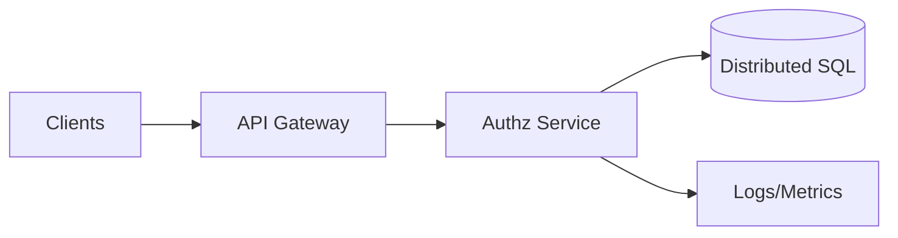
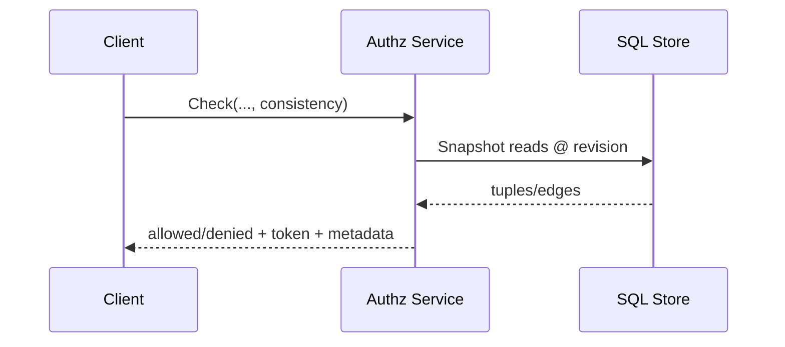

## Overview

This service provides relationship-based access control (ReBAC) for multi-tenant applications. It answers:

- `Check`: “Can subject **S** perform permission **P** on resource **R**?”
- `Expand`: explain *why* a decision was made (bounded proof)
- `LookupResources` / `LookupSubjects`: list-style queries for UIs and admin tooling

The system is built on three core ideas:

- **Tuples are the source of truth**: relationships like `document:123#viewer@user:alice`
- **Models define meaning**: tenant-defined relations/permissions derived from tuples
- **Consistency tokens make freshness explicit**: callers can require monotonic reads without hidden staleness

Caveats (conditional tuples) are supported as deterministic expressions evaluated with request context (e.g., time-based expiry).

---

## Requirements

### Functional
- Tuple APIs: write (create/delete, idempotent), read (scoped, paginated), optional caveats
- Model APIs: create/validate/version, activate, rollback
- Authorization APIs: `Check`, `Expand`, `LookupResources`, `LookupSubjects`
- Observability: traces, decision metadata, optional sampled decision logs

### Non-Functional Targets
- Scale: `Check` 50k QPS peak; writes 5k QPS peak; up to 10B tuples across tenants
- Latency (same region): `Check` P50 5–8ms, P99 30ms (warm path)
- Availability: `Check` 99.99%; writes and `Lookup*` 99.9%
- Consistency modes:
  - `FULLY_CONSISTENT`: evaluate at latest committed revision
  - `AT_LEAST_AS_FRESH(token)`: evaluate at revision ≥ token (monotonic reads)
  - `BEST_EFFORT`: may read from replicas/caches; must not return “allow” without evidence at the evaluated revision
- DR: RPO ≤ 1 minute, RTO ≤ 30 minutes (managed storage + multi-zone)

---

## Simplified Architecture

A single stateless service implements the public API, model management, and evaluation logic. A managed distributed SQL database provides MVCC snapshots and indexes for both forward and reverse tuple lookups.

### Components

#### API Gateway
- TLS termination, JWT/mTLS authn, request limits, and per-tenant rate limits
- Routes to the nearest healthy service region
- Enforces stricter quotas for `Expand` and `Lookup*`

#### Authz Service (single deployable)
- Tuple API: validation, canonicalization, idempotency, transactional writes
- Model API: validation, versioning, activation/rollback, compiled model caching
- Evaluator: `Check`/`Expand` execution with per-request memoization and strict budgets
- Lookup endpoints: index-assisted queries + bounded evaluation to keep results correct

#### Distributed SQL (authoritative store)
A managed, strongly consistent, MVCC-capable database (e.g., Spanner-class) that supports:
- Transactional writes with a monotonic commit revision
- Snapshot reads “as of” a revision for stable evaluation
- Secondary indexes for:
  - forward edges (resource → subjects)
  - reverse edges (subject → resources)

---

## Consistency Model

### Revision and tokens
- Each successful write commits at a **revision** (monotonic per tenant; typically a commit timestamp/HLC).
- The service returns a **consistency token** containing:
  - `tenant_id`
  - `revision`
  - `model_id` + active `model_version` (recommended)
  - HMAC/signature (prevents forgery)

### Read modes
- `FULLY_CONSISTENT`: read at the latest revision (best freshness, higher tail latency)
- `AT_LEAST_AS_FRESH(token)`: read at revision ≥ token revision (session consistency)
- `BEST_EFFORT`:
  - chooses a fast read source (e.g., local replicas)
  - still evaluates at a concrete revision
  - returns `allowed=true` only when the required tuples are confirmed at that revision; otherwise returns `allowed=false` or `UNAVAILABLE` (configurable per client/tenant)

---

## Data Model

### Tuple storage
- `relationship_tuples`
  - Key fields: `(tenant_id, resource_type, resource_id, relation, subject_type, subject_id, subject_relation)`
  - `caveat_name` (nullable)
  - `caveat_context` (JSON/BYTES, nullable)
  - `created_at`, optional `deleted_at` (if tombstones are needed)

### Indexes (in the same database)
- Forward adjacency index: by `(tenant_id, resource_type, resource_id, relation, ...)`
- Reverse adjacency index: by `(tenant_id, subject_type, subject_id, subject_relation, relation, resource_type, resource_id, ...)`

### Models
- `auth_models(tenant_id, model_id, version, dsl, compiled_ir, created_at, state)`
- `auth_model_active(tenant_id, model_id, active_version)`

### Idempotency
- `idempotency_keys(tenant_id, key, request_hash, response_blob, written_at_revision, expires_at)`
- Enforced for write endpoints that clients may retry automatically

---

## Evaluation

### Execution model
- Evaluator runs at a single `(tenant_id, model_version, revision)` snapshot.
- Per-request memoization prevents repeated subchecks and bounds store reads.
- Cycle detection + strict budgets protect availability under adversarial graphs.

Recommended defaults (tenant-configurable):
- Max depth: 10
- Max dispatches: 5,000
- Max visited nodes: 50,000
- Deadline: 20–40ms internal budget for `Check` (caller can set a tighter deadline)

### Caveats
- Caveats are evaluated as pure deterministic expressions against request context.
- A caveated tuple contributes only when the caveat evaluates to true.
- Unknown/invalid caveat evaluation fails closed for that edge.

### `Check` flow (revision-scoped)

---

## Lookup Endpoints

### `LookupResources(subject, permission, resource_type)`
1. Use reverse index to fetch candidate resources related to the subject (paginated).
2. For each page, run bounded `Check` evaluations at the requested revision to ensure correctness (especially with computed usersets and caveats).
3. Return results with a continuation token and truncation metadata when limits are hit.

### `LookupSubjects(resource, permission, subject_type)`
- Symmetric approach using forward adjacency + bounded evaluation.

These endpoints prioritize correctness and predictable resource usage over perfect completeness in one call; pagination + truncation are first-class.

---

## Multi-Tenancy and Isolation

- Every request is scoped by `tenant_id`; authorization is enforced before any data access.
- Per-tenant rate limits at the gateway protect shared storage and CPU.
- Data isolation:
  - Logical isolation via `tenant_id` + indexes
  - Optional physical isolation for regulated tenants by placing them into separate database instances or separate EU/US deployments

---

## Operations

### Availability and scaling
- Stateless service replicas behind the gateway; horizontal scaling by QPS.
- Database is managed and multi-zone; service stays available during node failures.
- Load shedding:
  - `Expand` and `Lookup*` get stricter quotas
  - evaluator budgets prevent runaway graph traversals

### Observability
- Decision metadata in responses: `tenant_id`, `model_version`, `revision`, evaluation counters, `trace_id`
- Metrics: QPS/latency/errors per endpoint and per tenant tier; budget-exceeded rates; store read latency
- Optional decision logs: sampled and written asynchronously to the logging platform (tenant-configurable)

### Model rollout and rollback
- Activation is atomic per tenant/model: update `auth_model_active`
- Safety checks on activation: type/relation validation, complexity limits, deterministic compilation
- Rollback: switch active version back immediately

---

## Simplification Notes

- Removed: external memo caches and cache clusters; correctness-safe performance comes from snapshot reads, per-request memoization, and compiled model caching.
- Removed: CDC streams, indexer workers, and separate lookup accelerators; `Lookup*` is supported using database secondary indexes plus bounded evaluation with pagination/truncation.
- Merged: API layer, model management, evaluator, and lookup logic into a single stateless `Authz Service` deployable to reduce coordination and operational surface area.
- Remaining complexity:
  - Consistency tokens and MVCC snapshot evaluation are necessary to make freshness explicit and keep decisions correct under caching/replica reads.
  - Strict evaluation budgets and truncation are necessary to protect availability under worst-case graphs.
  - A managed distributed SQL store is necessary to meet durability, multi-tenant scale, and strong consistency targets with minimal operational overhead.