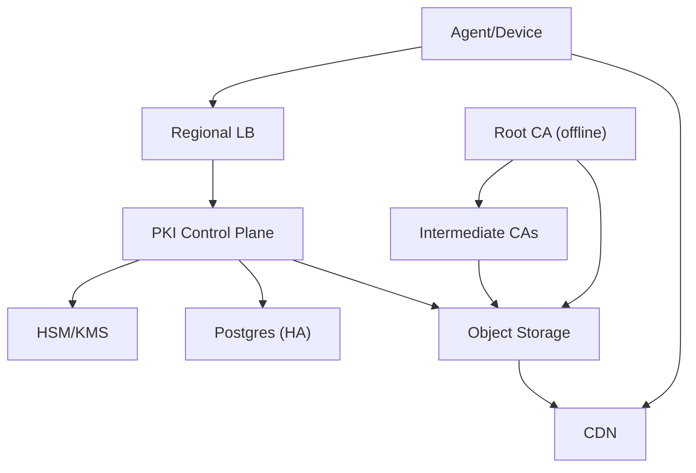
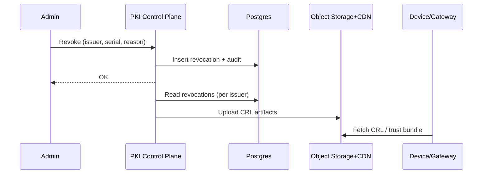

## Overview

This system provides internal X.509 certificates for mTLS across large fleets of workloads and devices. It focuses on three outcomes:

1. **Stable identity binding**: attest a workload/device and map it to an identity (e.g., SPIFFE ID or device ID).
2. **High-volume issuance & rotation**: automated renewals with predictable behavior under bursts.
3. **Controlled blast radius**: scoped intermediate CAs, auditable decisions, and fast incident response.

The design uses an **offline Root CA** for signing intermediates and **online Intermediate CAs** for day-to-day issuance. A single regional control-plane service performs attestation, policy evaluation, CSR validation, signing, and durable recording. Revocation is supported primarily via **CRLs** distributed through object storage + CDN; most workloads rely on **short-lived certificates** to reduce dependence on revocation availability.

---

## Requirements

### Functional
- Attest workloads/devices and map to a stable identity (SPIFFE ID or device ID).
- Issue leaf certificates + chain for mTLS.
- Automated renewal/rotation with jitter and zero downtime.
- Revocation workflows and status publishing (CRL; OCSP optional).
- Trust bundle distribution for heterogeneous clients.
- Multi-tenant policy enforcement: SAN constraints, TTL bounds, allowed issuers, rate limits.
- Tamper-evident audit trail for issuance, revocation, policy changes, and key lifecycle.
- Intermediate lifecycle workflows: create/activate/drain/retire; emergency response.

### Non-Functional (Targets)
- Steady-state issuance: ~60 QPS workloads + ~7 QPS devices; burst: **10k QPS** workloads for 10–30 minutes.
- Issuance latency (in-region): workloads P50 ~100 ms / P99 ~500 ms; devices P99 1–3 s.
- Availability: issuance per region **99.99%**; artifact distribution **99.999%** via CDN/object storage.
- Strong consistency for: revocation transitions, policy version used per decision, intermediate lifecycle state.
- FIPS-grade key protection for CA keys (HSM/KMS).

---

## Simplified Architecture

### High-Level



**PKI Control Plane** is a single service per region (stateless replicas) that contains:
- attestation verification
- policy evaluation
- CSR validation + certificate profile construction
- signing via HSM/KMS-backed intermediate keys
- idempotency + revocation + audit recording
- CRL generation + publishing (background job)

**Brief simplifications**
- The attestation layer, policy engine, and issuer are merged into one deployable service to keep the critical path small and easy to operate.
- The status publisher runs as a background worker in the same service, using the same database state.

---

## Components

### 1) PKI Control Plane (Regional Service)
**Responsibilities**
- Verify attestation and authenticate caller.
- Derive `subject_id` (SPIFFE ID/device ID) from claims.
- Evaluate policy deterministically and record `policy_version`.
- Validate CSR and enforce allowed extensions/algorithms/TTL/SAN.
- Sign leaf certs with a selected intermediate key via HSM/KMS.
- Write durable records: idempotency, revocation state, and audit events.
- Publish artifacts: trust bundle metadata pointers and CRLs.

**Attestation (pluggable verifiers)**
- Kubernetes: projected service account JWT, bound to namespace/service account (optionally with node/instance signal).
- VMs: cloud instance identity documents or TPM-based attestation.
- Devices: TPM/TEE proofs or manufacturer provisioning credentials, scoped tightly to tenant/fleet.

**Abuse controls**
- Per-tenant and per-identity rate limits.
- Input validation before signing.
- Admission control under HSM/KMS degradation.

---

### 2) Offline Root CA
**Responsibilities**
- Sign and roll intermediate CA certificates.
- Maintain root key in offline storage with quorum-controlled ceremony.

---

### 3) Intermediate CAs (Online)
**Responsibilities**
- Hold intermediate private keys in HSM/KMS (non-exportable where possible).
- Provide signing capacity and blast-radius isolation.

**Scoping**
- At minimum: split by environment (`prod`, `stage`, `dev`).
- Common extension: split by region to avoid private key replication across regions.

---

### 4) Postgres (HA) as the Source of Truth
**Responsibilities**
- Strongly consistent storage for:
  - intermediate state (`ACTIVE`/`DRAINING`/`RETIRED`)
  - revocations
  - idempotency
  - policy bundle versions
  - audit events (append-only)

---

### 5) Object Storage + CDN (Artifacts)
**Responsibilities**
- Serve:
  - versioned trust bundles (root + active intermediates)
  - CRLs per issuer
  - optional OCSP responses if enabled

**Client behavior**
- Clients keep last-known-good bundle/CRL until refresh succeeds.
- Immutable, versioned bundle URLs with long cache TTLs.

---

## Data Model (Postgres)

**issuers**
- `issuer_id` (PK)
- `env`, `region`
- `intermediate_cert_pem`, `chain_pem`
- `key_ref` (HSM/KMS handle)
- `status` (`ACTIVE`, `DRAINING`, `RETIRED`)
- `created_at`, `activated_at`, `retired_at`

**policy_bundles**
- `policy_version` (PK)
- `bundle_digest`
- `published_at`
- `signature_verified` (bool)

**idempotency**
- `idempotency_key` (PK)
- `subject_id`
- `request_hash`
- `issuer_id`
- `result_cert_fingerprint`
- `created_at`, `expires_at`

**revocations**
- `issuer_id`
- `serial_number`
- `revoked_at`
- `reason`
- `revoked_by`
- PK: (`issuer_id`, `serial_number`)

**audit_events** (append-only)
- `event_id` (PK)
- `event_type` (`ISSUE`, `REVOKE`, `POLICY_CHANGE`, `KEY_OP`, `BREAK_GLASS`)
- `principal`
- `policy_version`
- `request_hash`
- `decision`
- `timestamp`
- `payload` (structured, no secrets)

---

## Data Flows

### Issuance (Workloads & Devices)
1. Agent generates keypair and CSR locally.
2. Agent calls issuance endpoint with attestation + CSR + requested TTL + idempotency key.
3. Control Plane verifies attestation, derives `subject_id`, evaluates policy, validates CSR.
4. Control Plane writes idempotency intent, signs via HSM/KMS, records audit event, returns cert + chain.

### Revocation & CRL Publishing
1. Admin/automation submits revocation (`issuer_id`, `serial`, reason).
2. Control Plane records revocation + audit event.
3. Background publisher periodically generates CRLs per issuer and uploads to object storage; CDN caches for clients.



---

## API Design (REST)

### Issue Certificate
`POST /v1/certificates:issue`

Headers:
- `Idempotency-Key: <uuid>`

Request:
```json
{
  "attestation": { "type": "k8s_jwt", "token": "..." },
  "csr_pem": "-----BEGIN CERTIFICATE REQUEST-----...",
  "requested_ttl_seconds": 86400,
  "tenant_id": "payments"
}
```

Response:
```json
{
  "certificate_pem": "-----BEGIN CERTIFICATE-----...",
  "chain_pem": ["-----BEGIN CERTIFICATE-----..."],
  "issuer_id": "prod-us-east-1-1",
  "serial_number": "0x12ab...",
  "not_before": "2026-01-01T00:00:00Z",
  "not_after": "2026-01-02T00:00:00Z"
}
```

Errors:
- `400` invalid CSR / unsupported extensions
- `401/403` attestation failed / policy denied
- `409` idempotency conflict
- `429` rate limited
- `503` signing capacity unavailable

### Revoke Certificate (Privileged)
`POST /v1/certificates:revoke`

Request:
```json
{
  "issuer_id": "prod-us-east-1-1",
  "serial_number": "0x12ab...",
  "reason": "KEY_COMPROMISE"
}
```

Response: `200 OK`

### Fetch Trust Bundle
`GET /v1/trust-bundle`

Response:
```json
{
  "roots_pem": ["..."],
  "intermediates_pem": ["..."],
  "version": "2026-01-01",
  "signature": "..."
}
```

### CRL
`GET /crl/{issuer_id}.crl`

**OCSP (Optional)**
- Enabled for environments that require online stapling or gateway validation.
- Served behind the same CDN with aggressive caching.

---

## Certificate Profile Guidelines
- Prefer **URI SAN** for workload identity (e.g., SPIFFE).
- Enforce tight extension allow-list; reject unknown/forbidden extensions before signing.
- Serial numbers: cryptographically random (16–20 bytes).
- Clock skew: backdate `notBefore` by ~1–2 minutes.
- Default algorithms: ECDSA P-256; support RSA-2048/3072 for legacy clients.

---

## Scaling & Reliability

### Burst handling
- Stateless Control Plane replicas behind regional load balancer.
- Fast-fail invalid requests before HSM/KMS calls.
- Tenant-aware rate limiting and fairness.
- Client renewal at 50–70% of TTL with jitter + exponential backoff.

### HSM/KMS throughput
- Scale by adding intermediate keys (issuer shards) and HSM/KMS capacity.
- Keep signing to a single HSM/KMS call per issuance.

### Multi-region posture
- Each region runs an independent Control Plane + Postgres HA.
- Intermediates are region-scoped; clients trust all active intermediates via the global bundle.
- CDN/object storage provides global distribution for bundles and CRLs.

---

## Operations

### Intermediate lifecycle
- Create intermediate (ceremony) → publish bundle (old+new) → begin issuing from new → drain old → retire old → publish bundle removing old.

### Monitoring (minimal set)
- Issuance QPS, P50/P99 latency, error rates by reason.
- HSM/KMS signing latency and failure rates.
- Postgres write latency and replication health.
- CRL publish success + lag; CDN artifact availability.
- Renewal risk: counts of identities with cert expiring in `<2h` and `<24h`.

### Disaster recovery
- Regional restore via stateless redeploy + Postgres failover/PITR.
- Artifacts remain available via CDN/object storage during control-plane incidents.

---

## Failure Modes (Core)
- **HSM/KMS degradation**: admission control, prioritize near-expiry renewals, scale issuer shards.
- **Policy/attestation regression**: signed policy bundles, staged rollout, rapid rollback, tenant-level disable switches.
- **Intermediate compromise**: retire issuer, publish updated trust bundle, rotate affected identities, incident audit trail.
- **Postgres outage**: fail closed for issuance when idempotency/revocation/audit writes can’t be guaranteed; rely on existing cert TTL and retries.
- **Artifact distribution outage**: long cache TTLs, client last-known-good behavior, multi-region storage replication.

---

## Simplification Notes
- **Removed**: separate Registration Authority service; acceptable because attestation and authorization run as modules within a single Control Plane with the same audit and policy guarantees.
- **Removed**: standalone Policy Engine service (OPA sidecar/service); acceptable because policies are evaluated in-process from signed, versioned bundles with the policy version recorded per decision.
- **Removed**: dedicated CRL/OCSP publisher service; acceptable because publishing runs as a background worker in the Control Plane and shares the same strongly consistent revocation state.
- **Removed**: mandatory OCSP infrastructure; acceptable because CRLs + short-lived workload certificates provide predictable validation and availability, with OCSP kept as an optional extension.
- **Merged**: Issuer + RA + policy evaluation + publishing into `PKI Control Plane`; acceptable because these functions share the same request context and correctness/audit requirements.
- **Complexity retained**: offline Root CA ceremonies and HSM/KMS-backed intermediate keys; necessary to anchor trust, protect signing keys, and limit blast radius at large fleet scale.