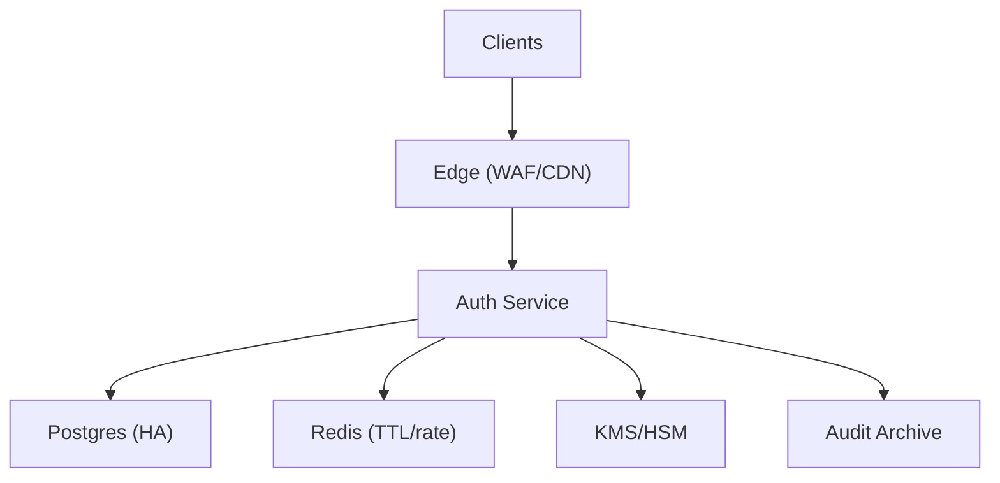
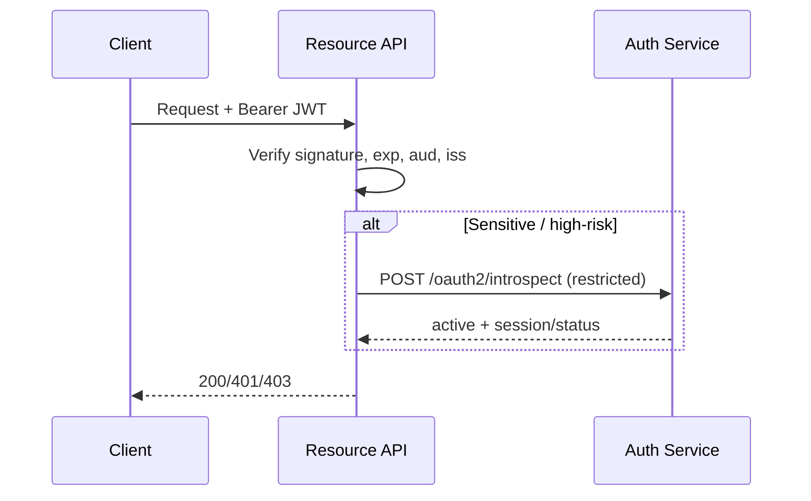

## Overview

This document describes a production-grade OAuth 2.1 / OpenID Connect (OIDC) Identity Provider (IdP) for a multi-tenant (B2B) environment.

The design centers on a single, horizontally scaled Auth Service that implements OAuth/OIDC, sessions, MFA, adaptive step-up, and federation as internal modules. It uses short-lived JWT access tokens for low-latency, offline verification by downstream APIs, while keeping refresh tokens and sessions strongly consistent in the primary database for practical revocation and reuse detection.

## Requirements

### Functional Requirements
- OIDC SSO for browser/mobile:
  - Authorization Code + PKCE
  - ID Token issuance, `/userinfo`, OIDC discovery and JWKS
  - Support `prompt=login`, `max_age`, `acr_values` for step-up semantics
- OAuth for service-to-service:
  - Client Credentials
  - Strong client authentication: `private_key_jwt`, `tls_client_auth` (mTLS), optional `client_secret_basic` for legacy
- MFA:
  - WebAuthn/FIDO2 (preferred, phishing-resistant)
  - TOTP, backup codes
  - SMS/voice only as gated fallback (high-risk, low assurance)
- Session management:
  - List sessions, revoke per-session, revoke all
  - Refresh token rotation + reuse detection
  - Optional OIDC logout (front-channel/back-channel) for first-party apps
- Device inventory and risk:
  - Maintain device records, signals, and explainable risk decisions
  - Use signals (new device, IP/ASN reputation, geo-velocity, device posture) to drive adaptive MFA
- Federation:
  - Upstream SAML 2.0 and OIDC IdPs, per-tenant configuration
  - JIT provisioning and account linking with explicit policies
- Administration:
  - Client registration (redirect URIs, grants, scopes, auth methods)
  - Tenant policies (MFA rules, session lifetime, federation rules)
- Auditing:
  - Append-only audit trail of auth events and admin actions with retention controls

### Non-Functional Requirements (Targets)
- **Scale (steady-state)**
  - 10M MAU, 500K DAU
  - Peak interactive authorization requests (GET `/oauth2/authorize`): 5k QPS (bursty)
  - Peak token issuance (POST `/oauth2/token`):
    - `authorization_code` exchanges: 2k QPS
    - `refresh_token` grants: 20k QPS (mobile-heavy + short access token TTL)
    - `client_credentials` grants: 5k QPS
  - Introspection (only for select gateways/APIs): 5k QPS
  - Stored objects (order of magnitude):
    - 10M users
    - 30M devices
    - 50M active sessions
    - Audit events: 0.5–5B/year
- **Latency (server-side, excluding human MFA time)**
  - GET `/oauth2/authorize` decision P99: 200ms
  - POST `/oauth2/token` P99:
    - `authorization_code`: 150ms
    - `refresh_token`: 120ms
    - `client_credentials`: 100ms
  - POST `/oauth2/introspect` P99: 80ms (within-region)
  - Discovery/JWKS P99: 50ms (CDN/edge cached; origin should be fast)
- **Availability**
  - 99.99% for OIDC discovery, JWKS, `/oauth2/authorize`, `/oauth2/token`
  - 99.9% acceptable for admin console and reporting
- **Consistency**
  - Strong (or linearizable per principal/tenant): password changes, MFA enrollment/disablement, revocations, refresh rotation, client config changes
  - Eventual: risk signals ingestion, analytics, reporting, long-tail audit exports
- **Durability**
  - RPO ≤ 5 minutes for identity/config/session metadata
  - Audit logs: no acknowledged loss (durable append semantics)

### Constraints & Assumptions
- Multi-tenant (B2B) with per-tenant policies, branding, and federation configurations
- Baseline compliance: SOC 2 controls, GDPR/CCPA data handling, encryption at rest/in transit, audit retention
- Deployed across at least 2 AZs per region; global traffic management for regional failover
- mTLS supported for internal service-to-service and optional external OAuth client auth
- Network edge provides WAF, DDoS protection, and request rate limiting

## Simplified Architecture

### High-Level Component Diagram

**Auth Service (single deployable)** includes:
- OAuth2/OIDC endpoints (authorize/token/revoke/introspect/userinfo/discovery/JWKS)
- Session + refresh token rotation (strong consistency)
- MFA (WebAuthn/TOTP/backup codes; SMS fallback policies)
- Adaptive step-up (risk rules + device trust)
- Federation connectors (SAML/OIDC upstream)
- Admin APIs/UI backend
- Audit event writer + background export job

**Data stores**
- **Postgres (HA, multi-AZ)** is the system of record for users, tenants, clients, sessions, refresh tokens, devices, MFA factors, federation config, and audit events (append-only, time-partitioned).
- **Redis** holds short-lived authorization request state, rate-limit counters, and small revocation/index caches with TTLs.
- **KMS/HSM** protects signing keys and envelopes sensitive secrets (TOTP, phone) and provides key rotation workflows.
- **Audit Archive** is an immutable retention sink (e.g., object storage with retention/WORM) fed by a background exporter reading from Postgres.

### Token Validation Pattern (Default: Offline JWT Verification)

## Components

### Auth Service
**Responsibilities**
- OIDC: discovery, JWKS, authorize (code+PKCE), userinfo, ID token issuance
- OAuth: token, revocation, introspection (restricted), client credentials
- Authentication: password verification (if applicable), federation login initiation/callbacks
- Policy: tenant/client policies, adaptive MFA/step-up
- Session management: list/revoke sessions, global revoke
- Administration: client registration, tenant policy updates, federation configuration
- Auditing: append-only event capture for all auth/admin actions

**Key design decisions**
- Authorization Code + PKCE for public clients; strict redirect URI matching
- Short-lived JWT access tokens (5–10 minutes) + rotating opaque refresh tokens
- All correctness-critical state transitions happen in Postgres transactions:
  - authorization code consumption (one-time)
  - refresh rotation + reuse detection
  - session revocation
- Introspection remains available for select callers with strong auth (mTLS or `private_key_jwt`)

### Sessions & Refresh Tokens (Strong Consistency)
**Revocation model**
- Access tokens are short-lived JWTs; revocation is enforced at:
  - refresh time (authoritative)
  - introspection time (for sensitive APIs)
  - session management APIs

**Refresh rotation + reuse detection**
- Store only a hash of refresh tokens (HMAC-SHA-256 with a server-side pepper protected by KMS/HSM).
- On refresh:
  - validate token hash
  - atomically mark it used/revoked
  - issue a new refresh token in the same family
- On reuse:
  - revoke the refresh family and associated session
  - emit an audit/security event

### MFA (Integrated Module)
**Supported factors**
- WebAuthn/FIDO2 (primary)
- TOTP (secondary)
- Backup codes (one-time, hashed)
- SMS/voice only under explicit tenant policy gating and throttling

**Storage**
- WebAuthn: public keys + metadata
- TOTP: envelope-encrypted secret
- Backup codes: one-way hashes (Argon2id/Bcrypt)

### Adaptive Step-Up & Device Trust (Integrated Module)
**Approach**
- Keep decisions explainable and synchronous on the login path:
  - compute `risk_score` and `reasons[]` from device history, IP/ASN reputation, geo-velocity, and recent security events
  - apply tenant policy to decide “no MFA / MFA / phishing-resistant MFA”
- Store device inventory and minimal signals in Postgres; cache small “recent risk decision” results in Redis for a short TTL to smooth retries.

### Federation (Integrated Module)
**Capabilities**
- Per-tenant upstream SAML 2.0 and OIDC IdP configuration
- Assertion/token validation, claim mapping, replay protection
- JIT provisioning and account linking under tenant policy
- Metadata caching (in-process and/or Redis), with safe validation on update

### Auditing (Append-Only + Export)
**Write path**
- Auth Service writes an audit row in Postgres in the same request context as the action being audited.
- Audit tables are time-partitioned and indexed by tenant and timestamp.

**Retention/export**
- A background exporter periodically copies partitions (or incrementals) to the Audit Archive with immutable retention policies.
- Export progress is tracked in Postgres to support retries without gaps.

## Data Model (Relational)

Primary tables (representative, minimal):
- `tenants(tenant_id, policy_json, ...)`
- `users(user_id, tenant_id, email, status, password_hash, ...)`
- `clients(client_id, tenant_id, redirect_uris, grant_types, scopes, token_endpoint_auth_method, jwks_uri/jwks, ...)`
- `sessions(session_id, tenant_id, user_id, device_id, auth_level, revoked_at, last_seen_at, ip_hash, ua_hash, ...)`
- `authorization_codes(code_id, code_hash, tenant_id, client_id, user_id, redirect_uri, code_challenge, nonce, expires_at, consumed_at)`
- `refresh_tokens(token_id, token_hash, family_id, session_id, tenant_id, user_id, rotated_from, expires_at, revoked_at, created_at)`
- `devices(device_id, tenant_id, user_id, device_fingerprint_hash, platform, trusted, risk_score, first_seen_at, last_seen_at)`
- `mfa_factors(factor_id, tenant_id, user_id, type, webauthn_public_key, totp_secret_enc, phone_enc, created_at, last_used_at)`
- `external_identities(binding_id, tenant_id, user_id, provider_type, provider_id, subject, created_at)`
- `audit_events(event_id, tenant_id, actor_user_id, target_user_id, type, metadata, created_at)` (partitioned by time)

## Key Flows

### Primary Login (OIDC + Step-Up)
1. Client calls `GET /oauth2/authorize` (PKCE, state, nonce).
2. Auth Service loads tenant policy, client config, user record, and device history.
3. Auth Service computes risk and decides required `auth_level`.
4. If step-up is needed, Auth Service runs WebAuthn/TOTP challenge/verify endpoints.
5. Auth Service creates a session and issues an authorization code (stored hashed, short TTL).
6. Client exchanges code at `POST /oauth2/token`; Auth Service consumes code, issues JWT access token + ID token + rotating refresh token.

### Refresh (Rotation + Reuse Detection)
1. Client calls `POST /oauth2/token` with `grant_type=refresh_token`.
2. Auth Service atomically verifies refresh token hash, revocation status, and session.
3. Auth Service rotates refresh token and emits an audit event; on reuse, revokes the family and session.

### Federation Login (SAML/OIDC Upstream)
1. Client initiates login; Auth Service redirects to tenant-selected upstream IdP.
2. Callback validates assertion/token, applies mapping and linking policies, then proceeds as a normal session + code issuance flow.

## API

### OIDC Discovery & Keys
- `GET /.well-known/openid-configuration`
- `GET /oauth2/jwks` (edge-cached; overlapping keys during rotation)

### OAuth/OIDC Core
- `GET /oauth2/authorize` (Authorization Code + PKCE)
- `POST /oauth2/token` (`authorization_code`, `refresh_token`, `client_credentials`)
- `POST /oauth2/revoke` (RFC 7009)
- `POST /oauth2/introspect` (RFC 7662, restricted to confidential clients/gateways with strong auth)
- `GET /userinfo`

### Admin & Sessions (First-Party/Admin)
- `GET /v1/sessions?user_id=...`
- `POST /v1/sessions/{session_id}/revoke`
- `POST /v1/users/{user_id}/revoke_all_sessions`
- `POST /v1/tenants/{tenant_id}/policy`
- `POST /v1/clients` / `PATCH /v1/clients/{client_id}`
- `POST /v1/federation/providers` / `PATCH ...`

### MFA
- `POST /v1/mfa/challenge`
- `POST /v1/mfa/verify`

## Scaling

### What scales horizontally
- Auth Service: stateless instances behind the edge; per-request DB transactions for correctness-critical operations.
- Read-heavy endpoints (discovery/JWKS) are edge-cached; origin load stays low.

### Database strategy (keeps correctness simple)
- Postgres HA (multi-AZ), with read replicas for admin/reporting workloads.
- Partition high-write tables (`audit_events`, optionally `sessions`) by time; keep indexes tenant-focused.
- Use connection pooling and careful query plans for refresh/token QPS.

### Redis usage (bounded scope)
- Authorization request state (`state`, `nonce`, PKCE metadata) with TTL minutes
- Rate-limit counters and login attempt throttling
- Small revocation/index caches (TTL) to reduce hot reads

## Failure Modes

- **Postgres unavailable**: new logins/token issuance stop; existing JWTs continue to validate until expiry; recovery via multi-AZ failover and backups (RPO ≤ 5 minutes).
- **Redis unavailable**: degrade login state and throttling; Auth Service applies conservative in-process throttles and can temporarily reduce new session creation if abuse risk rises.
- **KMS/HSM issues**: signing continues with cached active keys in memory; key creation/rotation and secret unwrap may degrade until KMS recovers.
- **Signing key compromise**: rotate keys, publish updated JWKS, shorten TTLs temporarily, revoke sessions, and drive incident response with audit evidence.

## Operations

- SLOs: 99.99% for discovery/JWKS/authorize/token; 99.9% for admin/reporting.
- Observability:
  - metrics by tenant/client/grant; MFA funnel; refresh reuse detections; DB/Redis/KMS latency
  - structured logs with request IDs and tenant/client identifiers (no secrets)
  - audit events exported to immutable retention storage
- Deployment:
  - canary/blue-green per region with synthetic probes (authorize → token → userinfo; refresh rotation correctness)
  - JWKS key overlap; do not remove keys until consumers refresh

## Simplification Notes

- Removed: separate `MFA Service`, `Risk Decision API`, and `Federation Service` by implementing them as internal modules in the single `Auth Service` (keeps call graph and deployments simple while preserving feature completeness).
- Removed: external `Event Bus` and dedicated `Audit Log Store` by writing audit events directly to Postgres (append-only) and exporting asynchronously to an immutable `Audit Archive` (durable, replayable, and operationally small).
- Merged: admin console backend and auth plane into the same service and database (tenant/client/policy changes remain strongly consistent and auditable).
- Complexity kept: Postgres transactions for refresh rotation/reuse detection and session revocation (required for correctness), KMS/HSM for key custody and envelope encryption (required for security), and restricted introspection for sensitive APIs (required for practical revocation controls without making every API call depend on the IdP).