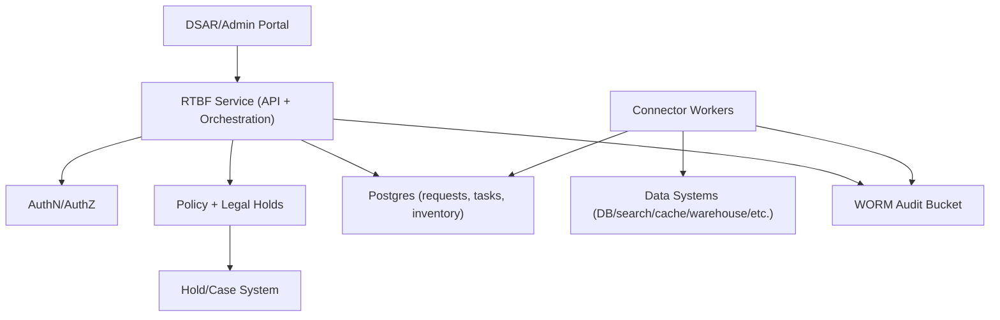

## Overview

The “Right to be Forgotten” (RTBF) must remove or irreversibly anonymize a subject’s data across many systems, prevent it from reappearing (notably via backups and derived datasets), and produce a durable audit trail that stands up to compliance review.

This design treats erasure as a **durable workflow** stored in a single authoritative database. A request expands into **per-target tasks** executed by connector workers. Each connector produces **evidence artifacts** and verifies results within the limits of the target system. For stores where byte-level purge is slow or impractical, the workflow supports a two-phase approach: **immediate suppression** (data is no longer served/queryable) followed by **bounded eventual physical purge**.

## Requirements

### Functional Requirements

- Accept RTBF requests for a subject (`user_id` and/or external identifiers) with requester identity and reason (DSAR, account deletion, admin action).
- Authenticate and authorize requesters; support user and admin flows with appropriate proof of identity.
- Enforce policy and eligibility:
  - Jurisdiction-aware rules (GDPR/UK GDPR/CCPA),
  - Legal holds and investigations,
  - Statutory retention exemptions (billing/tax/chargebacks),
  - Scoped deletion (delete some domains, retain others with pseudonymization).
- Discover all storage locations for the subject using a **data inventory** and route work to the correct connectors.
- Execute deletion/anonymization/suppression across primary stores, caches, search, object storage, streams/logs, analytics, and ML/derived datasets.
- Track request status and per-target task status with timestamps and evidence references.
- Guarantee idempotent processing and deduplicate repeated requests (idempotency key + payload hash).
- Produce immutable, tamper-evident audit records suitable for compliance and investigations.
- Support incremental rollout: add new target systems by adding inventory entries and connectors.

### Non-Functional Requirements

- Peak intake bursts up to 500 RPS; average up to millions/day.
- Fanout: tens of targets per request; tasks may reach billions/month.
- API acceptance is fast (`202 Accepted`); end-to-end completion is asynchronous.
- Strong consistency for request/task state transitions, task leasing, and audit append.
- High availability for intake and status; resilient retry for long-running work.

## Simplified Architecture



### Core Ideas

- **One service, one state store**: a single RTBF service owns intake, policy evaluation, workflow expansion, and status reads; Postgres stores requests, tasks, leasing, and the data inventory.
- **Workers run the same codebase**: connector workers are the same deployment artifact with a different runtime role (API vs worker), reducing operational sprawl.
- **Postgres-backed task leasing**: workers claim tasks with leases using database transactions (`SELECT … FOR UPDATE SKIP LOCKED`), providing at-least-once delivery without a separate queue.
- **Evidence-first auditing**: every state-changing action emits an immutable audit object (job IDs, counts, probe hashes, timestamps), referenced from Postgres.

## Components

### RTBF Service (API + Orchestration)

**Responsibilities**
- Intake endpoints (`create`, `status`, `list tasks`, `retry`).
- Subject resolution (map external identifiers to internal subject identifiers; record inputs/outputs for audit).
- Policy evaluation (jurisdiction rules, holds, exemptions, scoping) producing:
  - `decision`: `ALLOW | PARTIAL | BLOCK`
  - `exemptions[]` (what is retained and why)
  - `required_actions[]` (delete/anonymize/suppress/crypto-shred where supported)
  - `policy_version` for reproducibility
- Workflow expansion into tasks based on the inventory, with deterministic task keys for idempotency.

### Postgres (Requests, Tasks, Inventory)

**Responsibilities**
- Strongly consistent state machine for requests and tasks.
- Task leasing and retry scheduling.
- Inventory lookup (what systems store which data and how to delete/verify).

Recommended operational patterns:
- Partition `erasure_tasks` by time and/or hash if volume demands it.
- Keep task updates small; store large evidence in the audit bucket and only references in Postgres.

### Data Inventory (Stored in Postgres)

Each target entry captures:
- `target_system`, owner/oncall, environments
- supported identifiers (`user_id`, hashed email, device ID)
- deletion modes: `HARD_DELETE | ANONYMIZE | SUPPRESS | CRYPTO_SHRED | PURGE_CACHE | VACUUM`
- verification modes: `COUNT_CHECK | PROBE_QUERY | JOB_STATUS | FILE_REWRITE_CHECK`
- ordering/dependencies and rate limits
- SLO class (fast vs slow)

Inventory is updated via controlled admin tooling and code review, with validation to prevent incomplete entries.

### Connector Workers (Deletion Connectors)

**Responsibilities**
- Claim tasks, execute target-specific deletions, verify results, and write evidence.
- Implement an idempotent connector contract:
  - `execute(subject, scope, operation) -> execution_result`
  - `verify(execution_result) -> verification_result`
  - `write_evidence(...) -> evidence_ref`

Typical system handling:
- **OLTP databases**: transactional delete or PII anonymization while retaining required records.
- **Caches/CDN**: key deletes and/or user-epoch bumps for broad invalidation.
- **Search**: delete by doc keys; verify via probe queries.
- **Object storage**: delete objects; optionally crypto-shred per-user keys for encrypted blobs.
- **Streams/logs**: tombstones where compaction exists; suppression in downstream sinks as needed.
- **Warehouse/lakehouse/derived datasets**: immediate suppression plus scheduled delete + compaction/VACUUM tasks.

### WORM Audit Bucket

**Responsibilities**
- Immutable storage for audit events and evidence artifacts.
- Append-only, tamper-evident records using hash chaining per request:
  - each audit object includes `prev_event_hash` and `event_hash = H(prev_hash || payload)`

Objects store metadata and proofs (job IDs, counts, query hashes), not raw PII.

## Data Model (Postgres)

**`erasure_requests`**
- `request_id` (UUID, PK)
- `requester_id` (string, indexed)
- `idempotency_key` (string, unique per `requester_id`)
- `payload_hash` (bytea)
- `subject_user_id` (string, indexed, nullable until resolved)
- `subject_identifiers` (jsonb)
- `requested_scope` (jsonb)
- `jurisdiction` (string)
- `reason` (string)
- `policy_version` (string)
- `policy_decision` (enum: `ALLOW|PARTIAL|BLOCK`)
- `exemptions` (jsonb)
- `status` (enum: `PENDING|RUNNING|BLOCKED|COMPLETED|COMPLETED_WITH_EXEMPTIONS|FAILED`)
- `created_at`, `updated_at`, `deadline_at`, `completed_at`

**`erasure_tasks`**
- `task_id` (UUID, PK)
- `request_id` (UUID, indexed)
- `target_system` (string, indexed)
- `task_key` (string, unique; deterministic)
- `operation` (enum: `HARD_DELETE|ANONYMIZE|SUPPRESS|CRYPTO_SHRED|PURGE_CACHE|VACUUM|VERIFY_ONLY`)
- `status` (enum: `PENDING|RUNNING|SUCCEEDED|RETRYING|FAILED|SKIPPED`)
- `attempt` (int)
- `lease_owner` (string, nullable)
- `lease_expires_at` (timestamp, nullable)
- `next_run_at` (timestamp)
- `evidence_ref` (string, nullable)
- `last_error_code` (string, nullable)
- `last_error` (text, nullable)
- `updated_at` (timestamp)

**`inventory_targets`**
- `target_system` (string, PK)
- `identifiers_supported` (jsonb)
- `deletion_modes` (jsonb)
- `verification_modes` (jsonb)
- `rate_limits` (jsonb)
- `dependencies` (jsonb)
- `owner` / `oncall` metadata

## API Design

### Create Erasure Request

`POST /v1/erasure-requests`

Headers:
- `Authorization: Bearer <token>`
- `Idempotency-Key: <opaque-string>`

Request:
```json
{
  "subject": {
    "user_id": "u_123",
    "identifiers": { "email": "user@example.com", "phone": "+12065550123" }
  },
  "scope": ["profile", "sessions", "content", "analytics"],
  "reason": "GDPR_ERASURE",
  "jurisdiction": "EU"
}
```

Response (`202 Accepted`):
```json
{
  "request_id": "6e5f3f3c-0e8d-4f19-9e4b-3aa7c6b1b9c2",
  "status": "PENDING",
  "deadline_at": "2026-02-15T12:00:00Z"
}
```

Errors:
- `400` invalid payload/scope
- `401/403` unauthorized/forbidden
- `409` idempotency conflict (same key, different payload hash)
- `423` blocked by policy/hold (returns decision and exemptions)
- `429` rate-limited

Idempotency:
- Same (`requester_id`, `Idempotency-Key`) returns the original request.
- Different payload hash with same key returns `409`.

### Get Request Status

`GET /v1/erasure-requests/{request_id}`

Response:
```json
{
  "request_id": "6e5f3f3c-0e8d-4f19-9e4b-3aa7c6b1b9c2",
  "status": "RUNNING",
  "policy_decision": "PARTIAL",
  "exemptions": [
    {"domain":"billing", "reason":"STATUTORY_RETENTION", "until":"2033-01-01"}
  ],
  "progress": { "tasks_total": 42, "tasks_succeeded": 31, "tasks_failed": 1 },
  "updated_at": "2026-01-16T13:00:00Z"
}
```

### List Tasks

`GET /v1/erasure-requests/{request_id}/tasks?cursor=...&limit=100`

### Retry Failed Tasks (Privileged)

`POST /v1/erasure-requests/{request_id}/retry`

- Re-checks policy/holds, then re-enqueues only `FAILED` tasks.

## Execution Workflow

1. **Intake**
   - Authenticate requester.
   - Resolve subject identifiers to a stable `subject_user_id` (and linked IDs if needed).
   - Evaluate policy/holds; compute decision, exemptions, and required actions.
   - Create the request and tasks in a single database transaction.
   - Write immutable audit objects for request acceptance and policy decision.

2. **Task execution**
   - Workers claim due tasks using leases.
   - Each connector executes an idempotent delete/anonymize/suppress operation.
   - Connector verifies results and writes an evidence object to the audit bucket.
   - Worker updates task state and evidence reference in Postgres.

3. **Completion**
   - `COMPLETED` when all required tasks are `SUCCEEDED` or explicitly `SKIPPED` with policy rationale.
   - `COMPLETED_WITH_EXEMPTIONS` when partial fulfillment is expected (e.g., invoices retained but identifiers anonymized).
   - `BLOCKED` when holds prevent required actions.

## Preventing Resurfacing

- **Suppression list**: for systems where physical purge is slow (warehouse/lakehouse/derived datasets), connectors create a suppression entry used by query paths to exclude erased subjects immediately.
- **Bounded purge**: follow-up tasks perform delete + compaction/VACUUM within the SLO window; suppression remains until purge evidence is recorded.
- **Restore-time reaper**: after any restore from backup, replay erasure requests since the snapshot time before making systems externally available.
- **Crypto-shredding (where feasible)**: for encrypted per-user blobs, delete per-user keys to make restored bytes unrecoverable.

## Operations

- **SLIs**: intake latency/error rate, task lag (oldest task age), completion within 24h/7d, audit write success.
- **Alerting**: any audit append failure (page), sustained growth in oldest task age, high connector failure rates per target.
- **Safety**: per-target rate limits and concurrency caps from inventory; retries with exponential backoff; deterministic task keys for idempotency.
- **Security**: least-privilege credentials for connectors; audit access is read-only and tightly controlled; evidence objects exclude raw PII.

## Simplification Notes

- **Removed**: separate event bus/task queue and outbox; task distribution uses Postgres leasing, keeping a single operational control plane while preserving at-least-once execution.
- **Removed**: standalone subject-resolution, policy, and orchestrator services; these are modules inside the RTBF service so deployments and state ownership stay centralized.
- **Removed**: dedicated caching layers for status and inventory; Postgres remains the source of truth, with indexing and partitioning as the primary performance tools.
- **Merged**: data inventory into Postgres (with validation and controlled updates) so connectors, rate limits, and dependencies live with workflow state.
- **Complexity retained**: connectors and per-target verification/evidence (required for correctness and auditability across heterogeneous systems).
- **Complexity retained**: WORM audit storage with tamper-evident chaining (required for compliance and investigation-grade records).
- **Complexity retained**: suppression + eventual purge and restore-time reaper (required to prevent resurfacing from immutable/slow-to-rewrite stores and backups).