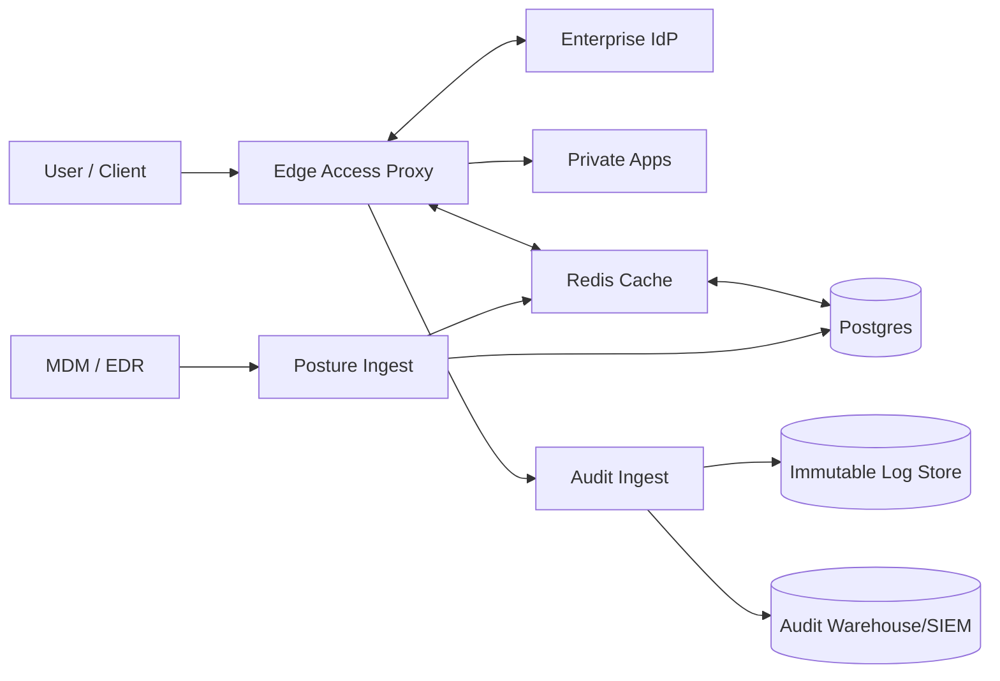

## Overview

A Zero-Trust Access Proxy enforces **identity- and context-based access** to internal applications at **request time**, independent of network location. Users and services authenticate through the enterprise IdP, requests are authorized by policy using identity and device posture, and applications receive a **verifiable identity context** without requiring app changes.

This design centers on:
- An **L7 identity-aware reverse proxy** on the data plane.
- A **single control plane** for app onboarding, policy publishing, posture ingestion, and auditing.
- **Local evaluation** on the request path (token verification + policy evaluation), with bounded-staleness posture.

## Requirements

### Functional Requirements
- Authenticate users against an enterprise IdP (OIDC preferred; SAML supported) with MFA and conditional access.
- Authorize **per request** using identity attributes (groups/roles), app metadata, request context, and device posture.
- Validate device posture (managed/enrolled, OS version, disk encryption, EDR running, jailbreak/root, compliance state, attestation freshness).
- Route authorized requests to the correct internal application over HTTPS; support multi-tenant and per-app config.
- Support step-up auth for sensitive apps and risk-based access (e.g., require fresh posture for “high risk” apps).
- Support non-browser clients (CLI/service access) via OAuth device code / client credentials + mTLS (where applicable).
- Provide admin APIs/UI for app onboarding, policy management, connector management, and audit access.
- Produce immutable audit trails for access decisions and admin actions with policy/version attribution.
- Provide safe rollout controls (deny-by-default, policy staging/canary, instant rollback, break-glass).

### Non-Functional Requirements (Concrete Targets)
- **Scale**
  - Users: 110k total.
  - Devices: 300k–1M registered.
  - Apps: ~5k internal web apps.
  - Traffic: peak 50k RPS global; typical sustained 5k–15k RPS global.
  - Audit volume: ~432M events/day (~130–350 GB/day raw before compression).
- **Latency**
  - Proxy overhead (excluding upstream app time): P50 < 10 ms, P99 < 50 ms.
  - Login flows (OIDC redirects + token exchange): P99 < 2 s (IdP dependent).
  - Config/policy propagation to all edges: P99 < 30 s after publish.
- **Availability**
  - Data plane (edge): 99.99% per region; global availability via multi-region active-active.
  - Control plane (admin/publish): 99.9%.
  - Predictable degradation when posture sources degrade, without silent fail-open for high-risk apps.
- **Consistency**
  - Strong consistency for policy/version publish and key rotation metadata.
  - Posture decisions served with bounded staleness (TTL 60–300s) plus explicit `last_updated`.
- **Durability**
  - Policy/config RPO ≤ 5 minutes.
  - Audit: at-least-once ingestion; once accepted by the audit pipeline, no loss for accepted events.

### Constraints & Assumptions
- Existing enterprise IdP (Okta/Azure AD/Ping) and device signal sources (Intune/Jamf + EDR).
- Primary scope: HTTPS web apps.
- Many legacy apps cannot be modified; enforcement must work via reverse proxy + verified identity context.
- Compliance targets: SOC2 / ISO27001 (optionally HIPAA/PCI per tenant).

### Out of Scope (Initial Version)
- Full private network overlay / L3 VPN replacement.
- Inline DLP for content inspection.
- Full UEBA platform.

## Simplified Architecture

### High-Level Diagram

### Key Properties
- **Hot path is local** at the edge: token verification and policy evaluation run in-process; posture is fetched from Redis with short TTL and explicit freshness rules.
- **Single control plane**: one deployable service with modules (Admin, Policy, Posture, Audit), backed by Postgres and Redis.
- **Strong publish semantics**: policies are versioned and activated via a single transaction, enabling instant rollback and deterministic auditing.
- **Immutable audit**: access/admin events are accepted once and written durably, then made queryable via a warehouse/SIEM integration.

## Trust Boundaries and Threat Model

- **Credential and session theft (phishing/malware)**: phishing-resistant MFA via IdP, short-lived proxy sessions/tokens, step-up for sensitive apps, device posture requirements.
- **Header spoofing to upstream apps**: strip inbound identity headers; propagate identity only via mTLS and/or a signed identity token issued by the proxy.
- **Stale or missing posture**: every posture read includes `last_updated`; high-risk apps enforce freshness thresholds; low-risk apps can accept bounded staleness.
- **Dependency degradation (IdP/MDM/EDR/audit)**: existing sessions continue when IdP is down; posture uses cached decisions within risk-based bounds; audit uses async ingestion with backpressure.
- **Policy mistakes**: staged rollout, canary cohorts, reason-coded decisions, instant rollback, and a break-glass policy bundle.

## Components

### 1) Edge Access Proxy (Data Plane)
**Responsibilities**
- TLS termination, routing, and per-request enforcement.
- Browser SSO redirects and session validation.
- Local JWT verification (IdP tokens and/or proxy-issued tokens).
- Policy evaluation and enforcement (allow/deny/step-up).
- Upstream identity propagation to apps.
- Rate limiting and abuse protection (per user/app/IP).

**Implementation Notes**
- Envoy (recommended) with ext_authz + OPA WASM, or an equivalent L7 proxy with an embedded policy engine.
- Maintain in-memory caches for JWKS, policy bundle, and small decision caches; use Redis for shared caches (posture, revocation markers) per region.

**Identity Propagation to Upstreams (Spoof-Resistant)**
- Strip inbound identity headers (`X-User`, `X-Email`, `X-Groups`, etc.).
- Propagate identity using one of:
  - **mTLS to upstream** + headers (apps trust headers only from the proxy’s client cert), and/or
  - **Signed upstream identity token** (JWT) in a dedicated header (e.g., `X-Access-Token`) verified by apps using proxy JWKS.
- Include `tenant_id`, `user_id`, `device_id`, `groups/entitlements`, `posture_state`, `policy_version`, `iat`, and short `exp`.

### 2) Control Plane Service (Admin + Policy + Keys)
**Responsibilities**
- Admin UI/API for app onboarding and access governance.
- Policy authoring, validation, review/approval workflow.
- Versioned publish with canary cohorts and instant rollback.
- Key metadata management (signing keys for tokens; JWKS publication; rotation coordination).
- Directory/group synchronization (SCIM or API pull) into Postgres.

**Policy Distribution**
- Publish immutable policy bundles keyed by `policy_version_id`.
- Edge proxies fetch by ETag on a short interval (or long-poll), targeting P99 < 30s propagation.
- Canary selection uses stable hashing (e.g., by `user_id`) for consistent cohorts.

### 3) Posture Ingest (Signals → Posture Decision)
**Responsibilities**
- Receive device signals from MDM/EDR/attestation sources (webhooks and/or scheduled pulls).
- Normalize raw signals into a posture decision per device.
- Serve posture decisions via Redis (fast path) with Postgres as source of truth.

**Posture Decision Shape**
- `compliant: bool`
- `reasons: string[]`
- `last_updated: timestamp`
- `source_freshness: {mdm_age, edr_age, attestation_age}`
- `posture_epoch: int` (monotonic per device to support caching and invalidation)

**Risk-Based Freshness**
- Per app risk level defines acceptable max staleness (e.g., low: 5m, medium: 2m, high: 2m + fail-closed when unknown).

### 4) Audit Ingest + Storage
**Responsibilities**
- Accept access decision logs and admin action logs from edges/control plane.
- Provide tamper-resistant, immutable storage and an investigation/query path.
- Export to SIEM where required.

**Storage Model**
- **Immutable Log Store**: object storage as the long-term system of record (append-only files, retention/legal hold, encryption).
- **Audit Warehouse/SIEM**: managed analytics/search path for hot queries and reporting; the admin UI queries this for interactive investigations, with async export for large ranges.

**Delivery Semantics**
- At-least-once ingestion with idempotency by `event_id`.
- Bounded buffering and backpressure so audit does not block request handling.

## Data Model

### Control Plane (Postgres)
- `tenants(tenant_id, name, status, created_at)`
- `apps(app_id, tenant_id, name, hostname_patterns, upstream_url, risk_level, owner_team, created_at)`
- `policies(policy_id, tenant_id, name, created_at, created_by)`
- `policy_versions(policy_version_id, policy_id, version, bundle_blob_or_uri, status, published_at, published_by)`
- `policy_rollouts(policy_version_id, cohort_type, cohort_selector, created_at)`
- `apps_policy_bindings(app_id, policy_id, priority, created_at)`
- `admin_audit(event_id, tenant_id, actor, action, resource_type, resource_id, policy_version_id, created_at, metadata_json)`

### Device Posture (Postgres)
- `devices(device_id, tenant_id, primary_user_id, platform, os_version, managed, encryption, edr, last_seen_at)`
- `device_signals(device_id, tenant_id, source, signal_json, observed_at, ingested_at)`
- `device_posture(device_id, tenant_id, compliant, reasons, last_updated, posture_epoch, computed_from_json)`

### Redis (Regional)
- `posture:{tenant_id}:{device_id}` → `{compliant, reasons[], last_updated, ttl_seconds, posture_epoch}`
- `revoked:{tenant_id}` → bounded set/bloom for high-risk revocations
- Optional short-lived decision cache keyed by `(tenant, app, user_hash, device_epoch, method, path_template, policy_version_id)`.

## API Design

### User-Facing (Proxy Behavior)
Requests arrive on the app’s hostname (e.g., `https://billing.internal.example.com/`).

**Browser Flow**
- Unauthenticated: redirect to IdP (OIDC Auth Code + PKCE).
- Authenticated: validate session/token, fetch posture, evaluate policy, forward or deny.
- Step-up: redirect to IdP with higher assurance requirements, then continue.

**Non-Browser/API Clients**
- `Authorization: Bearer <token>` (device code or client credentials).
- Optional mTLS for high-risk administrative or machine-to-machine access.

**Common Responses**
- `302` to IdP (browser, unauthenticated).
- `401` unauthenticated (API clients).
- `403` policy denied / non-compliant / stale posture (risk-based).
- `429` rate-limited.
- `503` only when a fail-closed policy cannot be evaluated with cached inputs.

### Control Plane (Admin API)
- `POST /v1/apps` (idempotent via `Idempotency-Key`)
- `POST /v1/policies`
- `POST /v1/policies/{policy_id}/versions`
- `POST /v1/policies/{policy_id}/publish` (canary/full)
- `POST /v1/policies/{policy_id}/rollback`
- `GET /v1/audit?app_id=&user_id=&from=&to=` (interactive via warehouse/SIEM; async export for large ranges)

### Posture Ingest (Internal/Partner)
- `POST /v1/device_signals` → `202 Accepted` with dedupe on `(tenant_id, device_id, source, observed_at, signal_hash)`
- `GET /v1/posture/{tenant_id}/{device_id}` → `{compliant, reasons[], last_updated, ttl_seconds, posture_epoch}`

## Scaling & Performance

### Hot Path
For an authorized request, the edge does:
1) Token/session validation (local signature verify; JWKS cached).
2) Posture lookup (Redis hit typical; bounded TTL and `last_updated` checks).
3) Policy evaluation (OPA WASM; deterministic inputs).
4) Optional short decision cache for very high-QPS endpoints.

This keeps latency stable because the request path avoids synchronous calls to IdP/MDM/EDR.

### Horizontal Scaling
- **Edge proxy**: stateless; autoscale per region; active-active across regions with geo routing.
- **Control plane**: Postgres primary with replicas; reads served from replicas; publish writes are serialized to preserve ordering.
- **Posture**: ingestion and computation scale independently (stateless workers) while Redis provides fast serving.

## Failure Modes & Mitigations

1) **IdP outage**
- Existing sessions continue until expiry; new logins/step-up fail.
- Short-lived tokens and cached JWKS keep validation local.

2) **Posture source delays/outage**
- Cached posture remains usable within risk-based staleness bounds.
- High-risk apps fail closed when posture is unknown/stale beyond threshold; user-facing remediation is explicit.

3) **Bad policy publish**
- Canary cohorts and deny-spike detection trigger rollback.
- Break-glass policy bundle is available for emergency access restoration.

4) **Audit ingest degradation**
- Edge uses async, bounded buffering and retries; audit ingest provides idempotent acceptance by `event_id`.
- Non-critical telemetry can be shed before audit if needed.

## Operations

### SLOs and Key Metrics
- Edge: availability 99.99% per region; overhead P99 < 50ms.
- Metrics: auth success rate, decision breakdown (allow/deny/step-up), OPA eval time, JWT verify failures, posture staleness distribution, Redis latency/hit rates, audit ingest acceptance rate and backlog.

### Deployment and Change Management
- Edge: canary/blue-green with connection draining; fast rollback.
- Control plane: backward-compatible migrations; canary releases.
- Policy: draft → automated checks → canary cohorts → full publish; approvals for high-risk apps.
- Keys: scheduled rotation with overlap; alarms on verification failures and `kid` miss spikes.

### Data Retention and Privacy
- Immutable audit logs retained per compliance (e.g., 1 year+), encrypted at rest and in transit.
- Minimize sensitive fields; hash/tokenize where possible.
- Tenant isolation via per-tenant authZ and encryption keys where supported.

## Simplification Notes
- Removed: separate session/auth broker service; browser/OIDC handling is owned by the control plane and enforced at the edge for fewer deployables.
- Removed: Kafka/PubSub-based posture and audit pipelines; posture uses direct ingestion + Postgres source-of-truth + Redis serving, and audit uses a single ingest service that writes to immutable storage and a query system.
- Removed: policy CDN/xDS bundle distribution; edges fetch versioned policy artifacts with HTTP caching and ETags.
- Merged: admin, policy, posture ingestion, and audit ingestion into one control plane service to reduce operational surface area.
- Kept: multi-region edge proxies, local policy evaluation (OPA WASM), spoof-resistant identity propagation (mTLS and/or signed token), and immutable audit storage because they are required for latency, correctness, and compliance at the stated scale.