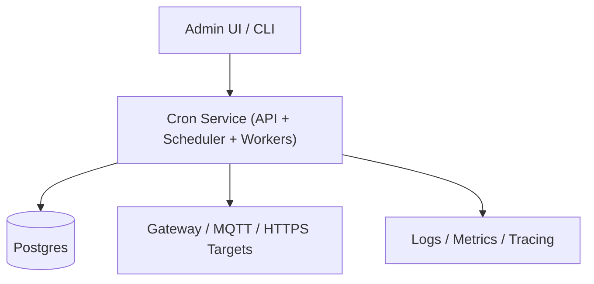

## Overview

A distributed cron system schedules periodic work across many IoT targets (gateways, groups, regions) and continues operating through crashes, retries, partitions, and clock skew. The core correctness rule is that **each scheduled occurrence is durably materialized as a Run** with a unique key. Execution is then a separate, retryable process that can be performed by any healthy worker.

This design favors a small set of well-understood building blocks:
- One stateless service for API + scheduling + dispatching (horizontally scalable)
- One strongly consistent database for all durable state (jobs, runs, retries, audit)
- At-least-once dispatch with effectively-once outcomes via idempotency keys

---

## Requirements

### Functional
- CRUD jobs with cron or fixed interval, IANA timezones, misfire policy (skip/catch-up/run-latest), and jitter
- Associate jobs to targets (gateway/device group/region), multi-tenant isolation
- Reliable run materialization and dispatch; retries with backoff and max attempts
- Run lifecycle tracking: `PENDING → CLAIMED → RUNNING → SUCCEEDED/FAILED/CANCELED/DEAD_LETTERED`
- Admin: pause/resume, run-now, optional cancel pending
- Observability: audit trail, metrics/logs/tracing
- Idempotency: duplicates must not cause duplicate side effects

### Non-functional (as targets)
- Strong consistency for job definitions, run uniqueness, and state transitions
- At-least-once dispatch; eventual delivery when targets are intermittently offline
- Control-plane availability 99.95%; dispatch pipeline 99.99%
- Hot retention for operational correctness; longer retention via tiering/export

---

## Simplified Architecture

### High-Level Diagram

### Components

#### Cron Service (single deployable, stateless)
Responsibilities:
- API: job CRUD, validation, authz, queries
- Scheduler loop: computes due occurrences and inserts Runs
- Worker loop: claims due Runs, executes against targets, records outcomes
- Background maintenance: partition creation, retention, dead-lettering, audit writes

Why it stays:
- Keeps correctness logic in one codebase and one transactional store
- Scales horizontally by running more identical instances

#### Postgres (single source of truth)
Responsibilities:
- Durable state for jobs, targets, runs, retry timing, and audit trail
- Strongly consistent uniqueness and atomic transitions
- Partitioned hot Run data for high write volume

Why it stays:
- Provides the durability and atomicity required for run materialization and claims

#### Targets (gateway / broker / endpoint)
Responsibilities:
- Performs the actual side effects
- Dedupe based on `idempotency_key` (bounded cache or persistent dedupe, depending on target)

Why it stays:
- IoT connectivity is intermittent; target-side dedupe is the practical boundary for effectively-once outcomes

---

## Core Design

### 1) Scheduling Model (durable Run materialization)

Each scheduled occurrence becomes a Run row, uniquely identified per job version, scheduled time, and target.

- Run uniqueness key:
  - `UNIQUE(tenant_id, job_id, job_version, scheduled_time_utc, target_type, target_id)`
- Idempotency key:
  - `idempotency_key = hash(tenant_id | job_id | job_version | scheduled_time_utc | target_type | target_id)`

Schedulers can re-run the same computation safely; duplicates become no-ops via the unique constraint.

#### Efficient due selection (no full scans)
Jobs maintain a cursor:
- `jobs.next_scheduled_at_utc` (indexed)

Scheduler loop:
- Select jobs due soon (`next_scheduled_at_utc <= now + lookahead`) ordered by time
- Lock rows with `FOR UPDATE SKIP LOCKED` so multiple scheduler instances share work without a separate coordination system
- For each job, compute occurrences (timezone-aware) and materialize Runs for its targets
- Advance `next_scheduled_at_utc` in the same transaction as Run inserts

#### Misfire semantics
When behind:
- `SKIP`: advance cursor to the first occurrence ≥ now
- `CATCH_UP`: create occurrences between cursor and now, capped by `max_catch_up_runs` and `max_catch_up_window`
- `RUN_LATEST`: create only the latest occurrence ≤ now, then advance cursor

Jitter:
- `available_at_utc = scheduled_time_utc + jitter + backoff` (jitter sampled deterministically per run if desired)

### 2) Execution Model (claim, lease, run, retry)

Workers poll the database for claimable Runs:
- Claimable when:
  - `status = 'PENDING' AND available_at_utc <= now`, or
  - `status IN ('CLAIMED','RUNNING') AND lease_expires_at_utc < now` (reclaim)

Claim is atomic:
- `SELECT ... FOR UPDATE SKIP LOCKED` (batch)
- Update `status`, set `lease_owner`, `lease_expires_at_utc`, increment attempt counters, write attempt row
- Execute target call with `idempotency_key`
- Heartbeat by extending `lease_expires_at_utc` for long executions
- On failure: compute backoff, set `available_at_utc`, transition back to `PENDING` (until max attempts), then `DEAD_LETTERED`

### 3) Per-target concurrency and rate limits (minimal, durable)

- **Concurrency**: enforced using PostgreSQL advisory locks keyed by `(tenant_id, target_type, target_id, slot)`.
  - For `max_concurrency = k`, worker tries to acquire one of `k` slots before executing.
  - If no slot is available, the run is rescheduled by setting `available_at_utc = now + small_delay`.
  - Locks are released automatically on worker crash.

- **Rate limits (optional per target)**: enforced via a `target_rate` row that stores `next_allowed_at_utc`.
  - Worker locks the row (`SELECT ... FOR UPDATE`), checks `next_allowed_at_utc`, and advances it by `1/max_rate_per_sec` on each execution.
  - If not yet allowed, reschedule the run for `next_allowed_at_utc`.

This keeps limits consistent across many worker instances using only the database.

---

## Data Model (logical)

### `jobs`
- `tenant_id`, `job_id` (PK), `name`, `schedule_type`, `cron_expr`, `interval_seconds`, `timezone`
- `misfire_policy`, `jitter_seconds`, `enabled`, `max_attempts`, `run_ttl_seconds`
- `next_scheduled_at_utc` (indexed), `version`, timestamps

### `job_targets`
- `tenant_id`, `job_id`, `target_type`, `target_id` (PK)
- `max_concurrency`, `max_rate_per_sec`

### `runs` (partitioned by time; hot)
- `tenant_id`, `run_id` (PK), `job_id`, `job_version`, `target_type`, `target_id`
- `scheduled_time_utc`, `available_at_utc` (indexed), `status`
- `lease_owner`, `lease_expires_at_utc` (indexed)
- `attempts_created`, `max_attempts`, `last_error`, `idempotency_key`, timestamps
- Unique constraint on `(tenant_id, job_id, job_version, scheduled_time_utc, target_type, target_id)`

### `attempts` (optional but useful for audit/debug)
- `tenant_id`, `attempt_id` (PK), `run_id`, `attempt_no`, `worker_id`
- `status`, `started_at`, `finished_at`, `error_code`, `error_message`

### `job_audit`
- append-only records of job creates/updates/pause/resume/runNow (who/when/what)

### `target_rate` (only for targets with rate limits)
- `(tenant_id, target_type, target_id)` (PK), `next_allowed_at_utc`, timestamps

---

## APIs (minimal surface)

- `POST /v1/jobs` (supports `Idempotency-Key`)
- `PATCH /v1/jobs/{jobId}` with `If-Match: <version>`
- `POST /v1/jobs/{jobId}:pause`
- `POST /v1/jobs/{jobId}:resume`
- `POST /v1/jobs/{jobId}:runNow` (supports `Idempotency-Key`)
- `GET /v1/jobs/{jobId}/runs?...` (cursor pagination)

Errors return a stable envelope (e.g., `application/problem+json`) with `code`, `message`, and `requestId`.

---

## Reliability and Failure Handling

- Scheduler crash: work is retried by another instance; Run inserts are idempotent via unique constraints.
- Worker crash mid-run: lease expires; another worker reclaims; target-side idempotency prevents duplicate side effects.
- Database restart/failover: acknowledged writes are durable; stateless service instances reconnect and resume.
- Target offline: executions fail and retry; misfire policy + TTL prevent unbounded backlog.
- DST/clock skew: scheduling is computed server-side using timezone rules; runs persist the logical `scheduled_time_utc` in UTC.

---

## Scaling and Performance

- Use lookahead scheduling (2–5 minutes) and jitter to smooth top-of-minute spikes.
- Batch run inserts per job/target set.
- Partition `runs` by day/hour; keep hot retention 24–72 hours for correctness and operational queries.
- Export older runs/attempts to an analytical store/object storage asynchronously (daily job) for 30-day history needs.
- Claim in small batches with `SKIP LOCKED` to avoid thundering herds and reduce lock contention.

---

## Simplification Notes

- Removed: `API Gateway` and separate `Job Service`; a single stateless `Cron Service` handles API + scheduling + workers, reducing deployable units and keeping correctness logic together.
- Removed: external `Lease/Coordination KV`; scheduler parallelism uses `SELECT ... FOR UPDATE SKIP LOCKED` on due jobs, providing safe work sharing with one datastore.
- Removed: `Dispatch Queue`, `Outbox`, and dedicated publisher; workers consume directly from the `runs` table with atomic claims, preserving at-least-once behavior with fewer moving parts.
- Merged: `Metadata DB` and `Run DB` into one `Postgres` cluster; jobs, runs, attempts, rate state, and audit live in one transactional schema for strong consistency.
- Complexity that remains: run uniqueness constraints, atomic claim/lease transitions, and target-side idempotency; these are required to remain correct under crashes, partitions, and retries at IoT scale.