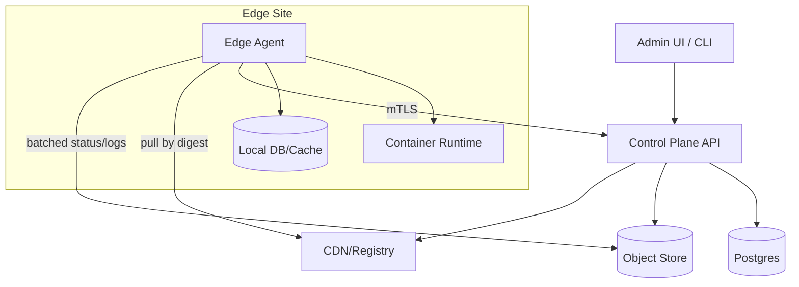
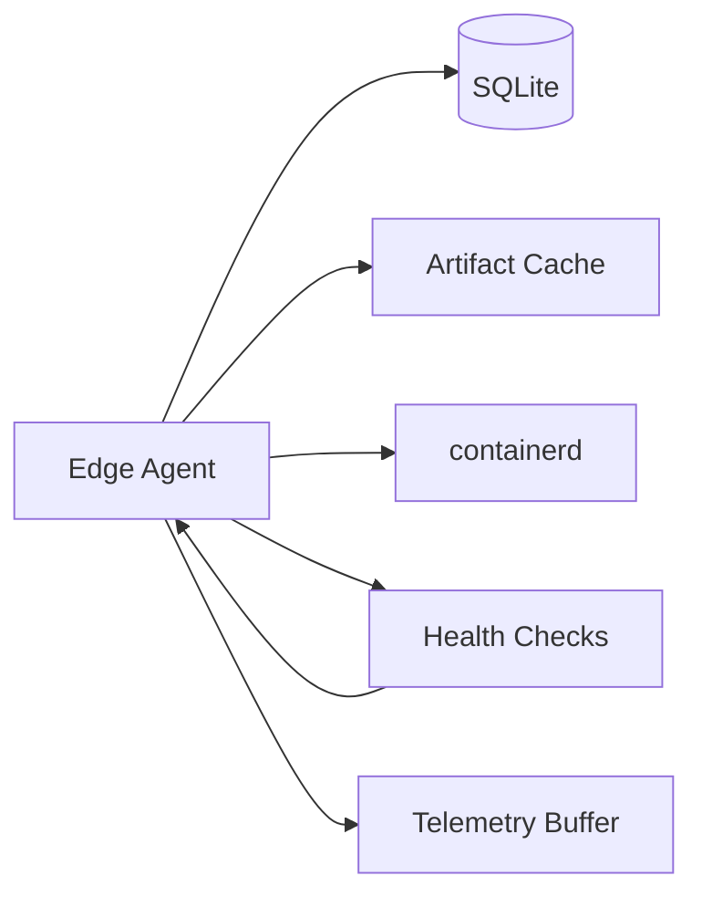

# Edge Compute Platform

## Overview

This platform deploys and operates containerized workloads across **thousands of distributed edge sites** (retail stores, factories, towers) where connectivity is **intermittent**, bandwidth is limited, hardware is heterogeneous, and physical compromise risk is higher than in a cloud region.

The design separates:
- A **cloud control plane** that stores intent (desired state), enforces policy/RBAC, orchestrates rollouts, and records audit history.
- An **edge agent** that executes autonomously using last-known desired state, safely applies updates, and continues running through outages.

Correctness is driven by **desired state + local safety**. Telemetry is **best-effort** and intentionally non-blocking.

---

## Requirements

### Functional
- Zero-touch enrollment with strong per-node identity; rotation and revocation.
- Deploy OCI images + config + secrets; canary/blue-green/phased rollouts.
- Placement constraints (arch/GPU/labels), priorities, quotas, resource limits.
- Lifecycle: start/stop, pin versions, rollback, health checks, drift detection, auto-repair.
- Offline operation: keep running last-known-good, queue updates, reconcile on reconnect.
- Observability: heartbeats, status, logs/metrics/events for diagnostics; fleet health and alerts.
- Remote ops: cordon/drain, restart workload, fetch diagnostics, audited debug access.
- Multi-tenancy: tenant isolation, RBAC, per-tenant quotas, policy-as-code.

### Non-functional targets (as given)
- Scale: **10,000 locations**, **~30,000 nodes**, **0.5M–2M containers**, **5,000 RPS** admin API peak.
- Control plane: **99.99%**, RPO **≤ 5 min**, RTO **≤ 30 min**.
- Strong consistency for desired-state writes and audit; eventual for observed status/telemetry.
- Outbound-only connectivity; encryption in transit/at rest; auditable privileged actions.

---

## Simplified Architecture

### High Level

**What stays strongly consistent**
- All desired-state mutations (deploy intent, rollout steps, RBAC/policy decisions) and audit events in **Postgres**.

**What stays eventually consistent**
- Node heartbeats, applied generations, workload status, logs/metrics/events uploaded asynchronously.

### Edge Site Internals

---

## Core Concepts

### Desired vs Observed
- **Desired state**: authoritative intent per location (what should run).
- **Observed state**: what the edge reports (what is running, last seen, health).

The control plane never relies on raw logs for correctness. Rollout gating uses bounded health signals derived from status and restart/health outcomes.

### Generation-based convergence
- Each location assignment includes a monotonic `generation`.
- The agent applies only if `generation > applied_generation` and reports `applied_generation` back.

### Edge autonomy rule
- The edge performs signature verification, staged activation, and rollback **without** synchronous reads from the control plane.

---

## Components

### 1) Control Plane API (single service, modular)
**Responsibilities**
- Admin API (tenants, locations, deployments, releases, rollouts).
- Agent API (enroll, fetch assignments, report status, fetch secrets, debug sessions).
- Policy/RBAC evaluation and audit logging.
- Rollout orchestration and reconciliation loops.

**Implementation notes**
- One deployable service with internal modules: `auth`, `policy`, `desired_state`, `rollouts`, `agent_api`, `ops/audit`.
- Background workers run in the same service (or the same container image) using Postgres job tables.

### 2) Postgres (single primary database)
**Stores**
- Desired state, rollout progress, audit logs.
- A compact, query-friendly **fleet status read model** (last seen, applied generation, health, workload counts).

**Why it works**
- Desired state is relatively low-churn compared to raw telemetry.
- High-churn observed updates are reduced to small, bounded rows per node/location.

### 3) Artifact Distribution (OCI + signing)
**Responsibilities**
- Immutable artifacts addressed by digest.
- Distribution via registry backed by object storage and a CDN.

**Integrity**
- Artifacts are signed in CI; the agent verifies signatures before activation.
- The trusted public key (or keyset) is pinned in the agent config and rotated via control-plane updates.

### 4) Telemetry Storage (object store, best-effort)
**Responsibilities**
- Accept batched uploads from agents for logs/metrics/events with quotas and sampling.
- Provide on-demand retrieval for debugging and incident workflows.

**Boundaries**
- Only store what’s needed for fleet operations in Postgres (heartbeats/status/health).
- Store raw diagnostics as compressed, time-partitioned blobs in object storage keyed by `{tenant}/{location}/{time}`.

### 5) Edge Agent (local control loop)
**Responsibilities**
- Outbound-only mTLS to control plane.
- Persist last desired assignment and last-known-good release in local SQLite.
- Pull by digest, verify signatures, apply staged updates, run health checks.
- Roll back to last-known-good on repeated failures; quarantine a failing release locally.
- Buffer telemetry to disk and upload when connectivity allows.

**Runtime**
- `containerd` + a minimal networking setup (CNI) to keep the footprint small.

---

## Data Model (Postgres)

### Authoritative tables
- `tenants(tenant_id, name, created_at)`
- `locations(location_id, tenant_id, region, labels_jsonb, created_at)`
- `nodes(node_id, location_id, arch, labels_jsonb, enrolled_at, revoked_at)`
- `deployments(deployment_id, tenant_id, name, strategy, created_by, created_at)`
- `releases(release_id, deployment_id, image_digest, config_digest, version, constraints_jsonb, created_at)`
- `location_assignments(location_id, release_id, generation, desired_spec_jsonb, updated_at)`
- `rollouts(rollout_id, release_id, state, step_jsonb, started_at, updated_at)`
- `audit_log(event_id, tenant_id, actor, action, resource, request_jsonb, created_at)` (time-partitioned)

### Fleet read model (bounded, observed)
- `node_status(node_id, location_id, last_seen_at, applied_generation, health, workload_counts_jsonb, updated_at)`
- `location_status(location_id, last_seen_at, applied_generation, health, updated_at)`

### Invariants
- `generation` increases per `location_id`.
- Agents apply idempotently: only newer generations; status reports deduped by `(node_id, seq)` within a bounded window.

---

## APIs

### Admin/Control APIs (REST)
- `POST /v1/tenants/{tenantId}/locations` → returns `locationId` and enrollment token (short-lived)
- `POST /v1/tenants/{tenantId}/deployments`
- `POST /v1/tenants/{tenantId}/deployments/{deploymentId}/releases` (digests required)
- `POST /v1/tenants/{tenantId}/releases/{releaseId}/rollouts` (steps + health gates)
- `GET /v1/tenants/{tenantId}/locations/{locationId}/status` (eventual; returns staleness)

Conventions:
- `Idempotency-Key` for all mutations.
- Optimistic concurrency with `etag` for updates.
- Pagination and tenant scoping everywhere.

### Agent APIs (gRPC or HTTP/2)
- `RegisterNode(enroll_token, node_info) -> node_identity`
- `GetAssignments(node_identity, last_generation) -> assignment_delta` (long-poll)
- `ReportStatus(node_identity, status_batch) -> ack`
- `FetchSecrets(node_identity, refs) -> encrypted_secrets`
- `OpenDebugSession(node_identity, request) -> session` (time-bound, recorded, audited)

---

## Rollouts and Safety

### Edge apply sequence
1. Pull artifacts by digest
2. Verify signature
3. Stage update
4. Switch activation
5. Validate health checks
6. Commit `last-known-good` locally

### Health gates
- Rollouts advance based on bounded signals:
  - restart rate / crash loops
  - failed health checks
  - “location unhealthy” and “node missing” thresholds
  - minimum bake time per step

---

## Scaling Strategy

- Partition work in the control plane by `location_id` hash to parallelize reconciliation.
- Use Postgres job tables for rollout steps and retries (`SELECT … FOR UPDATE SKIP LOCKED`).
- Keep observed writes small and rate-limited (adaptive heartbeats; status deltas not full state).
- Store raw telemetry in object storage with quotas/sampling; avoid indexing it in the primary database.
- Add read replicas for status queries; partition `audit_log` by time.

Multi-region:
- Active region + warm standby with replicated Postgres (RPO ≤ 5 min) and DNS failover (RTO ≤ 30 min).
- Agents configured with multiple control-plane endpoints.

---

## Failure Modes (handled by design)

- **Site offline for hours**: agent runs last-known-good; buffers updates/telemetry; reconciles on reconnect.
- **Bad release**: agent rolls back locally; rollout step halts on health gate breaches.
- **Registry/CDN outage**: new rollouts stall; existing workloads continue; caches mitigate.
- **Control plane outage**: edges continue running; admin operations degraded until failover completes.
- **Compromised node**: per-node mTLS identity, short-lived certs, revocation, scoped secrets, auditable debug access.
- **Clock skew**: monotonic sequence numbers for status; server clamps timestamps for ingestion.

---

## Operations

- SLOs: control-plane write acceptance P99 < 800ms; availability 99.99%.
- Alerts: API 5xx rate, Postgres latency, backlog of rollout jobs, % offline locations, rollout stuck timers.
- Change management:
  - Control plane: canary deploys and feature flags for rollout logic.
  - Agent: ring-based rollout with signed binaries and rollback to N-1.
- Incident tooling:
  - global/tenant rollout halt
  - revoke node identity
  - fetch last N minutes diagnostics bundle per location from object storage
  - break-glass debug sessions (time-bound, recorded, audited)

---

## Simplification Notes

- **Removed**
  - Event streaming backbone and dedicated TSDB/log store: telemetry is stored as bounded status in Postgres plus raw blobs in object storage, keeping rollout correctness and API performance independent of heavy ingest.
  - Separate “health signals store”: rollout gates use the same bounded status/health fields already persisted for fleet status.
  - Separate reconciler service and external work queue: background workers run with Postgres-backed job tables.

- **Merged**
  - API gateway, control API, policy engine, orchestrator, and telemetry ingest into a single modular control-plane service, reducing deployables and failure modes.
  - Desired-state DB, audit DB, and UI read model into a single Postgres cluster with partitioning and replicas.

- **Complexity that remains (and why)**
  - mTLS identity, short-lived credentials, and audit logging: required for zero-trust and compliance in physically exposed environments.
  - Edge local persistence + staged rollout + rollback: required to operate safely during connectivity loss and bad releases.
  - CDN/registry + signed artifacts: required for scalable distribution and supply-chain integrity across many sites.