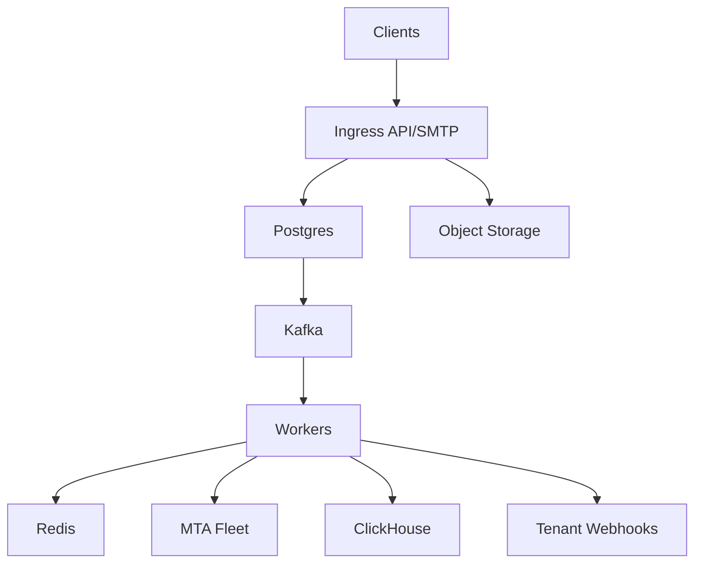

# Email Delivery Platform

## Overview

This platform accepts email send requests via REST and SMTP, renders personalized content, and delivers mail reliably while protecting sender reputation. The system separates **durable acceptance** (fast, strongly validated, tenant-isolated) from **delivery execution** (provider-throttled, retry-heavy) so API latency stays predictable and delivery can be tuned without risking data loss.

Core goals:
- Strong correctness for compliance and suppression.
- Tenant isolation for quotas, IP pools, and kill switches.
- Reliable delivery retries with provider-aware throttling.
- Durable, queryable event history with webhook fanout.

---

## Requirements

### Functional Requirements
- Ingest via:
  - REST API (JSON).
  - SMTP relay (authenticated tenants).
- Support templates, per-recipient substitutions, raw MIME, attachments, headers, and metadata.
- Deliverability controls:
  - Shared and dedicated IP pools, warm-up schedules, per-domain throttling.
- Compliance:
  - List-Unsubscribe + one-click where applicable.
  - Suppression lists (bounce/complaint/unsubscribe/manual).
  - Tenant/campaign kill switch; auditing of policy-relevant actions.
- Events:
  - accepted, queued, sent, delivered, deferred, bounced, complained, unsubscribed.
  - opens/clicks optional (best-effort signal).
  - Tenant webhooks with retries and signatures.
- Analytics:
  - Time-series aggregates and searchable per-message trace.

### Non-Functional Targets
- Durable acceptance with RPO ≈ 0 for accepted sends.
- Strong consistency for suppression, kill switches, and idempotency.
- Eventual consistency acceptable for analytics and event search.
- Multi-AZ by default; clear upgrade path to multi-region.

---

## Simplified Architecture

### High-Level Diagram

### Component Overview

#### Ingress API/SMTP
A single stateless service handles REST and SMTP submission.
- Authenticates tenant, validates payloads, enforces request limits.
- Applies compliance checks (unsubscribe headers where required, category rules).
- Performs suppression checks and kill-switch checks with strong consistency.
- Writes acceptance state in Postgres and returns `202` with `message_id`.

#### Postgres (System of Record)
Postgres is the source of truth for all strong-consistency decisions.
- Tenants, credentials, policies, IP pools, warm-up schedules.
- Messages, recipients, idempotency keys, suppression, audit log.
- Transactional outbox used to publish send work into Kafka without dual-write gaps.

#### Kafka (Buffer + Backpressure)
One Kafka cluster provides durable buffering and decoupling.
- `send_jobs` topic: work required to attempt delivery (partitioned by `tenant_id`).
- `events` topic: delivery/inbound/tracking events for downstream consumers.
- Backpressure is implemented by throttling acceptance when job lag exceeds thresholds.

#### Workers (Delivery + Events + Webhooks)
A single worker codebase runs multiple roles (scaled independently via configuration):
- Outbox publisher: reads Postgres outbox rows and publishes `send_jobs`.
- Delivery workers: consume `send_jobs`, render templates, select IP pool, throttle, attempt SMTP via MTA fleet, schedule retries.
- Event consumers: batch-write events to ClickHouse, trigger suppression updates when required, and enqueue webhook deliveries.
- Webhook delivery: at-least-once delivery with per-tenant concurrency limits, retries, and signed payloads.

#### Redis (Hot Rate State)
Redis stores ephemeral state that benefits from low latency:
- Token buckets for per-tenant and per-domain throttling.
- Short-lived counters for edge rate limiting.
- Webhook retry cursors and per-tenant concurrency state.
Postgres remains authoritative for policy and suppression.

#### MTA Fleet
MTAs execute SMTP transactions efficiently:
- TLS, connection pooling, DKIM signing, detailed SMTP response capture.
- Keeps delivery execution fast; routing/throttling decisions stay in workers for uniform policy.

#### ClickHouse (Event Store + Analytics)
ClickHouse stores the immutable event log for trace and analytics:
- High-ingest append-only `events` table.
- Rollups via materialized views or scheduled aggregation jobs for hourly/daily dashboards.

---

## Key Flows

### 1) REST / SMTP Acceptance
1. Ingress authenticates tenant and validates request.
2. Ingress checks kill switches and suppression (Postgres).
3. Ingress writes a single Postgres transaction:
   - `messages`, `message_recipients` (or a pointer to stored MIME / template references)
   - `idempotency_keys`
   - `outbox` row describing the send job
4. Ingress returns `202 Accepted` with `message_id`.

### 2) Delivery + Retry
1. Outbox publisher publishes send jobs to Kafka.
2. Delivery workers consume jobs, fetch content from object storage, and render per-recipient payload.
3. Worker selects IP pool and applies provider-domain throttling via Redis token buckets.
4. Worker asks MTA fleet to attempt delivery and captures SMTP results.
5. Worker emits canonical events to Kafka `events` and schedules retries for deferrals up to the configured max age (e.g., 72h).

### 3) Inbound (Bounces / Complaints) and Tracking (Opens/Clicks)
- Ingress exposes endpoints for:
  - Inbound MX/FBL processing (provider reports normalized to canonical events).
  - Tracking endpoints (pixel/redirect) with buffering and shedding under load.
- Both produce canonical events into Kafka `events`.

### 4) Event Storage, Suppression Updates, and Webhooks
- Event consumers batch-insert into ClickHouse.
- Policy-driven events (unsubscribe/complaint/hard bounce) update Postgres suppression.
- Webhook workers deliver signed events to tenant endpoints with retries and per-tenant limits.

---

## Data Model (Minimal)

### Identifiers and PII
- `message_id`, `event_id`: ULID/UUIDv7.
- Recipient identity:
  - `email_hash = SHA-256(normalized_email + tenant_salt)` for suppression joins.
  - Optional encrypted email for tenant-facing display/webhooks with retention limits.

### Postgres Tables (Core)
- `tenants(tenant_id, status, plan, created_at)`
- `api_keys(key_id, tenant_id, hashed_secret, scopes, revoked_at)`
- `messages(message_id, tenant_id, campaign_id, from_identity, ip_pool_id, status, accepted_at)`
- `message_recipients(message_id, rcpt_id, email_hash, dest_domain, personalization_json, status)`
- `idempotency_keys(tenant_id, idem_key, payload_sha256, message_id, created_at)` unique `(tenant_id, idem_key)`
- `suppression(tenant_id, email_hash, reason, created_at, source_event_id)` unique `(tenant_id, email_hash)`
- `kill_switches(tenant_id, scope, scope_id, enabled, reason, updated_at)`
- `audit_log(id, tenant_id, action, actor, created_at, meta_json)`
- `outbox(id, topic, payload_json, created_at, published_at)` for `send_jobs`

### Object Storage
- `mimes/{tenant_id}/{message_id}.eml`
- `attachments/{tenant_id}/{blob_id}`
Postgres stores only pointers and size metadata.

### ClickHouse Tables (Core)
- `events(tenant_id, event_time, event_id, message_id, rcpt_id, type, provider_domain, ip_id, smtp_code, meta Map(String,String))`
- Hourly/daily rollups using materialized views or scheduled jobs.

---

## API (Condensed)

### REST
- `POST /v1/messages:send` with `Idempotency-Key`
  - Returns `202` with `message_id`.
  - Errors: `401/403/409/422/429`.
- `GET /v1/messages/{message_id}`
  - Returns acceptance metadata + per-recipient summary + trace pointers.
- `GET /v1/events`
  - Paginated event search (eventual consistency).
- `POST /v1/suppressions`
  - Idempotent by `(tenant_id, email_hash)`.
- `POST /v1/messages/{message_id}:cancel`
  - Best-effort for not-yet-attempted recipients.

### Webhooks
- `POST {tenant_webhook_url}`
  - Headers: `X-Event-Id`, `X-Signature`, `X-Timestamp`, `X-Retry-Count`
  - At-least-once; tenants dedupe by `event_id`.

---

## Scaling and Operations (Practical Baseline)

- Scale stateless Ingress horizontally; protect Postgres with strict edge rate limiting.
- Partition Kafka `send_jobs` by `tenant_id` to preserve tenant isolation and predictable scaling.
- Batch ClickHouse inserts (e.g., 5k–50k rows/insert) for sustained ingest.
- Keep Redis strictly for ephemeral rate state; fail safe by reducing throughput if Redis is degraded.
- Multi-AZ for Postgres/Kafka/ClickHouse; disaster recovery via snapshots + replayable Kafka retention for events.

Minimum monitoring:
- Ingress: RPS, P99 latency, 4xx/5xx, auth failures, `429` rate limiting.
- Postgres: commit latency, replication health, connection usage, outbox backlog.
- Kafka: consumer lag on `send_jobs` and `events`.
- Delivery: SMTP code distribution, deferrals by provider domain, retry backlog age.
- Webhooks: per-tenant success rate, retry queue age, DLQ size.
- ClickHouse: ingest throughput, insert latency, merge lag, query P99.

---

## Simplification Notes

- Removed: separate “API edge”, “SMTP edge”, and “Auth & Policy” services; a single `Ingress API/SMTP` service keeps all accept-path logic colocated while remaining stateless and horizontally scalable.
- Removed: standalone “Message Trace API” and “Aggregations/Reporting” services; trace reads come from Postgres + ClickHouse, and rollups are handled inside ClickHouse (materialized views/scheduled jobs).
- Merged: outbox publisher, delivery orchestrator, event consumers, and webhook dispatcher into one `Workers` codebase deployed in distinct roles; this keeps one operational surface area while allowing independent scaling.
- Kept: Postgres for suppression/idempotency/kill switches because those decisions require strong consistency on the accept path.
- Kept: Kafka as the durable buffer between acceptance and delivery/events because delivery retries and high-volume telemetry need controlled backpressure.
- Kept: ClickHouse for the event log and analytics because sustained high-ingest append-only workloads and long retention are central to support tooling and reporting.
- Kept: Redis for hot rate state because deliverability throttling and per-tenant webhook concurrency need low-latency, high-churn state that should not pressure Postgres.