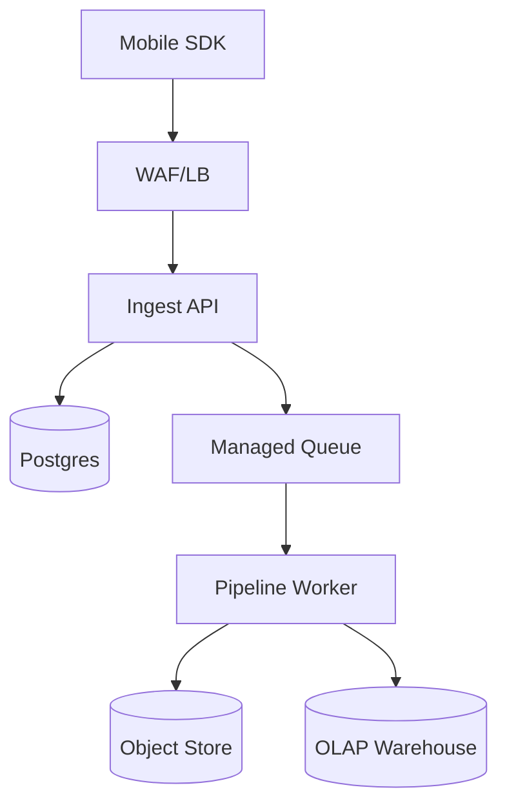
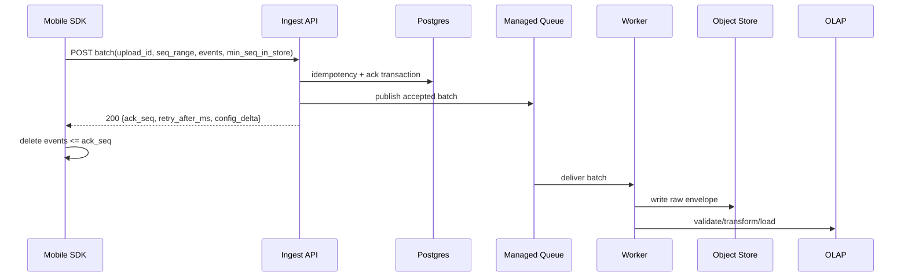

## Overview

Mobile telemetry has to work with intermittent connectivity, background execution limits, and tight battery/data budgets. The design treats telemetry as **opportunistic, batched, and idempotent**:

- **On-device**: persist events to a local WAL, upload in adaptive batches under favorable conditions (connectivity, power, optional Wi‑Fi/charging).
- **Server-side**: acknowledge quickly after **durable acceptance**, using **upload idempotency** plus **per-device sequence acknowledgements** so retries don’t double-count.
- **Analytics**: keep a replayable raw history and a query-optimized dataset with a few-minute freshness target.

## Goals and Non-Goals

### Goals
- Reliable ingestion under mobile constraints with predictable battery/data usage.
- At-least-once delivery with **idempotent ingestion** (safe retries).
- Analytics freshness of **< 5 minutes** for common dashboards, with replay for backfills.
- Multi-tenant quotas and privacy controls suitable for production.

### Non-Goals
- Exactly-once analytics across all failure modes for all event types.
- Sub-second end-to-end streaming for all devices.

## Requirements

### Functional Requirements
- Persist client events locally until uploaded; survive restarts and OS-killed jobs.
- Upload events in **batches** with compression; optional app-layer encryption for sensitive tenants.
- Safe retries and delivery feedback via a monotonic `ack_seq`.
- Server-driven config: batching, sampling, backoff, throttles.
- Backpressure: server hints (`Retry-After` / `retry_after_ms`) and client adaptation.
- Privacy: minimize PII, tenant isolation, opt-out/consent, and deletion workflows where applicable.

### Non-Functional Requirements (Targets)
- Scale: **50M DAU**, **25B events/day**, **4–8 TB/day compressed** (typical).
- Ingest API latency: **P50 < 200ms**, **P99 < 1s** (in-region server time).
- Availability: **99.99%** monthly for ingest.
- Durability: once acked, survives single-node and single-AZ failures.
- Consistency: strong per-device ack/idempotency within a region; eventual for analytics.

## Simplified Architecture

### Components

#### Mobile SDK
- Writes events to a local WAL (SQLite WAL mode or append-only log).
- Assigns a monotonic `client_seq` at persistence time.
- Uploads batches when thresholds are met and conditions allow.
- Deletes local events only after receiving `ack_seq`.

#### Ingest API (single service)
- Auth + tenant isolation + quotas.
- Validates headers, payload size, schema version, and seq ranges.
- Implements idempotency and per-device ack tracking using Postgres transactions.
- Publishes the accepted batch to a **managed queue** and returns a compact response:
  - `ack_seq`, `retry_after_ms`, and optional `config_delta` (piggybacked).

#### Postgres (single state store)
Stores only small, bounded state:
- Per-device ack state: highest contiguous accepted sequence.
- Per-upload idempotency: remembers responses for retries and detects conflicts.

#### Managed Queue
- Decouples ingest from storage/analytics without operating a streaming cluster.
- Provides retry handling and backpressure to the worker tier.

#### Pipeline Worker (single worker service)
- Consumes accepted batches from the queue.
- Writes immutable raw batches to object storage (for replay/audit).
- Validates/transforms and loads into the OLAP warehouse for querying.
- Sends irrecoverable records to a “failed” bucket/table for inspection and alerting.

#### Object Store (raw)
- Stores compressed, immutable batch envelopes partitioned by tenant and time.
- Retention and deletion are policy-driven (per tenant).

#### OLAP Warehouse (curated)
- Houses query-optimized tables for dashboards/investigations.
- Uses partitioning by date and clustering by tenant/event type/time for performance.

## Core Correctness Model

### Identifiers
- `tenant_id`: derived from auth token/credential.
- `device_install_id`: random UUID generated on install (avoid hardware IDs).
- `device_epoch`: increments when local telemetry state is reset.
- `client_seq`: monotonic per `(install_id, epoch)`, assigned at persist time.
- `upload_id`: UUID for a specific batch attempt; reused on retries of the same batch.
- `batch_hash`: SHA-256 of canonical (uncompressed) batch to detect conflicts.

### Delivery Semantics
- Client → Server: at-least-once.
- Server ingestion: idempotent per `(tenant_id, device_install_id, device_epoch, upload_id)`.
- Client cleanup: delete local events `<= ack_seq`.

### Ack Rules
- `ack_seq` is monotonic per `(tenant_id, device_install_id, device_epoch)`.
- The server advances `ack_seq` only for accepted contiguous sequences.
- To prevent the client from getting stuck after local drops, the request includes `min_seq_in_store`; the server may advance `ack_seq` to `min_seq_in_store - 1`.

## Data Model (Minimal)

### On-device (SQLite)
- `events(client_seq PRIMARY KEY, ts_ms, type, payload, priority, size_bytes, event_id)`
- `device_state(device_install_id, device_epoch, last_acked_seq, config_version, next_allowed_upload_ts_ms)`

### Server-side (Postgres)

**Per-device ack**
- PK: `(tenant_id, device_install_id, device_epoch)`
- `ack_seq BIGINT NOT NULL`
- `updated_at TIMESTAMP`

**Per-upload idempotency**
- PK: `(tenant_id, device_install_id, device_epoch, upload_id)`
- `first_seq BIGINT`, `last_seq BIGINT`, `batch_hash BYTEA`, `ack_seq_returned BIGINT`
- `received_at TIMESTAMP`
- TTL via table partitioning or scheduled cleanup (e.g., 7–14 days)

## API Design

### POST `/v1/telemetry/batches`
- Auth: `Authorization: Bearer <token>` (tenant derived from token)
- Headers:
  - `Content-Type: application/x-protobuf`
  - `Content-Encoding: zstd|gzip`
  - `Idempotency-Key: <upload_id>`
  - `X-Device-Install-Id: <uuid>`
  - `X-Device-Epoch: <int>`
  - `X-SDK-Version: <semver>`
  - `X-Batch-SHA256: <base64>` (recommended)

**Request (envelope)**
- `upload_id, device_install_id, device_epoch, first_seq, last_seq, min_seq_in_store, client_time_ms, events[]`

**Response**
- `ack_seq`
- `received_upload_id`
- `retry_after_ms`
- `config_delta` (optional)

**Server processing (single transaction)**
1. Authenticate/authorize, enforce quotas, validate sizes and seq range.
2. Look up `(tenant, install, epoch, upload_id)`:
   - If exists and hash/range match: return stored response (idempotent replay).
   - If exists and conflicts: return `409 Conflict`.
3. Publish to the managed queue (durable publish required).
4. Update per-device `ack_seq` monotonically.
5. Store idempotency record with the returned `ack_seq`.

**Errors**
- `400` invalid schema/seq range/encoding/version
- `401/403` auth/tenant mismatch
- `409` idempotency conflict (same `upload_id`, different content)
- `413` payload too large (compressed or decompressed)
- `429` throttled (`Retry-After`)
- `503` cannot durably accept (`Retry-After`)

### GET `/v1/telemetry/config` (optional)
Supported, but the default is to piggyback `config_delta` on upload responses to avoid extra radio wakeups.

## Data Flow

## Scaling & Performance

### Client-side
- Batching thresholds (events or bytes) and a max delay (minutes) to reduce radio tail.
- Backoff with jitter on failures; respect `Retry-After`.
- Local quota (e.g., 50–200MB) with priority-based dropping and counters.

### Server-side
- Enforce strict compressed/decompressed size limits and streaming decode.
- Rate limits per tenant/device; protect with WAF rules.
- Scale Ingest API horizontally (stateless) and Worker separately (queue-driven).

## Security & Privacy

- PII minimization and on-device redaction/consent gates.
- Pseudonymous identifiers (`device_install_id`), avoid hardware IDs.
- TLS in transit; encryption at rest for Postgres/object store/warehouse.
- Tenant isolation derived from auth token; quotas and limits enforced server-side.
- Deletion:
  - Prefer designs where raw/curated data contains no direct PII.
  - When deletion is required, partition by tenant/time and run delete jobs against affected partitions; keep a minimal mapping only if strictly necessary.

## Disaster Recovery & Multi-Region

- Run ingest in 2+ regions with per-device regional affinity (DNS/config).
- Postgres is multi-AZ within a region; cross-region DR via managed replication where available.
- During regional failover, duplicates are possible; analytics handles dedupe for critical metrics using `(tenant_id, device_install_id, device_epoch, client_seq)` or `event_id` where needed.

## Simplification Notes

- Removed: separate `ConfigAPI` + `CfgDB`; config is served/piggybacked by the single `Ingest API` and stored in the same Postgres.
- Removed: dedicated `Ack/Idempotency Store` technology and optional Redis; Postgres is the single authoritative store using primary keys and transactional updates.
- Replaced: Kafka-style stream cluster with a managed queue to reduce operational surface while keeping durable decoupling.
- Merged: `Raw Archive Writer`, `Curator/Validator`, and `DLQ` into one `Pipeline Worker` plus a simple “failed records” sink (bucket/table) with alerting.
- Complexity kept: per-device sequencing/idempotency (required for correctness with retries), durable acceptance before ack (required for durability), and a replayable raw store (required for backfills and audits).