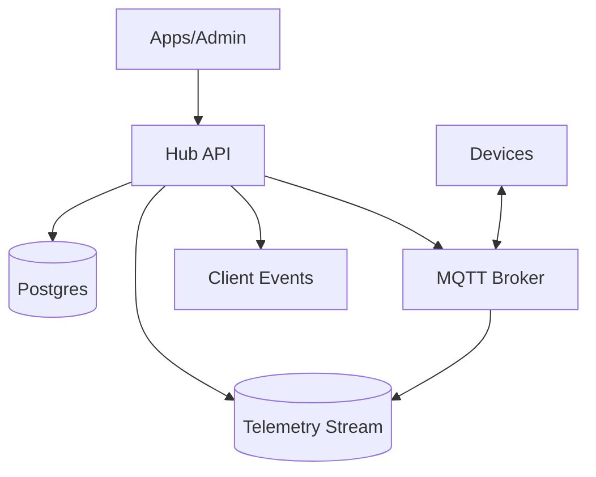
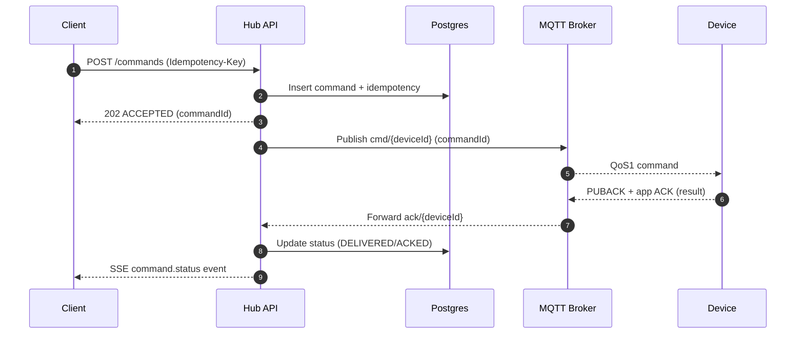

## Overview

A smart home backend must deliver user commands (e.g., “unlock door”, “turn on lights”) to devices that are frequently behind NATs, carrier-grade NAT, and restrictive firewalls. The core challenge is achieving **reliable command delivery** and a **coherent user experience** while devices roam networks, drop connections, and intermittently go offline.

The foundation is inverted connectivity: devices maintain **long-lived outbound, authenticated connections** to the cloud (MQTT over TLS on 443; optional MQTT-over-WebSocket on 443). The backend routes commands over those existing sessions and exposes a clear command lifecycle (`ACCEPTED` → `DELIVERED` → `ACKED`) plus a **device shadow** (`desired` vs `reported`) so user intent and device truth converge over time.

This document describes a production-ready architecture with concrete semantics, failure handling, and operational guidance, using a minimal set of core components.

## Goals and Non-Goals

### Goals
- Deliver commands with clear guarantees and observable status transitions.
- Support intermittent connectivity and offline delivery where safe.
- Maintain a device shadow (desired/reported) with conflict-safe updates.
- Scale to millions of concurrent connections with multi-tenant isolation.
- Provide strong security primitives (device identity, least privilege, auditability).

### Non-Goals
- Replacing local LAN control; local-first hubs can be layered on later.
- Real-time hard control loops (e.g., sub-10ms industrial control).
- Performing heavy analytics in the critical path (analytics is asynchronous).

## Requirements

### Functional Requirements
- Device onboarding and secure provisioning (pairing a device to a home/user).
- Maintain device connectivity through NAT/firewalls via outbound long-lived sessions.
- Send commands to a specific device with **durable acceptance**, delivery attempts, and device acknowledgements.
- Support offline devices: queue *eligible* commands (with TTL) and deliver on reconnect; reject unsafe commands when offline.
- Ingest telemetry and state updates (sensor readings, battery, device presence).
- Provide device shadow (desired/reported) and explain convergence semantics to clients.
- Push real-time events to clients (command status, presence, shadow changes).
- Multi-tenant isolation: users/homes/devices permissions, rate limits, and auditing.

### Non-Functional Requirements

#### Scale (realistic targets)
Assume:
- **10M registered devices**
- **1M concurrently connected**
- **Telemetry**: average 0.2 msg/s/connected device, peak 1 msg/s bursts

Targets:
- **Command API peak**: 20K commands/s
- **Telemetry ingest peak**: 1M msgs/s (bursty)
- **Shadow updates**: up to 1B/day (~11.6K/s average), bursty

#### Latency (SLOs)
- **Cloud internal (API → deliver attempt)**: P50 20ms, P99 100ms (within region)
- **End-to-end command (client → device app-level ack)** for online devices: P50 200ms, P99 1.5s
- **Shadow read (API)**: P99 75ms (region-local)
- **Telemetry to durable log**: P99 200ms

#### Availability & Durability
- **Command acceptance API**: 99.99% (regional), multi-AZ
- **MQTT connectivity**: 99.99% (regional), multi-AZ
- **Telemetry pipeline**: 99.9% acceptable
- **Durability**:
  - If a command is returned as `ACCEPTED`, it is durably recorded (RPO near-zero).
  - Telemetry is best-effort under overload with explicit sampling/drop signals.

#### Consistency Model
- **Strong consistency** for: auth, pairing, ACL enforcement, command creation, idempotency keys.
- **Eventual consistency** for: shadow convergence, presence, analytics aggregates.
- **Ordering**: per-device ordering for commands that require it.

## Simplified High-Level Architecture

A single regional deployment contains:
- A **Hub API** (modular service) for onboarding, authz, commands, shadows, events, and background delivery workers.
- An **MQTT broker cluster** that terminates device connections and routes messages by topic.
- A single **Postgres** cluster for registry, commands, shadows, presence, and audit.
- A **Telemetry stream** for high-volume ingestion and downstream processing.



### Component Responsibilities

#### Hub API (REST + SSE)
- Authn/Authz for users and services (OIDC/OAuth2 integration).
- Device provisioning APIs and registry management.
- Command acceptance (`ACCEPTED` only after durable write) and status queries.
- Device shadow APIs (`desired` writes, `reported` ingestion).
- Real-time client events (SSE) for command status, presence, and shadow updates.
- Background workers for command delivery, retries, and offline queue handling.

#### MQTT Broker Cluster (Data Plane)
- Terminates device connections (MQTT/TLS on 443; optional WS on 443).
- Authenticates devices (mTLS or signed token).
- Routes:
  - Commands: `cmd/{deviceId}`
  - Acks: `ack/{deviceId}`
  - Telemetry: `tel/{deviceId}`
  - Shadow updates (optional): `shadow/{deviceId}`
- Emits presence events (connect/disconnect, last-seen) to the Hub API.

#### Postgres (Single Source of Truth)
- Registry/ACL: homes, memberships, devices, credentials.
- Commands: durable command records + idempotency keys + status transitions.
- Shadows: `desired`/`reported` JSONB with versioning.
- Presence: last-seen timestamps and online/offline state.
- Audit: append-only log for sensitive actions.

#### Telemetry Stream
- Durable append-only ingestion for telemetry at peak rates.
- Downstream consumers write to long-term storage and aggregates (outside the command/shadow critical path).
- Quotas/sampling policies ensure telemetry cannot starve command delivery.

## Core Concepts

### Command Lifecycle
- `ACCEPTED`: command is durably stored.
- `DISPATCHED`: a delivery attempt has been initiated.
- `DELIVERED`: protocol-level delivery confirmed (e.g., MQTT QoS1 PUBACK).
- `ACKED`: device application-level acknowledgement recorded.
- `FAILED`: terminal failure (policy, expired TTL, permanently undeliverable).
- `TIMED_OUT`: device did not ack within `timeoutMs`.

### Offline Policy
Commands are classified:
- **Online-only** (e.g., unlock door): reject if device is offline.
- **Queueable** (e.g., set thermostat): store with TTL and deliver on reconnect.

## Data Flows

### Online Command (Fast Path)



### Offline Command (Queueable)
- Hub API records the command as `ACCEPTED` with `ttlMs` and `offlinePolicy=QUEUE_IF_OFFLINE`.
- Delivery worker periodically scans queued commands, and also triggers delivery on presence changes (device reconnect).
- On reconnect, worker publishes the next eligible command(s) to `cmd/{deviceId}` and advances state.

## API Design

### Send Command
`POST /v1/homes/{homeId}/devices/{deviceId}/commands`

Headers:
- `Authorization: Bearer <token>`
- `Idempotency-Key: <uuid>` (required)

Request:
```json
{
  "type": "LOCK_SET",
  "parameters": { "locked": true },
  "offlinePolicy": "REJECT_IF_OFFLINE",
  "timeoutMs": 5000,
  "ttlMs": 60000
}
```

Response:
```json
{
  "commandId": "01J...ULID",
  "status": "ACCEPTED",
  "acceptedAt": "2025-12-17T12:00:00Z"
}
```

Key behaviors:
- `ACCEPTED` is returned only after the command is durably stored.
- Idempotency stores `(scope_key, idempotency_key) -> command_id + request_hash` for 24h.
- Optional fast policy: return `412` for `REJECT_IF_OFFLINE` when the device is known offline.

### Command Status
`GET /v1/commands/{commandId}`

### Device Shadow
- `GET /v1/homes/{homeId}/devices/{deviceId}/shadow`
- `PATCH /v1/homes/{homeId}/devices/{deviceId}/shadow/desired` with `If-Match: <version>`

### Realtime Events (Clients)
- `GET /v1/events` (SSE)
- Event types:
  - `command.status`
  - `device.presence`
  - `shadow.updated`

## Storage Model (Postgres)

### Registry & ACL
- `devices(device_id, home_id, model, capabilities jsonb, status, created_at, updated_at)`
- `device_credentials(device_id, cert_fingerprint, public_key_ref, rotated_at, revoked_at)`
- `home_memberships(home_id, user_id, role, created_at)`

### Commands
- `commands(command_id, home_id, device_id, user_id, type, parameters jsonb, offline_policy, timeout_ms, ttl_ms, status, next_attempt_at, created_at, updated_at)`
- `command_idempotency(scope_key, idempotency_key, request_hash, command_id, expires_at)` with unique `(scope_key, idempotency_key)`
- `command_events(command_id, status, details jsonb, created_at)` for an immutable status timeline

### Shadow
- `device_shadow(device_id, home_id, version, desired jsonb, reported jsonb, updated_at, updated_by, last_command_id)`

### Presence
- `device_presence(device_id, online, last_seen_at, last_connect_at, last_disconnect_at)`

### Audit
- `audit_log(audit_id, home_id, actor_type, actor_id, action, device_id, ip, metadata jsonb, created_at)` (append-only)

## Delivery, Ordering, and Idempotency

### Delivery Workers
- Use a Postgres-backed work queue:
  - Select pending commands by `next_attempt_at <= now()` with `FOR UPDATE SKIP LOCKED`.
  - Update to `DISPATCHED` and attempt MQTT publish.
  - On delivery and ack callbacks, update status and emit SSE events.
- Retry policy:
  - Online: exponential backoff until `timeoutMs`.
  - Queueable offline: retry on reconnect and periodically until `ttlMs` expires.

### Per-Device Ordering
- Commands that require strict ordering are delivered sequentially per `deviceId`.
- Implementation options:
  - Per-device advisory lock in Postgres during dispatch.
  - Enforce `device_sequence` and only dispatch the next sequence.

### Device De-duplication
- Delivery is at-least-once.
- Devices must:
  - Deduplicate by `commandId`.
  - Prefer set-state command shapes (e.g., `LOCK_SET locked=true`) over toggles.
  - Return the same result for replays of the same `commandId`.

## Telemetry Ingest

- Devices publish telemetry to `tel/{deviceId}` with QoS1.
- Broker forwards telemetry to the Telemetry Stream with per-tenant quotas and optional sampling under overload.
- The stream feeds long-term storage and aggregates; command delivery and shadows remain isolated from telemetry spikes.

## Security and Privacy

### Device Security
- Device identity via:
  - mTLS with per-device certificates (recommended for locks/alarms), or
  - signed device tokens bound to a hardware key.
- Broker authorization restricts topic access to each device’s allowed scope.
- Certificate rotation and revocation are supported via credential state in Postgres and broker-side checks.

### User Security
- OIDC/OAuth2 for users.
- Fine-grained authorization enforced in Hub API (home membership + device capability checks).
- Sensitive actions write an audit entry with actor, device, and context.

### Data Protection
- Encrypt data at rest; least-privilege access to data stores.
- Minimize PII in telemetry; keep tenant identifiers separate from user-facing data.
- Retention policies for telemetry and audit logs.

## Failure Modes & Mitigations

### MQTT Broker Node Crash
- Devices reconnect via load balancing with jittered backoff.
- Hub API relies on broker presence events and `device_presence` TTL/last-seen to avoid stale online assumptions.
- Queueable commands remain in Postgres and are delivered on reconnect.

### Postgres Degradation
- Command acceptance fails fast unless the durable write succeeds (no false `ACCEPTED`).
- Delivery workers pause when DB is unavailable; devices remain connected to the broker.
- PITR backups and restore testing provide recoverability.

### Telemetry Stream Degradation
- Telemetry is sampled/dropped according to policy with explicit metrics and signals.
- Commands and shadows are protected via separate quotas and resource pools.

## Operational Considerations

- **Key metrics**:
  - Command age (time since `ACCEPTED`), P99 delivery and ack latency
  - Broker connection count, reconnect churn, auth failures
  - Postgres write latency, replication lag, lock contention
  - Telemetry ingest rate, sampling ratio, per-tenant quota enforcement
- **Debuggability**:
  - `commandId` as the primary correlation ID across API, broker topics, device logs, and audit events.
  - Per-device timeline view: presence, command history, shadow deltas.

## Simplification Notes

- Removed separate `Auth`, `Command API`, `Shadow API`, `Events API`, and `Router` services by merging into a single `Hub API` with internal modules and workers; deployments and on-call surface area stay small while preserving clear boundaries in code.
- Removed a standalone session directory by relying on the broker cluster’s topic routing and presence events for online/offline awareness; command delivery targets `cmd/{deviceId}` and the broker delivers to the correct active session.
- Removed a separate shadow database by storing shadows in Postgres JSONB with optimistic concurrency; this keeps registry, commands, and shadows strongly integrated and operationally simpler.
- Kept the MQTT broker cluster because long-lived outbound sessions are essential for NAT traversal and low-latency delivery.
- Kept a dedicated telemetry stream because peak telemetry volume requires a durable, high-throughput append-only ingestion path that is isolated from command and shadow workloads.