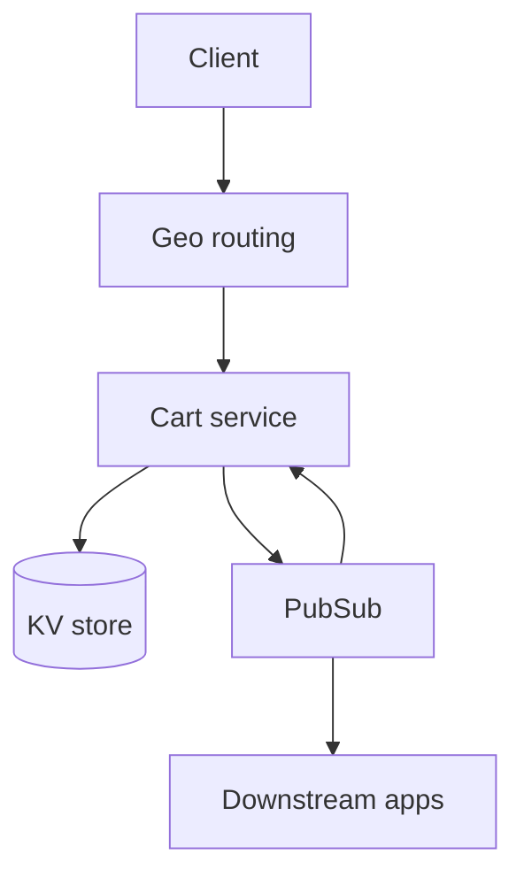
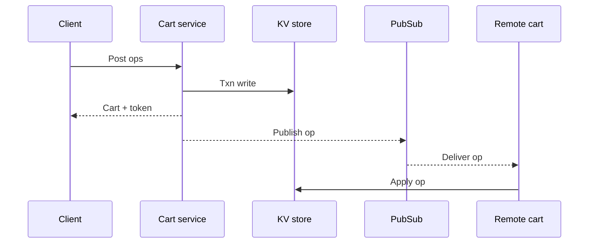
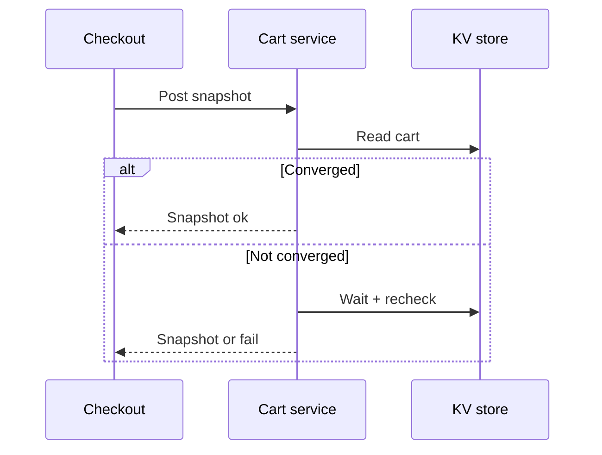

## Overview

This design supports an **active-active shopping cart across 3 regions** with fast local reads/writes and deterministic convergence under concurrent updates. The cart accepts mutations in the nearest region, replicates them asynchronously, and merges them using an **operation-based CRDT** with **idempotent operations**.

The system draws a clear line at checkout: a **checkout snapshot** can optionally wait (bounded) for the cart to be converged across required regions before returning a checkout-ready view.

## Requirements

### Functional Requirements
- Create and fetch a cart (anonymous and authenticated).
- Add items, decrement/remove items, clear cart; support quantity adjustments.
- Support user travel: reads/writes in any region should work and converge.
- Merge anonymous cart → user cart on login.
- Idempotent cart mutations (retries, duplicated requests, offline replays must not double-apply).
- Provide a checkout-ready snapshot with explicit convergence semantics.
- Emit events for downstream consumers (analytics, recommendations, abandoned-cart).
- Expire inactive carts (e.g., 30–90 days) without impacting active users.

### Non-Functional Requirements
- Scale: 20M DAU, ~5M peak concurrent sessions; ~400k `GET` QPS and ~200k mutation QPS (global).
- Latency (per region): `GET` P50 ≤ 30ms; mutations P50 ≤ 50ms; checkout snapshot P50 ≤ 200ms.
- Availability: region-local reads/writes 99.95%+; global user-perceived 99.99%+ with failover/degraded modes.
- Consistency: eventual across regions for browsing/mutations; explicit checkout convergence semantics.
- Durability: no acknowledged write loss within a region; async cross-region replication may lose recent changes if an entire region is destroyed.

### Constraints & Assumptions
- 3 active-active regions (e.g., `us-east`, `eu-west`, `ap-sg`).
- Catalog/pricing are separate systems; cart stores `skuId` and requested quantities.
- Mobile clients can be offline and replay operations later.
- Data residency may require constrained replication (e.g., EU carts replicate only within EU).
- Prefer managed services; avoid global consensus in the hot path.

## Simplified Architecture

### High-Level

**What happens on the hot path**
- The request lands in the nearest region.
- The Cart Service validates, enforces idempotency, applies the CRDT operation, updates the materialized cart view, and returns immediately.
- Replication and downstream event publishing run asynchronously.

## Components

### 1) Cart Service (API + merge + background workers)
A single service per region that contains:
- REST endpoints (`GET /cart`, `POST /cart/ops`, `POST /cart/merge`, `POST /cart/checkoutSnapshot`)
- CRDT merge library (in-process)
- Replication publisher (drains outbox records to Pub/Sub)
- Replication applier (consumes replicated operations and applies idempotently)
- Event publisher (publishes business events from the same outbox flow)

Operationally, this stays a stateless service: scale horizontally behind the regional load balancer.

### 2) Managed KV Store (single logical data store)
A managed, horizontally scalable KV/document store per region (e.g., DynamoDB/Cosmos-style). One logical “cart table” holds:
- **Cart state**: materialized view for fast reads.
- **Idempotency records**: `(cartId, idempotencyKey) → stored response metadata`.
- **Applied-op records**: `(cartId, opId)` for exactly-once effects on top of at-least-once delivery.
- **Outbox records**: replicated ops + downstream events to publish asynchronously.

Use atomic/transactional writes (where supported) so “idempotency record + op record + state update + outbox insert” commit together.

### 3) Managed Pub/Sub (replication + events)
A managed Pub/Sub backbone provides at-least-once delivery:
- **Replication topics** carry cart operations between regions.
- **Business event topics** carry stable events (`CartUpdated`, `CartMerged`, `CartAbandoned`, etc.).

For data residency, topics are partitioned by residency domain (e.g., `eu-only`, `global`) and each cart is tagged with a residency policy that routes replication accordingly.

## Data Model

### Cart state (materialized)
- `cartId`: opaque, globally unique.
- `owner`: anonymous or user reference.
- `items`: map `skuId -> qty` (qty never negative).
- `fields`: small set of cart-level fields (currency, fulfillment choice, etc.).
- `watermarks`: per-origin-region “last applied” markers used for session tokens and checkout convergence.
- `expiresAt`: TTL for inactive carts.

### Operation (replicated CRDT delta)
Each mutation becomes an operation with:
- `opId`: unique (use the idempotency key or a derived UUID).
- `cartId`
- `type`: `ADJUST_QTY | REMOVE_ITEM | CLEAR | SET_FIELD | MERGE`
- `skuId`, `delta` (when relevant)
- `hlc`: hybrid logical timestamp
- `originRegion`

## Consistency & Merge Semantics

### Operation-based CRDT
- **ADJUST_QTY**: commutative integer delta per SKU; quantity is clamped at 0 when materializing.
- **REMOVE_ITEM / CLEAR**: modeled as a per-SKU (or cart-wide) **reset watermark**:
  - Track `clearedAt` on the cart and `removedAt[skuId]` per item.
  - When applying an op, ignore it if `op.hlc <= clearedAt` (or `<= removedAt[skuId]`).
- **SET_FIELD**: LWW register using `(hlc, originRegion)` as the tie-break.

This yields deterministic convergence under partitions and retries, while keeping reads fast via the materialized view.

### Session token (best-effort monotonicity)
Responses include a `sessionToken` that encodes the cart’s per-region watermarks. Clients echo it back; the service uses it to:
- return the most recent local view it has already applied, and
- optionally wait briefly in `checkoutSnapshot` to reach required watermarks.

### Checkout snapshot (convergence barrier)
`POST /v1/cart/checkoutSnapshot` returns a snapshot plus explicit convergence metadata:
- `mode=STRICT`: fail if required regions are not converged within `maxWaitMs`.
- `mode=BOUNDED`: return snapshot with `isConverged=false` when not converged by the deadline.

## Key Flows

### Mutation + replication

### Checkout snapshot

## API (minimal)

### Get cart
`GET /v1/cart`

Response includes:
- `cartId`, `items`, `fields`, `region`, `etag` (optional), `sessionToken`.

### Apply operations (idempotent)
`POST /v1/cart/ops` (requires `Idempotency-Key`)

- If the same key is replayed for the same cart, return the stored result.
- If the key is reused with a different payload, return `409`.

### Merge anonymous into user cart
`POST /v1/cart/merge`

- Idempotent merge record keyed by `(fromCartId, toCartId)`.
- Produces a `MERGE` operation so other regions converge to the same ownership and contents.

### Checkout snapshot
`POST /v1/cart/checkoutSnapshot`

- Inputs: `requiredRegions`, `maxWaitMs`, `mode`, `minSessionToken` (optional).
- Outputs: `snapshotId`, `cart`, `isConverged`, `observedSessionToken`.

## Scaling & Performance

- Reads are served from the **materialized cart state** in the KV store.
- Writes are single-region atomic transactions with small, bounded items.
- The Cart Service scales horizontally; Pub/Sub scales the replication fan-out.
- TTL handles inactive cart cleanup without dedicated jobs.
- If a cart becomes hot (shared account or abuse), apply per-cart rate limits and request shaping.

## Failure Modes & Resilience

- **Inter-region partitions**: regions accept writes locally; ops converge after healing; checkout snapshot surfaces convergence explicitly.
- **Duplicate requests / offline replays**: idempotency keys + applied-op records prevent double effects.
- **Replication lag**: increases staleness; bounded checkout may return `isConverged=false`; strict mode may fail fast.
- **Regional outage**: traffic routes to another region; recent local-only cart ops may be lost if not replicated yet (acceptable for carts).

## Operations

- Monitor per-region API p99, error rate, and KV store latency.
- Monitor replication lag (publish backlog, consume delay) per residency domain.
- Track idempotency hit rate and conflict rate (payload mismatch).
- Track checkout snapshot convergence rate and timeout/fail rate.

## Simplification Notes

- Removed: separate Redis cache; acceptable because reads come from a materialized KV record and the KV layer scales horizontally.
- Removed: standalone CRDT engine service; merged into the Cart Service as a library to keep deployment and debugging simple.
- Removed: separate “stream/outbox service” and dedicated replicator service; merged into the Cart Service via an outbox table plus background publisher/consumer workers.
- Merged: cart state, idempotency, operation dedupe, and outbox into one managed KV store footprint to minimize moving parts and operational ownership.
- Complexity that remains: operation-based CRDT merge (required for correct convergence), idempotency/deduplication (required for retries/offline), and the checkout convergence barrier (required for predictable checkout behavior).