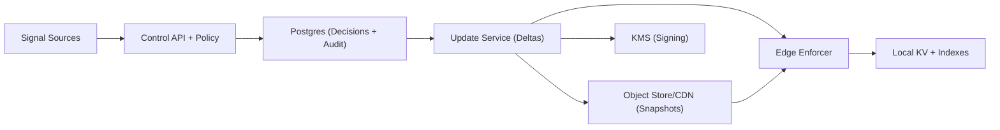

## Overview

This system ingests abuse signals (IPs, CIDRs, domains) and propagates **edge-enforceable decisions** globally within seconds. The data plane performs **purely local** checks (no per-request network calls), while the control plane provides strong safeguards (overrides, staged rollout, audit, explainability) and produces a **signed, versioned ruleset** continuously synchronized to every edge.

The design separates concerns into:
- **Control plane**: ingestion, normalization, policy evaluation, overrides, audit, decision storage.
- **Distribution**: delta streaming plus periodic snapshots, both cryptographically signed.
- **Data plane**: edge enforcer with in-memory indexes backed by a local KV store.

## Requirements

### Functional Requirements
- Ingest abuse signals from internal systems (WAF, auth/login, fraud) and external feeds (threat intel, partners).
- Support indicator types: IPv4/IPv6, CIDR ranges, domains, wildcard domains (e.g., `*.example.com`), optional URL/path patterns.
- Attach metadata: source, confidence, reason codes, first_seen/last_seen, TTL/expiry, scope (global/region/product/tenant), and provenance.
- Compute enforcement actions: **BLOCK**, **CHALLENGE**, **RATE_LIMIT**, **MONITOR**.
- Support **overrides**: allowlist/suppressions with higher precedence than blacklist.
- Propagate updates globally within seconds and expose a measurable propagation SLA/SLI.
- Provide query/audit APIs: effective decision, contributors, history, and “who/what changed it”.
- Provide admin tooling: bulk import/export, emergency kill-switch, staged rollout, appeal workflow.
- Ensure correct expiry (automatic unblocking) and safe deletion semantics.

### Non-Functional Requirements (Concrete Targets)

#### Scale (target design point)
- **Data plane traffic**: 10M requests/sec globally.
- **Edge decision path**: 99%+ of checks fully local (no per-request network call).
- **Control plane ingest**: 5K signals/sec steady; spikes to 100K/sec during major attacks.
- **Active decisions**:
  - IP/CIDR decisions: up to 10M–50M.
  - Domain decisions: up to 1M–5M.
- **Audit retention**: 12 months (immutable); decision state retained as long as needed + history.

#### Latency
- **Propagation SLO (connected edges)**: P50 < 1s, P99 < 5s from “publish accepted” to “enforced on 99% of connected edges in healthy regions”.
- **Edge evaluation**: P99 < 200µs incremental overhead for indicator check.
- **Cold start recovery**: latest snapshot + deltas within 1–5 minutes.

#### Availability & Reliability
- **Control plane APIs**: 99.9% monthly.
- **Data plane enforcement**: 99.99% monthly (enforces last-known-good during control-plane outages).
- **Distribution**: tolerate regional failures; edges resync on recovery.

#### Consistency
- **Publish/override writes**: strongly consistent for a given indicator’s decision (single-writer per indicator; monotonic versions).
- **Global convergence**: eventual consistency with bounded staleness (seconds).
- **Monotonicity**: edges never roll back to older versions/checkpoints.

#### Durability
- **Accepted signals and published decisions**: no loss once acknowledged (RPO ≈ 0 for accepted events).
- **Audit trail**: immutable, tamper-evident, and queryable for 12 months.

### Constraints & Assumptions
- Multi-region deployment (≥3 regions) plus edge PoPs; edges may be intermittently connected.
- Security-sensitive: updates must be authenticated, authorized, and tamper-evident (signed).
- Budget favors predictable infra: avoid per-request external lookups; edge runs on commodity instances.
- IP addresses are sensitive data in many regimes; apply data minimization and strict retention for raw signals.

---

## Simplified Architecture

### What runs where
- **Control API + Policy** (multi-region stateless): receives signals and admin actions, evaluates policy, writes decisions atomically.
- **Postgres** (multi-region with failover): authoritative decision state, overrides, append-only mutation history, audit log.
- **Update Service** (multi-region stateless): reads committed mutations from Postgres, batches/compresses, signs, and streams deltas to edges; publishes snapshot manifests.
- **Object Store/CDN**: serves signed snapshots at scale.
- **Edge Enforcer**: keeps a local ruleset (local KV + in-memory indexes) and evaluates requests with microsecond latency.

---

## Core Flows

### Request Path (data plane, no network dependency)
1. Request arrives at edge proxy/WAF.
2. Edge extracts indicators (source IP/CIDR match, host/domain match, optional path patterns).
3. Edge evaluates against in-memory indexes and applies action (BLOCK/CHALLENGE/RATE_LIMIT/MONITOR).
4. Edge never blocks on the control plane; it continues enforcing last-known-good state during outages.

### Publish Path (control plane, seconds)
1. Source submits a signal (idempotent).
2. Control service normalizes, dedupes, applies policy/guardrails, and computes the effective decision.
3. Control service commits:
   - upsert of current effective decision (per indicator+scope),
   - append-only mutation record,
   - append-only audit record.
4. Update service streams signed delta batches to edges and tracks ACKed checkpoints.
5. Snapshot job periodically produces signed snapshots + manifest in the object store/CDN.

---

## Components

### Control API + Policy (single service, modular)
**Responsibilities**
- AuthN/AuthZ for sources and admins; quotas per source.
- Deterministic normalization for IP/CIDR/domains.
- Guardrails: allowlist/suppress precedence, confidence thresholds, multi-source corroboration, TTL caps, blast-radius limits.
- Staged rollout: canary cohorts and percentage rollout per scope.
- Explainability: “why is this blocked?” and contributor summaries.

**Single-writer and monotonic versions**
- Route evaluation by `indicator_key = hash(type + canonical_value + scope + scope_id)` to a stable home shard.
- Store an `int64 version` per (indicator_key) and only advance it within the same transaction as the decision update.

### Postgres (authoritative store + history + audit)
**Responsibilities**
- Strongly consistent decision and override updates.
- Append-only mutation history for replay/catch-up and “what changed” queries.
- Append-only audit events (who/what/why) retained 12 months.

**Operational shape**
- One writable primary with automated failover across regions; read replicas in other regions for low-latency reads and update streaming.
- Partition large append-only tables by time (daily/weekly) to keep indexes and retention manageable.

### Update Service (delta streaming + snapshot manifests)
**Responsibilities**
- Tail new mutations from Postgres (by monotonic `mutation_id` or commit timestamp).
- Batch, compress, and **sign** delta batches using KMS-backed keys.
- Provide an edge sync API (stream deltas, accept ACKs, instruct snapshot bootstrap).
- Publish and serve a “current manifest” pointer for the latest snapshot + checkpoint.

**Checkpointing**
- Each delta batch includes a `checkpoint_id` representing “all mutations up to mutation_id N”.
- Edges ACK `checkpoint_id` after persisting and applying.

### Object Store/CDN (snapshots)
**Responsibilities**
- Serve large snapshots efficiently (cold starts, edges far behind, regional recovery).
- Store signed snapshot artifacts plus a signed manifest:
  - schema version, snapshot id, checkpoint id, hashes, key id, signature.

### Edge Enforcer (data plane)
**Responsibilities**
- Maintain a local, monotonic ruleset:
  - **Local KV** (RocksDB/LMDB) for persisted state,
  - **In-memory indexes** for request-path speed.
- Apply deltas idempotently and rebuild indexes as needed.
- Verify signatures for every delta batch and snapshot manifest before applying.

**Indexes**
- **IP/CIDR**: radix/patricia trie for IPv4 and IPv6.
- **Domains/wildcards**: reversed-suffix trie (`com.example`) supporting `*.example.com`.
- **Exact keys**: hash maps for exact IPs/domains where beneficial.

---

## Algorithms & Semantics

### Normalization (deterministic)
- Domains: lower-case, IDNA/punycode, strip trailing dot, validate labels.
- IPs: canonical representation; handle IPv4-mapped IPv6 explicitly.
- CIDRs: canonical network + prefix length; reject invalid masks.

### Precedence Rules (deterministic)
1. **ALLOW** override
2. **SUPPRESS** override (ignore blacklist for scope)
3. Effective blacklist decision (BLOCK/CHALLENGE/RATE_LIMIT/MONITOR)
4. Default allow

Scope matching is most-specific first (`TENANT` > `PRODUCT` > `REGION` > `GLOBAL`) with a stable tiebreak (latest version).

### Expiry
- Decisions carry `expires_at`.
- Control plane runs a periodic sweeper that emits explicit **EXPIRE** mutations.
- Edge also honors `expires_at` locally as a safety net.

### Delivery and monotonicity
- Update delivery is at-least-once; edge apply is idempotent:
  - apply only if `(version > local_version)` for that indicator key.
- Edges never roll back: snapshots and deltas include a checkpoint monotonicity guard (`checkpoint_id` must increase).

---

## Data Model (minimal)

### Tables (logical)
- `decisions`: current effective decision per `(indicator_key, scope, scope_id)` including `action`, `expires_at`, `version`, `policy_version`, contributor summary.
- `overrides`: allow/suppress rules with TTL and audit references.
- `mutations` (append-only): `mutation_id`, `indicator_key`, `op`, `decision_payload`, `version`, `emitted_at`, `policy_version`.
- `audit_events` (append-only): actor, request context, change summary, ticket/justification, timestamp.
- `edge_checkpoints`: last ACKed checkpoint per edge (or per edge cohort) for propagation SLIs.

### Edge state
- Local KV stores latest `(indicator_key -> decision + version + expires_at)` and last applied `checkpoint_id`.
- In-memory indexes are rebuildable from local KV on restart.

---

## API Design

### Submit Abuse Signal
- `POST /v1/signals`
- Headers: `Idempotency-Key`
- Body: `type`, `value`, `source`, `confidence`, `reason_code`, `scope`, `scope_id`, `ttl_seconds`
- Response: `signal_id`, `accepted`, `normalized_value`, `effective_action`, `effective_expires_at`, `decision_version`

### Admin Overrides
- `POST /v1/overrides`
- Body: `type`, `value`, `override_type` (`ALLOW`/`SUPPRESS`), `scope`, `scope_id`, `ttl_seconds`, `reason`, `ticket_ref`
- Response: `override_id`, `effective_version`

### Query Effective Decision (audit/explainability)
- `GET /v1/indicators/{type}/{value}?scope=...&scope_id=...`
- Response: normalized value, effective status/action, expiry, version, precedence path, contributors, recent history.

### Edge Sync (Update Service)
- `GET /v1/edge/manifest` → latest snapshot manifest pointer.
- `GET /v1/edge/deltas?since_checkpoint=...` (streaming) → signed delta batches.
- `POST /v1/edge/acks` → `{edge_id, checkpoint_id, applied_at}`.

---

## Scaling & Performance

- **Edge hot path**: entirely in-process; optimize for no allocations and cache-friendly data structures.
- **Write spikes**: batch signal processing per source, aggregate when safe (especially IPs to prefixes), and keep decision writes O(1) per affected indicator.
- **Distribution**: update service scales by outbound bandwidth and connections; snapshots via CDN handle thundering herds.
- **Measuring propagation**: compute `edge_ack_time - publish_commit_time` by checkpoint and cohort; alert on P99 and “% edges behind”.

---

## Failure Modes & Mitigations

- **Control plane outage**: edges continue enforcing last-known-good; updates resume from checkpoints.
- **Regional DB/read replica lag**: edges in that region continue on last-known-good; update service can instruct snapshot bootstrap after recovery.
- **Distributor overload**: autoscale update service, jitter reconnects, prioritize high-severity actions, and shift bulk transfer to snapshots.
- **False positives/poisoning**: staged rollout (canaries), confidence thresholds, multi-source corroboration, per-source TTL caps, emergency kill-switch and rapid allow overrides.
- **Signature/key issues**: KMS-backed signing, key rotation with dual-sign support, “freeze at last-known-good” mode on verification failures.
- **Clock skew**: explicit EXPIRE mutations plus local expiry as backstop; alerting on NTP drift.

---

## Operations & Security

- mTLS for edge↔update service; strict IAM for publishers/admins.
- KMS-backed signing keys; signatures on every delta batch and snapshot manifest.
- Append-only audit events with restricted write paths; periodic integrity digests (e.g., daily hash chain) stored in object storage for tamper-evidence.
- Data minimization: short retention for raw signals (if stored), longer retention for aggregated decision history and audit events per policy.

---

## Simplification Notes

- Removed: dedicated stream bus and transactional outbox; acceptable because Postgres append-only `mutations` provides durable ordering, replay, and tailing for delta distribution.
- Removed: separate immutable audit-log datastore; acceptable because append-only audit tables with integrity digests meet 12-month audit and tamper-evidence goals with fewer moving parts.
- Merged: ingestion, normalization, policy, and admin APIs into one modular control service; acceptable because these functions deploy and scale together and benefit from shared validation and policy code.
- Merged: snapshot builder into the distribution layer (as a periodic job alongside the update service); acceptable because snapshots are derived from authoritative decision state and don’t require an independent pipeline.
- Complexity that remains: edge-local KV + in-memory indexes and signed deltas/snapshots; necessary to meet sub-millisecond enforcement, offline edge resilience, and tamper-evident global propagation within seconds.