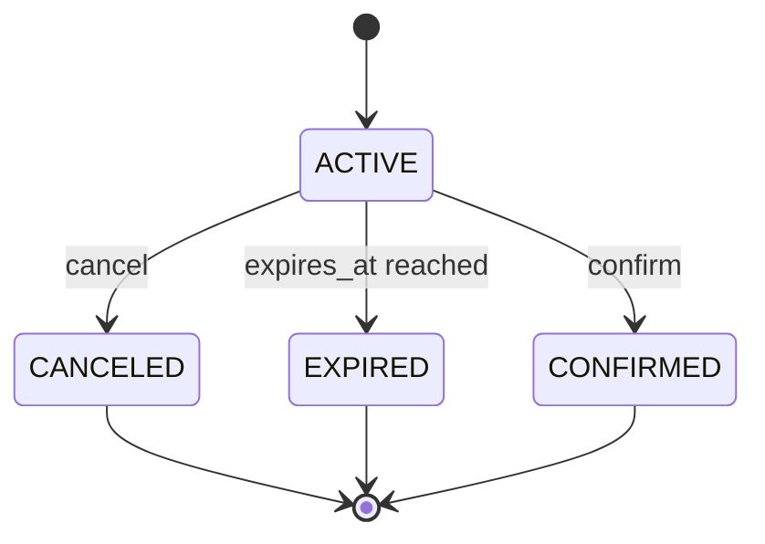

## Overview

This system provides **zero-oversell inventory** with **10‑minute cart holds** under extreme concurrency (flash sales). The core approach is simple: model **reservations as first-class rows** and enforce the invariant:

`reserved_qty + sold_qty <= total_qty`

All inventory-changing operations (`reserve`, `confirm`, `cancel`, `expire`, `adjust`) execute inside a **single strongly consistent transactional database**. Browse traffic is served via **edge caching** with very short TTLs; any stale availability is acceptable because the write path remains authoritative and fails closed.

---

## Requirements

### Functional Requirements
- Create a **10-minute reservation** for one or more SKUs.
- Prevent oversell across reserve/confirm/cancel/expire.
- View, cancel, and optionally extend reservations (policy-driven).
- Confirm a reservation into a purchase **exactly once**.
- Automatically expire reservations at 10 minutes and release stock.
- Provide **near-real-time availability** for product pages (eventual consistency acceptable).
- Support **idempotent retries** for reserve/confirm/cancel.
- Admin/system APIs to **adjust stock** with auditability.

### Non-Functional Requirements (Targets)
**Scale (peak, global)**
- Browse/read availability: **200k QPS**
- Reservation writes: **20k QPS**
- Checkout confirms: **5k QPS**
- SKUs: **~1M**, with **~100 hot SKUs** highly contended
- Reservations created: **50–200M/day** during launch

**Latency (end-to-end)**
- Browse availability: **P50 20ms, P99 80ms** (edge cache)
- Reserve: **P50 60ms, P99 200ms**
- Confirm: **P50 80ms, P99 250ms**

**Availability / SLOs**
- Reserve/confirm/cancel: **99.99%** (fail closed)
- Browse: **99.95%+**

**Consistency**
- Strong: inventory counters + reservation transitions
- Eventual: cached browse responses

**Durability**
- Source-of-truth DB: **RPO ~0**
- Cached reads: disposable

### Constraints & Assumptions
- Holds last exactly **10 minutes** (extensions, if offered, are bounded and rate-limited).
- PII is handled elsewhere; this system stores a minimal user identifier or opaque subject ID.
- Multi-item reservations prefer a **single DB transaction**; otherwise return partial failures with clear per-item errors.

---

## Simplified Architecture

### High-Level Diagram

```mermaid
graph TB
  C[Client] --> E[CDN / Edge Cache]
  E --> API[Inventory API]
  API --> DB[(Transactional DB)]
```



### What This Architecture Guarantees
- **Single consistency boundary**: the transactional DB is the only authority for sellable inventory.
- **Fail closed**: ambiguous outcomes return `503` or safe conflicts rather than risking oversell.
- **Idempotent writes**: API retries are safe and replayable.

### Simplifications Included (and why it works)
- **One service** handles all write operations and expiration logic.
- **No projection pipeline** is required to serve availability: availability is read directly from authoritative counters and cached at the edge with a short TTL.
- **No external queue/bus** is required for correctness: reservation and inventory state changes are fully represented in the database.

---

## Components

### CDN / Edge Cache
**Responsibilities**
- Cache browse/read availability responses with very short TTL (e.g., **1–2s**).
- Protect origin via rate limiting / bot protection on hot endpoints (as supported by the edge).

**Notes**
- Edge caching absorbs the majority of the **200k QPS** browse load.
- Cached responses are advisory; reservation writes remain authoritative.

### Inventory API (Single Service)
A stateless service that exposes reservation and inventory APIs and encapsulates all business rules.

**Responsibilities**
- Reserve / confirm / cancel operations with strict invariants.
- Expire reservations via a built-in background worker.
- Enforce idempotency for client retries.
- Provide admin adjustment APIs with audit records.
- Apply backpressure for hot SKUs (return `429` / `503` with `Retry-After`).

**Backpressure policy**
- If contention causes elevated transaction retries/latency for a SKU, shed load explicitly with:
  - `429 RATE_LIMITED` (preferred) or `503 TEMPORARILY_UNAVAILABLE`
  - short retry windows to prevent thundering herds

### Transactional DB (Source of Truth)
**Responsibilities**
- Store inventory counters and reservation state.
- Execute multi-row transactions for multi-item carts.
- Provide uniqueness constraints for exactly-once semantics.

**Recommended technology**
- A strongly consistent transactional DB that supports serializable semantics at scale (e.g., **Spanner/CockroachDB**).

---

## Data Model

### Reservation State Machine
Terminal states: `CANCELED`, `EXPIRED`, `CONFIRMED`



### Storage Schema (Logical)

**inventory**
- `sku_id` (PK part)
- `bucket` (PK part) — small integer (e.g., 0–15) to reduce hot-row contention
- `total_qty` (int64)
- `reserved_qty` (int64)
- `sold_qty` (int64)
- `updated_at` (timestamp)

Availability for a SKU is the sum across buckets:
`available = Σ(total_qty - reserved_qty - sold_qty)`

**reservations**
- `reservation_id` (PK, ULID/UUID)
- `user_id` (string/opaque subject ID)
- `status` (ACTIVE, CANCELED, EXPIRED, CONFIRMED)
- `expires_at` (timestamp)
- `created_at` (timestamp)
- `updated_at` (timestamp)

**reservation_items**
- `reservation_id` (PK part)
- `sku_id` (PK part)
- `bucket` (int)
- `qty` (int32)

**idempotency_keys**
- `client_id` (PK part)
- `idempotency_key` (PK part)
- `operation` (PK part) — `reserve|confirm|cancel`
- `request_hash` (string/bytes)
- `response_blob` (json/bytes)
- `created_at` (timestamp)
- retention: **24–72 hours**

**orders** (minimal linkage for exactly-once confirm)
- `order_id` (PK)
- `reservation_id` (UNIQUE)
- `status` (PLACED, PAID, FAILED)
- `created_at`

**stock_adjustments** (audit log)
- `adjustment_id` (PK)
- `sku_id`
- `bucket` (nullable; if null, system distributes)
- `delta_total_qty` (int64)
- `reason` (string)
- `actor` (string)
- `created_at`

---

## Core Transactions

All transactions use the database’s notion of time (e.g., `CURRENT_TIMESTAMP`) for expiry checks.

### Reserve
Within one transaction:
1. Validate idempotency key (create-or-replay).
2. For each item, choose a `bucket` (deterministic hash of `reservation_id` + `sku_id`, or precomputed).
3. Conditional update per `(sku_id, bucket)`:
   - ensure `total_qty - reserved_qty - sold_qty >= qty`
   - increment `reserved_qty` by `qty`
4. Insert `reservations` + `reservation_items`.
5. Store idempotency response.

If any item fails availability, the transaction aborts and returns `409 INSUFFICIENT_INVENTORY` with per-SKU details.

### Confirm
Within one transaction:
1. Replay/validate idempotency key.
2. Lock reservation row; verify `status = ACTIVE` and `now < expires_at`.
3. For each item: decrement `reserved_qty`, increment `sold_qty` on its bucket row.
4. Set reservation `CONFIRMED`.
5. Insert into `orders` with `UNIQUE(reservation_id)` to enforce exactly-once.
6. Store idempotency response.

### Cancel
Within one transaction:
1. Replay/validate idempotency key.
2. If reservation is `ACTIVE`, decrement `reserved_qty` for each item and mark `CANCELED`.
3. If already terminal, return current state (idempotent).

### Expire (Background Worker + Opportunistic Checks)
- Background worker scans `reservations` where `status = ACTIVE AND expires_at <= now` in small batches and transitions them to `EXPIRED`, releasing `reserved_qty` for items.
- Any API path that touches a reservation (read/cancel/confirm) treats `now >= expires_at` as expired and can trigger the same release logic.

The expiry worker runs inside the Inventory API deployment (same binary), keeping deployment and operations simple.

---

## API

### Conventions
- All write endpoints require:
  - `Idempotency-Key: <uuid>`
  - `X-Client-Id: <stable client id>`
- Errors use a stable `code` and optional per-item `details`.
- Authorization:
  - user endpoints require ownership checks,
  - admin endpoints require privileged scopes and write an audit row.

### Create Reservation
`POST /v1/reservations`

Request:
```json
{
  "userId": "u_123",
  "items": [
    { "skuId": "sku_abc", "qty": 1 },
    { "skuId": "sku_xyz", "qty": 2 }
  ]
}
```

Response `201`:
```json
{
  "reservationId": "r_01J...",
  "status": "ACTIVE",
  "expiresAt": "2025-12-17T12:34:56Z",
  "items": [
    { "skuId": "sku_abc", "qty": 1 },
    { "skuId": "sku_xyz", "qty": 2 }
  ]
}
```

Errors:
- `409 INSUFFICIENT_INVENTORY`
- `409 IDEMPOTENCY_KEY_REPLAY_MISMATCH`
- `429 RATE_LIMITED`
- `503 TEMPORARILY_UNAVAILABLE`

### Get Reservation
`GET /v1/reservations/{reservationId}`

### Cancel Reservation
`POST /v1/reservations/{reservationId}/cancel`

### Confirm Reservation
`POST /v1/reservations/{reservationId}/confirm`
- `409 RESERVATION_EXPIRED` if `now >= expiresAt`
- Exactly-once enforced via idempotency + `UNIQUE(reservation_id)` in `orders`

### Availability (Browse)
`GET /v1/availability?skuIds=...`
- Reads `available` from `inventory` counters (sum across buckets).
- Cached at the edge for **1–2s**.

---

## Scaling

### Primary Bottleneck: Hot SKU Contention
Hot SKUs concentrate writes. The design handles this with two simple controls:

1) **Bucketed inventory rows**
- Each SKU is split into a small fixed number of buckets (e.g., 16).
- Reservations write to one bucket per item, spreading write contention.
- Admin stock is distributed across buckets; adjustments can target a bucket or let the system distribute.

2) **Admission control**
- The API sheds load when contention spikes rather than amplifying retries:
  - bounded internal retries for transient serialization aborts
  - `429/503` when a SKU is overloaded

### Browse QPS
- Edge caching with short TTL handles most of the 200k QPS browse traffic.
- Origin reads are limited and predictable; the DB is protected from browse load.

### Expiry Load
- Expiry is processed in bounded batches with an index on `(status, expires_at)`.
- Opportunistic expiry in normal API calls reduces dependency on the background worker during spikes.

---

## Failure Modes

1) **Duplicate client retries**
- Handled by `idempotency_keys` with request hashing and stored responses.

2) **DB timeouts / uncertain commit**
- Writes fail closed with `503`.
- Clients retry with the same idempotency key.

3) **Expiry worker lag**
- Reservations are treated as expired based on `expires_at` in all user-facing operations.
- Lag mainly impacts how quickly inventory is returned to availability; it does not break correctness.

4) **Stock reductions below reserved+sold**
- Adjustments that would make inventory infeasible are recorded and policy-handled:
  - stop new reservations for affected SKUs
  - allow existing holds to expire or cancel according to an explicit admin policy

---

## Operations

### Observability
Key metrics:
- `reserve_success_rate`, `reserve_latency_ms_p50/p99`, `confirm_latency_ms_p99`
- DB transaction retry/abort rate
- `expiry_lag_seconds`, expirations processed/sec
- `invariant_violation_count` (must be 0)
- per-SKU request rate and error rate (hotspot detection)

### Deployment & Migrations
- Stateless API with autoscaling; background expiry worker runs per instance with DB-based claiming (safe concurrency).
- Backward-compatible migrations: add columns/tables → deploy → backfill → enforce constraints.

### Data Retention
- Reservations: retain terminal reservations for **7–30 days**, then archive.
- Idempotency keys: **24–72 hours**.

### Testing & Validation
- Concurrency tests: many parallel reserves on same hot SKU never oversell.
- Idempotency tests: replays return identical responses.
- Expiry tests: holds release after expiry even with worker delays.

---

## Simplification Notes
- Removed: event bus, outbox, read-model builder, and separate read store; availability is served from authoritative counters with short edge caching, keeping correctness and reducing operational surface area.
- Merged: expiry processing into the Inventory API as an internal background worker plus opportunistic expiry in normal request paths.
- Removed: separate cache layers (service Redis/read-through caches); the edge cache provides the primary read scale and the DB remains the sole write authority.
- Complexity that remains: strongly consistent transactions, idempotency storage, and bucketed inventory rows; these are necessary to meet “zero oversell” under flash-sale contention at the stated write rates.