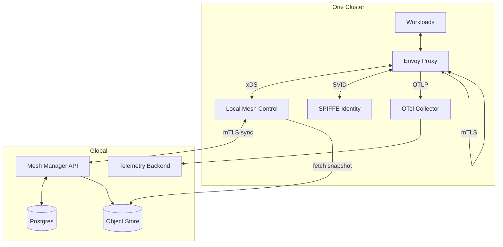
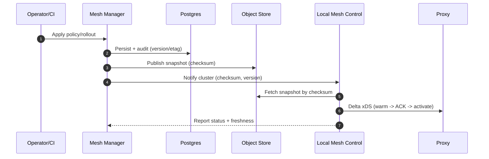

## Overview

This design delivers a hybrid-cloud, multi-cluster service mesh with **workload identity + mTLS**, **consistent traffic policy**, and **end-to-end observability** across clusters that do not share a flat network and may be intermittently partitioned.

The system follows a clear operating model: **global intent, cluster-local execution**. Each cluster makes fast, local decisions for routing and security using cached configuration, while a global management service provides policy authoring, auditing, and safe rollout orchestration.

---

## Requirements

### Functional Requirements

- **Identity + mTLS**
  - Issue and rotate workload identities (SPIFFE IDs + short-lived certs).
  - Support multiple trust domains and controlled federation.
- **Traffic management**
  - L7 routing, timeouts, retries, circuit breaking, outlier detection.
  - Locality-aware routing with health-based failover across clusters/regions.
- **Progressive delivery**
  - Canary/blue-green across clusters with analysis gates and automatic rollback.
- **Service discovery & federation**
  - Explicit export/import for cross-cluster access.
  - Cross-cluster routing without global endpoint fanout.
- **Authorization**
  - Zero-trust authorization between services and at ingress/egress boundaries.
- **Observability**
  - Metrics, traces, and access logs with correlation IDs and tenant-aware access control.
- **Multi-tenancy**
  - Tenant-scoped policies and telemetry; audited change history.
- **Operator UX**
  - Management API/UI, status, rollout health, certificate health, debugging tools.

### Non-Functional Requirements (SLO Targets)

- **Scale (12–18 months)**: 50 clusters, ~10,000 nodes, ~200,000 workloads, 5k–15k services, 200k–400k endpoints, ~10k proxy config updates/min (spiky), ~1M RPS aggregate.
- **Latency**
  - Policy propagation: P50 ≤ 10s, P99 ≤ 60s.
  - In-cluster overhead: P50 < 2ms, P99 < 10ms.
- **Availability**
  - Data plane: 99.99% (continues during control-plane outages).
  - Cluster-local control plane: 99.95% per cluster.
  - Global intent layer: 99.9% (no impact to existing traffic on outage).
- **Consistency**
  - Traffic policy: eventual consistency (seconds to a minute) with monotonic config versions.
  - Trust changes: staged rollout with explicit approvals and measured convergence.
- **Durability**
  - Policies + audit logs: no data loss (multi-AZ durable storage).
  - Telemetry: best-effort with buffering; partial loss acceptable under overload.

### Constraints & Assumptions

- No flat L3 across clusters; cross-cluster traffic traverses existing network boundaries (gateways/NAT).
- Partitions occur; each cluster remains functional in isolation.
- Small platform team; prefer standard protocols (xDS, SPIFFE, OpenTelemetry) and managed primitives.
- Compliance requires auditability and tenancy boundaries; some environments constrain telemetry egress.

---

## Simplified Architecture

**Key properties**
- **Partition-tolerant clusters**: proxies and local control continue with last-known-good config and local identity.
- **Versioned configuration**: all policy changes produce immutable, content-addressed snapshots for deterministic rollout and rollback.
- **Minimal global surface**: one global management service backed by Postgres and an object store.

---

## Components

### 1) Mesh Manager API (Global)

**Responsibilities**
- Policy and federation API/UI (traffic, authz, export/import, tenant scoping).
- Validation and safety checks (schema + semantic checks).
- Snapshot rendering per cluster (and per tenant, when needed).
- Rollout orchestration (step progression, gates, rollback).
- Audit log and change history.

**Implementation notes**
- Stores resources and audit events in Postgres with optimistic concurrency (`etag`/version).
- Renders immutable snapshot artifacts and publishes them to an object store.
- Tracks per-cluster rollout state and freshness using periodic cluster reports.

### 2) Local Mesh Control (Per Cluster)

**Responsibilities**
- Serve xDS to proxies (ADS/Delta xDS).
- Watch Kubernetes for endpoints and locality information and translate into xDS.
- Apply snapshots safely: stage → validate → warm → activate; keep last-known-good.

**Implementation notes**
- Runs as a small in-cluster deployment (multiple replicas).
- Caches snapshot artifacts by checksum and keeps a bounded working set in memory/disk.
- Reports status upstream (active checksum, ACK/NACK rates, staleness, SVID health).

### 3) SPIFFE Identity (Per Cluster)

**Responsibilities**
- Issue short-lived workload certificates bound to workload identity (Kubernetes service account/attestation).
- Distribute trust bundles for verification.
- Support trust-domain federation via explicit allow-lists.

**Implementation notes**
- Cluster-local issuance keeps steady-state traffic and renewals inside the cluster.
- Trust bundle updates are staged and measured for convergence before enforcement changes.

### 4) OpenTelemetry Collection (Per Cluster)

**Responsibilities**
- Collect proxy telemetry (metrics/traces/logs) and forward via OTLP.
- Apply tenant labeling, sampling, redaction, and bounded buffering.

**Implementation notes**
- Uses clear backpressure and drop policies that protect proxies and workloads under overload.

### 5) Data Plane (Envoy Proxies)

**Responsibilities**
- Enforce mTLS, routing, retries/timeouts, circuit breaking, authz filters.
- Emit telemetry with stable correlation IDs.
- Continue operating with cached configuration when xDS is unavailable.

---

## Data Model (Postgres)

**Core tables**
- `policies(id, kind, tenant, namespace, service, spec_json, version, etag, created_at, updated_at, created_by)`
- `rollouts(rollout_id, tenant, namespace, service, plan_json, state, current_step, created_at, updated_at)`
- `cluster_snapshots(cluster_id, checksum, source_version, state, created_at, activated_at, rolled_back_at)`
- `trust_bundles(trust_domain, bundle_pem, not_before, not_after, rotation_state, updated_at)`
- `cluster_status(cluster_id, active_checksum, last_seen_at, ack_rate, nack_rate, staleness_sec, svid_health_json)`
- `audit_log(event_id, ts, actor, action, resource_kind, resource_id, before_json, after_json, result, reason)`

Snapshots are stored as artifacts in the object store, keyed by checksum. Postgres holds references, state, and audit records.

---

## Key Flows

### Policy → Snapshot → Proxy

### Request Path

---

## Scaling & Reliability

- **xDS fanout**: one long-lived stream per proxy to the local control plane; local replicas scale horizontally; delta xDS reduces payload.
- **Endpoint churn**: local watch + batching windows + health hysteresis; only summaries needed for cross-cluster routing decisions.
- **Snapshot size**: keep policies scoped by tenant/namespace/service; render only what the cluster needs; artifacts are immutable and cacheable.
- **Global outages**: clusters continue with last-known-good snapshots; rollouts pause automatically when staleness thresholds are exceeded.
- **Network partitions**: locality-first routing and health-based failover; cross-cluster behavior degrades to configured policies without requiring global services in the request path.
- **Telemetry overload**: collectors enforce bounded queues and sampling; proxies stay protected from telemetry backpressure.

---

## Operations

### Monitoring (minimum set)

- **Data plane**: request rate/error rate/latency, retries, outlier ejections, mTLS handshake failures.
- **Local mesh control**: connected proxies, push latency, ACK/NACK rate, config freshness P50/P99.
- **Identity**: SVID issuance/renewal rate, renewal failures, cert expiry histograms, trust bundle convergence.
- **Rollouts**: step progression, gate pass/fail, auto-rollback counts, time-to-safe.
- **Federation**: export/import counts, cross-cluster failover events, convergence time of summaries.

### Change management

- All mutations are versioned and audited.
- Snapshot activation gates enforce safety (validate → stage → warm → activate).
- Trust changes require staged rollout with explicit approvals and measured convergence.

---

## Security

- **Management access**: OIDC-backed RBAC with tenant-scoped roles; all actions written to immutable audit logs.
- **Trust protection**: root/intermediate keys in a managed KMS; staged bundle rotation with dual-trust windows and rollback.
- **Zero-trust defaults**: explicit export/import for cross-cluster access; service-to-service authorization policies enforced at the proxy.

---

## Simplification Notes

- Removed: separate global service index service; rationale: service/cluster summaries and federation state live in `cluster_status`-style tables and are distributed via snapshots.
- Removed: dedicated CDN layer for artifacts; rationale: object-store-backed artifacts with client-side caching and checksum addressing meet distribution and rollback needs.
- Removed: optional Redis cache tier for control-plane computation; rationale: in-memory + artifact caching per cluster provides predictable behavior and simpler operations.
- Removed: separate policy engine dependency (OPA/CEL as a standalone service); rationale: policy schema + semantic validation is handled inside the Mesh Manager with audited versioning.
- Merged: “intent API”, “orchestration”, and “snapshot renderer” into one global Mesh Manager service; rationale: one deployable unit reduces operational surface while keeping clear internal modules.
- Merged: trust authority lifecycle management into the Mesh Manager control workflow (backed by managed KMS); rationale: one audited path for staged rotations and approvals.
- Complexity kept: per-cluster local control plane and cluster-local identity issuance; rationale: required for partition tolerance, low-latency xDS, and reliable mTLS/SVID renewals without WAN dependency.