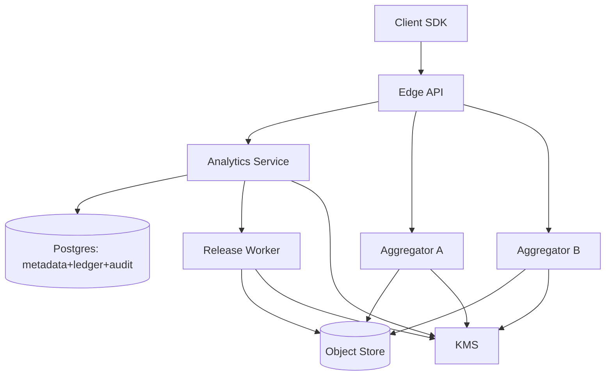
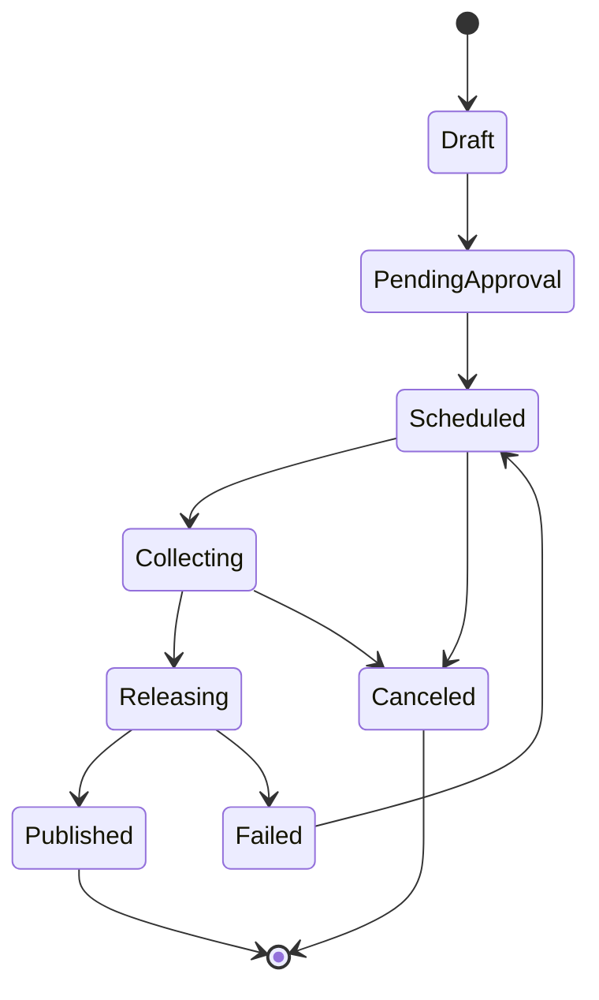

# Privacy-Preserving Analytics

## Overview

This system produces useful aggregate analytics (counts, rates, histograms, top‑k, quantiles) while preventing access to raw, user-level events and limiting re-identification risk. It combines:

1. **On-device pre-aggregation + contribution bounding** so each user’s influence is strictly limited before data leaves the device.
2. **Two-party secure aggregation** so no single server can observe individual contributions.
3. **Central differential privacy (DP)** applied only to aggregates, with a **strongly consistent privacy budget ledger** and auditable governance.

The system is batch/near-batch by design, with controlled release policies and repeatable metric definitions.

### Goals
- Produce **DP-protected** reports for internal stakeholders with clear governance and auditability.
- Ensure the system only releases **DP outputs**, with no raw event ingestion or export paths.
- Make releases reproducible and reviewable (policy + specs + parameters are versioned and auditable).

### Non-goals
- Ad-hoc SQL over raw events.
- User-level debugging, segmentation, or per-user exports.
- Real-time per-event dashboards.

---

## Requirements

### Functional Requirements
- Define bounded metrics (counts, sums, means, histograms, quantiles, top‑k) over cohorts and time windows.
- Enforce contribution bounds on-device and validate metric specs before execution.
- Run collection rounds with retries/duplicates handling and round close semantics.
- Produce DP reports with explicit parameters `(ε, δ)`, mechanisms, bounds, sampling rate, and quality metadata.
- Enforce privacy budgets per tenant/team/product with composition accounting and hard stops.
- Governance controls: approvals, minimum cohort threshold `k`, release policies.
- Opt-out/deletion:
  - Stop future participation (client-side).
  - Short retention for transient artifacts; enforceable deletion for system-held artifacts.
- Detect and mitigate abuse (poisoning, sybils, outliers) and provide operational monitoring.

### Non-Functional Requirements (targets)
- MAU 50M, DAU 10M; participation 0.5–5% per metric per round.
- Peak concurrent uploading clients 200K; peak ingestion 50K req/s; payload 1–4 KB compressed.
- DP jobs 5K/day; report reads 2K QPS (mostly cached).
- Ingestion P99 (regional) < 300 ms; cached report fetch P99 < 100 ms.
- Ingestion SLO 99.9%; report read SLO 99.9%; control plane SLO 99.5%.
- RPO: metadata + ledger ≤ 5 min; finalized reports effectively 0 (replicated object storage).

### Constraints & Assumptions
- Clients are partially trusted; assume compromised and sybil clients exist.
- Operators must not have programmatic access to raw user events within this system.
- Privacy is defined at user-level after contribution bounding for the reporting window.
- Unreliable networks: tolerate retries, duplicates, and partial participation.

---

## Simplified Architecture

### Key ideas
- **One backend service** (“Analytics Service”) owns job APIs, policy validation, round configuration, report serving, and the privacy budget ledger.
- **Two aggregators** (A/B) form the secure aggregation trust boundary; each sees only one share per client contribution.
- **One release worker** performs aggregation finalization + DP release and writes immutable report artifacts.

---

## Components

## 1) Client SDK
**Responsibilities**
- Maintain local summaries per metric/window.
- Enforce contribution bounds (clipping, per-user caps, per-window limits).
- Produce secure-aggregation shares (VDAF-style where supported) and required proofs/metadata.
- Enforce opt-out and sampling.

**Key design points**
- Deterministic eligibility per round + randomized participation for load control and privacy amplification.
- Rotating pseudonyms scoped to `(app, round/window)` to reduce linkability.
- No raw event identifiers in payloads; only bounded aggregates for the window.

---

## 2) Edge API
**Responsibilities**
- TLS termination, WAF, and rate limiting.
- Client authentication (app tokens; optional attestation for higher-trust tiers).
- Serve round configuration and route uploads to Aggregator A and B.

**Endpoints (client-facing)**
- `GET /v1/rounds/active`
- `POST /v1/rounds/{round_id}/contributions:a` (upload share A)
- `POST /v1/rounds/{round_id}/contributions:b` (upload share B)
- `GET /v1/jobs/{job_id}/report`

Uploads use `Idempotency-Key` and a per-round upload token minted by the Analytics Service.

---

## 3) Analytics Service (Control + Governance + Report API)
**Responsibilities**
- Metric spec validation and canonicalization (bounded domains, supported mechanisms, required caps).
- Job lifecycle (draft → approval → scheduled → collecting → published).
- Governance (approvals, `min_k`, dimension restrictions, release cadence rules).
- Privacy budget ledger (reserve/commit/release with strict invariants).
- Report metadata serving (pointer to immutable artifact + DP metadata).
- Audit event emission for every state transition and budget action.

**Strong consistency**
- Job state + ledger mutations occur in a single Postgres transaction.
- “Published” is only set when the report artifact pointer is written and the budget commit is durable.

---

## 4) Privacy Budget Ledger (in Postgres)
**Accounting**
- Use **RDP or zCDP** internally for composition; convert to `(ε, δ)` at report publication.
- `δ` is tenant policy-controlled (not per-job arbitrary), with guardrails (e.g., maximum allowed δ, minimum cohort size constraints).

**Semantics**
- `RESERVE(job_id, token)` at approval time (idempotent).
- `COMMIT(job_id, token)` at publication time (exactly-once).
- `RELEASE(job_id, token)` for cancellation/expiry.

Idempotency is enforced with unique keys per action + job.

---

## 5) Secure Aggregators (A/B)
**Responsibilities**
- Accept client shares for a specific `(round_id, metric_id)`.
- Validate protocol messages and enforce round eligibility.
- Maintain **per-round dedupe** on `(round_id, client_pseudonym)` to prevent double counting.
- Produce per-round aggregate share artifacts and write them to the object store with a strict TTL (≤ 24h).

**State and retention**
- Dedupe is stored as an **ephemeral key set** with TTL (implementation may use an embedded store such as RocksDB) and is never retained beyond the round artifact TTL.
- Only aggregate share artifacts are retained for finalization; no raw events are collected.

**Isolation**
- A and B run with independent credentials, deployments, and access controls.
- Each aggregator can only read/write its own artifacts and keys.

---

## 6) Release Worker (Aggregation Finalization + DP)
**Responsibilities**
- Triggered when a round closes (scheduler or polling via Analytics Service).
- Read Aggregator A/B artifacts, combine to obtain the aggregate.
- Enforce quality gates: minimum `k`, sanity checks, clipping stats thresholds, domain validation.
- Apply DP mechanisms (noise + thresholding + post-processing) and produce an immutable report artifact.
- Write report metadata (mechanism, `(ε, δ)`, bounds, sampling rate, participant counts, checksum) and mark job published (with ledger commit).

**Mechanisms (examples)**
- Counts/histograms: Gaussian/Laplace + non-negativity clamp; optional consistency constraints.
- Means: DP sum + DP count then divide; clamp to bounds.
- Quantiles/top‑k: bounded-domain DP histogram + selection, with conservative privacy cost defaults.

---

## Storage Model

## Postgres (single relational store)
Holds metadata, ledger, and audit events with strong consistency.

Core tables:
- `tenants(tenant_id, compliance_tier, ...)`
- `dp_policies(policy_id, tenant_id, budget_period, max_epsilon, max_delta, accounting_model, min_k_default, allowed_mechanisms, ...)`
- `metric_specs(metric_id, tenant_id, spec_json, spec_hash, status, owner, ...)`
- `jobs(job_id, tenant_id, metric_id, window_start, window_end, requested_privacy, min_k, status, approvals, ...)`
- `rounds(round_id, job_id, region, sampling_rate, start_at, end_at, status, upload_tokens, ...)`
- `reports(report_id, job_id, artifact_uri, artifact_checksum, privacy_spent_json, quality_metadata_json, generated_at, ...)`
- `privacy_ledger_entries(entry_id, tenant_id, job_id, action, accounting_payload, epsilon, delta, idempotency_key, actor, reason, timestamp)`
- `audit_events(event_id, tenant_id, actor, action, subject_type, subject_id, payload_json, timestamp)` (append-only)

## Object Store (encrypted, replicated)
- `round_artifacts/{round_id}/{aggregator}/{metric_id}/...` (TTL ≤ 24h)
- `reports/{tenant_id}/{report_id}.json` (immutable, replicated, long retention)
- Optional: periodic export of `audit_events` snapshots to WORM-capable storage for compliance tiers.

All objects are envelope-encrypted with KMS-managed keys.

---

## Data Flow

1) **Job creation and approval**
- Analyst creates a job with a metric spec + window + requested privacy parameters.
- Analytics Service validates spec, enforces policy, and routes for approval if required.
- On approval, the service reserves budget and schedules one or more rounds.

2) **Client collection**
- Client fetches active rounds, receives bounds + sampling parameters + upload URLs for A and B.
- Client uploads one share to each aggregator endpoint with idempotency keys.
- Aggregators dedupe and update per-round aggregate share state; periodic checkpoints are written to object storage.

3) **DP release**
- At round close, Release Worker reads A/B artifacts, combines them, checks `min_k`, applies DP, and writes an immutable report artifact.
- Analytics Service records the report pointer and commits the budget in the same transaction.

4) **Report retrieval**
- Report reads return metadata + the DP result (inline for small results, or via artifact pointer/CDN for larger ones).

---

## Job Lifecycle (Simplified)

---

## Reliability, Security, and Operations

### Availability and durability
- Edge API and aggregators run multi-AZ with autoscaling; aggregators write frequent checkpoints to object storage.
- Postgres runs multi-AZ with synchronous replication; cross-region replication targets ≤ 5 minutes RPO.
- Reports are immutable and replicated in object storage for near-zero RPO.

### Security and privacy controls
- Strong IAM boundaries:
  - Aggregators only accept uploads and write their artifacts.
  - Release Worker only reads aggregate artifacts and writes DP reports.
  - Analytics Service controls policy, tokens, and report metadata, and cannot access per-client shares.
- End-to-end TLS; at-rest encryption with KMS envelope encryption.
- Mandatory audit events for job creation/approval, ledger actions, and report publication.

### Abuse and integrity
- Contribution bounds enforced on-device and validated via protocol constraints.
- Rate limits per tenant/round; optional attestation tiers.
- Quality gates: clipping rates, anomaly detection on aggregate distributions, `min_k` enforcement, bounded domains only.

### Retention and deletion
- Round artifacts and dedupe state expire automatically (≤ 24h default).
- DP reports and audit logs follow tenant compliance tier (e.g., 180–365 days).
- Opt-out stops future participation; historical DP reports remain immutable unless a policy mandates removal.

---

## Simplification Notes

- Removed `Queue/Stream`; uploads go directly to Aggregator A/B, and aggregators checkpoint to object storage to absorb retries and restarts.
- Removed separate `Collector`, `DP Engine`, and `Query Service`; a single `Release Worker` produces reports and the `Analytics Service` serves report metadata and access control.
- Removed standalone `Metadata DB`, `Cache`, and dedicated `Audit Log Store`; one Postgres cluster stores metadata + ledger + append-only audit events, with optional export to WORM storage for high-compliance tenants.
- Merged control plane functions into one `Analytics Service`; strong consistency (jobs + budget) is provided by a single transactional datastore.
- Kept two secure aggregators (A/B) to preserve the non-collusion trust boundary required for secure aggregation; kept KMS and immutable object storage because encryption, retention, and durable report artifacts are core to correctness and compliance.