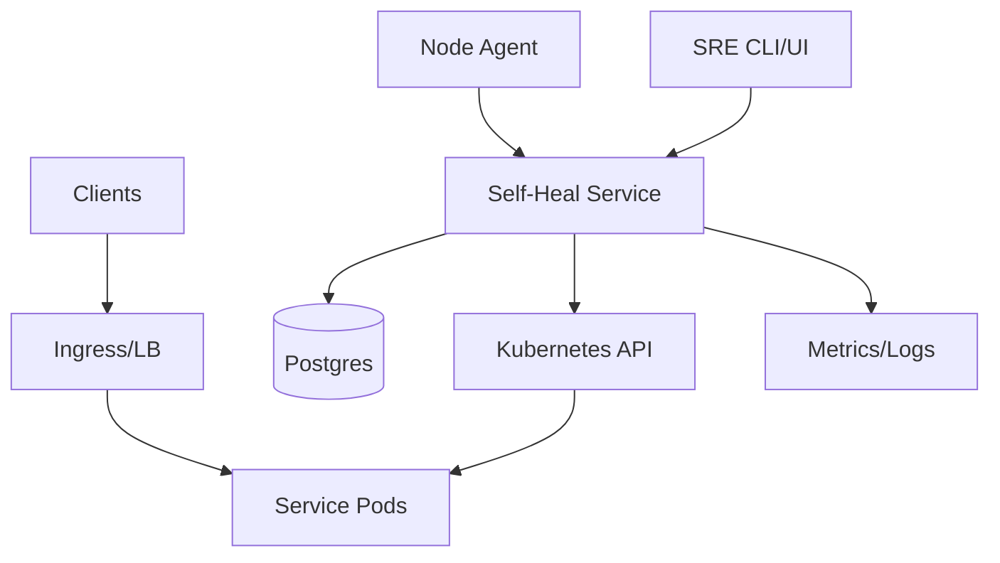
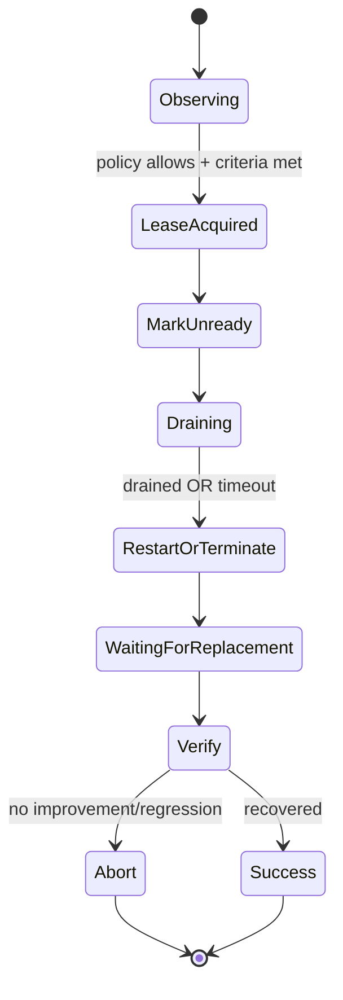

## Overview

Production systems often degrade before they crash: memory slowly climbs, GC churn increases, file descriptors approach limits, pressure builds, and “soft failures” accumulate until latency spikes or nodes fall over. A self-healing system closes this gap with a conservative control loop that:

1. Detects early, high-signal degradation close to the workload.
2. Chooses the smallest safe remediation using service policies and SLO context.
3. Executes traffic-safe actions (readiness gating, draining, graceful termination) with strict guardrails.

This design keeps the fleet safe-by-default: on uncertainty, it observes and records; it does not act.

## Goals & Non-Goals

### Goals
- Detect and remediate common soft-failure modes (zombies, memory pressure/leaks, FD pressure, thread explosions, GC thrash indicators).
- Make remediation traffic-safe and rate-limited (no thundering herds, no capacity collapse).
- Provide clear auditability for every decision and action.
- Support progressive rollout: observe-only → limited automation → broad automation.

### Non-Goals
- Full-time profiling/APM replacement (the system integrates with existing observability).
- Fixing application correctness bugs (the system stabilizes the fleet and reduces impact).
- Perfect anomaly detection (the system prioritizes conservative, explainable automation).

## Requirements

### Functional
- Detect, attribute, and report degradation signals at container/cgroup scope.
- Trigger traffic-safe remediations:
  - Mark unready, drain, restart pod/container, recycle node (cordon + drain), quarantine.
- Enforce guardrails:
  - Per-service concurrency and rate limits, global rate limits, automation kill switch.
- Human controls:
  - Pause automation, manual remediation, policy editing with RBAC and audit.
- Verify outcomes:
  - Post-action health normalization and SLO recovery checks; stop/escalate on regressions.

### Non-Functional (Targets)
- Scale: ~5,000 nodes, ~50,000 pods, ~2,000 services.
- Detection-to-decision: P50 ≤ 5s, P99 ≤ 30s for soft failures.
- Drain-to-fully-drained: P50 ≤ 15s, P99 ≤ 90s (service-dependent).
- Control plane availability: 99.99% monthly.
- Strong consistency for leases/policies to prevent double-remediation.
- Audit retention: 90 days.

## Simplified Architecture

### How It Works
- **Node Agent** detects local degradation and sends **structured health events** to the **Self-Heal Service**.
- **Self-Heal Service** evaluates policies, checks safety, acquires a **lease** in Postgres, then calls the Kubernetes API to perform a traffic-safe remediation.
- All decisions and actions are written to an **append-only audit trail** for incident review and postmortems.
- Metrics/logs flow to the existing observability stack; the self-heal system depends only on a small set of core signals.

## Core Control Loop

1. **Detect (Agent)**: sample local OS/cgroup signals; emit only actionable events.
2. **Decide (Self-Heal Service)**:
   - Correlate recent signals (short time window).
   - Check service and fleet guardrails.
   - Acquire an action lease (strongly consistent).
3. **Execute (Kubernetes API)**:
   - Mark unready → drain → restart/terminate → allow replacement to become ready.
4. **Verify**:
   - Confirm readiness stabilizes and key signals recover.
   - Record outcome; pause automation automatically if safety thresholds trip.

## Remediation State Machine

## Components

### 1) Node Agent (per node)

**Responsibilities**
- Collect container-aware signals and attribute to the owning workload:
  - Zombie/defunct processes
  - RSS/working-set growth slope
  - FD utilization, thread count
  - cgroup OOM events, Linux PSI where available
  - Optional app-provided counters (GC CPU/pause, restart loops)
- Emit **health events** (low volume, high value) to the Self-Heal Service.
- Export standard metrics to the existing metrics backend (best effort).

**Design**
- Multi-signal gating at the edge (reduces false positives and event spam), e.g. “leak risk” requires sustained RSS slope plus rising pressure/GC over N minutes.
- Bounded local buffering with retry/backoff; critical events are prioritized.

**Implementation**
- Lightweight daemon (Go/Rust).
- Optional eBPF for richer visibility; `/proc` + cgroup sampling fallback.

### 2) Self-Heal Service (single logical service)

A modular service with three internal roles that scale horizontally together:
- **Ingestion API**: receives and validates health events (mTLS, schema enforcement, per-agent rate limits).
- **Decision Worker**: evaluates policies/guardrails and acquires leases.
- **Remediation Executor**: performs idempotent Kubernetes operations and outcome verification.

**Guardrails (examples)**
- Per-service:
  - `max_concurrent_actions` (e.g., 1–3)
  - `max_actions_per_hour` (e.g., 3–10)
  - `min_healthy_percent` (e.g., 90–99)
  - `drain_timeout_sec`, `graceful_shutdown_sec`
- Global:
  - `max_actions_per_minute`
  - Kill switch (manual and automatic)

**Automation Kill Switch**
Automatically pauses automation when sustained signals indicate the system is making things worse, e.g. low success rate, post-action error rate increase, or widespread readiness drops.

### 3) Postgres (strong state + audit)

A single managed Postgres cluster provides:
- **Strong consistency** for policies and action leases.
- **Append-only audit** for decisions/actions/outcomes (partitioned by time for retention and query performance).

**Lease semantics**
- Exactly one active lease per `instance_id`.
- Atomic acquisition with TTL; leases expire safely after crashes.
- All remediation calls are idempotent via `{lease_id, action_type}`.

### 4) Kubernetes (existing orchestrator)

**Execution pattern**
- Mark unready: patch readiness gate/label consumed by readiness checks.
- Drain: respect `preStop`, `terminationGracePeriodSeconds`, and service drain settings.
- Restart/terminate: delete pod or restart container based on action type.
- Node remediation: cordon + drain; quarantine via taints/labels when needed.
- Safety enforcement: honor PDBs and minimum healthy constraints before acting.

## Data Model (Minimal)

**Table: `service_policy`**
- `service_id` (PK)
- `automation_enabled` (bool)
- `max_concurrent_actions` (int)
- `max_actions_per_hour` (int)
- `min_healthy_percent` (int)
- `drain_timeout_sec` (int)
- `graceful_shutdown_sec` (int)
- `thresholds` (jsonb)
- `version` (int)
- `updated_at` (timestamptz)

**Table: `action_lease`**
- `lease_id` (PK)
- `instance_id` (unique)
- `service_id`
- `action_type` (enum)
- `state` (enum)
- `owner` (string)
- `expires_at` (timestamptz)
- `created_at` (timestamptz)

**Table: `audit_event`** (append-only, partitioned)
- `event_id` (PK)
- `ts` (timestamptz)
- `cluster_id`, `service_id`, `instance_id`
- `kind` (enum: `HEALTH`, `DECISION`, `ACTION`, `RESULT`)
- `lease_id` (nullable)
- `payload` (jsonb) — signals, thresholds, guardrail checks, errors, outcomes

## API Design (Internal)

### Report Health Events (Agent → Self-Heal Service)
- `POST /v1/health-events`
- `Idempotency-Key: <batch_hash>`
- Response: `202 Accepted`

### Policy Control (SRE Tooling → Self-Heal Service)
- `GET /v1/service-policies/{service_id}`
- `PATCH /v1/service-policies/{service_id}` with `If-Match: <version>`

### Manual Remediation (SRE Tooling → Self-Heal Service)
- `POST /v1/remediations`
- Enforces the same guardrails by default; privileged override is audited.

### Pause/Resume (Global)
- `PATCH /v1/automation` `{ "enabled": false }`

## Operations

### Monitoring
- Effectiveness: action success rate, abort rate, mean time to recover, post-action SLO regression.
- Safety: actions/min, concurrent actions per service, kill switch activations.
- Traffic impact: drain duration, connection resets during drains, ready endpoints vs policy minimum.
- Platform health: Postgres latency, Kubernetes API error rates, ingestion rate limits.

### Rollout
- Observe-only by default; enable automation per service tier with small blast radius.
- Fast rollback: global kill switch and per-service `automation_enabled=false`.

### Security
- Agent identity (workload/node identity) + mTLS.
- Strict RBAC for policy edits and manual actions.
- Audit trail designed for post-incident forensics (immutable semantics via append-only writes and restricted access).

## Simplification Notes

- Removed: separate “metrics/events pipeline” service and broker; agents send health events directly to the Self-Heal Service, and metrics remain in the existing observability stack (acceptable because remediation decisions rely on low-volume, high-signal events and the agent buffers/retries during bursts).
- Removed: standalone orchestrator adapter service; Kubernetes execution is part of the Self-Heal Service as a module (acceptable because it deploys with the decision logic and shares the same leases, rate limits, and audit context).
- Merged: strong state store and audit log into a single managed Postgres cluster (acceptable because leases, policies, and audit records share the same consistency needs and operational ownership; partitioning supports retention and query patterns).
- Complexity that remains: per-instance leases, guardrails, and traffic-safe draining (necessary to prevent double-remediation, limit blast radius, and preserve availability during automated restarts).