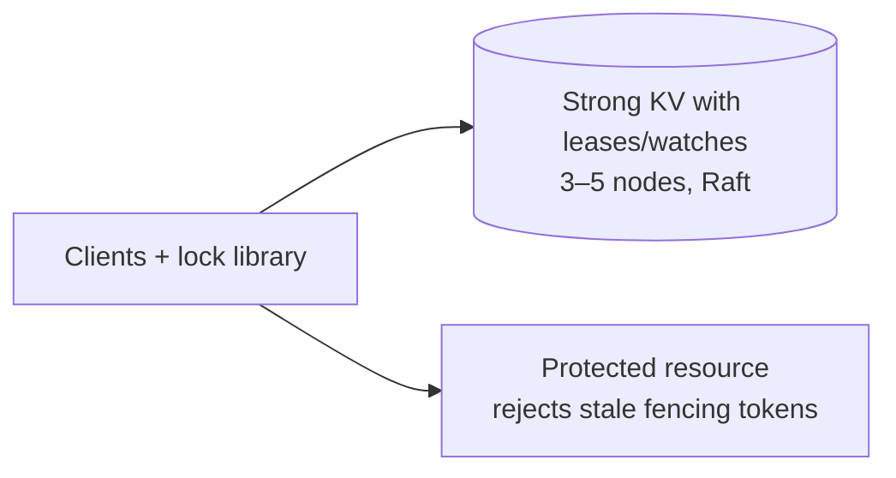

## Overview

Provide safe distributed locks by using an existing strongly-consistent store with **leases**, **transactions**, and **watches**. Lock ownership is an ephemeral key attached to a lease; every acquire is a single linearizable write. Safety comes from **fencing tokens** that downstream systems validate.

## What Makes This Hard

Under partitions and pauses, clients can keep running after they become unsafe. Leases answer “who is still connected enough to renew?”, but they don’t stop a zombie client from acting. A lock is only safe when every protected write carries a **monotonic fencing token** that the protected system rejects when stale.

## Requirements

### Functional Requirements
- **Linearizable acquire/release** for each lock key.
- **Leases**: ownership is bound to a lease; expiry deletes ownership automatically.
- **Fencing tokens**: each successful acquire yields a strictly increasing token per lock key; clients include it with downstream writes.
- **Client failure detection**: loss of lease renewals forces client self-fencing.
- **Watch/notify** to wait without polling.

### Scale Targets
- **Cluster size**: 3 nodes (Raft), tolerate 1 failure; 5 nodes for maintenance windows.
- **Clients**: 10k concurrent clients, 50k active leases.
- **Locks**: 1–5 million lock keys (sparse).
- **Write QPS**: dominated by lease keepalives and acquire/release; keep p99 commit latency < 50ms intra-region.
- **Watchers**: high cardinality supported by avoiding per-lock fanout (FIFO queue with predecessor watches).

## Key Design Decisions

- **What we chose:** use an existing Raft-backed KV (etcd-style) that already provides linearizable transactions, leases, and watch-by-revision.
  - **Why:** the lock service becomes a client recipe, not a new consensus system.

- **What we chose:** represent a lock as an ephemeral “queue node” key under `/locks/<K>/q/<attempt_id>` attached to the caller’s lease.
  - **Why:** ownership and cleanup are automatic (lease expiry deletes the key).

- **What we chose:** FIFO waiting with **predecessor watches**.
  - **Why:** release wakes O(1) waiters instead of a per-key notification storm.

- **What we chose:** fencing token = the queue node’s committed **create revision** (monotonic).
  - **Why:** it is issued by the consensus log and is safe under retries and leader changes.

- **What we chose:** idempotent acquire via a stable `attempt_id` (request id) embedded in the queue key name.
  - **Why:** “unknown result → retry” becomes “retry the same attempt and then check position”.

- **What We Removed:** custom gRPC front-end, custom Raft implementation, bespoke state machine, bespoke watch fanout, and custom metrics pipeline (use the store’s metrics + standard dashboards).

## Architecture

### Components

- **Strong KV with leases/watches**: the single serialization point for acquire/release and the source of truth for lease expiry and revisions.
- **Client library**: implements acquire/release/wait, keepalive, backoff, and self-fencing.
- **Protected resource token check**: stores `MaxToken[K]` and rejects `token < MaxToken[K]`.

## Deep Dive: Fencing Tokens (The Hardest Part)

**Token model**
- On acquire, the client creates `/locks/<K>/q/<attempt_id>` with its lease.
- The key’s **create revision** is the fencing token.
- The client holds the lock when its queue key is the smallest by create revision under `/locks/<K>/q/`.

**Waiting (FIFO, O(1) wakeups)**
1. Create queue key (idempotent: same `attempt_id`).
2. List `/locks/<K>/q/` sorted by create revision and find your predecessor.
3. If none, you own the lock.
4. Otherwise, watch the predecessor key for deletion; on delete (or watch reset), repeat step 2.

**Downstream enforcement**
- Every protected write includes `(K, token)`.
- The protected resource stores `MaxToken[K]` and rejects any request with `token < MaxToken[K]`.
- On accept, it updates `MaxToken[K] = token` (atomically).

**Edge cases**
- **Leader change / timeout during acquire**: retry using the same `attempt_id`, then re-check queue position.
- **Client pause / partition**: if keepalive isn’t acknowledged within `TTL/2`, the client self-fences and stops acting; if its lease expires, its queue key is deleted automatically.
- **Compaction / watch lag**: if a predecessor watch is compacted or reset, the client re-lists the queue prefix and resumes from current state.

## Trade-offs

| Optimized For | Sacrificed |
|--------------|------------|
| Strong correctness (linearizable ownership + fencing) | Cross-region latency for writes |
| Minimal custom code (client recipe on proven KV) | Feature set limited to what the KV provides |
| O(1) wakeups per release (predecessor watches) | Requires a queue key per waiting client |
| Operational predictability | Writes stop on quorum loss |

## Failure Modes

- **Quorum loss for minutes (2/3 down or partitioned)**
  - **What happens:** all linearizable ops stop (acquire/release/keepalive); leases stop renewing; clients must assume locks are lost.
  - **Detect:** keepalive acks stop; store returns `UNAVAILABLE`/timeouts; lease-expiry counters rise after recovery.
  - **Recover:** clients self-fence, recreate session, rejoin queue; downstream rejects stale-token writes.

- **Leader change while many leases are near expiry**
  - **What happens:** brief keepalive disruption; some leases expire; some clients see unknown results on acquire.
  - **Detect:** leader election events; keepalive retry spike.
  - **Recover:** self-fence on missed keepalive within `TTL/2`; retry acquire with the same `attempt_id`; token enforcement prevents zombie writes.

- **Slow watch delivery (commits healthy, notifications lag)**
  - **What happens:** waiters take longer to observe predecessor deletion; throughput drops, correctness unchanged.
  - **Detect:** watch lag metrics, reconnect rates.
  - **Recover:** clients treat watches as hints and re-list on reconnect/timeout; do not build correctness on “every event”.

- **Bad config deploy (TTL too low, keepalive mismatch, waiter limits too strict)**
  - **What happens:** self-inflicted lease churn, retry storms, artificial contention.
  - **Detect:** keepalive QPS spikes, increased lease expiries, rising acquire timeouts.
  - **Recover:** enforce safe defaults in the client library (TTL floor, keepalive <= TTL/3, jitter), and fail fast with clear errors when limits are exceeded.

- **Traffic 10x unexpectedly (renew storms + hot keys)**
  - **What happens:** keepalive dominates write budget; hot locks serialize waiters; tail latency rises.
  - **Detect:** sustained write saturation, fsync latency, growing client backoff.
  - **Recover:** raise TTL (reduces keepalive QPS), add jitter, cap per-tenant sessions, and return fast “busy” errors when the store is saturated.

## What I'd Do Differently At...

- **10x scale:** run multiple independent clusters partitioned by namespace/tenant; keep the same client recipe.
- **100x scale:** move coordination needs that don’t require linearizability out of the lock path; keep locks and fencing on the strong store.

## Operational Notes

- **Lease safety rule:** if a client can’t renew and confirm within `TTL/2`, it self-fences immediately.
- **Time handling:** treat TTL as a monotonic countdown on the server; never trust client wall-clock.
- **Compaction:** clients must handle “compacted” watch errors by re-listing current queue state and resuming.
- **Overload behavior:** on `UNAVAILABLE`/timeouts, clients back off with jitter; on explicit limits (watchers, sessions), fail fast with actionable errors.
