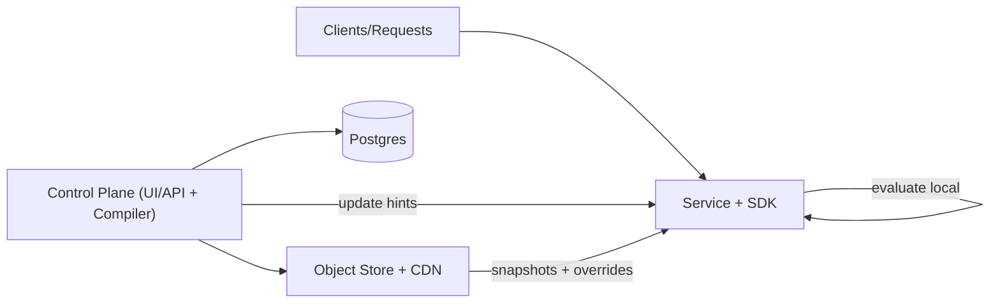

## Overview

This system is a feature flag + experimentation platform where evaluation is always local (in-process SDK) and changes propagate asynchronously. Humans edit flags in one control plane; services run a compiled snapshot so every decision is a pure function of `(snapshot_id, subject_key, context)`.

The core idea is a tiny, deterministic rules VM: strict precedence + stable hashing + a versioned runtime format. That keeps request latency near-zero and makes results consistent across services and languages.

## What Makes This Hard

Remote evaluation adds network tail latency and makes flags a critical-path dependency.

Local evaluation only works if every SDK behaves identically: hashing, rule ordering, missing-key behavior, and type coercions must be the same everywhere or experiments and rollouts become untrustworthy.

## Requirements

### Functional Requirements
- Deterministic evaluation for targeting + rollouts + experiments across languages and services.
- Safe kill switch semantics: “turn off now” beats all other rules, globally.
- Fast propagation of flag changes without pushing evaluation onto a network hop.
- Auditability: who changed what, when, and the ability to explain “why did user X see variant B?”
- Assignment stability: changing `salt` resets; other edits may change outcomes predictably.

### Scale Targets
- **Evaluation latency:** p99 < 1 ms added latency per request (in-process; no network).
- **Throughput:** 1M evaluations/sec aggregate across fleet (SDK scales with services, not a central box).
- **Config size:** 10k flags, 100k rules total (forces compilation and efficient runtime representation).
- **Propagation:** < 5 seconds from publish to 95% of hosts updated; < 30 seconds to 99.9%.
- **Writes:** ~1–10 flag publishes/minute in steady state; spikes during incidents (kill switches).

## Key Design Decisions

- **Chosen: SDK-side evaluation from an immutable compiled snapshot**
  - Why: removes network tails and keeps production traffic correct during control-plane outages.

- **Chosen: content-addressed artifacts + per-environment “latest pointer”**
  - Why: installs are idempotent, integrity-checkable, and rollback is a pointer swap.

- **Chosen: update hints over a control-plane stream + fallback polling**
  - Why: fast propagation without running a separate message bus; polling is only the safety net.

- **Chosen: strict runtime contract versioning + conformance tests**
  - Why: prevents SDK/snapshot incompatibility and semantic drift across languages.

## Architecture

Minimal architecture: one control plane service, one database, one blob store/CDN, and SDKs embedded in services.

### Components

- **Control Plane (UI/API + Compiler)**
  - Justification: the only write path; enforces validation/permissions and compiles configs into the SDK’s strict runtime format.

- **Postgres**
  - Justification: system of record for authored config, publish state, audit trail, and rollback history.

- **Object Store + CDN**
  - Justification: serves immutable compiled artifacts (`sha256 -> blob`) plus tiny per-environment pointers (`/env/latest.json`) and override layers (`/env/overrides.json`).

- **Service + SDK**
  - Justification: evaluates flags in-process from the installed snapshot; keeps last-known-good on disk and updates out of band.

## Deep Dive: Deterministic Evaluation + Fast Propagation

Evaluation never calls the network. Updates are async and safe: if anything goes wrong, keep using the last-known-good snapshot.

**1) Compile to a strict runtime contract**
- Authoring is flexible; runtime is a minimal, versioned format (`snapshot_format_version`, `min_sdk_version`).
- Each flag compiles to explicit precedence:
  1) global kill switch
  2) overrides (env/tenant/user)
  3) targeting rules (matchers)
  4) rollout/experiment bucketing
  5) default
- SDKs must pass golden-vector tests for hashing, matcher semantics, and missing-key behavior.

**2) Stable hashing and bucketing**
- Rollouts/experiments use `bucket = hash64(subject_key + salt) mod 10000`.
- Percentages are integer ranges over 0..9999 for cross-language consistency.
- `salt` changes reset; other changes are treated as normal config edits (and can change outcomes).

**3) Publish is a small state machine**
- Postgres tracks publishes as `PENDING -> AVAILABLE -> LIVE`.
- `AVAILABLE`: compiled artifacts uploaded under `sha256` and recorded in Postgres.
- `LIVE`: `/env/latest.json` points at the snapshot `sha256` (rollback swaps it back).
- Update hints tell SDKs to re-check `/env/latest.json`; SDKs only activate after integrity + compatibility checks.

**4) Emergency overrides stay tiny**
- `/env/overrides.json` is a separate small layer (also content-addressed) merged on top of the snapshot.
- Kill switches update overrides first; full snapshots are for normal work.

**5) Explainability is an output**
- SDK can emit a debug record: `snapshot_id, flag_key, matched_rule_id, bucket, variant`.

## Trade-offs

| Optimized For | Sacrificed |
|--------------|------------|
| Near-zero request latency | Instant global consistency (updates are async) |
| Operational simplicity | Upfront work in compiler + SDK conformance/versioning |
| Fast incident response | Overrides add a second artifact to install |

## Failure Modes

- **Postgres down for 5 minutes**
  - What happens: no publishes; control plane becomes read-only.
  - Detect: control plane health + Postgres connection failures.
  - Recover: restores on DB recovery; SDKs continue on last-known-good.

- **Control plane crash mid-publish**
  - What happens: a publish stays `PENDING`/`AVAILABLE` and never becomes `LIVE`.
  - Detect: publish stuck in non-`LIVE`; `/env/latest.json` unchanged.
  - Recover: retry idempotently with the same publish id; artifacts are immutable.

- **Update hint stream outage**
  - What happens: SDKs stop getting hints.
  - Detect: “time since last hint” rises.
  - Recover: SDK polls `/env/latest.json` periodically (with jitter) and catches up.

- **Bad publish (logic error)**
  - What happens: config is valid but harmful (e.g., targets too broad).
  - Detect: exposure shifts; sampled evaluation canaries; user reports.
  - Recover: update `/env/overrides.json` (kill switch), then rollback `/env/latest.json` if needed.

- **CDN partition / snapshot fetch failures**
  - What happens: some hosts can’t fetch the new artifacts.
  - Detect: SDK fetch error rate + skew in active `snapshot_id` across fleet.
  - Recover: stay on last known good; retry with backoff; hints do not force cutover.

- **SDK / snapshot incompatibility**
  - What happens: SDK sees higher `snapshot_format_version`/`min_sdk_version` than it supports.
  - Detect: SDK refuses activation and emits a loud health signal.
  - Recover: rollback pointer to a compatible snapshot; upgrade SDKs; republish.

## What We Removed

- A dedicated update bus (Kafka/NATS); update hints come from the control plane and polling is the fallback.
- A standalone publisher service; compile + publish lives inside the control plane.
- Multi-region publishers, multi-CDN/origin failover, and other distribution complexity.
- A per-request “flag evaluation API” anywhere near the request path.
- “Preserve assignment as much as possible” heuristics; bucketing behavior is explicit.
- A dedicated assignment service; ordinary experiments use deterministic hashing.

## Operational Notes

- Startup: load last-known-good snapshot from disk; fetch in background; never block request handling.
- Updates: install overrides, then snapshot; activate only after integrity + compatibility checks; swap atomically.
- Kill switches: edit the override layer with stricter permissions and mandatory reason.
- Exposures: emit after decision, sampled and buffered; dropping exposures is preferable to slowing requests.
- Rollback: swap `/env/latest.json` and/or `/env/overrides.json`, and write the audit entry.
