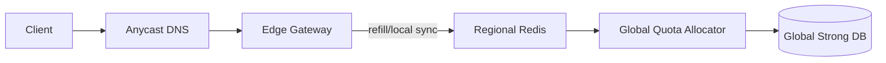

## Overview

Enforce global per-identity limits without putting a global round-trip on every request.

The gateway makes the allow/deny decision locally using short-lived tokens. A single global allocator occasionally grants **time-bounded quota leases** from a strongly consistent store. This keeps the request path fast while making global overshoot explicitly bounded.

## What Makes This Hard

- Global correctness and low latency fight each other; per-request global counters don’t scale.
- Failure retries can silently turn “bounded overshoot” into unbounded overshoot if leases aren’t idempotent.
- Hot identities must be boring: one abused key shouldn’t melt shared state.

## Requirements

### Functional Requirements
- Global limits per identity (API key/user/IP) with a **bounded** overshoot.
- Hierarchical limits; the decision is the minimum remaining budget across applicable policies.
- Common case: no cross-region dependency.
- Operator controls: per-key overrides, emergency blocks, shadow mode.
- Audit-grade telemetry: allow/deny counts, lease grants, top offenders.

### Scale Targets
- ~1M RPS sustained, peaks higher.
- 30–60 regions.
- High identity cardinality with churn; eviction must be first-class.
- Gateway added latency p99 < 2ms.
- Global allocator touched by a small fraction of requests.

## Key Design Decisions

- Lease quota globally; spend locally.
- Keep exactly one active lease per `(identity, region)` and make lease grants idempotent.
- Use a strongly consistent global DB for the allocator’s state so “double spend” is impossible under retries.

## Architecture

### Components

- **Edge Gateway**
  - Does the allow/deny decision and emits rate-limit headers.
  - Holds a tiny in-memory token bucket per identity for the hot path.
  - Justification: the only place that can reliably stay under the latency budget.

- **Regional Redis**
  - Stores the *regional* leased pool per identity and deduplicates refills (single-flight).
  - Gateways periodically “top up” their in-memory buckets from this pool in chunks.
  - Justification: one shared regional coordination point without running a regional service.

- **Global Quota Allocator**
  - Issues time-bounded leases to regions and enforces “one active lease per `(identity, region)`”.
  - Implements strict idempotency so retries never grant extra tokens.
  - Justification: the only correctness-critical component besides the DB.

- **Global Strong DB**
  - Stores policies (versioned), global bucket state, and lease/idempotency records.
  - Justification: makes bounded overshoot defensible under failures and retries.

## Deep Dive: Quota Leasing (The Hardest Part)

The allocator never answers “is this request allowed?” It only answers “how much may this region spend locally until expiry?”

**State model (token bucket)**
- Policy defines `(rate, burst)` and has a monotonically increasing `policy_version`.
- Global state per identity is stored as token-bucket fields: `(tokens, last_refill_time)`.

**Lease grant contract**
- A region requests a lease for `(identity, region, policy_version, request_id, prior_lease_id?)`.
- The allocator transactionally:
  - Enforces **idempotency**: if `request_id` already exists, return the stored response.
  - Enforces **single active lease**: if an unexpired lease exists for `(identity, region)` and `prior_lease_id` doesn’t match, return “lease still active” (no new tokens).
  - Refill global tokens by elapsed time, then decrement by `granted_tokens`.
  - Write the new lease record `(lease_id, granted_tokens, expires_at, policy_version)` and the idempotency record keyed by `request_id`.

**Regional spending**
- Redis holds `(lease_id, remaining_tokens, expires_in, policy_version)` per `(identity, region)`.
- Gateways obtain small chunks from Redis (single-flight + atomic decrement) and spend locally in-memory.
- If Redis is unavailable, gateways do not mint new tokens; they only spend what they already hold and then throttle.

**Bounding overshoot**
- Let `L` be the max lease size per identity and `R` the number of regions that can hold a lease.
- Worst-case overshoot is bounded by `R * L` (plus in-flight requests already admitted).
- The bound holds because:
  - At most one active lease per `(identity, region)`.
  - Lease grants are idempotent.
  - Gateways never create tokens during degraded modes.

**Policy changes and emergency blocks**
- Policies are versioned. A lease carries `policy_version`.
- If a gateway/Redis sees a newer `policy_version`, it treats old leased state as expired and refills (biasing toward under-utilization).
- Emergency blocks are enforced at the gateway from a cached “blocklist” fetched via the allocator’s control API; the gateway applies it immediately on the request path.

**Timekeeping**
- Leases are enforced using “time since receipt” (monotonic TTL countdown), not wall-clock `expires_at`.

## Trade-offs

| Optimized For | Sacrificed |
|--------------|------------|
| <2ms request path (local decisions) | Perfect global precision at sub-second granularity |
| Defensible bounded overshoot | Some under-utilization during failures and policy changes |
| Small operational surface area | Redis becomes a key regional dependency (but not on every request) |

## Failure Modes

- **Allocator outage**
  - Regions can’t obtain new leases; Redis pools drain; gateways eventually throttle.
  - Safe behavior: fail closed when tokens are exhausted.

- **Allocator retries/timeouts**
  - Safe behavior: idempotent `request_id` returns the same lease; no extra tokens can be granted.

- **Bad policy rollout / emergency block**
  - Safe behavior: policy version bump causes fast convergence (old leases treated as expired); emergency block is enforced at the gateway from cached control data, independent of allocator reachability at request time.

- **Clock skew**
  - Safe behavior: TTL is monotonic from receipt; skew cannot extend a lease.

- **Regional Redis brownout**
  - Safe behavior: gateways reduce refill concurrency, spend only already-held tokens, then throttle; no “extra emergency budget” is minted.

- **Hot identity bursts across many regions**
  - Safe behavior: `R * L` bound applies; single-flight in Redis prevents refill stampedes.

## What We Removed

- **Regional RLS service**
  - Merged into gateways + Redis (Redis is the single regional coordination point).

- **Separate “Local Token Bucket” component**
  - Folded into the gateway as an implementation detail.

- **Lease adaptation complexity**
  - Fixed, capped lease sizing is the default; correctness invariants stay simple and auditable.

## Operational Notes

- Pick `L` (max lease size) to match your overshoot tolerance; the bound is only real if the cap is real.
- Require `request_id` on every lease call and persist the response transactionally.
- Monitor: lease grant QPS, idempotency hit rate, per-identity refill rate, top denies, Redis latency, allocator latency.
- Keep gateway bucket TTL eviction aggressive; cardinality spikes should shed cleanly.
