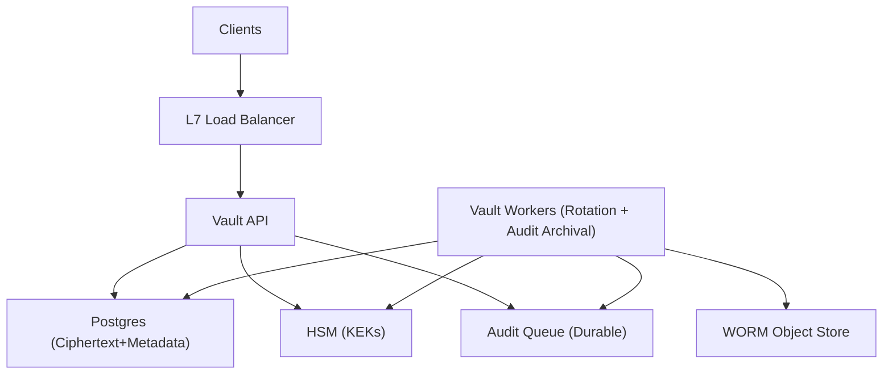

## Overview

This system is a centralized secrets service that stores and serves encrypted secrets, rotates credentials, and produces tamper-evident audit logs. Reads are intentionally boring: authenticate, authorize, decrypt via envelope encryption, emit an audit record. Rotation is the only workflow: create a new version, overlap, then revoke.

The key insight is to separate **secret storage** (encrypted blobs) from **secret validity** (versions + leases) and keep static secret reads read-only. Only dynamic secrets create durable leases; everything else is versioned and time-bounded.

Everything else stays boring: Postgres for metadata + encrypted payloads, an HSM for key-encryption-keys (KEKs), and append-only audit logs hash-chained and archived to WORM storage through a durable shared buffer.

## What We Removed

- `Redis Cache`: short-lived tokens/JWTs + in-process caches; no separate cache tier.
- Per-read durable leases for static secrets: only dynamic secrets write lease rows.
- Local-disk audit buffering: a shared durable audit queue provides backpressure and durability.
- Custom audit “stream + index”: audits are written to immutable objects and queried from the same archive.
- Separate worker service: rotation and audit archival run as background jobs from the same codebase as the API.

## Requirements

### Functional Requirements
- Store versioned secrets with strict ACLs (path + verb + constraints like environment/team).
- Support dynamic secrets with leases (e.g., DB credentials, API tokens) and explicit revocation.
- Rotate secrets on schedule and on-demand, with controlled overlap and rollback.
- Integrate with HSM for KEK operations; KEKs never leave the HSM.
- Provide tamper-evident audit logs for every auth decision and secret access (including denials).
- Support break-glass access with heightened auditing and time-bounded approval.
- Disaster recovery: recover service without exposing plaintext; recover audit trail without gaps.

### Scale Targets
- 25,000 services / workloads; 5,000 humans.
- 15,000 RPS peak reads (deploy storms); p99 read latency < 50 ms in-region.
- 200 RPS peak writes (CI churn, onboarding); rotations: 50,000/day (DB creds dominate).
- 500M audit events/month; retention: 1 year online query, 7 years immutable archive.
- HSM budget: < 5% of read traffic hits the HSM (HSM wraps/unwraps DEKs, not bulk decrypt).

## Key Design Decisions

- **Decision 1: Envelope encryption with per-version DEKs, KEKs in HSM**
  - What we chose: Each secret version is encrypted with a random DEK; the DEK is wrapped by an HSM-backed KEK and stored alongside ciphertext.
  - What we rejected: One global data key; application-managed encryption; storing KEKs outside HSM.
  - Why: Limits blast radius (one secret version per DEK), makes KEK rotation a rewrap operation, and prevents “DB access = plaintext.”

- **Decision 2: Versions everywhere; durable leases only for dynamic secrets**
  - What we chose: Static secrets return `(secret, version, expires_at)` without writing a lease row. Dynamic secrets return `(secret, version, lease_id, expires_at)` and persist the lease for renew/revoke.
  - What we rejected: Writing lease state on every read; “update in place.”
  - Why: Rotation stays deterministic where it matters (dynamic creds), while static reads stay fast under deploy storms.

- **Decision 3: Audit is part of correctness (durable buffer + WORM)**
  - What we chose: Every request enqueues an audit record (including denials) into a durable managed queue. A background job writes hash-chained immutable segments to WORM storage with retention lock.
  - What we rejected: Best-effort logging; local disk buffers on stateless nodes.
  - Why: API nodes stay stateless while still failing closed when auditing is not keeping up.

- **Decision 4: HSM budget via short-lived DEK cache**
  - What we chose: Cache *unwrapped DEKs* in-process for seconds with strict size limits; never cache plaintext secrets.
  - What we rejected: Plaintext caching; long-lived key caches.
  - Why: Keeps deploy-storm read latency stable while keeping the blast radius bounded in time.

## Architecture

### Components

- `Vault API`: Stateless HTTP service for auth, policy evaluation, secret CRUD, and decrypt-on-read. The API never persists plaintext and never caches plaintext beyond request scope. Justification: the only custom component that encodes policy and consistent access semantics.
- `Postgres (Ciphertext+Metadata)`: Source of truth for secret versions, wrapped DEKs, dynamic leases, policy versions, and rotation state. Justification: transactional correctness for pointers and revocation beats bespoke distributed stores.
- `HSM (KEKs)`: Holds KEKs and performs wrap/unwrap/rewrap. Justification: DB compromise does not become KEK compromise.
- `Audit Queue (Durable)`: Shared buffer for audit events. Justification: removes local buffering and provides backpressure without making API nodes stateful.
- `WORM Object Store`: Immutable audit archive with retention lock. Justification: the only credible ground truth audit store during and after compromise.
- `Vault Workers (Rotation + Audit Archival)`: Background jobs running the same codebase as the API. Justification: isolates long-running workflows from the read path without multiplying services.

## Deep Dive: Rotation Without Outages (Leases, Overlap, and Rollback)

Rotation is a small state machine in Postgres. Each run is idempotent and single-flight per secret (Postgres advisory lock keyed by secret id). For a rotatable secret we store `default_version`, optional `next_version`, and policy-defined `overlap_window`.

1. **Create `N+1` and switch the default**
   - Generate new material (or create a new provider-side principal), store as ciphertext + wrapped DEK, mark `ACTIVE`.
   - Atomically set `default_version = N+1`. `N` stays readable during overlap.

2. **Pinning is conditional**
   - Dynamic secrets get durable leases pinned to `(principal, secret_path, version, expiry)` for renew/revoke and inventory.
   - Static secrets are pinned only by time: `expires_at` is returned and clients re-read on expiry.

3. **Cutover and revocation**
   - After `overlap_window`, mark `N` as `DEPRECATED`.
   - Dynamic secrets: revoke leases pinned to `N` and revoke provider-side credentials.
   - Static secrets: stop serving `N` after overlap; access to deprecated versions requires explicit policy.

4. **Rollback is “change the default”**
   - Set `default_version = N`, mark `N+1` as `ROLLED_BACK`. The action is a pointer flip and an audit event.

## Trade-offs

| Optimized For | Sacrificed |
|--------------|------------|
| Strong security boundaries (HSM KEKs, per-version DEKs) | Slightly higher read latency and operational cost vs “just store plaintext” |
| Deterministic rotation (versions + dynamic leases) | Less perfect “who is still on N?” visibility for static secrets |
| Defensible audits (durable queue + WORM) | Requests fail closed if auditing can’t keep up |
| HSM load control (short-lived DEK cache) | Under host compromise, cached unwrapped DEKs reduce time-to-impact for a brief window |

## Failure Modes

- **Postgres down (hard downtime)**
  - What happens: reads/writes fail closed; rotation pauses.
  - Detect: DB health checks, query error rate.
  - Recover: promote replica with fencing; API reconnects; no degraded “serve from cache” mode.

- **Audit pipeline slow (not down)**
  - What happens: the API’s bounded audit enqueue queue fills; requests fail closed before memory pressure.
  - Detect: queue lag, enqueue latency, reject rate due to backpressure.
  - Recover: scale consumers/throughput; traffic resumes without replaying local disks.

- **HSM throttling / partial outage during deploy storm**
  - What happens: unwrap calls throttle; p99 rises; eventually decrypt fails.
  - Detect: HSM latency/quota, DEK-cache hit rate, unwrap error rate.
  - Recover: short-lived in-process DEK cache keeps unwrap traffic under budget; if HSM is unavailable, decrypt fails closed.

- **Bad policy/config rollout**
  - What happens: new policy version causes deny-all or over-broad allow.
  - Detect: shadow-eval audit entries (log-only) before promotion; sudden allow/deny spikes after promotion.
  - Recover: policies are versioned; rollback is “promote previous version”; break-glass is a separate, time-bounded policy that always emits heightened audits.

- **Rotation bug revokes too early / rotates twice**
  - What happens: clients fail auth at the provider or lose access unexpectedly.
  - Detect: invariants enforced in the state machine (`no revoke before overlap_window`, monotonic transitions), plus provider-side error spikes.
  - Recover: single-flight per secret via advisory locks + idempotency keys; rollback by switching `default_version` back and re-enabling the previous provider credential.

## Operational Notes

- Treat “seal/unseal” as an incident workflow: auto-unseal via HSM, but require human break-glass to change KEK policy or disable auditing.
- Keep auth simple: short-lived tokens (minutes) or mTLS identity per request; revocation is “stop issuance + expire quickly,” plus lease revocation for dynamic secrets.
- Run regular “audit verifiability drills”: pick a time window, verify hash chain continuity, and validate WORM retention settings actually prevent deletion.
- Maintain a “rotation canary”: a small set of secrets rotated hourly to continuously test provider integrations and rollback paths.
