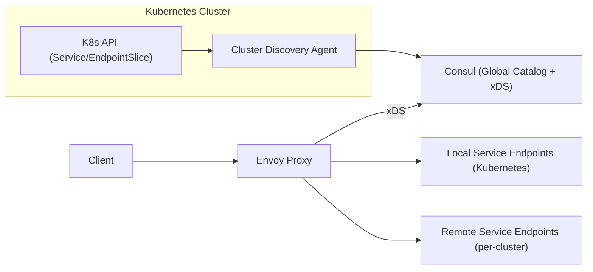

## Overview

This system provides **multi-cluster service discovery** with **health-based routing** across Kubernetes clusters by keeping “global discovery” intentionally small: it is only used for **remote failover**, while the **local path stays independent**.

Kubernetes remains the source of truth for local endpoints. Consul holds a **TTL-based global catalog of cluster-level endpoints** (one per service per cluster, not every pod). Envoy makes per-request decisions and treats global state as a hint: **prefer local**, use remote only when needed, and stop trusting remote quickly when it misbehaves.

## What Makes This Hard

In multi-cluster routing, the hardest failure is **confidently routing to dead capacity** because health signals are stale. The second failure is making “global discovery” a dependency for the local happy path.

This design avoids both by (1) keeping global state coarse (cluster-level) and soft (TTL), and (2) making Envoy safe under staleness (local-first + passive health + bounded retries).

## Requirements

### Functional Requirements
- Discover service endpoints across multiple Kubernetes clusters under a single logical service name.
- Route requests based on **health**, preferring same-cluster endpoints and failing over to other clusters.
- Handle eventual consistency explicitly: endpoints may be added/removed/partitioned while traffic continues.
- Support gradual rollouts: new endpoints must not receive global traffic until they’re demonstrably ready.
- Provide a control-plane API for operators: “what is routing to what, and why?”

### Scale Targets
- **Clusters:** 20 (typical large org footprint); design should not fall apart at 100.
- **Services:** 5,000; large enough that full-table polling is unacceptable.
- **Endpoints:** 200,000 total; forces watch/stream distribution and compact representations.
- **Discovery QPS:** 50k lookups/s equivalent at the edge (handled via xDS push + local caches, not synchronous queries).
- **Update rate:** 1,000 endpoint changes/s during deploy storms; requires incremental updates and TTL-based cleanup.

## Key Design Decisions

- **Chose:** Cluster-level global endpoints (per service, per cluster) with TTL  
  **Rejected:** Pod-level global endpoint replication  
  **Why:** Remote failover does not need pod granularity; it needs a safe remote target. This removes most churn and makes eventual consistency survivable.

- **Chose:** Consul as the global catalog **and** xDS server  
  **Rejected:** A custom discovery control plane  
  **Why:** The system only needs a catalog + watch distribution. Policy stays minimal and lives in Envoy config and Consul config entries.

- **Chose:** Envoy for routing safety (locality + outlier ejection + bounded retries)  
  **Rejected:** DNS-only multi-cluster discovery  
  **Why:** Routing safety is a data-plane problem; Envoy can stop trusting bad upstreams quickly.

- **Chose:** Two-stage gating for remote eligibility  
  **Rejected:** “Publish immediately when it appears”  
  **Why:** “Ready locally” is not the same as “safe for remote traffic.” Remote is opt-in after stability.

**What We Removed**
- Custom `Discovery Control Plane` → replaced by Consul’s built-in xDS distribution.
- Separate `Health Prober` → replaced by K8s readiness for eligibility and Envoy passive health for routing safety.
- Global pod endpoint advertisement → replaced by per-cluster service endpoints.

## Architecture

### Components

- `Cluster Discovery Agent`
  - Watches Kubernetes `Service` + `EndpointSlice`.
  - Registers **one remote target per service per cluster** into Consul with **TTL** and metadata (`cluster`, `region/zone`, `revision`, `protocol`, `port`).
  - Two-stage gate:
    - **LocalReady:** service has ready endpoints (Kubernetes readiness).
    - **GlobalReady:** LocalReady has been stable for a short window; remote weight ramps up slowly.
  - HA and safety:
    - Runs as a Deployment with **leader election** (K8s Lease); only the leader renews TTLs.
    - Renews with jitter/batching to survive deploy storms.

- `Consul (Global Catalog + xDS)`
  - Stores soft-state remote targets with TTL.
  - Streams updates to Envoy over xDS.
  - Enforces who may register via ACLs (registration is not open-ended).

- `Envoy Proxy`
  - Has a **static local cluster** (Kubernetes service discovery) so local traffic works without Consul.
  - Uses Consul xDS only for the **remote failover layer**.
  - Routing safety:
    - **Local-first** routing; remote only on local failure/overload.
    - **Outlier ejection** to stop sending traffic to bad remote targets quickly.
    - **Bounded retries** with strict budgets to avoid retry storms.
  - Debug surface:
    - Envoy admin and access logs expose chosen cluster/endpoint, ejection status, and config version (the “why” signal).

## Deep Dive: Health-Based Routing Under Eventual Consistency

1) **Global state is eligibility, not truth**  
Consul only answers: “which clusters are currently eligible targets for this service?” Eligibility is TTL-based and expires quickly.

2) **Remote eligibility is gated and slow-started**  
A service becomes remotely eligible only after LocalReady is stable. Remote traffic ramps via weights/slow-start so “globally visible” does not mean “take full remote load.”

3) **Data plane corrects faster than the catalog converges**  
Envoy treats remote targets skeptically: if a target times out/5xx’s, it is ejected quickly and traffic fails over without waiting for catalog updates.

## Trade-offs

| Optimized For | Sacrificed |
|--------------|------------|
| Few moving parts (Consul + Envoy + small agent) | Fine-grained global endpoint steering |
| Safe local happy path independent of global systems | Remote routing is coarser (cluster-level) |
| Fast protection from stale health (Envoy passive health) | Less “rich” active health signal |
| Deploy-storm resilience (TTL + gating + slow-start) | Slightly slower remote ramp-up |

## Failure Modes

- **Consul outage or stale watch results**
  - What happens: remote updates stop.
  - Recover: Envoy continues routing locally using static config; remote is additive and can be automatically disabled if xDS is too old.

- **Agent failure / bad rollout (cluster is healthy)**
  - What happens: TTL renewals stop; that cluster’s remote eligibility expires.
  - Recover: local traffic remains unaffected; once the agent leader is healthy again, eligibility returns after gating.

- **Network partition between a cluster and Consul**
  - What happens: that cluster stops receiving remote traffic as TTLs expire.
  - Recover: other clusters continue; when connectivity returns, targets reappear after gating and slow-start.

- **Slow control-plane propagation (lag, not outage)**
  - What happens: remote changes arrive late.
  - Recover: Envoy’s passive health prevents persistent blackholes; alerts focus on snapshot age / xDS ACK latency to keep lag from turning into incident.

- **Bad retry/failover policy push**
  - What happens: self-inflicted retry storms or wrong failover order.
  - Recover: keep policy surface small; use versioned config and fast rollback; Envoy bootstrap supports an emergency local-only mode that does not depend on Consul being healthy.

## What I'd Do Differently At...

- **10x scale:** keep the same shape; reduce remote churn further by tightening “remote eligibility” to only the clusters intended to take remote traffic (explicit allowlists/weights per service).
- **100x scale:** stop thinking in endpoints entirely; remote routing stays cluster-level and becomes the default abstraction (everything else stays local).

## Operational Notes

- TTL is for *eligibility*, Envoy passive health is for *routability*; tune them together, but let Envoy make the fast decision.
- Alert on **xDS staleness**, **xDS ACK latency**, and **outlier ejection rate**; they catch “slow” before it becomes “down.”
- Keep retries boring: small per-try timeouts, low max attempts, strict budgets; default to local-first.
- Registration is privileged: Consul ACLs restrict which agents may register which service names; cross-cluster transport uses mTLS when enabled in the mesh.
