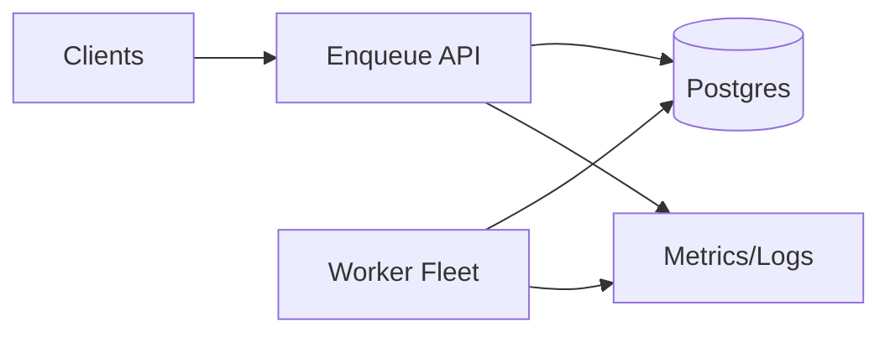

## Overview

This system is a distributed batch job scheduler: clients enqueue jobs with a priority and an optional “not before” time, workers execute them, and the platform handles retries, backoff, and tenant isolation.

Postgres is the source of truth. Workers run a small tenant-first dispatch loop that enforces per-tenant concurrency and rate limits before claiming jobs. Execution is at-least-once by design; correctness comes from idempotency keys and retry semantics.

## What Makes This Hard

Priority + delay + retries + multitenancy interact badly if you rely on global “next job” ordering. Isolation only holds if admission happens at the tenant level, not on a shared ready queue.

Exactly-once execution is not achievable in a distributed scheduler. Leases expire, workers crash, and jobs get re-delivered; the system must be safe under duplicates.

## Requirements

### Functional Requirements

- Enqueue a job with: `tenant_id`, `queue`, `priority`, `run_at`, `max_attempts`, `timeout`, `idempotency_key`, and a bounded `payload`.
- Dispatch jobs to workers with **at-least-once** semantics and a bounded execution lease.
- Retries with exponential backoff + jitter; retryable vs fatal errors.
- Multi-tenant isolation:
  - Per-tenant concurrency limits (hard cap on in-flight jobs).
  - Per-tenant rate limits (sustained throughput cap).
  - Fair sharing across tenants when the system is saturated.
- Dead-lettering: jobs that exceed attempts (or hit fatal errors) are retained for inspection and replay.

### Scale Targets

- 1,000 tenants, long tail + a few heavy hitters.
- Peak enqueue: 50k jobs/min; sustained: 10k jobs/min.
- Pending jobs: up to 50M.
- Ready jobs: up to 1M at peak surge.
- Dispatch latency SLO: p95 < 2s from `run_at` to start (for ready capacity).
- Worker fleet: 2k–20k concurrent executions across all tenants.

## Key Design Decisions

- **Tenant-first admission (then job selection)**
  - Enforce per-tenant caps and rate limits before claiming jobs.
  - Tenant selection is deterministic and debuggable: order by `(next_ready_at, tenant_id)`.

- **Postgres as the durable scheduler core**
  - Jobs, leases, retries, and DLQ live in Postgres.
  - Claiming uses row locks and `SKIP LOCKED` to avoid double-claiming.

- **Worker pull (workers both claim and execute)**
  - Workers claim leases directly from Postgres and then execute.
  - There is no separate scheduler-to-worker handoff path to fail.

- **At-least-once with concrete idempotency enforcement**
  - Each job has an `idempotency_key`.
  - Workers gate side effects on an idempotency record in Postgres, and handle conflicts safely.

**What We Removed**
- Separate scheduler service (merged into workers).
- Advisory locks (row locks on `tenant_state` serialize per-tenant decisions).
- Persistent deficit round-robin (simple deterministic tenant ordering).
- Triggers/`LISTEN/NOTIFY` wakeups (polling with jitter only).
- External payload blob store (payload is stored in Postgres with a strict size cap).

## Architecture

### Components

- **Enqueue API**
  - Validates basic tenant limits, enforces a payload size cap, writes jobs, and provides status endpoints.
  - Earns its place by being the stable contract surface: jobs in, status out.

- **Postgres**
  - System of record for job state transitions, retry scheduling, dead-letter retention, and auditability.
  - Earns its place by providing atomic claiming and a single place to debug reality.

- **Worker Fleet**
  - Claims jobs (tenant-first), executes them, heartbeats long jobs, and records outcomes.
  - Earns its place by being elastic and disposable; failures are contained via leases + retries.

- **Observability**
  - Per-tenant lag, in-flight counts, retry/DLQ rates, and DB contention signals.
  - Earns its place because isolation is only real if it’s visible and actionable.

## Deep Dive: Multi-Tenant Fair Dispatch Without Hot Spots

Workers enforce isolation using admission control at the tenant level. The hot path selects tenants from a small table, then claims jobs within that tenant.

### Data model (minimal but sufficient)

- `jobs`
  - `id`, `tenant_id`, `queue`, `priority`, `run_at`, `status` (`ready|leased|done|dead`), `attempt`, `max_attempts`
  - `lease_owner`, `lease_expires_at`
  - `idempotency_key`, `payload` (bounded), `last_error`, `created_at`, `updated_at`
  - Index: `(tenant_id, status, run_at, priority desc, id)` and a partial index for `status='leased'` by `(lease_expires_at)`.

- `tenant_state` (one row per tenant)
  - `tenant_id`, `inflight`, `concurrency_cap`
  - `rate_tokens`, `rate_updated_at`
  - `next_ready_at`
  - Index: `(next_ready_at, tenant_id)`.

- `job_idempotency`
  - `tenant_id`, `idempotency_key`, `state` (`started|completed`), `job_id`
  - `locked_until`, `created_at`, `completed_at`
  - Unique index: `(tenant_id, idempotency_key)`.

### Dispatch algorithm (simple + safe)

Each worker runs this loop:

1. **Pick a tenant (row-locked)**: `SELECT ... FROM tenant_state WHERE next_ready_at <= now() AND inflight < concurrency_cap AND rate_tokens > 0 ORDER BY next_ready_at, tenant_id FOR UPDATE SKIP LOCKED LIMIT 1`.
2. **Claim jobs for that tenant (single transaction)**:
   - Select jobs: `SELECT ... FROM jobs WHERE tenant_id=? AND status='ready' AND run_at <= now() ORDER BY priority desc, run_at asc, id asc FOR UPDATE SKIP LOCKED LIMIT batch_size`.
   - Update claimed rows to `status='leased'`, set `lease_owner`, `lease_expires_at=now()+lease_ttl`.
   - Increment `tenant_state.inflight` by claimed count; decrement rate tokens once per batch.
   - Update `tenant_state.next_ready_at` to the next runnable time for that tenant (recomputed from that tenant’s ready jobs).
3. **Execute** each leased job:
   - Enforce idempotency before side effects:
     - Lock/create idempotency row for `(tenant_id, idempotency_key)`.
     - If `state='completed'`: mark job `done` as duplicate and release capacity.
     - If `state='started'` and `locked_until > now()`: reschedule the job with a short delay and release capacity.
     - Otherwise set `state='started'` and `locked_until=now()+idempotency_ttl`, then execute.
   - Heartbeat only for long-running jobs (extend `lease_expires_at` periodically after a runtime threshold).
4. **Completion** (transactional update):
   - Success: mark job `done`, decrement `tenant_state.inflight`, set idempotency row to `completed`.
   - Retryable failure: compute `next_run_at = now() + backoff(attempt) + jitter`, mark job `ready` with new `run_at`, decrement `inflight`, refresh `next_ready_at`.
   - Fatal / attempts exceeded: mark job `dead`, decrement `inflight`, refresh `next_ready_at`.

### Correctness: leases, timeouts, and reconciliation

- Leases provide bounded ownership. Expired leases are treated as lost work and become eligible again.
- `tenant_state.inflight` and `tenant_state.next_ready_at` are treated as cached admission hints with enforced invariants:
  - `inflight` must match the count of non-expired leased jobs for that tenant.
  - `next_ready_at` must be <= the minimum `run_at` of ready jobs (or a sentinel if none).
- A periodic reconciler runs per active tenant:
  - Recompute `inflight` from leased jobs (bounded by tenant).
  - Recompute `next_ready_at` from ready jobs (bounded by tenant).
  - This corrects drift from crashes, timeouts, and edge races.

## Trade-offs

| Optimized For | Sacrificed |
|--------------|------------|
| Minimal moving parts | Separate scheduler tier and specialized queue throughput |
| Tenant isolation and debuggability | Perfect fairness and global ordering guarantees |
| Simple failure behavior | Duplicate executions (at-least-once) |
| Single-store correctness | Strict payload size limits (no large blobs) |

## Failure Modes

- **Postgres is down**
  - Enqueue and dispatch return errors; clients retry with backoff.
  - Workers ramp back up with jittered polling to avoid a thundering herd on recovery.

- **Workers can’t reach Postgres**
  - Dispatch halts; leases expire; work resumes when connectivity returns.
  - Capacity is restored naturally via expired leases and reconciled `tenant_state`.

- **Worker crashes mid-job**
  - Lease eventually expires and the job is retried.
  - Idempotency gating prevents concurrent duplicates; sequential duplicates remain possible if the side effect completed but the attempt did not record completion.

- **`tenant_state` drift**
  - Admission becomes too strict or too loose for that tenant.
  - Reconciliation restores invariants from authoritative rows in `jobs`.

- **Retry storms (poison jobs)**
  - Tenant capacity is consumed by fast-failing jobs.
  - Minimum backoff floors and fatal classification contain blast radius; DLQ provides inspection and replay.

- **Traffic spike with large backlog**
  - DB becomes the bottleneck via write amplification (leases, retries, heartbeats).
  - Degraded mode: larger claim batches, heartbeat only for long jobs, and rate-token updates per batch (not per job).

## Operational Notes

- Keep timeouts explicit and observable: `lease_ttl`, heartbeat threshold/interval, and job `timeout`.
- Enforce a strict payload size cap at enqueue to keep the DB hot set predictable.
- Provide operator tools: pause tenant, drain tenant, replay DLQ, and bulk-cancel by predicate.
- Monitor per-tenant lag and saturation: “ready but not dispatching” is the primary isolation alarm.
