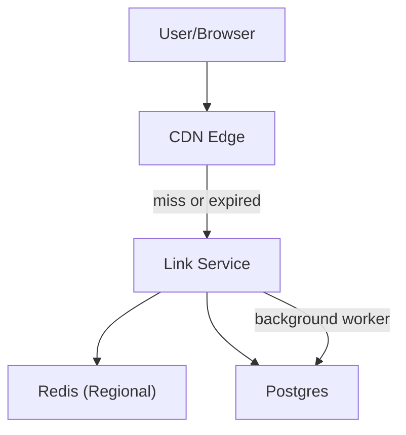

## Overview

This system creates and resolves short links with custom aliases, strict expiration, and abuse takedowns while keeping redirect latency globally low.

Redirects are treated as cacheable content with **bounded staleness** (edge TTL derived from `expires_at`). Creation, ownership, and policy decisions live in a **single authoritative control plane** (Postgres).

## What Makes This Hard

Expiration and takedowns are correctness requirements: stale redirects past `expires_at` or after a block are incidents, not “freshness” issues.

Global low-latency reads tempt teams into complex multi-region databases. Workload skew makes edge caching the simplest way to get latency without multiplying write complexity.

## Requirements

### Functional Requirements
- Create short links with:
  - Random codes and custom aliases (normalization + reserved words).
  - Aggressive expiration (minutes to days) with hard cutoff semantics.
  - Update/disable/delete (owner actions and abuse takedowns).
- Resolve links with:
  - Global low-latency redirects.
  - Expiration/takedown correctness within a bounded window.
- Abuse prevention:
  - Limit bulk creation, malicious destinations, and keyspace scanning.
  - Fast takedown with an audit trail.

### Scale Targets
- Redirects: 5B/day (~58k QPS avg), 300k QPS peak.
- Link creates/updates: 2k QPS peak.
- Active links: 100M.
- Latency: p95 < 20ms at edge for cache hits; p99 < 150ms for origin path.
- Correctness: expired/disabled links stop redirecting globally within ≤ 5 minutes (bounded by edge TTL cap).

## Key Design Decisions

- **Edge-cached redirects with bounded TTL**
  - CDN caches redirect responses with TTL = `min(expires_at - now, EDGE_MAX_TTL)` (e.g., 300s).
  - Takedowns rely on TTL bounds for correctness; purge is an accelerator for the hottest offenders.

- **One service, two concerns**
  - A single stateless Link Service serves both redirect and admin routes (auth-gated).
  - The same codebase runs a background safety worker loop.

- **Postgres as the control plane**
  - Postgres is the source of truth for alias uniqueness, link state, ownership, safety verdicts, and audit events.

- **Redis as a regional read cache**
  - Redis is a read-through cache for link records on the origin path.
  - TTL is derived from `expires_at` (and short TTL for terminal states) to cap staleness and protect Postgres.

- **Edge-only caching; browsers don’t cache**
  - Browser-facing responses use conservative caching (`Cache-Control: no-store`).
  - CDN caching uses `Surrogate-Control` (or equivalent) so edge can cache while clients do not.

## Architecture

### Components

- **CDN Edge**
  - Justification: absorbs flash/scanning traffic and serves most redirects from cache with bounded staleness.
  - Responsibilities: cache redirect responses by TTL derived from `expires_at`; coarse rate limits/bot controls.

- **Link Service**
  - Justification: the single place that turns link state into correct HTTP semantics (redirect vs terminal), including cache headers.
  - Responsibilities:
    - Redirect route: validate code, enforce `status` + `expires_at`, return redirect or terminal response.
    - Admin routes: auth, alias rules, quotas, destination validation, state changes, and audit events.
    - Background safety worker: processes scan jobs from Postgres and updates verdicts/state.

- **Redis (Regional)**
  - Justification: shields Postgres from hot reads and broad miss traffic; keeps origin p99 under control.
  - Responsibilities: cache link records (including terminal states) with TTL aligned to `expires_at` and short negative caching.

- **Postgres**
  - Justification: strong consistency for uniqueness/state transitions and a durable audit trail.
  - Responsibilities: link records, safety verdicts, audit events, and a simple jobs table for scanning.

## Deep Dive: Correct Redirects Under Expiration + Takedowns

**Link record (authoritative):**
- `code` / `alias`
- `destination_url`
- `expires_at`
- `status` = `active | disabled | blocked | deleted`
- `updated_at`
- `safety_verdict` (+ reason, timestamps)

**Redirect path algorithm:**
1. **Edge cache hit**: serve immediately.
2. **Edge miss**: call Link Service.
3. Link Service checks Redis:
   - If present: enforce `status` and `expires_at > now`; respond.
   - If missing: read Postgres, then populate Redis with TTL = `min(expires_at - now, REDIS_MAX_TTL)`.
4. **Response caching:**
   - Client: `Cache-Control: no-store` (prevents browser stickiness).
   - Edge: `Surrogate-Control: max-age=min(expires_at - now, EDGE_MAX_TTL)`.
5. **Terminal responses:**
   - Expired/deleted: `410 Gone`, edge-cached briefly (e.g., 60s).
   - Blocked: `451 Unavailable` (or an interstitial), edge-cached briefly.

**Write path (create/update/takedown):**
- Enforce alias normalization and uniqueness in Postgres transactions.
- Validate destination URL (scheme allowlist `http/https`, reject `javascript:`/`data:`, normalize/IDN handling).
- Insert a scan job row for new/changed destinations; background worker updates `safety_verdict` and flips `status` when needed.

## Trade-offs

| Optimized For | Sacrificed |
|--------------|------------|
| Global low-latency reads via edge caching | Immediate global takedown (bounded by TTL cap) |
| Small-team operability (one service + Postgres + Redis) | Less isolation than multiple microservices |
| Browser correctness (no sticky caches) | Slightly lower client-side caching efficiency |
| Simple async safety via DB jobs | Scans are eventually consistent; backlog delays verdicts |

## Failure Modes

- **Postgres is down**
  - Behavior: Link Service serves from Redis while entries are valid; once Redis entries expire, Link Service fails closed with `503` (edge caches errors minimally).
  - Result: takedown/expiry guarantees remain bounded; availability degrades for uncached links.

- **Redis is down / partial**
  - Behavior: Link Service reads Postgres directly with tight concurrency limits; for obvious scans and repeated misses it returns `429/503` to protect the database.
  - Result: redirects degrade gracefully; the control plane stays healthy.

- **Bad cache headers / browser “permanent” caching**
  - Behavior: client caching is disabled (`Cache-Control: no-store`); edge caching uses surrogate headers only.
  - Result: policy changes are not trapped in user-agent caches.

- **Network partition (service can reach Redis but not Postgres, or vice versa)**
  - Behavior: Redis is used only within its TTL window; without Postgres, Link Service fails closed once cached entries expire.
  - Result: correctness stays bounded; availability degrades predictably.

- **Safety scan backlog**
  - Behavior: scan jobs are idempotent; retries are bounded; links can be created as `active` but flip to `blocked` when a verdict arrives (audited).
  - Result: scanning delays reduce time-to-block for new threats but do not break redirect correctness once blocked.

## What We Removed

- Separate Admin/Create API (merged into the Link Service).
- Separate queue system (replaced by a Postgres jobs table processed by the Link Service worker).
- Version-based cache coherence (bounded TTL + authoritative checks are sufficient for correctness here).
- Dependence on global purge for correctness (kept only as an accelerator for top offenders).
- Partitioning/expiration sweep complexity as a core requirement (expiration is enforced at read time; cleanup is a periodic maintenance task).

## Operational Notes

- `expires_at` is UTC and validated; TTL math is treated as production-critical.
- Primary SLOs: “redirect after `expires_at`” and “takedown-to-effective” measured from multiple POPs.
- Monitor: edge hit ratio, origin QPS, Redis hit rate, Postgres latency, redirects by status, and 4xx/5xx spikes by ASN/IP.
- Takedown playbook: flip `status` in Postgres immediately; refresh Redis for that code; purge selectively for links producing high QPS.
