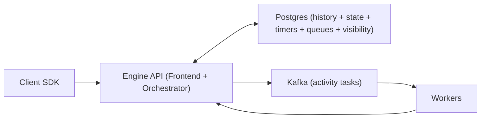

## Overview

This is a Temporal-like workflow engine for coordinating long-running business processes (minutes to months). Each workflow is a deterministic, single-writer state machine whose only durable truth is an append-only history log in Postgres. Crash recovery is replay: read history, rebuild in-memory state, continue.

The engine guarantees exactly-once **acceptance** of workflow state transitions (decisions, completions, timers, signals). External side effects are at-least-once executed by workers and made practically safe via required idempotency keys.

## What Makes This Hard

You must assume duplicates, retries, worker crashes, and coordinator failover mid-decision. Correctness comes from one durable place enforcing ordering and fencing; everything else is derived and safely repeatable.

## Requirements

### Functional Requirements
- Durable workflows: progress survives process crashes and restarts.
- Exactly-once acceptance: each step completion is recorded once (idempotent API semantics).
- Timers and delays: late is acceptable; early is impossible.
- Retries with backoff, timeouts, heartbeats, and cancellation.
- Deterministic workflow logic: replay produces identical decisions (or fails loudly).
- Observability: inspect history, current state, and “why it’s stuck”.

### Scale Targets
- 10M total workflows/day, 1M concurrently open.
- 50k workflow task decisions/sec peak.
- 200k activity dispatches/sec peak to workers.
- P95 decision latency < 200ms (excluding activity runtime).
- History retention 30 days; average history 200 events, p99 10k events.

## Key Design Decisions

- **Append-only history is truth**
  - State is derived by replay; debugging and recovery are built-in.
- **Single-writer per workflow via optimistic concurrency**
  - One committed decision stream per `workflow_id`; races become extra work, not corruption.
- **Exactly-once acceptance via durable fencing**
  - Completions are accepted only when their fence token matches durable expected state; duplicates return the recorded result.

## Architecture

### Components

- **Client SDK**
  - Runs deterministic workflow code and routes nondeterminism through engine APIs (timers, activities, signals).
  - Exists to make determinism enforceable and developer-visible.

- **Engine API (Frontend + Orchestrator)**
  - One service boundary: client/worker APIs plus the orchestrator loop.
  - Exists to enforce idempotency, fencing, and optimistic commits at a single durable boundary (Postgres).

- **Postgres (history + state + timers + queues + visibility)**
  - `history_events` (append-only), `workflow_execution` (status + `version` + pointers), `activity_state` (expected token + completion result), and a small read model for listing workflows.
  - Exists because correctness needs one transactional source of truth.

- **Kafka (activity tasks)**
  - Activity distribution at high fanout/throughput with at-least-once delivery.
  - Exists to keep worker scaling and dispatch throughput off the primary database write path.

- **Workers**
  - Execute side effects and report heartbeats/completions using idempotency keys.
  - Exists because the engine must stay pure and repeatable; IO is external.

## Deep Dive: Exactly-Once Step Execution

### 1) Decisions are durable, dispatch is derived
When workflow code requests an activity or timer, the orchestrator commits intent to history:
- `ScheduleActivity(activity_id, input, retry_policy, fence_token)`
- `StartTimer(timer_id, due_at)`

The same transaction updates derived tables (`activity_state`, timers, visibility) so reads don’t require replay.

### 2) Workflow-task scheduling (no workflow-task broker)
All events that require evaluation (start, signal, activity completion, timer firing) enqueue a workflow task in Postgres:
- `workflow_task_queue(workflow_id, run_id, available_at)`

Orchestrator workers claim tasks with:
- `SELECT ... FOR UPDATE SKIP LOCKED` + a short lease
so crashes become re-claimable work, not stuck workflows.

### 3) Timers live in Postgres and wake workflows
Timers are rows keyed by `(workflow_id, timer_id)` with an index on `due_at`. A poller claims due timers with:
- `WHERE due_at <= now() ORDER BY due_at LIMIT N FOR UPDATE SKIP LOCKED`
and, in the same transaction, appends `TimerFired` to history and enqueues a workflow task. Early fire cannot happen because the DB condition is authoritative.

### 4) Completion transaction contract (the only place “exactly-once” exists)
Workers complete with:
- `CompleteActivity(workflow_id, activity_id, fence_token, result)`

The Engine API performs one transaction:
- `SELECT ... FROM activity_state WHERE (workflow_id, activity_id) FOR UPDATE`
- If already completed: return the recorded result (idempotent).
- Else if `fence_token != expected_fence_token`: reject as stale.
- Else: append `ActivityCompleted` to `history_events`, mark `activity_state` completed with stored result, and enqueue a workflow task.

This makes “accepting a completion” rare and strictly fenced by durable state.

### 5) Side effects are safe via required idempotency keys
A worker may crash after applying an effect but before reporting completion. Retried execution must be equivalent:
- Idempotency key = `workflow_id:activity_id` (or a stable activity key recorded in history).
- Downstream must store/recognize that key and return the original result on duplicates.

## Trade-offs

| Optimized For | Sacrificed |
|--------------|------------|
| Correctness under retries/partitions | Extra compute from replay and retries |
| Small-team operability (one service + Postgres + Kafka) | Less flexibility than many specialized subsystems |
| Fast, authoritative timer semantics (DB truth) | Timer throughput tied to Postgres tuning |
| Simple visibility (Postgres read model) | Limited search vs dedicated search engines |

## Failure Modes

- **Postgres down**
  - What happens: all APIs that write state fail; no progress is recorded; workers can still run but completions won’t be accepted.
  - Recover: clients/workers retry with backoff; on return, orchestrator drains `workflow_task_queue` with concurrency caps to avoid replay storms.

- **Kafka outage / consumer lag**
  - What happens: activity dispatch stalls; workflows wait on activities; state remains correct.
  - Recover: when Kafka returns, workers catch up; retries remain safe due to idempotent completion + fencing.

- **Network partition: workers can’t reach Engine API or Postgres**
  - What happens: completions can’t be accepted; retries occur; side effects rely on downstream idempotency keys.
  - Recover: once connectivity returns, the first accepted completion wins; stale attempts are fenced.

- **Outbox/dispatch loop lags**
  - What happens: activities are scheduled in history but arrive late to workers; timers and signals still enqueue workflow tasks.
  - Recover: prioritize publishing oldest unsent activity tasks; throttle new starts before starving completions/timers.

- **Bad deploy causes nondeterminism**
  - What happens: replay diverges; the workflow fails loudly at the first mismatched decision with a history pointer.
  - Recover: roll back, or gate incompatible logic behind a workflow-code version marker recorded in history.

- **Traffic spikes 10x**
  - What happens: queue depth grows; decision latency rises.
  - Recover: admission control in Engine API (429 starts first), cap concurrent evaluations per shard/worker, prioritize timer firing and activity completions over new work.

## What We Removed

- **Workflow-task Kafka**
  - Workflow evaluation scheduling is a Postgres queue (`SKIP LOCKED` + leases) because it’s already tied to durable state and needs simple fairness, not a separate broker.

- **Separate Visibility Index**
  - Visibility is a Postgres read model updated in the same transaction as history/state changes, so listing workflows cannot lag correctness.

- **Standalone dispatcher service**
  - Publishing activity tasks is a loop inside the Engine API reading durable rows and publishing to Kafka; there is no extra service boundary.

- **“Exactly-once effects” claim**
  - The engine guarantees exactly-once acceptance of transitions; effects are safe only with required idempotency contracts per activity type.

## Operational Notes

- Determinism is enforced: workflow code must fail fast on nondeterminism with a clear decision mismatch and history pointer.
- “Stuck” usually means: missing worker pollers, retries saturated, Kafka lag, timer backlog, or replay cost; each maps to one queue/table/metric.
- Keep payloads out of history: store large inputs/outputs externally and reference them; history is for decisions and pointers.
- Retention is reliability: TTL/archival is mandatory; without it, the history store becomes the outage.
