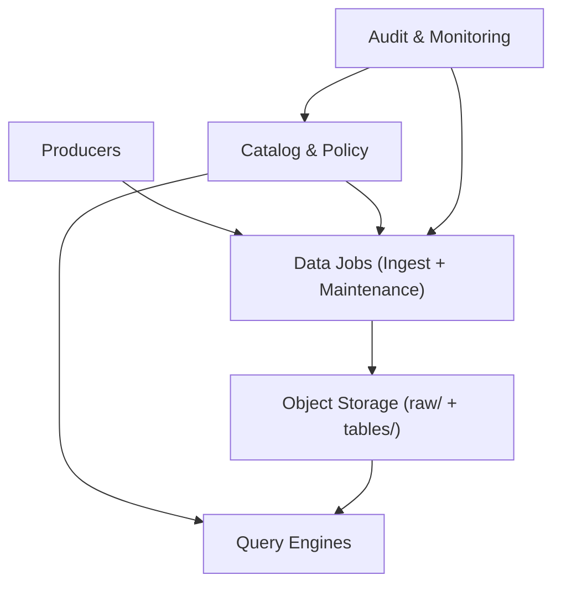

## Overview

This is a governed lakehouse on object storage that supports Iceberg and Hudi with multiple compute engines. The system is intentionally simple: **object storage holds data**, **table formats provide commit/snapshot semantics**, and a **single control plane (catalog + policy)** is the only supported path for discovery and authorization. Auditability comes from joining control-plane decisions to object-store access logs via session identity.

## What Makes This Hard

Lakes fail when “files in a bucket” become the API: every engine interprets layouts differently, partial overwrites slip through, and governance becomes unenforceable. At PB scale, **small files + metadata growth** become the dominant reliability and cost problems, so maintenance must be treated as first-class table operations, not ad-hoc engine behavior.

## Requirements

### Functional Requirements
- Support **Iceberg and Hudi** tables on the same object storage, readable by common engines.
- Provide **snapshot-consistent reads** and **format-native commits** (no partial overwrites).
- Run **compaction/optimization** and **metadata cleanup** without breaking concurrent readers/writers.
- Enforce **table/column-level governance** with auditable access logs.
- Make the **catalog the gate** for discovery and access (no catalog-bypass reads).

### Scale Targets
- Storage: **1–5 PB**; tables: **1,000–5,000**; ingest: **5–20 TB/day** (bursts during backfills).
- Query: **200–2,000 concurrent**; partitions/day: **50k–200k**; target file sizes: **256MB–1GB**.

## Key Design Decisions

- **Single control plane:** A managed, highly available **Catalog & Policy** is the only supported way to resolve table locations and permissions.
- **Fail-closed storage boundary:** The data bucket denies access by default; only requests carrying approved **short-lived IAM credentials + session tags/IDs** can read governed table paths.
- **No dedicated compaction service:** Compaction and cleanup run as **scheduled jobs using the same compute engines** and format-native procedures, with explicit budgets and backpressure.
- **Audit via managed logs:** Control-plane decision logs and object-store access logs are retained immutably and joined via the session ID to prove enforcement.

## Architecture

### Components

- **Object Storage (`raw/` + `tables/` prefixes):** Durable system of record; `raw/` is short-retention landing for reprocessing/forensics, `tables/` is governed Iceberg/Hudi data.
- **Iceberg + Hudi tables:** Provide snapshot/commit semantics, schema/partition evolution, and standardized maintenance primitives.
- **Catalog & Policy (managed control plane):** Single source of truth for metadata + policy; issues/validates table grants and mints the session identity used for enforcement and audit joins.
- **Data Jobs (Ingest + Maintenance):** Stateless compute that writes through format-native commits and runs compaction/cleanup as table operations under budgets.
- **Query Engines:** Read tables through the catalog and run with table-scoped, time-bound credentials; no broad bucket access.
- **Audit & Monitoring (managed logs + metrics):** Captures policy decisions, job outcomes, and storage access logs; supports drift detection and on-call SLOs.

## Deep Dive: Compaction Without Breaking Readers

Compaction is always a **table commit**. Jobs read a consistent snapshot/instant, write new files, and atomically publish updated metadata so readers see either the old view or the new view.

Maintenance stays bounded with three rules:
1. **SLO triggers:** compact when small-file counts, manifest growth, or Hudi log depth cross thresholds tied to query pain.
2. **Budgets:** cap rewritten bytes/day per dataset and prioritize by query criticality.
3. **Conflict-aware execution:** avoid hot partitions; use idempotent job attempt IDs and safe retries on commit conflicts.

## Trade-offs

| Optimized For | Sacrificed |
|--------------|------------|
| Provable governance and audit | Less ad-hoc direct object access |
| Minimal custom code (managed control plane + logs) | Tighter coupling to the chosen cloud IAM/logging model |
| Predictable performance via bounded maintenance | Ongoing compute spend for compaction/cleanup |
| Multi-engine interoperability | Format-specific edge cases (Hudi MOR vs COW, Iceberg metadata growth) |

## Failure Modes

- **Object store throttling / partial outage**
  - **What happens:** slow/failed GET/LIST/PUT; jobs stall and queries degrade.
  - **Detect:** storage 4xx/5xx rates, elevated retries, rising job runtimes.
  - **Recover:** exponential backoff + bounded retries, write backpressure, “commit is last step” discipline, pause maintenance first, re-run idempotent jobs after recovery.

- **IAM/STS/KMS outage**
  - **What happens:** sessions can’t be minted or data can’t be decrypted; access fails.
  - **Detect:** auth/decrypt error spikes; widespread “access denied” from engines.
  - **Recover:** fail closed by default; allow short-TTL **read-only** continuation via cached auth decisions where supported; break-glass role with tight time bounds and mandatory audit.

- **Commit coordination conflicts (high write concurrency/backfills)**
  - **What happens:** optimistic commit collisions and retries; partial progress without published metadata.
  - **Detect:** commit conflict rates, repeated job attempts, growing ingestion lag.
  - **Recover:** deterministic idempotency keys per write attempt, bounded retries with jitter, isolate backfills to controlled windows, and enforce per-table writer concurrency limits.

- **Bad schema/policy deployment**
  - **What happens:** masking bugs, incompatible schema changes, or overly broad grants.
  - **Detect:** policy change events correlated with query failures or access expansions; anomaly alerts on newly exposed columns/tables.
  - **Recover:** staged rollout with dry-run checks against representative queries, explicit rollback procedure, and “two-person rule” for high-impact policy changes.

- **Maintenance backlog during ingest bursts**
  - **What happens:** small-file storms and metadata bloat; query planning time dominates.
  - **Detect:** small-file counts, manifest sizes, Hudi log depth, compaction queue age.
  - **Recover:** enforce ingestion-time file sizing standards, alarm on partition explosion, cap backfill parallelism, and temporarily relax freshness for low-tier tables.

## What We Removed

- **Dedicated Compaction Service:** replaced by scheduled maintenance jobs (same engines) with budgets and triggers.
- **Custom credential-vending service:** replaced by cloud-native short-lived credentials with session tags/IDs used for enforcement and audit joins.
- **Bespoke tamper-evident audit pipeline:** replaced by immutable retention of managed control-plane logs and object-store access logs.
- **Custom monolithic catalog/policy implementation:** replaced by a proven managed control plane that all engines integrate with.

## Operational Notes

- Enforce “no wildcard bucket grants” and require private access paths; storage policy requires approved session identity on every request.
- Guardrails for partition specs and schema evolution live in the control plane; alert on partition explosion early.
- Track small-file counts, Iceberg manifest/snapshot growth, Hudi log depth, and rewritten-bytes/day vs ingested-bytes/day.
- Treat cleanup as mandatory: snapshot expiration, orphan file deletion, and Hudi timeline archiving are scheduled maintenance, not best-effort.
