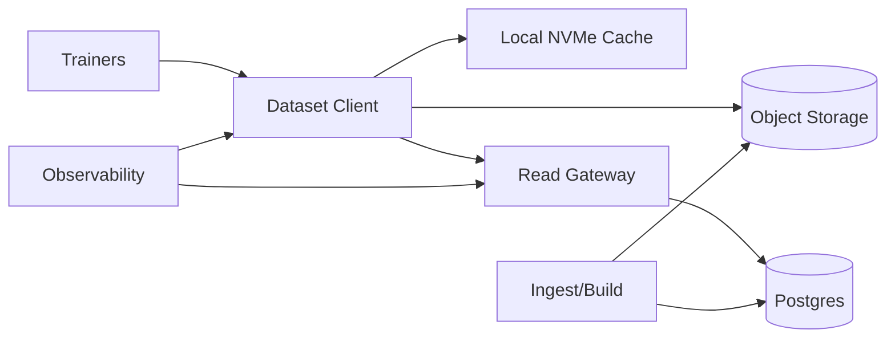

## Overview

This is a **read-optimized dataset store** for distributed training. Datasets are **immutable snapshots**. Bytes live in **large, content-addressed shards** (objects). A **client library** does the “filesystem” work: it resolves a snapshot manifest once, then performs **range reads + prefetch + local NVMe caching** so training mostly reads locally after the first epoch.

The hot path is intentionally boring: **Range GET big objects**, **cache aggressively**, and keep metadata lookups rare and cacheable.

## What Makes This Hard

1. **Tail latency amplification.** Fan-out reads turn “one slow read” into “a stalled step.”
2. **The small-file trap.** Millions of tiny files melt metadata and random IO.
3. **Synchronized hotspots.** Epoch boundaries and retries create herds unless concurrency is bounded and predictable.

## Requirements

### Functional Requirements
- **Immutable dataset snapshots** with strong reproducibility.
- **High-throughput parallel reads** across many workers.
- **Efficient sample access** without per-sample RPCs.
- **Fast job startup** without long warmups.
- **Multi-tenant isolation** so one job can’t collapse everyone’s tail latency.

### Scale Targets
- **Dataset size:** 1 PB stored, 10k snapshots retained (dedupe across snapshots).
- **Concurrency:** 20k training workers.
- **Throughput:** 2 TB/s aggregate read.
- **Latency:** p99.9 range-read < 50 ms for 4–16 MB reads (best-effort; mitigated primarily via cache/prefetch).
- **Metadata QPS:** < 1 metadata RPC per 1 GB read per worker.

## Key Design Decisions

- **Immutable snapshots + content addressing**
  - Makes caching and dedupe safe without rename/lock semantics.

- **Shards + per-shard index**
  - The unit of IO matches SSD/NIC economics; indices translate `sample -> (object, offset, length)` locally.

- **Client-first performance**
  - Prefetch + adaptive concurrency + local NVMe cache handle the synchronized training loop without extra backend hops.

- **Managed object storage for bytes**
  - Range GET on large objects is the primitive; durability/replication are delegated.

- **Postgres for metadata**
  - Snapshots, manifests, and shard indices are stored and served with simple, queryable semantics.

## Architecture

### Components

- **Dataset Client**
  - Justification: only place with training-loop context to prefetch, bound retries, and translate samples locally.
  - Responsibilities: manifest fetch/cache, per-worker read plan, prefetch window, decompression, adaptive concurrency, explicit backpressure handling.

- **Local NVMe Cache**
  - Justification: converts repeated epochs into mostly-local reads and dampens tail spikes.
  - Behavior: read-through cache keyed by `(object_hash, range)` with checksum verification; per-job quota and bounded prefetch to avoid thrash.

- **Read Gateway**
  - Justification: single enforcement point for multi-tenant fairness and rollout safety, without sitting on the data path.
  - Responsibilities: auth, per-tenant/job token buckets, manifest delivery, config/kill-switch delivery, issuing **time-limited signed URLs** for direct object-store Range GET.

- **Postgres**
  - Justification: reproducibility depends on correct manifests; Postgres is simple to operate and easy to query for catalogs/lineage.
  - Stores: snapshot rows, manifest blobs (versioned), shard/object metadata, optional compacted indices.

- **Object Storage**
  - Justification: durable, operationally minimal storage for immutable shards with Range GET.
  - Stores: content-addressed shard objects and (optionally) prebuilt per-shard index blobs.

- **Ingest/Build**
  - Justification: moves validation/indexing off the read path so reads stay predictable.
  - Responsibilities: pack shards (512 MB–2 GB), compute hashes, write objects, generate per-shard indices + snapshot manifests, validate checksums/schema once.

- **Observability**
  - Justification: without tail/skew visibility you’ll “meet throughput” while stalling steps.
  - Tracks: p99.9 range-read latency (client-side), cache hit ratio, per-tenant throttling, object-store error/timeout rate, startup time.

## Trade-offs

| Optimized For | Sacrificed |
|--------------|------------|
| Operational simplicity (managed bytes + Postgres) | Fine-grained control over replica choice and p99.9 tuning knobs |
| High read throughput via large objects + cache | POSIX semantics and mutable writes |
| Reproducible snapshots | “Latest” view semantics |
| Isolation via gateway budgets | Some upfront integration work (client + gateway contract) |
| Low metadata load | Per-file ergonomics (millions of paths) |

## Failure Modes

- **Gateway is slow (not down)**
  - What happens: job starts and URL refreshes slow; steady-state reads continue using cached manifests and valid signed URLs.
  - Detect: elevated gateway latency and increased client “URL refresh” time.
  - Recover: hard gateway queue limits + fail-fast responses; clients back off and continue reading with existing URLs until expiry.

- **Clients can reach gateway but not object storage**
  - What happens: reads fail quickly; prefetch stops; training stalls explicitly instead of retry-storming.
  - Detect: spike in object-store connection/timeouts across many clients.
  - Recover: bounded retry budget per step; exponential backoff with jitter; surface a clear “storage unreachable” error for the job controller.

- **Bad client release enables overly aggressive hedging/retries**
  - What happens: bandwidth explosion and request amplification.
  - Detect: sudden jump in per-sample bytes read, request rate, and throttling.
  - Recover: gateway-enforced caps in signed-URL policy (max concurrent in-flight bytes/requests per job) + kill switch/config pinning served by gateway; clients treat throttling/fail-fast codes as “reduce concurrency,” not “retry harder.”

- **Postgres unavailable during mass job restart**
  - What happens: new jobs can’t resolve manifests; running jobs continue (cached manifests and direct reads).
  - Detect: manifest fetch errors and increased job start failures.
  - Recover: ship the snapshot manifest as a versioned bootstrap artifact with the training job; gateway accepts it if hash matches the catalog entry.

- **Local NVMe cache issues (disk full, corruption, noisy IO)**
  - What happens: cache hit rate collapses; tail latency increases; worst case falls back to object storage reads.
  - Detect: cache error rate, eviction churn, IO wait, and hit-rate drop.
  - Recover: strict per-job quota, size-based eviction, and “cache-disable” mode when thrashing is detected (reduce prefetch, keep reads sequential and bounded).

## What We Removed

- **Custom storage nodes and shard placement logic**
  - Replaced by object storage Range GET on immutable objects.

- **Dedicated strongly-consistent KV (e.g., etcd)**
  - Replaced by Postgres for manifests/catalog and simple transactional updates.

- **Gateway on the data path and gateway-driven hedged reads**
  - Data reads go directly to object storage; gateway only authenticates, rate-limits, serves manifests/config, and issues signed URLs.

- **Burst replication/pinning automation**
  - Replaced by client-side adaptive concurrency + cache/prefetch; hotspot handling is primarily “don’t amplify load.”

- **Bespoke dataset format**
  - Shards are standard container formats (e.g., WebDataset/TFRecord/Parquet) plus a versioned manifest and per-shard index.

## Operational Notes

- The three dashboards: **client p99.9 range-read**, **cache hit ratio per job**, **gateway throttles/fail-fast rate per tenant**.
- The only safe retry behavior: **bounded per-step budget** + jittered backoff; throttling signals must reduce concurrency immediately.
- Keep manifests small, versioned, and integrity-checked; clients should treat manifests as immutable once fetched.
- Make rollout safety a first-class gateway feature: config pinning, staged enablement flags, and an emergency kill switch for retry/prefetch aggressiveness.
