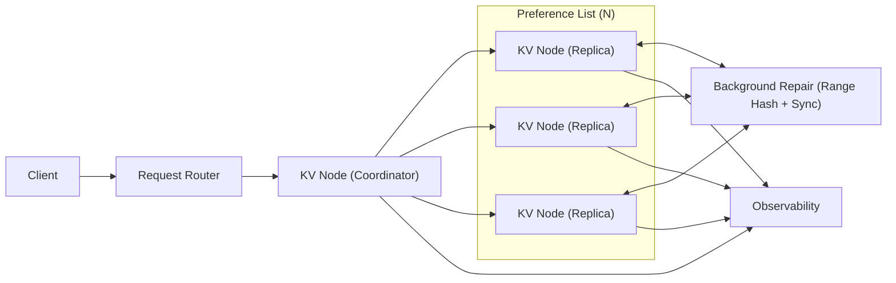

## Overview

A simple Dynamo-style key-value store inside one region: keys are sharded by consistent hashing, each key is stored on `N` replicas, and each request chooses `R`/`W` to trade latency vs consistency.

Each node runs the same binary and can act as coordinator for a request. Correctness comes from quorum intersection when you choose it (`R+W>N`) plus always-running background repair to converge replicas after failures and timeouts. Conflict semantics are intentionally simple: **Last-Write-Wins using Hybrid Logical Clocks (HLC)**.

## What We Removed

- **Vector clocks + siblings**: only LWW/HLC remains.
- **Sloppy quorum + hinted handoff**: writes go only to the preference list; if quorum can’t be met, the write fails.
- **Gossip membership (SWIM)**: the ring is driven by a versioned static node list (config epoch), not emergent membership.
- **Merkle trees per partition**: repair uses coarse range hashes + targeted sync instead of per-partition Merkle maintenance.
- **“Smart” SDK behavior**: the API supports idempotency and conditional writes directly; SDKs are optional thin wrappers.

## Requirements

### Functional Requirements
- `GET(key)`, `PUT(key, value)`, `DELETE(key)` with per-request consistency presets (`ONE`, `QUORUM`, `ALL`) mapping to `R/W`.
- Versioning and conflict resolution:
  - **LWW/HLC only**: each write carries an HLC timestamp and deterministic tie-breaker.
  - Optional conditional writes: `PUT`/`DELETE` can include `if_version` (or `if_not_exists`) to avoid lost updates.
- Read repair on quorum reads (best-effort, background).
- Background repair that continuously converges replicas.
- Multi-tenant safety: per-namespace limits (value size, request rate, max tombstone age).

### Scale Targets
- **Cluster size**: 50–200 nodes.
- **Data**: 50 TB logical, ~150 TB physical at `N=3`.
- **Throughput**: 100k writes/s, 300k reads/s sustained.
- **Latency**: p99 `GET` < 20 ms, p99 `PUT` < 30 ms within a region.

## Key Design Decisions

- **Quorum replication (`N`, `R`, `W`) with any-node coordination**
  - Any node can coordinate; the coordinator sends parallel RPCs to the preference list and waits for `R`/`W`.
  - Defaults: `N=3`, `W=2`, `R=2` for most namespaces.

- **Static ring with an explicit config epoch**
  - Nodes load a shared ring config (node list + tokens) with an `epoch`.
  - A node only coordinates if its local `epoch` matches the peers it is contacting; otherwise it fails fast with a clear “ring epoch mismatch” error.

- **LWW with HLC (plus deterministic tie-break)**
  - Each write is stamped with HLC and `coordinator_id` as tie-breaker.
  - Clients that need safety from overwrites use conditional writes (`if_version`).

- **Repair by coarse range hashes**
  - Periodically compute hashes for fixed key ranges (or SSTable/segment ranges), compare between replicas, and sync mismatched ranges.

## Architecture

### Components

- **Request Router**
  - Justification: routes to any healthy node; keeps clients simple and avoids “token-aware routing” complexity.

- **KV Node (Coordinator + Replica in one process)**
  - Justification: one deployable unit; any node can coordinate to avoid a leader dependency.
  - Responsibilities:
    - Compute preference list from ring config.
    - Execute quorum logic with timeouts.
    - Apply backpressure: treat overloaded replicas as non-ackable and return explicit overload errors when quorum can’t be met.

- **Local Storage (RocksDB)**
  - Justification: proven durability and performance; keeps novelty in the distributed layer.
  - Stores: value, HLC version, optional `last_request_id` for idempotent retries per key, tombstone marker.

- **Background Repair (Range Hash + Sync)**
  - Justification: convergence mechanism that keeps eventual consistency honest.
  - Behavior: compare coarse hashes across replicas; sync only mismatched ranges; rate-limited to protect tail latency.

- **Observability**
  - Justification: the system’s failure mode is backlog and overload; operators need visibility.
  - Minimum signals: quorum failure rate, replica latency, overload rate, repair lag, tombstone count/age, compaction pressure.

## Trade-offs

| Optimized For | Sacrificed |
|--------------|------------|
| Buildability and operability by a small team | Lower availability during multi-replica loss (no sloppy quorum) |
| Clear semantics (LWW/HLC + optional conditional writes) | No sibling returns or causal tracking |
| Predictable runtime behavior (static ring epoch) | Less “hands-off” membership; changes are operational events |
| Simple repair implementation | More bandwidth/CPU than fine-grained Merkle repair |

## Failure Modes

- **Ring epoch mismatch (split config / partial rollout)**
  - What happens: nodes disagree on token ownership.
  - Detect: elevated “epoch mismatch” errors.
  - Recover: complete rollout or roll back; writes fail fast rather than silently landing on the wrong replica set.

- **Coordinator crashes after quorum but before responding (client retries)**
  - What happens: client may retry a committed write.
  - Detect: increased duplicate `request_id` rate (if used) and retry metrics.
  - Recover: clients send `request_id`; replicas store per-key `last_request_id` + result metadata and return the same outcome for duplicates.

- **Replica overload (compaction stalls / disk pressure)**
  - What happens: tail latency spikes and quorum becomes hard to meet.
  - Detect: compaction pressure + overload responses + rising quorum timeouts.
  - Recover: coordinators stop counting overloaded replicas toward `R/W`; return `503 overloaded` when quorum isn’t achievable; operators reduce write load or add capacity.

- **Delete resurrection (tombstone retention too short)**
  - What happens: an old value reappears via repair or late replica.
  - Detect: resurrection counter during repair.
  - Recover: tombstones replicate like values; keep tombstones for `T_gc` comfortably above worst-case repair lag and outage windows.

- **Hot keys**
  - What happens: a single key saturates its replica set.
  - Detect: per-key rate and latency outliers.
  - Recover: per-key rate limits; optional client-side key salting for namespaces that need it; coordinator-side request coalescing for hot reads.

## What I'd Do Differently At...

- **10x scale:**
  - Add zone-aware placement in the ring config and tighten admission control tied to compaction pressure.

- **100x scale:**
  - Add token-aware routing (clients/routers pick a coordinator in the preference list) and move to more incremental repair metadata.

## Operational Notes

- Keep defaults boring: `N=3`, `R=2`, `W=2` for most data; use `ONE` only for explicitly stale-tolerant namespaces.
- Treat overload as a first-class response: fast failure beats slow global meltdown.
- Repair must be always-on and rate-limited; repair lag is the primary “eventual consistency health” metric.
- Set `T_gc` from measured repair lag, not hope; lowering it is a correctness change, not an ops tweak.
