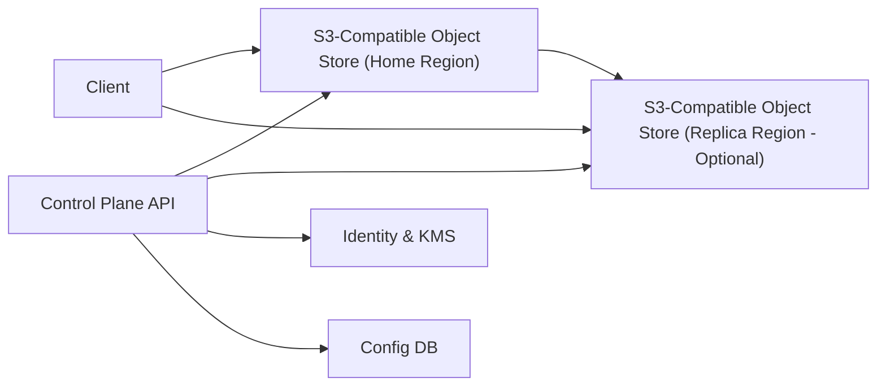

## Overview

This system is a **multi-tenant S3-compatible object storage offering** built by standing on an existing S3 implementation (cloud S3 or a production-grade S3-compatible cluster) and adding only a small **control plane** for tenant isolation, policy, quotas, and safe configuration.

The data path stays boring: clients speak S3 directly (SigV4), and durability/versioning/lifecycle/replication are enforced by the underlying object store. The only custom logic is provisioning and guardrails.

## What Makes This Hard

The hard part is not storing bytes; it’s **multi-tenant correctness and safety**:
- Preventing cross-tenant access (auth, policies, encryption keys).
- Making quotas and lifecycle changes safe to operate.
- Defining clear consistency and replication-lag semantics.

## Requirements

### Functional Requirements
- S3-compatible API surface: `PUT/GET/HEAD`, multipart upload, range reads, conditional requests, presigned URLs, bucket policies.
- Versioning: immutable versions, delete markers.
- Lifecycle: time/tag-based transitions and expirations.
- Cross-region replication: one-way replication policy per bucket, preserving version IDs and delete markers.
- Multi-tenancy: per-tenant isolation for auth, quotas, encryption keys, and noisy-neighbor control.

### Scale Targets
- Tenants: 10k, buckets: 200k, objects: 50B, stored data: 5 PB/region.
- Traffic: 30k req/s sustained, 200k req/s peak (LIST-heavy spikes and PUT bursts matter).
- Durability: provided by the underlying object store; replicated buckets have bounded replication lag.

## Key Design Decisions

- **Decision 1: Keep the data path out of our system**
  - Chose: clients use the object store’s S3 endpoint directly; our control plane issues credentials/presigned URLs and configures buckets.
  - Why: removes custom ingest, chunking, commit protocols, and most failure modes.

- **Decision 2: Isolation is “bucket-per-tenant” + “key-per-tenant”**
  - Chose: each tenant owns dedicated buckets and a dedicated KMS key (or key alias namespace) enforced by bucket policy.
  - Why: simplest boundary for auth, encryption, quotas, and incident containment.

- **Decision 3: Single-writer home region per bucket**
  - Chose: writes go to a home-region bucket; optional read-only replica bucket(s) via built-in replication.
  - Why: predictable semantics and disaster recovery without inventing distributed consistency.

## Architecture

### Components

- **S3-Compatible Object Store (Home Region)**: Stores objects and metadata; enforces versioning, lifecycle, multipart, and durability.  
  Why it stays: it is the storage system.

- **S3-Compatible Object Store (Replica Region - Optional)**: Read-only replica buckets populated by built-in replication.  
  Why it stays: cross-region availability without custom replicators.

- **Control Plane API**: Provisions tenants/buckets, applies bucket policies, configures versioning/lifecycle/replication, issues scoped credentials/presigned URLs, and enforces quota decisions.  
  Why it stays: this is the only custom product surface.

- **Identity & KMS**: Managed identity (IAM/OIDC) and managed key management (KMS) used by bucket policies and encryption-at-rest.  
  Why it stays: tenant isolation and encryption are requirements.

- **Config DB**: Stores tenant state (tenants, buckets, home region, policies, quota settings, lifecycle/replication intents, audit trail).  
  Why it stays: durable source of truth for provisioning and guardrails.

## Deep Dive: Atomic Versioning + Lifecycle + Replication

All object correctness is delegated to the object store’s existing semantics:

- **Versioning**: enabled per bucket; deletes create delete markers; previous versions remain addressable by version ID.
- **Lifecycle**: rules are configured on the bucket; transitions/expirations are applied by the object store against versioned objects.
- **Replication**: configured as bucket replication from home to replica; version IDs and delete markers replicate in order per the object store’s guarantees.

The control plane’s job is to apply configurations safely:
- Changes are validated (scope, prefixes, tags, storage class targets).
- Changes are staged (create rule disabled → enable after preview window).
- Every change is recorded in the config DB with actor attribution and rollback instructions.

## Trade-offs

| Optimized For | Sacrificed |
|--------------|------------|
| Small-team operability | Custom data plane innovations (content-addressing, bespoke metadata model) |
| Fewer failure modes | Fine-grained control over replication ordering and repair behavior |
| Strong isolation boundaries | Cross-tenant dedupe and “global chunk store” cost optimizations |
| Fast time-to-production | Custom EC profile control and bespoke durability math |

## Failure Modes

- **Config DB down for 5 minutes**
  - What happens: provisioning, policy changes, and new presigned URL issuance pause.
  - Behavior: existing S3 credentials/presigned URLs keep working until expiry; direct S3 access remains available.
  - Recover: restore DB; control plane resumes; no data recovery needed.

- **Replication lag or replica region outage**
  - What happens: replica buckets fall behind; RPO increases to “replication lag”.
  - Detect: replication metrics and last-replicated timestamps per bucket.
  - Recover: replication resumes automatically; failover is explicit and can be read-only until caught up.

- **Quota drift (usage accounting not perfectly current)**
  - What happens: tenants can temporarily exceed a configured quota.
  - Detect: periodic reconciliation against object store inventory/metrics.
  - Recover: enforce on the next credential/presign issuance; optionally freeze writes by tightening bucket policy.

- **Bad lifecycle rule deletes/archives too aggressively**
  - What happens: objects transition/expire per the rule; versioning limits blast radius but does not make deletion free.
  - Detect: rule-change audit + sudden delete/transition volume.
  - Recover: disable the rule immediately; restore by removing delete markers where versions exist; rely on object lock/legal hold if hard protection is required.

- **10x LIST-heavy spike**
  - What happens: higher request cost and latency from the object store.
  - Detect: elevated LIST rates and 4xx/5xx from the object store.
  - Recover: throttle via credentials/presign issuance and client guidance; rely on provider scaling rather than custom indexing.

## What I'd Do Differently At...

- **10x scale:** move quota enforcement to “policy-first” (hard bucket-policy gates where possible), and make reconciliation more frequent per high-risk tenants/buckets.
- **100x scale:** separate “tenant control plane” from “billing/analytics” entirely so operational safety actions never compete with reporting.

## What We Removed

- Per-bucket ordered change log and custom consumers.
- Custom ingest router, chunking, and commit protocol.
- Custom EC storage nodes, repair, scrubbing, and GC pipelines.
- Custom CRR replicator and backfill logic.
- Content-addressed chunk store and cross-tenant dedupe model.
