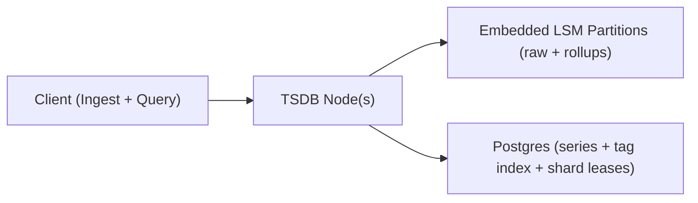

## Overview

This system is a distributed time-series database for append-mostly telemetry. Data is stored in immutable, time-partitioned storage so retention is deleting whole partitions, and rollups are a bounded rewrite of already time-ordered data.

Tags never live on each point. Points reference a `series_id`; tags are resolved once (series dictionary + inverted index) and reused for ingest and query planning.

## What We Removed

- `Router` → merged into each `TSDB Node` (any node can accept requests and forward to the right shard).
- `Segment Store` + custom `Compactor` → replaced by an embedded LSM (RocksDB/Pebble) per shard+time partition; compaction is delegated to the embedded engine.
- `Rollup Builder` + `Rollup Store` → merged into the same embedded LSM with separate keyspaces for raw/rollups and a background rollup worker.
- Custom tag-index persistence layer → replaced by Postgres tables for series dictionary + tag inverted index (plus shard leases).

## Requirements

### Functional Requirements
- Ingest time-series points with tags/labels, timestamp, and numeric fields.
- Query by time range + tag filters; support common aggregates (sum/avg/min/max/p95) and group-by tag(s).
- Continuous downsampling into fixed windows (e.g., 1m, 1h) with multiple retention tiers (e.g., 7d raw, 90d 1m, 2y 1h).
- Exactly-once is not required; idempotent ingest and bounded duplication is acceptable.
- Backfill support (late/out-of-order points) within a bounded window.

### Scale Targets
- Ingest: 1,000,000 points/sec sustained, 3,000,000 points/sec burst.
- Cardinality: 50,000,000 active series with daily churn.
- Queries: P95 < 2s for “last 6h, filter by 2 tags, group-by 1 tag”; P95 < 5s for “last 7d rollup”.

## Key Design Decisions

- Time is a hard boundary: data is written into per-shard, fixed time partitions (e.g., 2h directories) so retention is deleting directories, not row deletes.
- Embedded LSM for raw + rollups: each partition is an embedded DB (or column families) with keys ordered by `(series_id, timestamp)` for sequential ingest and range scans.
- Postgres for metadata + coordination: Postgres stores `series_key → series_id`, `tag → series_id` mappings, and shard leases for safe ownership and rebalancing.
- Clear durability semantics: writes are acknowledged after local WAL fsync on the shard leader; replication to a follower is async (bounded loss window on leader failure, bounded duplicates on retry).

## Architecture

### Components

- `TSDB Node`
  - Why it exists: single deployable unit that handles ingest, query planning/execution, shard routing, background rollups, and replication.
  - What it does:
    - Ingest: normalize tags, enforce tenant limits, resolve/allocate `series_id`, forward to shard leader, append to WAL, write to embedded LSM.
    - Query: resolve tags → `series_id` set, enforce fanout limits, scan relevant time partitions, merge + aggregate.
    - Rollups: incremental fixed-window aggregates written to rollup keyspaces; rollups are versioned by `rollup_generation_id`.
    - Replication: shard leader streams WAL entries to a follower for fast failover.

- `Postgres (Metadata + Coordination)`
  - Why it exists: the simplest correct persistence for series/tag mappings and shard ownership without building a custom metadata store.
  - What it stores:
    - Series dictionary: `(tenant_id, series_key) → series_id`.
    - Tag inverted index: `(tenant_id, tag_key, tag_value) → series_id` (plus maintenance for churn/TTL).
    - Shard leases: shard → (leader, follower, lease_expiry) for failover/rebalance.

## Trade-offs

| Optimized For | Sacrificed |
|--------------|------------|
| Small-team buildability | Less low-level IO control than a custom segment store/compactor |
| Predictable retention (drop partitions) | More partitions to manage (files/handles) |
| Fast ingest + range scans | Postgres becomes a critical dependency for tag-based queries |
| Availability during network issues | Possible bounded loss window on leader crash (async replication) |
| Stable p95 queries (precomputed rollups) | Extra storage for rollups; rebuild limited to raw retention |

## Failure Modes

- Storage node dies mid-ingest
  - Behavior: shard leases promote the follower to leader after lease expiry; clients retry and may create bounded duplicates; data not yet replicated from the old leader can be lost.
  - Recover: reassign a new follower, resync from the new leader, and continue; enforce per-tenant backpressure during rebalancing.

- Postgres down for 5 minutes (metadata/index path)
  - Behavior: ingest continues only for already-known series via local cache; new series creation is rejected; tag-filter queries fail closed (no partial scans).
  - Recover: when Postgres returns, refresh caches and resume new-series writes; alert on cache-miss rejection rate.

- Network partition between nodes (leader ↔ follower or client ↔ cluster)
  - Behavior: leader keeps accepting locally (ack after local WAL fsync); replication lag grows; failover is prevented by leases (no split-brain ownership).
  - Recover: once partition heals, follower catches up from WAL stream; if leader is lost, accept bounded loss window.

- Embedded LSM compaction falls behind during burst
  - Behavior: partitions accumulate files and disk usage rises; read amplification increases.
  - Recover: admission control tied to disk watermark + compaction lag (throttle/reject per tenant), pause rollups first, then reduce ingest until compaction stabilizes.

- Bad rollup code/config deployed
  - Behavior: rollups are isolated by `rollup_generation_id`; queries read only the current generation.
  - Recover: bump generation, rebuild rollups from raw partitions within raw retention, then switch generation atomically.

## Operational Notes

- Treat disk watermark + compaction lag as paging signals; everything else is secondary.
- Enforce fanout limits: cap matched series IDs and group-by cardinality; return a clear error when exceeded.
- Keep rollups boring: deterministic window keys + generation gating; rebuild is delete-and-recompute within raw retention.
- Degraded mode is explicit: “known series only” ingest when Postgres is unavailable; no tag-filter query fallbacks that silently scan.
