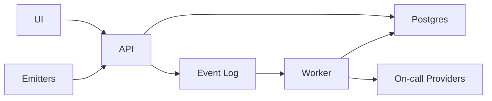

## Overview

This system turns a noisy stream of alert events into a small, stable set of *incidents* that reliably reach the right humans (or automation) with minimal interruption. Alerts are immutable inputs; incidents are the derived work items. Correctness comes from doing all incident transitions and notification intent creation transactionally, then delivering notifications asynchronously and idempotently.

## What Makes This Hard

Retries, duplicates, and rate limits are normal—especially during outages. If “we decided to page” and “a page was sent” aren’t tied together with idempotency and a durable handoff, you will either miss pages or spam humans.

## Requirements

### Functional Requirements
- Convert incoming alert events into **incidents** with a clear lifecycle: `open → acknowledged → resolved` (with re-open rules).
- **Deduplication** across sources and retries using stable fingerprints; group related alerts into one incident when it reduces toil.
- **Silences** with precise scoping (by labels, time window, creator, reason) and auditable effect (“what did this silence suppress?”).
- **Escalation policies**: schedules, timeouts, multi-step targets, and handoffs; acknowledgement stops escalation.
- **SLO-based alerting**: route multi-window burn-rate alerts (fast + slow) based on error budget consumption, not raw error rate.
- **Auditability**: every incident state change is attributable (who/what/when/why).
- Multi-tenant isolation: no cross-tenant routing, silencing, or data leakage.

### Scale Targets
- Ingest: **200k alert events/min peak** (large fleets + retries during outages); sustained **30k/min**.
- Active incidents: **10k concurrent** across tenants; active alerts (raw) can be **100k+**.
- Rules: **20k routing rules**, **100k silences** (most long-lived: maintenance patterns), **5k escalation policies**.
- Notifications: **10k sends/min peak**, with provider rate-limits and bursty fanout.
Why these matter: the system must remain stable *during* outages when event rates and retries spike, and correctness must not depend on “normal” conditions.

## Key Design Decisions

- **Kafka for ingest buffering + replay**
  - Chose: `AlertEvent` is append-only in Kafka; the system blocks ingest if Kafka is unavailable.
  - Why: it absorbs spikes and provides the one replay boundary for correctness during outages.

- **One Postgres for config + incidents + audit + outbox**
  - Chose: one Postgres cluster (separate schemas, separate pools).
  - Why: fewer moving parts; correctness relies on transactions and constraints, not cross-service choreography.

- **Transactional outbox for notifications**
  - Chose: incident transitions insert `NotificationIntent` rows in the same transaction.
  - Why: you never get “incident committed but page lost”.

- **Ordering and fencing via `incident_version`**
  - Chose: every incident state transition increments `incident_version`; notification intents reference `(incident_id, incident_version, escalation_step)`.
  - Why: retries and duplicates become no-ops; split-brain turns into constraint violations instead of double pages.

- **Config is versioned**
  - Chose: every config change writes a new version; an `active_version` pointer flips only after validation.
  - Why: bad deploys roll back instantly without rewriting incidents.

## Architecture

### Components

- `API`: ingestion + control plane (auth, tenancy, config, ack/resolve, “why/why not” queries). For ingest it validates and writes `AlertEvent`s to Kafka; it does not update incidents.
- `Event Log` (Kafka): buffering + replay boundary; protects Postgres and the worker during event storms.
- `Worker`: consumes `AlertEvent`s to update incident state and drains `NotificationIntent`s to providers with retries/backoff.
- `Postgres`: source of truth for config, incident state (`incident_version`), audit (`IncidentEvent`), and the notification outbox (`NotificationIntent`).
- `On-call Providers`: delivery and scheduling targets; treated as unreliable and rate-limited.

## Deep Dive: Dedup + Grouping Without Missing Pages

**1) Identity: separate “alert fingerprint” from “incident key”.**  
`AlertFingerprint = hash(tenant, rule_id, sorted(labels_subset))` is stable across retries. `IncidentKey = hash(tenant, routing_target, incident_grouping_labels, severity)` is the human work item. Many fingerprints can map to one incident key by policy.

**2) Time semantics: explicit windows, server time only.**  
Dedup and reopen windows are policy knobs. The system uses server-received timestamps for evaluation; producer timestamps are metadata.

**3) One transaction owns an incident transition.**  
The worker takes a transaction-scoped advisory lock on `IncidentKey`, locks the incident row `FOR UPDATE`, applies silences/routing/escalation rules, increments `incident_version`, and appends an `IncidentEvent` row.

**4) Notifications are intents first, sends second.**  
If a transition should page, the same transaction inserts `NotificationIntent` rows. A unique `notification_id = hash(incident_id, incident_version, escalation_step, provider, channel)` suppresses duplicates. The worker later delivers intents to providers and records attempts/status.

**5) Silences match projected incident state.**  
Silences evaluate against incident labels + routing target and suppress only paging transitions, making “what did this silence suppress?” a simple query over `NotificationIntent` + `IncidentEvent`.

## Trade-offs

| Optimized For | Sacrificed |
|--------------|------------|
| No missed pages under partial failure | Slightly higher latency (log + worker + outbox) |
| Small-team operability (2 binaries + 2 stores) | Postgres becomes a hard dependency for processing |
| Few, stable incidents humans can act on | Less “real-time” raw alert streaming |
| Auditability (“why/why not”) | More writes (events + intents) |

## Failure Modes

- **Postgres down (incident store unavailable)**
  - What happens: API continues accepting events into Kafka; worker stops processing and stops sending (no committed transition, no page).
  - Detect: worker errors, growing Kafka lag, increasing age of pending intents.
  - Recover: restore Postgres; worker drains backlog; notification delivery resumes from the outbox.

- **Kafka degraded/unavailable**
  - What happens: API rejects ingest with 503/429 and explicit retry guidance; nothing is buffered locally.
  - Detect: publish failures; drop in accepted events.
  - Recover: restore Kafka; clients retry; processing resumes.

- **Network partition: worker can write Postgres but can’t reach providers**
  - What happens: intents accumulate; delivery retries with jitter and respects provider limits.
  - Detect: intent backlog age, provider 429/5xx, “pages delayed” metric.
  - Recover: connectivity returns; delivery resumes without re-triggering incident transitions.

- **Bad config deploy**
  - What happens: active config flips only after validation; worker falls back to last-known-good if needed.
  - Detect: config validation failures; elevated “config fallback” counter.
  - Recover: flip `active_version` back; no incident rewrites required.

- **Duplicated / out-of-order events**
  - What happens: duplicates become no-ops; state is fenced by `incident_version` and dedup windows.
  - Detect: elevated duplicate counters; stable notification rate.
  - Recover: none required.

## What We Removed

- Separate `Config DB` and `Incident DB` (single Postgres cluster instead).
- Separate `Notifier` service (folded into the worker; notifications come from the outbox).
- A standalone `IncidentEvent` stream/log (audit lives in Postgres; Kafka is only for `AlertEvent`s).
- Template-driven idempotency (`template_version` removed from `notification_id`).
- External lease stores (no Redis; advisory locks + `incident_version` fencing).

## Operational Notes

- Fingerprint stability is a production feature: changing label subsets is a breaking change that can re-key incidents; version the fingerprint function.
- Provider rate limits are normal during outages; treat 429/5xx as first-class signals and track “pages delayed”.
- Multi-tenant isolation is enforced in keys, queries, and config ownership (tenant is part of every identity hash).
- The “why/why not” story comes from `IncidentEvent` + `NotificationIntent`: matched route, matched silence, suppressed intent, provider failures, and retries.
