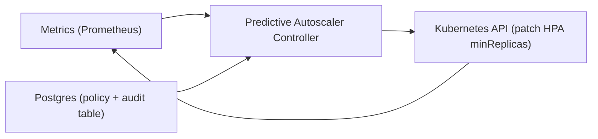

## Overview

This is a predictive autoscaler that raises baseline capacity *before* demand hits, while Kubernetes HPA remains the safety net for surprises. Every decision is: forecast near-future demand, translate demand into replicas using a learned “safe throughput per replica,” then add a safety margin with an explicit coverage target. When inputs degrade, it stops writing and HPA runs alone.

The system is intentionally small: one controller process, existing metrics, and one database table for policy + audit.

## What Makes This Hard

Forecasting isn’t the hard part; safe actuation is. Forecast error becomes an outage unless it’s translated into a measurable safety policy with guardrails and reliable fallbacks.

The other failure mode is feedback: scaling changes utilization and can corrupt learning. This design learns only from “healthy” windows and uses demand-per-replica (not CPU%) as the primary mapping, so incidents don’t rewrite capacity assumptions.

## Requirements

### Functional Requirements

- Produce per-workload capacity floors for a fixed horizon (e.g., 5–30 minutes ahead) and apply them continuously.
- Encode safety explicitly: “scale to P95 demand with 99% coverage over the last 14 days” (or equivalent).
- Support per-workload overrides and guardrails (max step, max spend, minimum headroom, freeze conditions).
- Provide explainability: every applied change is attributable to inputs, forecast, margin, and constraints.
- Fail safe: on bad data, degraded coverage, or dependency outages, stop predictive writes and rely on HPA.

### Scale Targets

- **Workloads:** 500 deployments across 10 clusters.
- **Decision cadence:** every 60s; **horizon:** 15 minutes.
- **Signals:** 1-minute aggregates of demand proxy (RPS/queue depth) + saturation (latency, 5xx) + current replicas + data freshness.
- **Action volume:** up to 30k decisions/hour; only a small fraction should change floors due to hysteresis.

## Key Design Decisions

- **Decision 1: Predict demand, not utilization**
  - Forecast a demand proxy and keep saturation as a veto signal.
  - Capacity mapping is “demand per replica in healthy windows,” not “CPU% predicts replicas.”

- **Decision 2: Safety margin via coverage**
  - Maintain a rolling forecast error history per workload and set margin from the error quantile needed to hit target coverage.
  - Coverage is measured online and is the primary health signal for the predictive path.

- **Decision 3: One control authority**
  - The predictive controller only writes `HPA.spec.minReplicas` (the floor).
  - HPA remains the only writer of `replicas` and handles residual variance.
  - Floors decrease slowly (hysteresis + max-down-step) to avoid “floor drops” creating sudden downscales.

## Architecture

**What We Removed:** separate Feature Builder service, separate Forecaster service, separate Policy Engine service, separate Audit Log component, direct ASG/node actuation path, heavyweight model/retraining per decision.

### Components

- **Metrics (Prometheus):** provides 1-minute demand + saturation + freshness signals.
  - Justification: it’s the system’s source of operational truth; the autoscaler only reads what already exists.

- **Postgres (policy + audit table):** stores per-workload constraints, rollout state, and an immutable decision record.
  - Justification: one transactional store for “what is allowed” and “what happened,” without introducing another logging system.

- **Predictive Autoscaler Controller:** one process that does feature extraction, forecasting, margining, mapping demand→replicas, and K8s actuation.
  - Justification: the only custom component; it concentrates safety logic, fallbacks, rate limits, and idempotent writes.

- **Kubernetes HPA:** reactive autoscaling based on existing signals.
  - Justification: proven incident tooling and the default fallback when prediction is unsafe.

## Deep Dive: Uncertainty-Aware Scaling (The Hardest Part)

Each minute, per workload:

1) **Forecast near-future demand.** Use a cheap seasonal baseline (time-of-week buckets) plus short-term residual smoothing to produce a demand quantile for the next 15 minutes.

2) **Map demand to replicas from healthy periods.** Maintain a “safe throughput per replica” estimate computed only from windows where saturation is low (latency under SLO, low 5xx) and the workload is stable. Convert forecast demand to replicas via `ceil(demand / safe_throughput_per_replica)`.

3) **Add margin to hit target coverage.** Track recent forecast errors by time-of-week. Inflate the forecast by the error quantile needed for target coverage (e.g., 99%). Coverage is measured online; if it collapses, predictive writes stop.

Guardrails applied before writing a floor:
- **Hysteresis:** floors only drop after sustained overprovisioning.
- **Max step:** caps per-minute floor changes up and down.
- **Freeze reasons:** stale metrics, missing series, coverage collapse, actuation throttling, or policy violations.
- **Staleness cutoff:** never apply a decision older than the current loop.

## Trade-offs

| Optimized For | Sacrificed |
|--------------|------------|
| Simple, safe operation for a small team | Maximum forecast accuracy |
| Predictive pre-scaling without fighting HPA | Direct control of nodes/ASGs |
| Measurable risk via coverage | Some steady-state efficiency |
| Dependency outages don’t page immediately | Less complete audit during outages |

## Failure Modes

- **Postgres is down**
  - **What happens:** policy reads and audit writes can’t complete.
  - **Detect:** DB health and write failures.
  - **Recover:** controller runs on cached config (TTL) and continues computing decisions; audit writes are best-effort with a bounded in-memory buffer (drop-oldest). If config expires or safety constraints can’t be validated, freeze predictive writes and rely on HPA.

- **Prometheus gaps / query lag**
  - **What happens:** forecasts are wrong or impossible.
  - **Detect:** freshness signal, missing-series rate, sudden drops to zero.
  - **Recover:** for short gaps, reuse last-known-good forecast and widen margin; for sustained gaps, freeze predictive writes and rely on HPA.

- **Kubernetes API throttling / controller restarts**
  - **What happens:** decisions aren’t applied promptly; floors lag.
  - **Detect:** reconcile error rate, rate-limit signals, desired-vs-applied drift.
  - **Recover:** idempotent patches with exponential backoff, per-cluster write rate limits, skip stale decisions, and freeze predictive writes on repeated actuation failure (HPA continues).

- **Bad config / wrong demand proxy**
  - **What happens:** floors push the wrong direction.
  - **Detect:** coverage collapse and saturation rising after floor changes.
  - **Recover:** per-workload safe template (tight max step + high margin) and a global kill switch that stops predictive writes; rollback is simply “stop writing floors” (HPA remains).

- **Change points (new version, requests/limits, perf regression)**
  - **What happens:** “safe throughput per replica” becomes invalid.
  - **Detect:** abrupt shift in achieved demand-per-replica during healthy windows, correlated with rollout.
  - **Recover:** reset mapping on rollout and run shadow-only for a short warmup window before writing floors again.

## What I'd Do Differently At...

- **10x scale:** use Prometheus recording rules to emit curated per-workload signals (demand, saturation, freshness) so the controller does cheap reads; shard controllers by cluster with leader election.
- **100x scale:** keep the same controller shape, but move most computation into recording rules and reduce audit volume (store full payload only on change; keep aggregates for coverage/cost).

## Operational Notes

- Start in **shadow mode**: compute floors and coverage, don’t write.
- Coverage is the primary KPI; cost is tuned only after coverage is stable.
- Maintain a **blocklist** for workloads without a stable demand proxy.
- Every applied change writes one decision row with a stable decision ID, inputs, constraints, and the exact floor written (or a freeze reason when it refuses to write).
