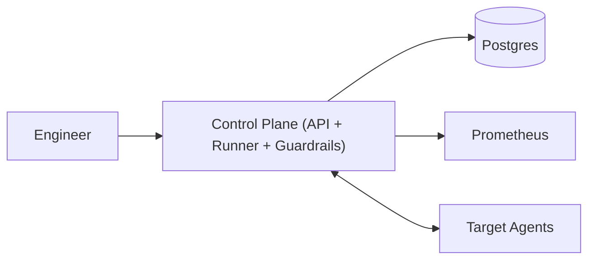

## Overview

This is a controlled chaos engineering platform that runs fault-injection experiments with a small blast radius and a provable stop path under degraded conditions. The core safety property is **lease-based injection**: targets inject only while holding a short-lived, signed lease token. If anything goes wrong (control plane overload/crash, telemetry delays, network partitions), leases expire and injection stops automatically.

The platform stays boring on fault types and spends its complexity budget on guardrails that are conservative and fail-closed.

## What Makes This Hard

“Stop” is not an API call; the dangerous failure mode is **losing the ability to stop** during an incident. Telemetry can be late/missing, the control plane can be unhealthy, and partial faults can stick. Blast radius also means correlated targets (AZ, shard, nodepool, tenant), not just “% of pods”.

## Requirements

### Functional Requirements
- Define experiments with explicit scope and hard caps (count + percentage) plus diversity constraints (AZ/nodepool/shard/tenant labels).
- Progressive ramp in steps with mandatory health checks between steps.
- Guardrails expressed as SLO-style signals with clear windows; **unknown telemetry fails closed**.
- Global kill switch that stops injection within seconds.
- Auditability: who ran what, where, why, approvals, and exact parameters.
- Safe-by-default permissions: teams target only what they own; production requires explicit approval policy.

### Scale Targets
- 50–200 teams; up to 5,000 services across 10–50 clusters.
- 200–1,000 experiments/day; concurrency capped 10–30 per org.
- Stop latency p99 < 10s from guardrail breach to injection cessation.
- Tolerate 30–60s telemetry delay and occasional gaps without unsafe continuation.

## Key Design Decisions

- **Decision 1: Lease-based injection (fail-closed)**
  - Targets inject only while holding a short-lived **signed lease token** (TTL seconds) tied to `experiment_id` and `step_epoch`.
  - The platform persists step/epoch transitions, not per-renewal history.

- **Decision 2: Safety evaluation is a separate loop (inside one deployable)**
  - One control-plane service runs two isolated worker pools: **runner** (ramps/targets) and **guardrail loop** (health decisions), each with independent health checks and circuit breakers.
  - Guardrails control whether leases can be renewed and can request immediate stop via the same agent polling channel.

- **Decision 3: Progressive ramp with mandatory checkpoints**
  - Stepwise rollout with a “settle + observe” phase per step; no step advances during observation.

## Architecture

### Components

- **Control Plane (API + Runner + Guardrails)**
  - Owns experiment lifecycle, policy/RBAC, step ramping, guardrail evaluation, and signing/issuing lease tokens.
  - Earns its place by being the single policy and safety authority while remaining fail-closed via short TTLs.

- **Postgres**
  - Stores experiment specs, approvals, step/epoch state, and append-only audit events.
  - Earns its place by providing durable, transactional state transitions for reconciliation and accountability.

- **Prometheus**
  - Source of health signals via a small, precomputed set of recording rules (tier templates).
  - Earns its place by being the existing metrics system; the platform assumes it can be delayed or partially missing.

- **Target Agents (Kubernetes DaemonSet)**
  - Executes a small set of proven faults and always self-rolls back on lease expiry.
  - Earns its place by being the only place that can guarantee stop/rollback when the control plane can’t reach the target.

## Deep Dive: Guardrails That Actually Halt Safely

The platform halts via two mechanisms that share one simple rule: **no valid lease token, no injection**.

**1) Signed lease tokens (stateless renewals)**
- Token contains: `experiment_id`, `target_id`, `fault_spec_hash`, `step_epoch`, `issued_at`, `expires_at`, and `global_kill_epoch`.
- Agents verify signature locally, check `expires_at`, and enforce a separate **max local injection duration** measured by a monotonic timer (clock-skew safe).
- Renewals are outbound: agents poll the control plane every `poll_interval` seconds; control plane replies with either a fresh token or a stop instruction.

**2) Guardrails control renewals (and can stop immediately)**
- Guardrail loop evaluates on a fixed cadence using recording rules (SLO burn-rate style signals).
- States: **Healthy** (renew), **Degraded** (stop now + deny renewal), **Unknown** (deny after a bounded grace + consecutive unknowns).
- “Unknown” is based on staleness/quorum of required series, not a single scrape miss.

**Stop latency math (explicit)**
- Worst case under partition: injection stops within `lease_ttl`.
- Normal case under breach: stop within `poll_interval` (agent sees “stop” on next poll); `lease_ttl` is a backstop if the poll path fails.
- To meet p99 < 10s: choose `lease_ttl <= 10s` and `poll_interval` in the low seconds.

**Kill switch propagation**
- Kill switch is a single `global_kill_epoch` bump in Postgres.
- Agents fetch the epoch on every poll and refuse any token with a stale epoch; if polling fails, TTL still ends injection.

## Trade-offs

| Optimized For | Sacrificed |
|--------------|------------|
| Fail-closed stop under stress | Continuity during telemetry outages |
| Small-team operability | Fine-grained per-renewal persistence |
| Low component count | Wide fault-type catalog |
| Predictable stop latency | Some false-positive halts (conservative unknown handling) |

What We Removed:
- Per-target lease rows and renewal writes in Postgres (replaced by signed short-lived tokens + persisted step/epoch).
- Separate Guardrail Evaluator service (merged into one deployable with hard isolation).
- Ad-hoc PromQL per experiment (replaced by recording-rule templates per tier).
- Bespoke kill-switch pathway (reduced to a global epoch bump checked on agent polls).
- WORM/object-storage audit pipeline (audit is append-only events in Postgres).

## Failure Modes

- **Postgres down (minutes)**
  - Existing injection still stops via lease TTL.
  - New experiments don’t start; renewals fail closed because the control plane can’t advance/confirm state.

- **Prometheus delayed 60s / partially missing**
  - Guardrails enter Unknown; after bounded grace + consecutive Unknowns, renewals are denied and agents stop.

- **Network partition (control plane can’t reach a cluster)**
  - Agents can’t poll; leases expire and local rollback runs.

- **Bad guardrail config denies renewals globally**
  - Experiments pin a guardrail-template version at start; new versions only apply to new experiments.
  - A breakglass allowlist exists as an explicit, audited override (still bounded by TTL and blast caps).

- **Agent fails to rollback**
  - Agent reports failure; platform blocks new experiments for that target.
  - Operational response is node/pod remediation; safety remains bounded by TTL and the limited fault set.

## Operational Notes

- Treat experiments like deployments: owner, hypothesis, blast caps, and a post-run report from stored events.
- Maintain a small set of tiered guardrail templates; teams pick a tier, not custom thresholds.
- Regularly game-day the platform itself: kill switch, TTL expiry, rollback verification for each supported fault type.
