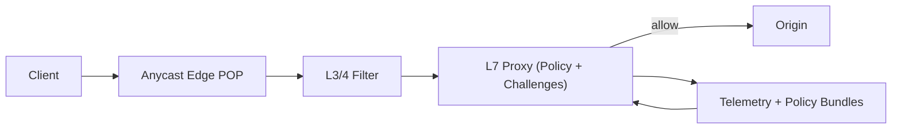

## Overview

This system puts a deterministic, dependency-light mitigation stack at anycast edge POPs. Each request is allowed, rate-limited, challenged (PoW/CAPTCHA), or dropped using only local computation and last-known-good policy. Heavier analysis runs off the hot path and periodically publishes coarse, signed policy bundles back to POPs.

## What Makes This Hard

You must shed attacker traffic immediately, before you can be sure, without turning the mitigation system into the bottleneck. The request path cannot depend on cross-region lookups, database writes, or global consensus during an attack. Challenges must be cheap to validate at the edge, survive anycast/BGP shifts, and avoid creating friction storms.

## Requirements

### Functional Requirements
- Mitigate L3/4 floods, L7 floods, and low-and-slow attacks automatically.
- Apply progressive friction: allow → rate-limit → PoW → CAPTCHA → block, based on risk and system stress.
- Verify challenges statelessly at the edge (no per-request DB/cache dependency).
- Support operator controls: lockdown, allowlists, per-customer policy, and shadow mode rollout.
- Emit compact, explainable decision signals for debugging.

### Scale Targets
- **Peak ingress:** 1 Tbps and/or 50M packets/sec.
- **HTTP load:** 10M requests/sec sustained across POPs, with < 5ms added p95 edge processing.
- **Mitigation reaction time:** < 10 seconds from onset to stable policy behavior at POPs.
- **State tolerance:** POPs continue mitigating with the control plane unavailable for 30 minutes.

## Key Design Decisions

- Anycast POPs with a two-stage datapath: kernel/NIC L3/4 filtering to protect CPU, then an L7 proxy to enforce HTTP/TLS semantics and apply friction.
- Challenge mint/verify is part of the L7 proxy (same process), using signed, short-lived tokens verifiable at any POP.
- The hot path uses cheap, predictable features and local counters; policy distribution is cold-path only via signed bundles with per-POP caching.

## Architecture

### Components

- **Anycast Edge POP**: Absorbs and spreads attacks; continues operating independently with cached policies during control plane outages.
- **L3/4 Filter**: Drops obvious volumetric garbage and protects the L7 CPU/TLS budget (this is where “line rate” work happens).
- **L7 Proxy (Policy + Challenges)**: Terminates TLS/HTTP, normalizes signals, computes risk, applies rate limits, and mints/verifies stateless challenges in-process.
- **Telemetry + Policy Bundles**: Collects sampled decision/counter data and produces signed, coarse policy bundles; never required for per-request decisions.

## Deep Dive: Adaptive Challenges Without Stateful Dependencies

### 1) Identity and scoring that survives bot churn
Identity is tiered; higher-trust signals dominate when present:
- `account/api-key` → `session` → `device attestation` → `prefix (/24 or /56) + TLS/HTTP fingerprint`.

Risk and friction use cheap features:
- Rate/burstiness, error ratio, method/path mix, and per-identity counters.
- Reputation is applied only as coarse policy (e.g., ASN/path/fingerprint buckets), never as per-request remote lookups.

### 2) Stateless challenge tokens that survive POP changes
Challenges are minted and verified at the edge using a globally verifiable keyring:
- Token format includes `kid`, `exp`, `iat_bucket`, `client_id`, and a narrow scope (`host` + `path_class` + `method`).
- `token = HMAC(k_global[kid], fields...)`
- Verification is pure computation; POP mobility works because any POP can verify with `k_global`.
- Keys rotate; POPs accept a small set of active/previous keys and a bounded clock skew window.

Replay is treated as bounded and contained:
- Short TTL + narrow scope + issuance bucket.
- A solved token grants only a limited step-up (e.g., PoW → rate-limit), not an unconditional allow.

### 3) Adaptive difficulty as a stable feedback loop
Difficulty tracks system stress, not “attacker strength”:
- Inputs: per-POP L7 CPU saturation, connection pressure, upstream error rate, and solve rate.
- Controls: move cohorts along the friction ladder and adjust PoW difficulty.
- Stability: hysteresis + max step-change per interval + a safe default profile when signals are noisy.
- Guardrails: authenticated/paid cohorts follow explicit tenant policy; shadow mode applies before enforcement for new rules.

## Trade-offs

| Optimized For | Sacrificed |
|--------------|------------|
| Survivability under attack with minimal dependencies | Fine-grained global consistency across POPs |
| Stateless, POP-agnostic challenge verification | Bounded replay within TTL and some NAT/shared-network friction |
| Simple hot-path logic that holds under load | Full-fidelity per-request explainability without heavy sampling |
| Small-team operability | Slower iteration on “perfect detection” in real time |

## Failure Modes

- **Control plane outage during an attack**
  - *What happens:* POPs can’t fetch new bundles.
  - *Detect:* stale bundle version + fetch error alarms.
  - *Recover:* POPs run last-known-good until its explicit expiry; on expiry they fall back to a pinned “safe lockdown” profile per tenant.

- **Anycast re-route / client hits a different POP mid-challenge**
  - *What happens:* requests shift POPs.
  - *Detect:* normal network behavior; no special detection required.
  - *Recover:* tokens verify at any POP via the global keyring (`kid` + rotated keys), so challenges remain valid across POPs.

- **Replay/sharing of solved challenges within TTL**
  - *What happens:* some bypass sharing occurs.
  - *Detect:* abnormal solve-to-allow ratio in a cohort.
  - *Recover:* keep TTL short, scope tokens narrowly, and cap what a token unlocks (step-up only).

- **Slow-not-dead dependencies (origin latency spike, telemetry backpressure, CPU saturation)**
  - *What happens:* user-visible latency and edge pressure rise.
  - *Detect:* saturation and upstream error signals at POP.
  - *Recover:* shed telemetry first (sampling/counter-only), then disable expensive normalization features, then increase friction; enforce hard circuit breakers (TLS accept cap, early 503 with `Retry-After`) when needed.

- **Bad rollout blocks legitimate traffic at scale**
  - *What happens:* false positives spike.
  - *Detect:* guardrail metrics (auth success, key endpoints’ 2xx) drop while challenge/block rises.
  - *Recover:* shadow mode first, canary by POP/tenant, automatic abort on guardrails, instant revert to pinned known-good bundle.

## What We Removed

- Dedicated **Challenge Service** (challenge mint/verify is inside the L7 proxy).
- Per-request **remote lookups** (no feature store, no cross-region cache/DB dependency in the hot path).
- Fine-grained real-time **ML classification** on the request path (only coarse, stable policy bundles feed POPs).

## Operational Notes

- Maintain an audited “break glass” lockdown profile per tenant (force PoW, block by coarse attributes, exempt known-good authenticated cohorts).
- Roll out policies in shadow mode, then canary by POP/tenant with automatic abort on guardrail metrics.
- Emit compact decision reason codes in edge logs and enable a lightweight debug header only in shadow/canary.
- Treat friction as a capacity lever with hysteresis and bounded step changes to avoid oscillation.
