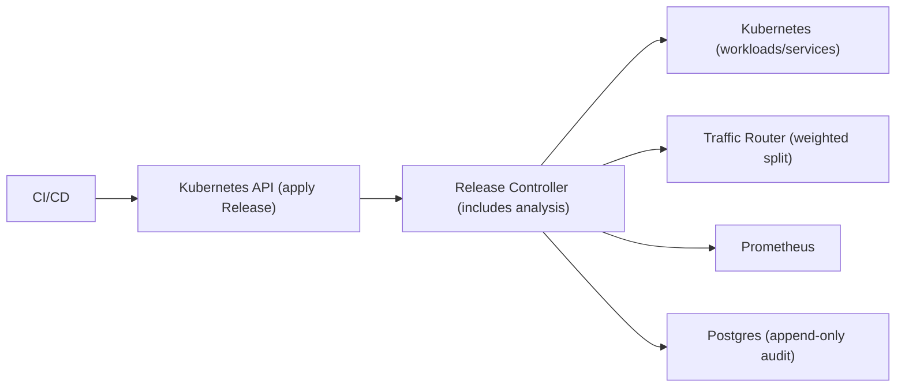

## Overview

This system makes deployments a controlled experiment: shift traffic in small, reversible steps, evaluate user impact with SLO signals, then promote or roll back automatically. The system’s only job is to be deterministic under failure and conservative under missing data.

## What Makes This Hard

Production signals are noisy and sometimes missing. Orchestration also fails mid-step. This design stays safe by using one source of truth for rollout state, idempotent transitions, and “INCONCLUSIVE means stop.”

## Requirements

### Functional Requirements
- Support **blue/green** and **canary** with step-based traffic shifting (e.g., 1% → 5% → 25% → 50% → 100%).
- Automated analysis with **guardrails** (SLO burn-rate, error rate, tail latency, saturation), using **baseline comparison**.
- Fast fail for obvious breakage and slower confirmation for subtle regressions.
- Automated rollback that is **safe and deterministic**: revert traffic first, then clean up.
- Manual gates (approve/abort) with an audit trail.
- Per-service rollout rules validated at admission.

### Scale Targets
- 2,000 services across 20 clusters.
- 10,000 deployments/day, peak 50 deployments/min.
- Per active rollout: metric evaluation must be bounded and resilient to timeouts.

## Key Design Decisions

- **Decision: Kubernetes-native control plane (CRD + controller)**
  - A `Release` CRD is the single source of truth; `Release.status` drives every action and survives restarts.

- **Decision: Comparative analysis with “INCONCLUSIVE stops”**
  - Every step evaluates canary vs stable and returns `PASS | FAIL | INCONCLUSIVE`.
  - `INCONCLUSIVE` pauses the rollout with a clear reason and a bounded timeout policy.

- **Decision: Rollback invariants**
  - On `FAIL`, the first action is always “remove exposure” (router weight to 0) before any Kubernetes cleanup.
  - If exposure can’t be reduced, the rollout freezes and escalates.

## Architecture

### Components

- **`Release` CRD + Controller (includes analysis)**
  - Reconciles a small state machine and runs step evaluation.
  - Earns its place by being restart-safe, idempotent, and the only writer of rollout state.

- **Kubernetes**
  - Runs the stable/canary workloads and exposes them via Services.
  - Earns its place because the rollout state is expressed as desired state, not scripts.

- **Traffic Router**
  - Applies weighted routing between stable and canary backends.
  - Earns its place because rollback becomes a fast exposure change, not a slow pod lifecycle operation.

- **Prometheus**
  - Supplies the only signals used to advance, pause, or roll back.
  - Earns its place because it’s the existing substrate for operational metrics.

- **Postgres (append-only audit)**
  - Stores rollout events and decisions for “why did it fail?” debugging.
  - Earns its place because post-incident diagnosis requires durable evidence, not just current status.

## Deep Dive: Automated Metric Analysis & Rollback

Each rollout step sets a traffic weight `w`, waits a warmup, then evaluates a bounded set of checks.

**1) Cohorts are unambiguous.**  
Stable and canary are identified by immutable workload identity (revision + image digest). If cohorts overlap, are empty, or don’t match the intended revision, the step returns `INCONCLUSIVE` with the specific mismatch.

**2) The backbone gate is multi-window burn-rate.**  
For availability/latency SLOs, compute burn-rate over a fast and slow window. Roll back only when both breach thresholds to avoid flapping on short-lived noise.

**3) Baseline deltas handle non-stationarity.**  
When traffic is split, compare canary vs stable deltas (error rate, latency, saturation). Absolute thresholds may exist as hard stops, but step progression is driven by regression vs baseline.

**4) Data integrity is required to judge.**  
If request volume is too low, scrapes are stale, or queries time out, return `INCONCLUSIVE` and hold. The controller uses a simple ladder: retry with backoff, extend the step window once, then fail closed after a max hold.

**5) Rollback is exposure-first and deterministic.**  
On `FAIL`:
1. Set router weight to 0% for canary.
2. Freeze the rollout and record the failing gate (query + window + computed value) into `Release.status` and the audit sink.
3. After exposure is removed and a short stabilize wait passes, scale down canary.

If the router can’t reduce canary exposure, the rollout freezes and escalates. The manual escape hatch is a single Kubernetes change: patch the canary Service selector to point at the stable revision (so any residual canary weight serves stable code).

## Trade-offs

| Optimized For | Sacrificed |
|--------------|------------|
| Minimal moving parts (one controller) | Less isolation than a separate analysis service |
| Deterministic rollouts under failure | Less ad-hoc flexibility than scripts |
| Conservative safety on missing data | Slower progress during metrics/router brownouts |
| Debuggability (status + audit) | Some operational overhead (audit store) |

## Failure Modes

- **Postgres is down**
  - What happens: rollouts continue; `Release.status` remains the source of truth.
  - Detect: `audit_write_degraded` condition/metric.
  - Recover: resume audit writes when available; critical “why” remains in `Release.status` for recent steps.

- **Prometheus is slow (timeouts/intermittent)**
  - What happens: step returns `INCONCLUSIVE`, rollout holds.
  - Detect: query timeout counters and step hold duration.
  - Recover: backoff retry → extend once → fail closed on max hold; alert on prolonged holds.

- **Router update succeeds but controller crashes mid-step**
  - What happens: exposure may change without progression.
  - Detect: controller observes current router weight vs desired weight in `Release.status`.
  - Recover: reconciliation converges to the desired state and resumes safely.

- **Router becomes unavailable during rollback**
  - What happens: canary exposure can’t be reduced programmatically.
  - Detect: rollback attempts failing and exposure mismatch persisting.
  - Recover: freeze and alert immediately; manual override patches the canary Service selector to stable.

- **Cohort/label drift (baseline and canary not cleanly separated)**
  - What happens: step returns `INCONCLUSIVE` with the exact identity failure (overlap/empty/mismatch).
  - Recover: fix workload identity wiring; rerun.

- **Two releases submitted concurrently for the same service/environment**
  - What happens: only one is allowed to be active.
  - Recover: reject or pause the newer `Release` until the active one completes/aborts.

- **10x traffic spike mid-rollout**
  - What happens: burn-rate reflects user impact; saturation gates prevent advancing during instability.
  - Recover: hold until autoscaling/queues stabilize; enforce max rate-of-exposure change per step.

## What We Removed

- **Deploy API**: rollouts are created by applying `Release` objects to the Kubernetes API with admission validation.
- **Separate Analysis Engine**: analysis runs inside the controller as part of reconciliation.
- **Signed decisions / crypto workflow**: controller identity + RBAC + append-only audit provide operational traceability.
- **Paging/Chat as a component**: alerting is driven by controller metrics/conditions in the existing observability stack.
- **Split-brain “state in Postgres”**: `Release.status` is the only rollout state; Postgres is audit only.

## Operational Notes

- `Release.status` always includes: current step, desired weight, last decision (`PASS|FAIL|INCONCLUSIVE`), and a human-readable reason.
- One metric/condition per state transition, plus step duration and inconclusive hold time.
- Alerts focus on: stuck holds, failed rollbacks (exposure not reduced), and audit degradation.
