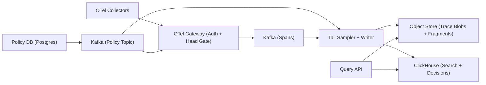

## Overview

This is an OTLP backend that ingests spans, makes **budgeted sampling decisions**, and stores traces for **fast search** and **reliable retrieval** with hard cost controls per tenant.

Sampling is treated as a tiered spending problem: enforce hard caps at ingest, then spend limited retention budget on traces that are most useful (errors, slow paths), with explicit partial/late-span behavior.

## What Makes This Hard

Traces are incomplete by default: spans arrive out of order, arrive late, or never arrive. Tail sampling must work with bounded memory and bounded decision time while remaining predictable under burst.

Cost control is the other half of correctness: without enforced ceilings and budgets, one noisy tenant/service turns everyone’s tracing into downtime and surprise bills.

## Requirements

### Functional Requirements

- Ingest OTLP spans from collectors with multi-tenant isolation (authn/authz, per-tenant config).
- Support **head-based controls** at ingest (hard ceilings + optional deterministic admission sampling per trace ID).
- Support **tail-based sampling** using observed properties (error present, latency, specific routes/attributes).
- Ensure consistent trace decisions: keep or drop, label partials when unavoidable.
- Enforce cost controls:
  - per-tenant ingestion ceilings (bytes/sec, spans/sec)
  - per-tenant retained trace budget (kept spans/sec or kept bytes/day)
  - per-service fairness inside a tenant (approximate is acceptable)
- Provide search and retrieval:
  - query by service, operation, time range, duration, status, tags
  - fetch full trace by trace ID (with fragments if late)
- Provide auditability:
  - explain why a trace was kept/dropped (policy version + rule + budget result)

### Scale Targets

- 5,000 tenants
- Ingest: 2M spans/sec sustained, 10M spans/sec burst
- Retention:
  - indexed search: 7 days
  - raw trace bodies: 14–30 days
- Query: 2k QPS search, 10k QPS trace-by-id (spiky)

These numbers force burst absorption, bounded tail state, and a storage split between search and payload.

## Key Design Decisions

- **OTel Collector gateway for ingest + head gate**
  - Terminates OTLP, authenticates tenants, normalizes identity, enforces hard ceilings, and optionally applies deterministic admission sampling by trace ID.
  - Keeps the “front door” small: one gateway binary plus a minimal custom processor for auth/budgets.

- **Kafka as the spine (spans + policies)**
  - Spans go to Kafka immediately for backpressure and replay.
  - Policies are distributed as a versioned, compacted Kafka topic so every sampler can run on last-known-good without a live RPC dependency.

- **Tail sampler writes storage directly**
  - One consumer service makes tail decisions and writes:
    - trace payload blobs to object storage
    - trace/search rows + decision/audit rows to ClickHouse
  - This removes a separate “storage writer” hop and avoids decision-vs-write races.

**What We Removed**
- Separate `OTLP Ingest`, `Head Sampler`, `Storage Writer`, and `Policy & Budgets Service` as standalone services (collapsed into gateway + Kafka policy stream + tail sampler).
- Redis/distributed token buckets (budgets are enforced with hard ingest ceilings plus approximate per-sampler tail budgets).
- Mutable “append late spans into existing blobs” behavior (late spans are always written as fragments).

## Architecture

### Components

- **OTel Gateway (Auth + Head Gate)**
  - Justification: the only reliable choke-point for tenant identity and **hard** ceilings under burst/Kafka trouble.
  - Behavior: enforce per-tenant bytes/sec + spans/sec; optionally admit only a deterministic fraction per trace ID when ceilings are tight; emit policy version used.

- **Kafka**
  - Justification: burst absorption and replay; the system stays up when storage is slow.
  - Correctness knobs: idempotent producers, `acks=all`, bounded producer buffering; partition key `(tenant_id, trace_id_hash)`.

- **Tail Sampler + Writer**
  - Justification: converts “observed value” into budgeted retention and produces the stored truth.
  - Behavior: bounded per-trace state with a fixed decision window; monotonic keep; writes blobs + indexes + decision/audit records.

- **Object Store**
  - Justification: cheapest durable retention for large payloads.
  - Layout: immutable blobs per `(tenant_id, trace_id, chunk_id)`; late spans are separate fragment blobs linked by trace ID.

- **ClickHouse**
  - Justification: fast search/aggregation at stated QPS.
  - Stores: trace summaries/tags for search, plus decision/audit rows keyed by `(tenant_id, trace_id, policy_version)`.

- **Query API**
  - Justification: stable user semantics: search from ClickHouse, fetch payload from object store, merge fragments, and surface partial/late labels + decision reasons.

## Deep Dive: Tail Sampling With Bounded Memory And Predictable Cost

**Decision contract**
- A trace is “kept” only if the tail sampler writes:
  1) a trace blob (possibly partial) and
  2) a ClickHouse decision row referencing blob keys.
- This keeps “kept” from becoming a best-effort promise that can be lost to races.

**Budgets (simple and enforceable)**
- Unit: `kept_spans` (optionally also `kept_bytes` as an estimate).
- Accounting happens in the tail sampler at decision time; estimation error is accepted and bounded by ingest ceilings.
- Fairness: approximate per-service (or per service tier) within a tenant, enforced locally per sampler instance; hard tenant ceilings at the gateway prevent worst-case abuse.

**Rules (tiered, monotonic)**
- P0: error seen → keep if P0 budget available; else record `budget_exhausted_p0`.
- P1: slow trace (duration estimate above threshold) → keep if P1 budget available.
- P2: baseline → keep with probability bounded by remaining P2 budget.

**Late spans (always fragments)**
- If trace is kept: accept late spans for a fixed late window and write fragment blobs + fragment rows.
- If trace is dropped: no resurrection by default; the only override is an explicit tenant “debug override” policy version (time-boxed).

## Trade-offs

| Optimized For | Sacrificed |
|--------------|------------|
| Small team operability | Perfect completeness of traces |
| Predictable cost under burst | Fleet-wide exact budget fairness |
| Clear failure behavior | “One-store” elegance |
| Fast search + cheap retention | More moving parts than pure ClickHouse |

## Failure Modes

- **Policy DB down (minutes)**
  - Behavior: samplers continue on last-known-good from Kafka policy topic; gateway uses a safe fallback cap if policy is stale.
  - Guardrail: policies are versioned; decisions always record `policy_version`.

- **Kafka partially unavailable (ISR shrink / leader flaps)**
  - Behavior: gateway fails admission deterministically per tenant (429) once bounded buffers fill; no unbounded in-memory spooling.
  - Settings: `acks=all`, idempotent producer; if Kafka can’t confirm, treat as not admitted.

- **Network partition: sampler can’t fetch policy**
  - Behavior: keep running on last-known-good; if staleness exceeds a max, degrade to P0-only + tiny baseline within hard ingest caps.

- **ClickHouse writes slow (not failing)**
  - Behavior: tail sampler throttles keep decisions by priority (drop P2, then P1) based on ClickHouse insert latency and internal backlog; Kafka continues absorbing spans.
  - Recovery: replay from Kafka when steady.

- **Bad policy rollout (e.g., P0 becomes 100% keep)**
  - Behavior: hard ceilings at the gateway are non-overridable; tail budgets have fixed upper bounds.
  - Guardrails: policy validation on write + staged activation by tenant (policy versioning).

## What I'd Do Differently At...

- **10x scale:** split Kafka by tenant tier and make tail sampler state management more explicit (still Kafka-first).
- **100x scale:** adopt a block-compaction trace layout in object storage to reduce retrieval fanout.

## Operational Notes

- Treat policy changes as production changes: versioned, reversible, and observable via kept-by-class and budget-exhaustion rates.
- Surface partial/late as first-class in APIs/UI; never pretend a trace is complete.
- Keep a tiny always-on baseline even in degradation modes; it’s your canary.
