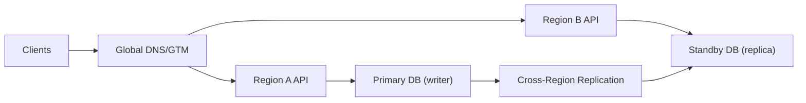

## Overview

This design is active-passive DR for a tier-1 service: one write region, one warm standby region. Traffic can go to either region, but **only the current database writer can accept writes**. That single invariant makes DNS overlap and gray failures survivable.

The key separation is:
- **Data plane:** DNS decides where clients land.
- **Authority plane:** the database decides who can write (writer vs replica). If a region isn’t the writer, it’s read-only by construction.

## What Makes This Hard

Real outages are gray: one region can look “up” while being unsafe for writes, and DNS cutover is slow and incomplete. The design tolerates overlap by making “wrong region” behavior deterministic: reads may work, writes never do unless the database is the writer.

## Requirements

### Functional Requirements
- **Bounded data loss:** Explicit RPO with alerting; promotion is gated by replication lag unless an operator accepts data loss.
- **Fenced promotion:** After a failover, only one region can be the writer; old primary cannot accept writes even if it comes back.
- **Deterministic cutover:** Automated DNS/GTM change with a safe overlap period.
- **Auditability + drills:** Every failover is logged and practiced.

### Scale Targets
- **Traffic:** 50k RPS peak, 10k RPS sustained.
- **Writes:** 1k tx/s peak; < 50ms in-region commit latency target.
- **Data:** 10 TB; 7-day PITR retained.
- **RPO:** 30 seconds.
- **RTO:** 5 minutes.

## Key Design Decisions

- **Active-passive (warm standby), single-writer.**
- **Write fencing lives at the database.** The standby is a replica that rejects writes; “no writer, no write” is enforced even if an app deploy is wrong.
- **DNS/GTM cutover is treated as a hint.** The system stays correct while both regions receive traffic.

## Architecture

### Components

- `Global DNS/GTM`: Moves client traffic between regions; supports staged weights and health-checked records.
- `Region A API` / `Region B API`: Stateless; always safe if both regions receive traffic; write paths handle “not the writer” deterministically.
- `Primary DB` + `Standby DB`: The writer/replica roles are the fencing mechanism; standby is pre-provisioned to take full load after promotion.
- `Cross-Region Replication`: Async replication with lag metrics; keeps the standby close enough to meet RPO in normal operation.

## Deep Dive: Fenced Failover Without Split-Brain

Write safety is simple: **only the DB writer accepts writes**. Every write uses the regional DB endpoint for that region; if the region isn’t the writer, the DB rejects writes and the API returns a retryable response that steers clients to the active region.

Failover sequence (push-button automation, operator-visible):
1. **Detect:** Regional SLO breach (client-facing errors/latency) sustained beyond a short cooldown.
2. **Assess RPO:** Check replication lag and estimate loss by replication position (e.g., LSN/GTID gap). If lag exceeds RPO, require an explicit “accept data loss” decision.
3. **Promote:** Promote Region B replica to writer using the database provider’s promotion operation. This is the only step that changes write authority.
4. **Cut traffic:** Shift DNS/GTM weights to Region B (10% → 50% → 100%) while watching errors, saturation, and tail latency.
5. **Handle overlap:** Any traffic still landing in Region A:
   - Reads: serve from the replica (stale-but-safe).
   - Writes: return a deterministic redirect or retryable failure (e.g., `307` to regional hostname or `503` + `Retry-After`).

Edge cases are naturally safe:
- **Old primary comes back:** it reconnects as a replica and cannot write.
- **Both regions get traffic:** only the writer can commit writes; the other region stays read-only.

If promotion is not possible (control plane/API unavailable), the system defaults to safety: keep the current writer if it’s still reachable; otherwise serve read-only and page.

## Trade-offs

| Optimized For | Sacrificed |
|--------------|------------|
| Simple correctness under gray failure | Some read staleness during overlap |
| Few moving parts a small team can run | Failover depends on DB promotion operation |
| Fast recovery with warm standby | Higher steady-state cost than cold standby |

## Failure Modes

- **Promotion operation unavailable for 5 minutes**
  - *What happens:* Cannot change writers.
  - *Detect:* Promotion API failures; “cannot promote” alarms.
  - *Recover:* Continue with existing writer if reachable; otherwise switch to read-only mode until promotion is available.

- **Network partition: one region serves clients, the other holds write authority**
  - *What happens:* Clients may prefer a region that cannot write.
  - *Detect:* Rising write rejections/redirects; mismatch between traffic distribution and writer region.
  - *Recover:* Keep the non-writer region read-only; cut DNS toward the writer or promote if the writer region is effectively unreachable.

- **Replication lag spikes above RPO, then writer dies**
  - *What happens:* You choose between downtime and data loss.
  - *Detect:* Lag and replication-position gap exceed thresholds.
  - *Recover:* Block auto-promotion; require explicit override with a measured loss estimate.

- **Bad deploy enables a write code path**
  - *What happens:* App tries to write from the wrong region.
  - *Detect:* Write attempts failing at the DB; elevated “read-only transaction” errors.
  - *Recover:* DB continues to fence; roll back deploy; keep redirects/retries in place.

- **DNS cutover slow / sticky clients**
  - *What happens:* Old region keeps receiving traffic for minutes to hours.
  - *Detect:* Residual request volume in the old region after cutover.
  - *Recover:* Old region stays read-only and returns redirects/retryable errors for writes until traffic drains.

## What We Removed

- `DR Orchestrator + Lease`: Promotion is the authority change; fencing is enforced by DB writer/replica roles.
- External quorum/lease semantics: No separate lease TTL/renewal system to operate; the database writer role is the single source of truth.
- Multi-signal health “quorum” logic: Failover gating is reduced to (1) sustained client-facing impact and (2) replication lag/RPO check.

## Operational Notes

- Run quarterly failover drills and record outcomes (RTO achieved, RPO at failover, time-to-drain stuck traffic).
- Page on replication lag that threatens RPO, not just outages.
- Keep a single “Failover” runbook/script that executes: lag check → promote → DNS weight shift → verification → audit entry.
- Treat “read-only mode” as a first-class state: clear client errors, retry guidance, and dashboards showing current writer region and replication lag.
