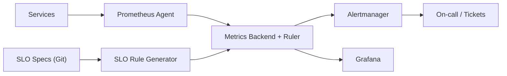

## Overview

This system tracks SLO compliance by continuously measuring SLIs, converting them into **error budget burn rates**, and alerting when burn indicates the budget will be exhausted before the SLO window ends. SLO monitoring is treated as **deterministic rule generation**: SLO specs are compiled into a small, repeatable set of recording and alerting rules evaluated by a Prometheus-compatible time-series backend, with Alertmanager handling routing and Grafana providing the UI.

Removed: custom SLO UI/API, bespoke rule compiler, a mandatory OTel-collector hop, and arbitrary “top contributors” breakdowns.

## What Makes This Hard

1. **Math that lies under pressure.** If you compute error rates incorrectly (bad aggregation, counter resets, missing data), you page people for ghosts or miss real incidents. Burn rate math is simple; making it correct on real telemetry is not.

2. **Alerting that is either noisy or late.** Single-window alerts flap or arrive too late. The fix is **multi-window, multi-burn** alerting: require a fast window and a slow window to agree.

## Requirements

### Functional Requirements
- Define SLOs per service/journey with: objective, rolling period (e.g., 30d), and an SLI expressed as *good/total* events.
- Continuously compute:
  - Burn rate across multiple windows (e.g., 5m, 30m, 1h, 6h).
  - Error budget remaining for the rolling period (cheap, predictable query cost).
- Trigger alerts based on burn-rate policies (paging vs ticket) with **deterministic behavior** for:
  - No traffic (don’t page)
  - Missing telemetry (monitoring failure)
  - Backend/ruler unavailable or behind (monitoring blind)
- Provide dashboards per SLO: current SLI, burn rates, remaining budget, and (only) controlled breakdowns where safe.
- GitOps workflow: reviewed changes, versioned policies, auditable history, rollback.

### Scale Targets
- **SLO count:** ~1,000 SLOs.
- **Ingestion:** ~500k–2M samples/sec across the fleet.
- **Rule eval:** 1-min evaluation interval; paging alert latency target <2 minutes from sustained incident start.
- **Cardinality budget:** per-SLO evaluation touches O(10–100) series; no unbounded labels.
- **Budgets/quotas:** rule count caps, query time budgets, and per-tenant/team series limits enforced at v1.

## Key Design Decisions

- **Use a Prometheus-compatible metrics backend with a ruler (Mimir/Cortex/Thanos Ruler).**
  - Burn math maps cleanly to PromQL; ruler evaluation is boring and proven.

- **Define SLIs as counters (good/total or errors/total).**
  - Counters are cheap, robust, and aggregate correctly with ratio-of-sums.

- **Generate rules from SLO specs using an existing generator (Sloth/Pyrra style).**
  - Templates standardize math, multi-window policies, and guardrails; the “custom” surface area is just templates + linting rules.

- **Use a Prometheus Agent-style pipeline for scrape/relabel/remote_write.**
  - One moving part: scrape + relabel + ship metrics; backend can change without app changes.

- **Make guardrails first-class.**
  - CI validates specs and generated rules, diffs generated output in review, and ships a small set of canary SLOs to catch fleet-wide mistakes.

## Architecture

### Components

- **Services**
  - Emit low-cardinality `good_total` and `total_total` counters (or `errors_total` + `total_total`) with strict label hygiene.

- **Prometheus Agent**
  - Scrapes, relabels, and remote_writes metrics; isolates applications from backend details and centralizes label control.

- **Metrics Backend + Ruler (Mimir/Cortex/Thanos)**
  - Durable, horizontally scalable storage; evaluates recording + alerting rules close to the data at predictable cost.

- **SLO Specs (Git)**
  - YAML definitions for objective, period, selectors, alert policy, and ownership; enables review, rollback, and audit trails.

- **SLO Rule Generator (Sloth/Pyrra-style)**
  - Compiles specs into a standard set of recording rules and multi-window burn alerts; enforces allowed labels and required aggregations via templates and CI.

- **Alertmanager**
  - Dedup, inhibit, route, and escalate; clean separation of “service bad” vs “monitoring blind”.

- **Grafana**
  - Standard dashboards per SLO + fleet views, links to runbooks, and deep-links from alerts.

## Deep Dive: Correct Burn-Rate Alerts (Without Noise)

The core quantity is **burn rate**:

- Let `objective = 0.999` over `period = 30d`
- Error budget fraction `budget = 1 - objective = 0.001`
- For a window `w`, measured error fraction:
  - `err_frac(w) = errors(w) / total(w)` (ratio of sums)
- Burn rate:
  - `burn(w) = err_frac(w) / budget`

Recording rules (pattern; labels are controlled by templates):

- Errors and total are aggregated first:
  - `errors_rate(w) = sum(rate(errors_total[ w ]))`
  - `total_rate(w)  = sum(rate(total_total[ w ]))`
  - `err_frac(w)    = errors_rate(w) / total_rate(w)`
  - `burn(w)        = err_frac(w) / budget`

Multi-window, multi-burn policy:

- **Page (fast):** `burn(5m) > 14` AND `burn(1h) > 14`
- **Ticket (slow):** `burn(30m) > 6` AND `burn(6h) > 6`

Deterministic missing-data semantics are part of the generated rules:

- **No traffic:** if `total_rate(w)` is ~0, burn is undefined and paging rules are not eligible.
- **Missing telemetry:** alert when the required series are absent for N minutes (monitoring failure, routed to the owner).
  - Pattern: `absent_over_time(total_total{...}[N])` (and/or `absent_over_time(errors_total{...}[N])`)
- **Data freshness gate:** paging alerts require recent samples to avoid “monitoring blind” pages.
  - Pattern: `data_ok = (count_over_time(total_total{...}[5m]) > 0)`
  - Paging condition: `(page_burn_condition) AND on(<slo identity labels>) data_ok`

Budget remaining uses rollups to keep cost predictable:

- Record short-interval rollups:
  - `errors:rate1m = sum(rate(errors_total[1m]))`
  - `total:rate1m  = sum(rate(total_total[1m]))`
- Derive rolling-period error fraction cheaply:
  - `err_frac(period) = sum_over_time(errors:rate1m[30d]) / sum_over_time(total:rate1m[30d])`
- Remaining budget:
  - `consumed = err_frac(period) / budget`
  - `remaining = 1 - consumed`

## Trade-offs

| Optimized For | Sacrificed |
|--------------|------------|
| Correct burn math + predictable cost | Arbitrary ad-hoc SLIs and breakdowns |
| Low operational novelty | Bespoke SLO UI/features |
| Fast, low-noise paging | Perfect sensitivity to very short spikes |
| Strict cardinality control | Per-customer/per-raw-dimension SLOs |

## Failure Modes

- **Pipeline gap / remote-write lag**
  - Detect: remote_write queue/failed samples metrics + `data_ok` turning false.
  - Respond: page only on monitoring-blind alerts; SLO burn alerts are gated by freshness.

- **Metrics backend/ruler blind or evaluation behind**
  - Detect: ruler evaluation missed interval / evaluation duration / query failures; backend health signals.
  - Respond: alert “monitoring blind” separately; keep burn paging gated to avoid false pages from stale/NaN series.

- **Cardinality explosion (label drift)**
  - Detect: series count growth + ruler eval time rising + top-cardinality reports.
  - Respond: generator templates allow only a small label set; CI blocks specs that exceed budgets; backend enforces per-tenant quotas.

- **Bad SLO spec deploy (wrong selector/inverted good vs bad)**
  - Detect: CI validation + generated-rule diff review + canary SLOs with known behavior.
  - Respond: rollback via Git; generator output is deterministic and fully versioned.

## Operational Notes

- Standardize a small SLO template library (availability, latency-<T, freshness) and require review for anything outside templates.
- Every SLO declares `owner`, `runbook`, and paging policy; burn alerts include fast+slow burn, remaining budget, and a Grafana deep link.
- Keep “service bad” and “monitoring blind” distinct in routing and severity.
- Enforce budgets at v1: per-team rule caps, per-team series quotas, and query/eval time budgets.
