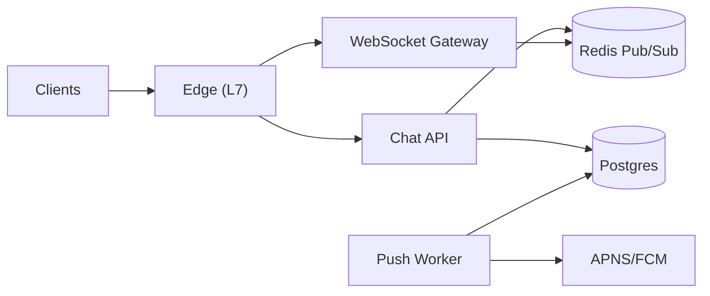

## Overview

This is a messaging system for 1:1 and group chat with offline sync, read receipts, and typing indicators. The whole system is built on one durable primitive: an **append-only message log per conversation** in Postgres. Everything “real-time” is best-effort and can be missed, because clients always reconcile by syncing from their cursor.

The correctness model is intentionally small:
- Messages are appended once.
- Clients sync “everything after my cursor”.
- Read receipts are a single **monotonic watermark** per user per conversation.

## What Makes This Hard

- **Large groups**: writing per-recipient inbox rows explodes writes; real-time fan-out must avoid “N writes per message”.
- **Flaky networks**: WebSockets drop; if real-time is treated as truth, state becomes unknowable.
- **Multi-device users**: any server-stored “delivered” watermark that is shared across devices can cause a device to skip messages it never downloaded.

## Requirements

### Functional Requirements
- **Offline sync**: fetch exactly what was missed since a cursor.
- **Read receipts**: “read up to here” without per-message, per-user rows.
- **Typing indicators**: low latency, ephemeral, never blocks sends.
- **Large-group fan-out**: real-time only to active viewers, not all members.
- **Idempotent send**: retries don’t create duplicates.

### Scale Targets
- Design holds under high connection counts and high message throughput by keeping writes proportional to messages (not group size) and keeping real-time best-effort.

## Key Design Decisions

- **Postgres is the truth**
  - Messages, membership, and read watermarks live in one transactional store.

- **Cursor-based sync**
  - Clients ask for messages “after cursor”; this is the recovery path for every missed event.

- **Delivered state is client-local**
  - The server does not store `last_delivered_*` per user; each device advances its own local cursor only after it persists the batch.

- **Read receipts are a single watermark**
  - Server stores only `last_read_cursor` per `(conversation_id, user_id)` and updates it monotonically.

- **Real-time is best-effort**
  - Redis Pub/Sub exists only to reduce perceived latency for active sessions; correctness never depends on it.

- **Push is durable**
  - Push notifications come from a Postgres outbox written in the same transaction as the message.

## Architecture

### Components

- `Chat API`: Authenticates, enforces membership, writes messages, updates read receipts, and publishes best-effort real-time events. Stateless.
- `Postgres`: Durable message log, membership, read watermarks, and push outbox. The only source of truth.
- `WebSocket Gateway`: Holds connections, subscriptions, and backpressure handling. Never stores truth.
- `Redis Pub/Sub`: Ephemeral broadcast from API to gateways. Losing events is acceptable because clients sync.
- `Push Worker`: Drains a Postgres outbox and calls APNS/FCM with retries and rate limits.
- `Edge (L7)`: TLS termination, routing, WebSocket upgrade, and basic abuse limits.

## Deep Dive: Offline Sync + Large-Group Fan-out (The Hardest Part)

Each device maintains a per-conversation cursor:
- `last_synced_cursor`: the newest message it has persisted locally

### Message identity and ordering
Use a server-defined ordering cursor of `(created_at, message_id)`:
- `created_at` is assigned by the database (`now()`), not the client.
- `message_id` is a unique ID (UUID/ULID) used as a tie-breaker.

Schema sketch (conceptual):
- `messages(conversation_id, created_at, message_id, sender_id, client_msg_id, body, ...)`
  - Index: `(conversation_id, created_at, message_id)`
  - Unique: `(sender_id, client_msg_id)` for idempotency
- `receipts(conversation_id, user_id, last_read_created_at, last_read_message_id, updated_at)`
  - PK: `(conversation_id, user_id)`
- `push_outbox(id, conversation_id, message_created_at, message_id, recipient_user_id, state, attempts, next_attempt_at, ...)`

### Send path (idempotent)
Clients send with `client_msg_id` for retries.
1. Insert message with `(sender_id, client_msg_id)` uniqueness; on conflict, return the existing message.
2. In the same transaction, write push outbox rows (or a single outbox record that the worker expands using membership).
3. After commit, publish `message_created(conversation_id, created_at, message_id)` to Redis (best-effort).

If Redis publish fails, the message is still correct and will be found by sync.

### Sync path (correctness-first)
Client calls:
- `GET /conversations/:id/messages?after_created_at=...&after_message_id=...&limit=...`

Server executes an index-backed query:
- `WHERE (created_at, message_id) > (:ts, :id) ORDER BY created_at, message_id LIMIT :n`

Client advances its local cursor only after persisting the batch.

### Read receipts without per-message explosion
Read receipts are a monotonic watermark:
- `POST /conversations/:id/read { last_read_created_at, last_read_message_id }`
- Server stores `MAX(existing, incoming)` by cursor ordering (never moves backward).

### Fan-out that scales for large groups
Real-time fan-out is only to active sessions:
- Gateways keep an in-memory map: `conversation_id -> local connections`
- API publishes one event per message to Redis
- Gateways forward only to locally subscribed connections

Offline users learn via push (if enabled) and/or sync when they open the app.

## Trade-offs

| Optimized For | Sacrificed |
|--------------|------------|
| Simple, teachable correctness (cursor sync) | Guaranteed real-time delivery semantics |
| Large-group efficiency (no per-recipient writes) | Instant delivery to every member of huge groups |
| Multi-device safety (delivered is device-local) | A server-global “delivered to user” metric |
| Durable push (outbox) | Extra DB writes and a small worker |

## Failure Modes

- **Postgres down**
  - What happens: sends and sync fail.
  - Behavior: reject sends fast (no in-memory queue); clients backoff with jitter; reconnect and sync when DB returns.
  - Recovery: standard failover (replica promotion) and connection pool timeouts tuned to fail fast.

- **Committed but not broadcast (Redis publish fails)**
  - What happens: real-time delivery/typing may be missed.
  - Recovery: clients catch up via sync; no repair needed.

- **Multi-device user**
  - What happens: nothing special—delivered is not shared server-side.
  - Recovery: each device syncs from its own cursor.

- **Hot conversation spike**
  - What happens: Postgres and gateways see bursty load; real-time lag grows.
  - Recovery: rate-limit per conversation, shed typing before message events, and rely on sync for correctness.

- **Bad deploy / schema/index regression**
  - What happens: latency spikes, timeouts, or cursor query slows.
  - Recovery: keep cursor format backward-compatible, roll back quickly, and treat new indexes/migrations as slow-roll changes.

## What We Removed

- Server-stored `last_delivered_*` watermarks (delivered is device-local only).
- ULID-only ordering as the cursor (ordering is explicitly `(created_at, message_id)`).
- Separate idempotency table (idempotency is a single unique constraint on `messages`).
- Any fan-out-on-write inbox model.
- Any “guaranteed delivery” real-time semantics.
- Sharded pub/sub, Redis Streams, Kafka, and other scaling-only routing layers.
- Extra services for validation/config/audit (kept inside the API + Postgres).

## Operational Notes

- Prioritize events: `message_created` > `receipt_update` > `typing`; shed in that order.
- Gateways enforce backpressure: disconnect slow clients; they recover via sync.
- Enforce strict limits: message size, typing frequency, and per-conversation send rate.
- Push worker uses retries with backoff; outbox rows are the single source of push truth.
