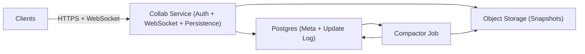

## Overview

A Google Docs–style editor where the **client CRDT is authoritative** for edit semantics and offline merges. The backend does four boring things: authenticate, accept updates, broadcast to other connected editors, and durably store an append-only update log with periodic snapshots for fast reload.

Edits are **local-first** (apply instantly), and “sync” is simply: load the latest snapshot, then fetch and apply updates since that snapshot.

## What Makes This Hard

Correctness is easy to get and easy to make unusably slow. The real problem is keeping **reconnect/open costs bounded** as updates accumulate, without introducing “ghost edits” (seen live but missing after reload) or silent corruption from compaction.

## Requirements

### Functional Requirements
- Real-time coauthoring with sub-150ms perceived latency for local edits (remote <300ms typical).
- Offline-first: edits made offline must reconcile without conflicts or manual merge.
- Multiple devices/tabs per user; retries must not duplicate updates.
- Presence (“who’s here”, cursors) must be real-time but not durable; it must not block editing.
- Access control (view/comment/edit) enforced on every connection and every persisted update.
- Version history and “restore” built from snapshots + update log.

### Scale Targets
- 10M DAU, 1M peak concurrent editors.
- Median doc: 1–5 active editors; p95 doc: 20 editors; rare spikes: 200.
- Edit rate: ~2–5 ops/sec/editor; bursty.
- Fanout: doc 200 editors → 199 outbound messages per update.
- Storage: snapshots 50KB–5MB/doc + deltas between snapshots.

## Key Design Decisions

- **Client CRDT + binary deltas**
  - Clients apply local edits immediately and send deltas to the server.
  - The server never interprets rich-text operations.

- **Persist-then-broadcast**
  - An update is only broadcast after it is durably written.
  - “Seen by others” implies “will be there after reload.”

- **Append-only updates + periodic snapshots**
  - Updates stay cheap to write and easy to audit.
  - Snapshots bound load/reconnect time.

- **Presence is gateway-memory only**
  - Presence is best-effort and disappears on disconnect.
  - Presence never depends on the database.

## Architecture

### Components

- `Clients`
  - Run the CRDT, apply edits instantly, buffer offline deltas, and resync by loading a snapshot then applying missing updates.
  - Justification: this is the only place that can guarantee local-first latency and offline merge correctness.

- `Collab Service (Auth + WebSocket + Persistence)`
  - Verifies user auth, checks doc ACLs, accepts deltas, writes them durably, then fans out to other connected editors of the same doc.
  - Maintains ephemeral presence (cursors/active users) in memory and drops it under load.
  - Justification: one stateless service keeps the data plane simple; persistence and broadcast ordering is enforced in one place.

- `Postgres (Meta + Update Log)`
  - Stores doc metadata (owner/ACL, current snapshot pointer) and an append-only updates table with idempotency constraints.
  - Justification: transactional durability + uniqueness guarantees for retries, with minimal operational surface area.

- `Object Storage (Snapshots)`
  - Stores immutable compressed snapshot blobs keyed by `snapshot_id`.
  - Justification: cheapest reliable blob store; snapshots are the fast-path for opening stale/large docs.

- `Compactor Job`
  - Periodically builds a new snapshot from the latest snapshot + a tail of updates, validates it, then atomically flips the snapshot pointer.
  - Justification: the mechanism that keeps replay bounded and performance stable.

## Deep Dive: Offline Reconciliation Without Server Transforms

Sync is snapshot + replay:

- Open doc:
  1) Fetch `snapshot_id` from Postgres.
  2) Download snapshot bytes from Object Storage and load into the CRDT.
  3) Fetch updates newer than that snapshot and apply them in order.

- While online:
  - Client sends binary deltas with a `client_update_id` (unique per doc) and size-bounded payload.
  - Server checks ACL, writes `(doc_id, client_update_id, delta_bytes, created_at)` with a unique constraint on `(doc_id, client_update_id)`, ACKs the writer, then broadcasts the delta to other connected editors.

- Reconnect:
  - Client repeats “open doc” and replays whatever it missed since the snapshot.
  - Offline edits are uploaded on reconnect; duplicates are ignored via idempotency.

Bounding growth:
- Compaction produces new snapshots; the server keeps only a retention window of recent deltas beyond the current snapshot.
- If a client is older than retention, it is forced onto the latest snapshot (full reload), not partial replay.

## Trade-offs

| Optimized For | Sacrificed |
|--------------|------------|
| Minimal moving parts | Higher bandwidth on reconnect than state-vector diffs |
| Strong “no ghost edits” guarantee | Live fanout waits on durable write latency |
| Operational simplicity (Postgres + object store) | A hot doc can stress a single DB and a single service shard |
| Safe compaction | More storage due to safety windows |

## Failure Modes

- **Postgres down**
  - What happens: live collaboration stops; presence may still show connected users, but no edits can be “saved.”
  - Recover: the service rejects update writes; clients continue local editing and show “unsaved/offline,” then resync on recovery.

- **Persistence succeeds, broadcast fails**
  - What happens: some collaborators don’t see an update immediately.
  - Recover: clients periodically fetch missing updates while connected (with jitter/backoff); on any reconnect they replay from the snapshot.

- **Network partition: service ↔ clients OK, service ↔ Postgres degraded**
  - What happens: updates cannot be ACKed/saved; clients keep local edits.
  - Recover: explicit backpressure (reject writes fast); clients resync when the DB is reachable.

- **Compactor produces a bad snapshot**
  - What happens: opening a doc could diverge if the bad snapshot becomes current.
  - Recover: compactor validates by loading the previous snapshot, applying the same tail of updates, and comparing a checksum; only then flips the pointer. Old snapshots and deltas remain for a safety window to roll back immediately.

- **Hot doc spike (200 editors, paste storms)**
  - What happens: outbound queues grow; latency rises.
  - Recover: per-doc rate limits, bounded per-connection send buffers, drop/merge presence first, and if needed disconnect slow consumers and force resync.

## What We Removed

- `Realtime PubSub (Redis Cluster)`; fanout is in-memory for connected editors of a doc, and everyone can always recover from Postgres via replay.
- Separate `Doc Sync API`; persistence and realtime are one service to enforce persist-then-broadcast without cross-service split-brain.
- State-vector selective catch-up; reconnect uses snapshot + replay-since-snapshot.
- Fine-grained per-doc partition management as a starting point; a single append-only table plus indexing is the baseline.

## Operational Notes

- Define the durability contract in the UI: edits are “saved” only after server ACK; collaborators only see ACKed edits.
- Cap delta size, reject compressed payloads, and rate-limit per doc/user to prevent abuse.
- Snapshot safety: build → verify → flip pointer; delay deletion of old deltas/snapshots for rollback.
- Presence is best-effort: store only in memory, heartbeat-based, and drop it under load before dropping edits.
- Stale client policy: if older than delta retention, force snapshot reload and replay from there.
