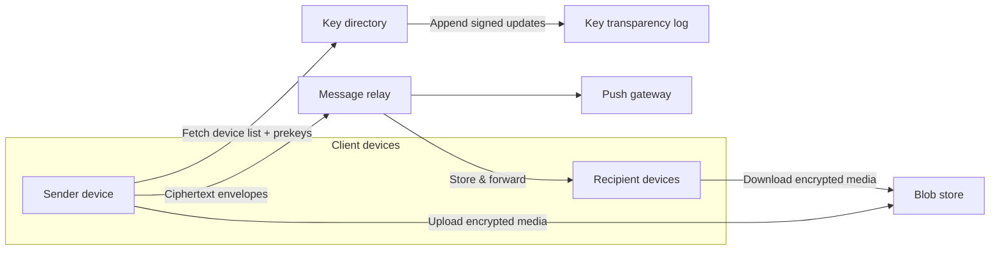

## Overview

This system is an end-to-end encrypted messaging platform where the server is a *dumb relay*: it stores and forwards ciphertext, and it hosts a key directory so devices can find each other. The elegance comes from keeping the server out of the trust path for message confidentiality while still using it aggressively for *correctness* (freshness, fanout, retries, backpressure) so the client protocol stays simple.

The core insight is to treat “multi-device” as a first-class cryptographic identity problem, not a synchronization problem. Each device is a distinct cryptographic endpoint with its own sessions; “sync” becomes a natural consequence of sending messages to *all* of a user’s devices (including your own) rather than inventing a separate state replication protocol.

The hard parts are (1) asynchronous session setup with forward secrecy (Signal’s X3DH + Double Ratchet), and (2) device lifecycle (add/remove) without letting the server silently swap keys or resurrect removed devices. Everything else—storage, fanout, retries—uses boring, standard infrastructure.

## What Makes This Hard

Naive E2EE implementations get trapped by one of two mistakes:

1. **They treat a user as a single keypair.** Multi-device then becomes “copy private keys around,” which destroys forward secrecy and turns every device compromise into a total account compromise.

2. **They bolt “sync” onto the side.** Teams build a parallel system to replicate state/history, then discover they’ve reintroduced a trusted server (or an implicit shared key) that breaks the security model.

The subtle trap: with multi-device + forward secrecy, a newly added device *should not* automatically decrypt past traffic (otherwise you’re effectively back to long-lived shared keys). If product requirements demand history on new devices, you need an explicit encrypted-backup story—trying to “just sync keys” quietly demolishes the threat model.

## Requirements

### Functional Requirements

- **Asynchronous secure session setup:** Send a message to an offline recipient device without prior interaction.
- **Forward secrecy + post-compromise security:** Past messages stay safe if a device key leaks later; recovery after compromise via ratcheting.
- **Multi-device per user:** Each user has up to ~5 devices; messages reach all active devices reliably.
- **Device lifecycle with user control:** Adding a device requires approval from an existing device; removing a device stops future delivery to it.
- **Group messaging support:** Efficient fanout without per-recipient O(n) overhead for large groups (use sender keys).

### Scale Targets

- **50M DAU**, **10M peak concurrent**, **1B messages/day** (≈11.6k msg/s average; plan for **200k msg/s peak**).
- **P95 end-to-end delivery < 300ms** for online recipients; **minutes** acceptable for offline (push + store-and-forward).
- **Device count:** median 2, P99 5 → per-message per-user encryption overhead stays bounded and predictable.
- **Key directory QPS:** dominated by “first message to contact/device” and cache misses; target **<5%** of message QPS via caching + long-lived sessions.

## Key Design Decisions

- **We choose:** Signal-style **X3DH (prekeys) + Double Ratchet** per *device-to-device* session.
  - **We reject:** A single “user session key” shared across devices.
  - **Why:** It preserves forward secrecy and compartmentalizes compromise to one device/session.

- **We choose:** **Device certificates signed by the user’s identity key**, and **device add requires an existing device**.
  - **We reject:** Server-authorized device enrollment (email/SMS-only).
  - **Why:** Multi-device is an identity problem; the server must not be able to mint devices on your behalf.

- **We choose:** **“Sync by fanout”**: every outbound message is also encrypted to the sender’s other devices; optional encrypted state snapshots for fast catch-up.
  - **We reject:** A separate plaintext-ish sync service or shared “account key” for all devices.
  - **Why:** It keeps the system conceptually single-path: everything is just messages, with the same security properties.

## Architecture

### Components

- **Client devices**
  - Hold long-term identity keys and per-session ratchet state; perform all cryptography.
  - Encrypt separately to each recipient device (and to the sender’s other devices for multi-device sync).

- **Key directory**
  - Stores: user identity public key, device certificates, and each device’s prekey bundle (signed prekey + one-time prekeys).
  - Serves authenticated, cacheable key material; never sees message plaintext or session keys.

- **Key transparency log**
  - Append-only log of key directory updates (device adds/removals, signed prekey rotations).
  - Makes “server swapped your keys” *detectable* via consistency proofs/gossip.

- **Message relay**
  - Durable mailbox per device; enforces ordering *best-effort* but does not require it (Double Ratchet tolerates reordering).
  - Provides backpressure and retry; stores ciphertext envelopes and minimal routing metadata.

- **Push gateway**
  - Notifies devices to wake and fetch from their mailbox; never contains plaintext.

- **Blob store**
  - Stores encrypted attachments; keys are carried in message ciphertext.

## Deep Dive: Multi-Device Key Management Without Losing Forward Secrecy

### 1) Key hierarchy: user identity vs device identity

Each user has a long-lived **Identity Key (IK)**. Each device has its own **Device Key (DK)**. The device’s public key is bound to the user by a **Device Certificate**:

- `DeviceCert = Sign_IK( device_id, device_pubkey, created_at, expires_at )`

This achieves two things:
- Contacts can verify “this device truly belongs to that user” without trusting the server.
- Compromising one device does not give you the user IK (and should not automatically compromise other devices).

### 2) Device enrollment that the server cannot forge

**Add device flow (practical, minimal trust):**
1. New device generates `DK_new` locally.
2. New device shows a QR containing `DK_new_pub` + a nonce.
3. An existing device scans, verifies user intent, then signs `DeviceCert_new = Sign_IK(...)`.
4. Existing device submits `DeviceCert_new` to the key directory (over authenticated account channel).
5. New device becomes active only once it fetches and validates its own certificate.

This makes “server silently adding a spyware device” materially harder: without an existing device (or the IK), the server can’t create a valid device certificate.

### 3) Asynchronous session setup per recipient device (X3DH)

Each device publishes a **prekey bundle**:
- Identity public key `IK_pub` (per user)
- Signed prekey `SPK_pub` + `Sig_IK(SPK_pub)` (rotated weekly)
- A set of one-time prekeys `OPK_pub[i]` (consumed once)

**Session initiation (sender → recipient device):**
- Sender fetches recipient’s *device list* (cert-verified) and a prekey bundle for each device.
- For each device, sender runs X3DH to derive a shared secret and seeds a Double Ratchet session.
- First message includes the necessary X3DH handshake material (Signal “prekey message” style).

**Why this works at scale:** sessions are long-lived; key directory lookups happen at session start or after key changes, not per message.

### 4) Multi-device “synchronization” by treating your own devices as recipients

When Alice sends a message to Bob, Alice’s sending device also encrypts the message to **Alice’s other devices** (the same way it encrypts to Bob’s devices). Practically:
- Per recipient device session → ratchet → encrypt ciphertext envelope.
- The relay fanouts to each device mailbox.

This yields:
- All online devices converge on the same visible history without sharing long-lived decryption keys.
- Forward secrecy remains intact because every device uses its own ratcheted sessions.

**Non-obvious consequence (intentional):** a newly added device does *not* automatically decrypt old history. If history-on-new-device is required, add an explicit **encrypted backup** feature (client-encrypted archive with a user-held recovery key), rather than smuggling “history keys” through the server.

### 5) Preventing “stale device list” accidents with a signed device epoch

The most common real-world failure is not cryptographic—it’s operational: senders cache device lists and keep encrypting to removed devices.

Use a **device epoch**:
- Key directory maintains `device_epoch` per user (monotonic).
- Any device add/remove increments epoch and is signed into the transparency log.
- Sender includes `recipient_device_epoch` in the envelope header (routing metadata).
- Relay rejects delivery if epoch is stale, forcing the sender to refetch keys and re-encrypt.

This keeps “removed device still receiving messages” from happening due to cache staleness, while remaining compatible with E2EE.

### 6) Groups: sender keys, not quadratic encryption

For group chats, use Signal-style **Sender Keys**:
- Each sender establishes pairwise sessions once with each member device to distribute a per-sender symmetric key.
- Subsequent group messages are encrypted once with the sender key (plus a small per-group header), avoiding per-message O(n) encryption.

Membership change rotates sender keys (removing a device means it stops getting future sender-key updates).

## Trade-offs

| Optimized For | Sacrificed |
|--------------|------------|
| Strong confidentiality with minimal server trust | New devices don’t get old history by default |
| Clean device compromise boundaries | More ciphertext fanout (per-device) |
| Practical offline messaging | Key directory and prekey hygiene become operationally critical |
| Detectability of key tampering (transparency) | Extra infrastructure and client verification complexity |

## Failure Modes

- **Prekey exhaustion (recipient device runs out of OPKs)**
  - **What happens:** New sessions fall back to signed prekey only; worse UX under load, and less “one-time” hardness against replay/metadata correlation.
  - **Detect:** Key directory metrics on OPK inventory per device; alert when below threshold.
  - **Recover:** Clients replenish OPKs proactively; server enforces “min OPKs” policy on registration and blocks devices that never replenish (with clear client error).

- **Ratchet state divergence (out-of-order, replay, or multi-device restore bugs)**
  - **What happens:** Decrypt failures, “missing message” gaps, or permanent conversation breakage.
  - **Detect:** Client-side decrypt failure telemetry (counts only, no content), per-version regression monitoring.
  - **Recover:** Automatic session repair: on sustained failures, trigger a new X3DH session (new prekey message) while keeping old session state briefly to handle late messages.

- **Malicious or compromised key directory serving inconsistent keys**
  - **What happens:** Server can mount targeted key substitution unless it’s detectable; users may talk to attacker devices.
  - **Detect:** Transparency log consistency proofs + gossip; clients pin identity keys and flag unexpected changes.
  - **Recover:** Client blocks on unverifiable key transitions; require explicit user verification for identity key changes; incident response rotates infra keys but cannot decrypt past messages.

## What I'd Do Differently At...

- **10x scale:**
  - Shard message relay by device_id; move fanout onto a streaming backbone (Kafka/Pulsar) with per-device consumers.
  - Aggressively cache key directory responses with short TTL + epoch validation to keep p99 low.

- **100x scale:**
  - Adopt **MLS** for large groups (simpler, more scalable group key management than sender keys at very large membership).
  - Add external transparency witnesses (or multi-party gossip) so “single provider runs directory + log” is no longer a single trust domain.

## Operational Notes

- Track and alert on: OPK inventory, prekey fetch latency, decrypt-failure rates by client version, relay queue depth per shard, and “epoch mismatch” rejection rate (signals caching bugs).
- Rate-limit key directory queries to prevent contact enumeration; require authenticated access and return identical-shaped errors.
- Never log key material; treat client crash dumps as sensitive (ratchet state can leak metadata even without plaintext).
- Make device removal *fast*: bump epoch immediately, and have relays enforce epoch freshness so cached senders stop delivering to revoked devices within one round trip.
