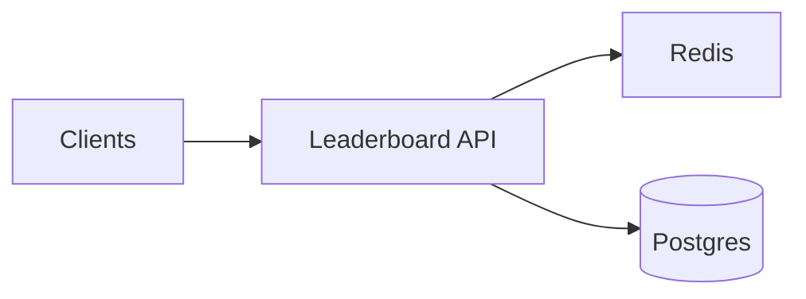

## Overview

This system ingests score updates and serves low-latency leaderboard queries (top N, “my rank”, and “around me”) across daily/weekly windows for millions of players.

Durable truth lives in Postgres (append-only events + current per-player score per window). Redis is a disposable read cache for fast top-N and fast “around me” when you’re near the top. Everything is built to be rebuildable from Postgres.

## What Makes This Hard

- A single global ordered structure becomes a hot spot under write load.
- Window rollovers create spikes and correctness edge cases.
- “My rank” and “around me” are expensive without an ordered index.
- Duplicates, retries, and backfills happen; results must converge.

## Requirements

### Functional Requirements
- Accept score updates with idempotency (at-least-once delivery is assumed).
- Support multiple windows: daily and weekly (aligned to UTC boundaries).
- Serve queries:
  - Top N (typically N ≤ 1000)
  - “My rank/score”
  - “Around me” (±k neighbors)
- Support multiple leaderboards (e.g., game mode, region, playlist), each independently queryable.
- Semantics: **max-score-wins per player per window**.

### Scale Targets
- **Players:** 20M daily actives, 2M peak concurrent.
- **Write rate:** 200k score updates/sec peak (bursty during events).
- **Read rate:** 50k leaderboard queries/sec peak (top N heavily cached).
- **Latency SLO:** p95 reads < 50ms, p95 writes < 100ms (end-to-end ingest to visible).
- **Windows:** daily + weekly; retention of finalized leaderboards for 90 days (audit + player support).

## Key Design Decisions

- **Postgres is the source of truth**
  - Append-only `score_events` for audit/rebuild.
  - Current `player_scores` per `(leaderboard_id, window_id, player_id)` with max-score-wins.

- **Sharded top-K caches in Redis**
  - Writes go to a shard-local top set (avoids a single hot key).
  - A small global top-K exists for cheap top-N reads, updated only from shard candidates.

- **Explicit freshness contract**
  - “Top N” and “around me” from Redis are **fast** and can be **slightly stale** (bounded by cache update).
  - “My score” is always correct from Postgres.
  - “My rank” is exact only when you are in cached top-K; otherwise it returns percentile-tier rank plus your score.

- **Windowing uses server receive time**
  - Window assignment uses server time (UTC), with no event-time/lateness handling.

## Architecture

### Components

- `Leaderboard API`
  - Justification: single place for auth, rate limits, write semantics, windowing, and query fanout.
  - Handles:
    - Writes to Postgres (idempotent event insert + max-score update)
    - Best-effort updates to Redis top caches
    - Reads from Redis first; falls back to Postgres when needed

- `Postgres`
  - Justification: durable truth + idempotency + 90-day retention + rebuild source.
  - Stores:
    - Leaderboard definitions/config (versioned)
    - `score_events` (append-only, idempotent)
    - `player_scores` (current score per window)

- `Redis`
  - Justification: p95 read latency for top-N and near-top “around me”.
  - Stores (disposable):
    - Per-shard top lists: `(leaderboard_id, window_id, shard)` ZSET limited to `M`
    - Global top-K: `(leaderboard_id, window_id)` ZSET limited to `K`

## Deep Dive: The Hardest Part — Ranking Under High Write Load (Without a Hot Key)

The hot spot is a single global ordered structure. The design keeps writes distributed and keeps global ordering small.

### The two-tier cache (kept small)

1) **Shard-local top lists (write path)**
- `shard = hash(player_id) % S`
- On update, the API updates only:
  - Postgres `player_scores` with max-score-wins
  - Redis ZSET for that shard, trimmed to size `M`

2) **Global top-K (read path)**
- The API updates the global top-K only when a player remains in the shard-local top list (a “candidate”).
- Reads for top-N come from global top-K only.

### Query semantics (simple and explicit)

- **Top N**
  - Return from Redis global top-K.
  - If Redis is unavailable: return from Postgres using an index on `(leaderboard_id, window_id, score DESC)`.

- **My score**
  - Return from Postgres `player_scores`.

- **My rank**
  - If player is in Redis global top-K: exact rank.
  - Otherwise: return `(score, percentile-tier)` computed from Postgres (bucketed by score ranges maintained per leaderboard/window).

- **Around me (±k)**
  - If player is in Redis global top-K: return neighbors from Redis.
  - Otherwise: return neighbors from Postgres via `(leaderboard_id, window_id, score)` index within a bounded score band.

### Windowing

- Windows are UTC-aligned and assigned by server receive time.
- Rollover is pre-created and warmed by generating empty Redis keys and Postgres partitions ahead of time.

### Idempotency

- Each update carries an `event_id`.
- `score_events(event_id)` is unique; duplicates become no-ops.
- `player_scores` uses max-score-wins so retries converge cleanly.

## Trade-offs

| Optimized For | Sacrificed |
|--------------|------------|
| Small-team operability (3 components) | Exact global rank for the long tail |
| Hot-key avoidance for writes | Slight staleness in cached top-N |
| Fast top-N and near-top “around me” | “Around me” for long tail is higher latency |

## Failure Modes

- **Postgres is down**
  - Writes: rejected (no buffering).
  - Reads: Redis top-N can continue serving stale results; “my score” fails.

- **Redis is down / eviction storm**
  - Reads: fall back to Postgres (higher latency); top-N may be temporarily slower.
  - Writes: continue to Postgres; Redis rebuilt from Postgres events/player_scores.

- **Cache freshness lag (hot event spikes)**
  - What happens: top-N can be slightly stale; “my score” remains correct.
  - Detect: “accepted → visible” freshness metric, Redis ops latency.
  - Recover: shed cache updates first, keep Postgres writes; rebuild/warm caches after the spike.

- **Hot leaderboard dominates traffic**
  - What happens: pressure concentrates on Postgres partitions and the API tier.
  - Detect: per-leaderboard QPS/write rate, slow queries by partition.
  - Recover: increase shard count `S`, increase API replicas, and split Postgres partitions by leaderboard/window.

- **Bad config deploy (tie-breaker/K/window policy changed)**
  - What happens: inconsistent reads if config mutates mid-window.
  - Recover: config is versioned; in-flight windows pin a version; changes apply to next window only.

## What We Removed

- Kafka log and stream processor: Postgres append-only events provide replay/audit and rebuild.
- Object storage snapshots/checkpoints: Postgres partitions are the retention and rebuild mechanism.
- Quantile sketches and bespoke “adjusted around-me”: replaced with percentile tiers and simple Postgres neighbor queries.
- Separate API gateway and ingest service: merged into a single Leaderboard API.

## Operational Notes

- Postgres tables are partitioned by `(window_id)` (and optionally `leaderboard_id`) with 90-day retention via partition drops.
- Redis keys are treated as cache: rebuildable from Postgres, with explicit freshness SLOs per endpoint.
- Primary metric: `accepted_to_visible_ms` (separately for Postgres truth and Redis cached views).
