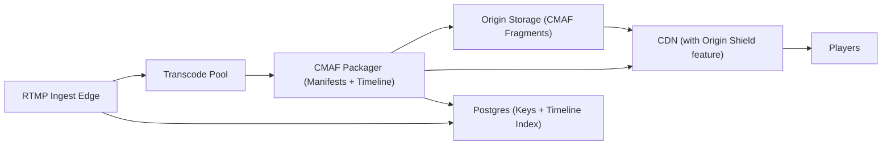

## Overview

This is a Twitch-like live platform that ingests RTMP, transcodes into a bitrate ladder, packages into a single canonical CMAF timeline, and serves low-latency playback with DVR.

Everything is a view over one append-only timeline per stream: **CMAF fMP4 fragments** with strict timestamps, aligned segment boundaries across renditions, and explicit discontinuities. Live is a small sliding window; DVR is the same timeline addressed by time/sequence for the last *N* hours. VOD after the stream ends is the same fragments with longer retention.

## What Makes This Hard

1. **Timeline correctness**: if renditions don’t share identical segment boundaries and discontinuity semantics, ABR switches break and DVR seeks land on undecodable frames.
2. **Manifest behavior at scale**: manifests are the hottest objects; low latency without playlist churn requires predictable cadence and cache-friendly responses.

## Requirements

### Functional Requirements
- RTMP ingest with per-stream authentication and immediate rejection on invalid keys.
- Transcoding ladder (e.g., 1080p/60 → 720p/60 → 480p/30 → 360p/30 → 160p) with consistent segment boundaries across renditions.
- Low-latency playback: glass-to-glass target ~3–5s on capable players (LL-HLS), graceful fallback to standard HLS/DASH.
- DVR: seek back in the last *N* hours (e.g., 6h) while the stream is live; after stream ends, publish VOD from the same artifacts.
- Fast stream start: first playable frames within ~1–2s after ingest begins (excluding player join latency).
- Multi-CDN support and origin shielding to avoid melting origins on hot streams.

### Scale Targets
- **Concurrent live streams:** 10,000
- **Average ingest bitrate:** 6 Mbps per stream; peak 12 Mbps
- **Ladder outputs:** 5 renditions, ~10 Mbps total per stream output
- **Concurrent viewers:** 200,000 average, 1,000,000 peak events
- **Segmenting:** 2s segments, LL-HLS parts at 200–500ms
- **DVR retention:** 6 hours hot retention

## Key Design Decisions

- **Canonical format: CMAF fMP4 for everything**
  - CMAF fragments are the only media representation; LL-HLS and DASH are just different manifests over the same fragments.

- **Timeline owned by the packager**
  - Transcoders produce deterministic GOP/keyframe cadence; the packager alone assigns segment/part boundaries, sequence numbers, and discontinuities.

- **One durable control store: Postgres**
  - Postgres holds stream keys, stream lifecycle, and an append-only timeline index (segments/parts + discontinuity events). Packagers cache hot state in-memory and use Postgres for recovery and DVR addressing.

## Architecture

### Components

- **RTMP Ingest Edge**
  - Justification: enforces the system boundary (auth/limits) and scales horizontally.
  - Responsibility: validate stream key against Postgres, enforce basic limits, forward input to transcoders.

- **Postgres (Keys + Timeline Index)**
  - Justification: one durable source for stream auth, lifecycle, and DVR addressing/recovery.
  - Responsibility: store stream keys; track stream state; append-only segment/part index and discontinuity events.

- **Transcode Pool**
  - Justification: turns messy inputs into deterministic outputs; without fixed GOP/IDR cadence, ABR/DVR fails.
  - Responsibility: normalize frame rate and enforce keyframes on the packager’s boundary schedule.

- **CMAF Packager (Manifests + Timeline)**
  - Justification: this is the product; it enforces “one correct timeline”.
  - Responsibility: generate CMAF fragments; write fragments to object storage; serve LL-HLS/HLS/DASH manifests via HTTP backed by in-memory state + Postgres index; insert explicit discontinuities consistently across renditions.

- **Origin Storage (CMAF Fragments)**
  - Justification: durable, cheap origin-of-record for immutable media.
  - Responsibility: store fragments keyed by stream/rendition/sequence; lifecycle policies implement retention for DVR/VOD.

- **CDN (with Origin Shield feature)**
  - Justification: required to serve 1M viewers and absorb spikes.
  - Responsibility: cache immutable fragments aggressively; cache manifests briefly with stale-while-revalidate; shield origins to collapse revalidation.

- **Players**
  - Justification: runtime reality; clients vary.
  - Responsibility: LL-HLS where supported; otherwise standard HLS/DASH with higher latency.

## Deep Dive: The Hardest Part
### A Single, Correct Timeline (Low-Latency + DVR + ABR)

All renditions share identical segment boundaries and safe decode points. Transcoding enforces fixed GOP/IDR cadence; the packager cuts segments/parts on a strict schedule and only at decodable boundaries. This makes bitrate switches and DVR seeks land on valid frames.

Discontinuities are explicit timeline events owned by the packager. They are inserted when the packager detects an input reset, timestamp jump, or gap beyond tolerance; Postgres records the event so manifests are consistent across restarts.

Manifests are served from the packager with predictable cadence:
- Live manifests expose a small sliding window for fast joins.
- DVR manifests are generated for a requested time/sequence range using the Postgres timeline index (same fragments, longer window), so DVR doesn’t require writing ever-growing playlists.

Caching is designed around availability over freshness: manifests are cacheable for ~1s at the CDN with `stale-while-revalidate`, while fragments/parts are immutable and cached long.

## Trade-offs

| Optimized For | Sacrificed |
|--------------|------------|
| One timeline for live + DVR + VOD | Packager correctness is critical-path |
| Fewer moving parts (Postgres only) | Postgres must be healthy for DVR indexing/recovery |
| Lower mutable-object churn (serve manifests, store fragments) | Packager becomes an origin for manifests (must scale) |
| Cache-friendly behavior | Lowest-possible latency (<2s) everywhere |

## Failure Modes

- **Transcoder worker dies mid-stream**
  - Detect: missing parts per rendition, packager input timeout, player rebuffer spike.
  - Recover: packager drops the rendition from manifests; autoscaler replaces worker; rendition returns behind a discontinuity.

- **Packager falls behind (CPU/IO pressure)**
  - Detect: part publish delay, manifest age at CDN, internal queue depth.
  - Recover: temporarily widen part duration / reduce part frequency; drop top rendition; scale packagers.

- **Object storage tail latency**
  - Detect: fragment PUT latency, CDN origin latency, 5xx/timeouts.
  - Recover: keep serving manifests; fragments remain immutable so CDN hit-rate improves; if needed, temporarily reduce renditions/bitrate to reduce write pressure.

- **Postgres down for ~5 minutes**
  - Behavior: existing streams keep publishing using in-memory timeline; DVR generation and new stream auth degrade.
  - Recover: reject new ingest keys while DB is down; resume indexing/DVR when DB returns.

- **Network partition between packager and Postgres**
  - Behavior: packager continues cutting the timeline and serving live manifests from memory; DVR generation degrades.
  - Recover: reattach and resume indexing; discontinuities remain driven by media signals.

- **Bad config/deploy (wrong GOP/IDR cadence, wrong part duration, cache TTL mistake)**
  - Detect: startup validation failures, ABR switch failures, manifest fetch errors, latency jump.
  - Recover: block stream start on invalid encoder settings; emergency switch to standard HLS (disable parts); revert TTL/cadence to known-good defaults.

- **Traffic 10x unexpectedly (hot stream)**
  - Detect: CDN revalidation surge, manifest QPS spike, packager CPU/network pressure.
  - Recover: raise manifest CDN TTL slightly; reduce part cadence; shrink live window; temporarily disable DVR generation for that stream.

## What We Removed

- **Separate Stream Control service**: merged into the packager; Postgres holds durable stream state and timeline index.
- **Redis**: removed; Postgres + in-memory hot state is the default.
- **Dedicated origin-shield proxy tier**: replaced with the CDN’s origin shield feature.
- **Object-storage-written, ever-growing DVR playlists**: replaced by on-demand DVR manifest generation from the Postgres timeline index.

## Operational Notes

- Enforce time sync (NTP) and fixed encoder settings (GOP/IDR cadence, bounded lookahead/VBV).
- Treat manifests as a product surface: stable URLs, predictable update cadence, CDN caching with short TTL + `stale-while-revalidate`.
- Degrade modes must be one-switch: drop renditions, widen parts, switch off LL-HLS parts, shrink live window, disable DVR generation per stream.
- Monitor what users feel: join time, player-reported live latency, rebuffer ratio, manifest fetch success, ABR switch failure rate.
