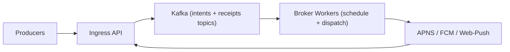

## Overview

This system accepts push notification intents, applies priority + rate limits, dispatches to APNS/FCM/web-push, and emits receipts.

The system’s core is a single worker tier that treats “send a push” as a **quota-governed scheduling problem**. Everything else is durable intake (Kafka) and boring I/O to providers.

## Requirements

### Functional Requirements
- Accept notifications with `tenant`, `audience` (device token or provider topic), `priority` (`critical|high|normal|bulk`), `ttl`, and `idempotency_key`.
- Enforce rate limits:
  - per-tenant
  - per-campaign/job
  - per-provider constraints (APNS/FCM throttles, connection caps)
- Prioritize so `critical` is protected under overload while preserving tenant fairness.
- Provide receipts with clear semantics: `ENQUEUED`, `DISPATCHED`, `PROVIDER_ACCEPTED`, `DELIVERED` (when available), `FAILED` (reasoned).
- Survive provider outages without dropping critical traffic; degrade bulk first.

### Scale Targets
- Ingest: **2M notifications/sec sustained**, **10M/sec burst for 60s**.
- Payload: avg **700B**, p99 **2KB**.
- Fanout: **1.2 destinations/notification** average.
- Latency SLO (broker → provider dispatch):
  - `critical`: p99 **200ms**
  - `normal`: p99 **2s**
  - `bulk`: best effort within TTL
- Receipts: **99.9% emitted** for broker + provider-acceptance states within **30s**.

## Key Design Decisions

- **Kafka is the only durable system of record.**
  - Intents are append-only; receipts are append-only.
  - If Kafka is unavailable, the broker does not accept traffic.

- **Partition ownership is the unit of correctness.**
  - Route by `hash(tenant_id)` so all traffic for a tenant is owned by exactly one Kafka partition at a time.
  - Rate limits and fairness are enforced only by the worker consuming that partition.

- **Scheduling is simple and explicit.**
  - Four in-memory queues per partition (`critical/high/normal/bulk`) with TTL enforcement.
  - `critical` is always attempted first (subject to provider circuit breaker + caps).
  - Non-critical uses round-robin across active tenants within each priority with per-tenant token buckets (no DRR/weights).

## Architecture

## Components

- **Ingress API**
  - Justification: the only public entrypoint for auth/validation and a single, durable write to Kafka.
  - Behavior:
    - Validates payload, normalizes priority/TTL, rejects oversized payloads.
    - Enforces a hard max fanout per request; large audiences must use provider topics.
    - Emits `ENQUEUED` by writing the intent to Kafka (no synchronous provider calls).
    - Receives provider callbacks/feedback (when available) and writes receipt events to Kafka.

- **Kafka**
  - Justification: durable intake + replay, and the receipt fact log.
  - Topics:
    - `intents` (append-only): notification intents to be dispatched.
    - `receipts` (append-only): state transitions and outcomes.
    - Optional `latest_status` (compacted): best-known status per `notification_id` for cheap queries.

- **Broker Workers**
  - Justification: the only custom logic—priority + quotas + provider-specific dispatch—in one horizontally scaled tier.
  - Responsibilities:
    - Consume `intents`, enqueue by priority, enforce TTL (expire → `FAILED` with `ttl_expired`).
    - Rate limit at dispatch time:
      - per-tenant token bucket (QPS + burst)
      - per-campaign token bucket (within tenant)
      - per-provider caps (max in-flight + dynamic QPS based on health)
    - Provider dispatch with bounded retries and strict in-flight limits.
    - Emit receipts (`DISPATCHED`, `PROVIDER_ACCEPTED`, `FAILED`) to Kafka.

- **APNS / FCM / Web-Push**
  - Justification: required external dependencies; treated as unreliable and rate-limited.

## Deep Dive: Scheduling Under Priority + Quotas (The Hardest Part)

Each Kafka partition is owned by exactly one worker at a time, so per-tenant state is local and lock-free.

- **Priority**
  - `critical` is always attempted first, but never bypasses provider safety limits (circuit breaker and in-flight caps).
  - `bulk` is strictly best-effort: it is the first to be delayed and the first to expire.

- **Fairness**
  - Within a priority level, the worker cycles through active tenants (round-robin).
  - Each tenant has its own token bucket; a tenant with no tokens is skipped until refilled.

- **Rate limiting**
  - Enforced only at the moment of dispatch.
  - Provider protection is explicit:
    - max concurrent in-flight per provider per worker
    - a provider token bucket whose refill rate is reduced when RTT/errors rise

- **Idempotency**
  - Contract: at-least-once dispatch.
  - Broker behavior: best-effort de-duplication within a bounded time window per partition keyed by `(tenant_id, idempotency_key)`; duplicates outside the window may be re-sent and are visible via receipts.

- **Receipts semantics**
  - `ENQUEUED`: intent durably written to Kafka.
  - `DISPATCHED`: worker attempted a provider send.
  - `PROVIDER_ACCEPTED`: provider accepted the request (not device delivery).
  - `DELIVERED`: only when the provider supplies a delivery signal.
  - `FAILED`: terminal broker decision (e.g., `ttl_expired`, `invalid_token`, `provider_rejected`, `retries_exhausted`).

## Trade-offs

| Optimized For | Sacrificed |
|--------------|------------|
| Few moving parts (3-engineer operable) | Less independent scaling between “scheduling” and “dispatch” |
| Strict per-tenant quotas (single-partition ownership) | Hot tenants can be throughput-limited by their partition |
| Clear receipts as a fact log | At-least-once dispatch unless providers support strong de-dupe |
| Predictable overload behavior (critical protected, bulk expires) | Some bulk traffic may never send under sustained provider issues |

## Failure Modes

1. **Kafka unavailable**
   - **What happens:** ingress rejects requests.
   - **Detect:** produce failures / Kafka client error rate.
   - **Recover:** return 503; producers retry with `idempotency_key`; once Kafka returns, normal flow resumes.

2. **Provider throttling/outage**
   - **What happens:** provider circuit breaker opens; dispatch slows; queues grow; bulk expires first.
   - **Detect:** provider error codes, RTT, open-breaker state, queue age by priority.
   - **Recover:** shrink provider send rate, cap retries, keep `critical` flowing when possible, emit `FAILED` on TTL expiry.

3. **Network partition: worker can read Kafka but can’t reach providers**
   - **What happens:** breaker opens quickly; retries stay bounded; intent backlog grows.
   - **Detect:** simultaneous provider connection failures + rising queue age.
   - **Recover:** stop sending until connectivity returns; do not amplify with uncontrolled retries; expire by TTL.

4. **Slow component (CPU throttling / RTT p99 jumps)**
   - **What happens:** in-flight caps are hit; queues age upward before errors appear.
   - **Detect:** queue age by priority + worker event loop lag + provider RTT.
   - **Recover:** reduce per-worker concurrency, scale workers, and allow bulk to expire rather than destabilizing critical.

5. **Bad policy/config deploy**
   - **What happens:** incorrect bucket sizes or caps can starve priorities or overload providers.
   - **Detect:** abrupt SLO regression in queue age and provider errors after a config change.
   - **Recover:** bounded config values, fast rollback, and a safe default profile (conservative provider caps, strict bulk shedding).

## What We Removed

- Separate `Schedulers` and `Dispatchers` services (merged into one `Broker Worker` tier).
- Separate `Receipt Ingest` service (callbacks handled by `Ingress API`).
- Separate “Receipt Log component” (receipts are Kafka topics; optional compacted `latest_status` for queries).
- Shard-wide weighted fair scheduling (DRR/weights) in favor of priority queues + per-tenant buckets + round-robin.
- External checkpointed rate-limit state store (all enforcement is partition-local; restarts rely on replay + conservative ramp-up).

## Operational Notes

- Primary on-call dashboard: **queue age by priority**, plus provider breaker state and in-flight saturation.
- Backpressure is explicit and bounded: max in-flight per provider, capped retries, strict TTL expiry.
- Consumer rebalances are treated as routine: replay is normal; receipts make duplicates and retries visible.
- Receipt documentation is a state machine: `PROVIDER_ACCEPTED` is never “delivered”, and `DELIVERED` is optional.
