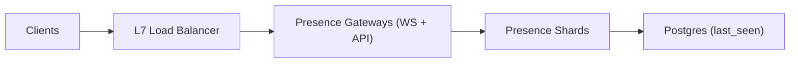

## Overview

This system tracks **Online** and **Last Seen** for millions of concurrent users by treating the **server-side connection as truth** and writing to the database only on **state transitions** (0→1 sessions, 1→0 sessions). No per-user TTL refresh loop.

Presence lives in memory on sharded servers for speed. Gateways keep sockets and report connect/disconnect. Shards aggregate multi-device state and persist `last_seen` to Postgres only when a user goes fully offline.

## What Makes This Hard

At 10M concurrent users, “store a TTL per user and refresh it” turns presence into a constant write firehose.

The real problem is **unclean disconnects** (crashes, partitions, load balancer resets). Presence must converge to offline without relying on per-user heartbeats to a central store.

## Requirements

### Functional Requirements
- **Online status** with seconds-level freshness.
- **Last Seen** is when the user last transitioned from “online on at least one device” to “offline on all devices.”
- **Multi-device**: user is online if any session is active.
- **Privacy/visibility**: online/last-seen access is filtered by relationship and user settings.
- **Real-time updates** for active views, plus efficient batch lookup.

### Scale Targets
- **Concurrent connections:** 10M active WebSockets.
- **Presence transition rate:** ~5.5k connects/s and ~5.5k disconnects/s globally; plan for **50k/s bursts**.
- **Lookup fanout:** 50–500 users per view; **single-digit ms** server time.
- **Write amplification target:** writes scale with **session transitions + gateway liveness signals**, not “online users × refresh interval.”

## Key Design Decisions

- **Decision 1: Connection-derived presence (no per-user TTL refresh)**
  - Gateways report only **connect/disconnect**; shards compute online via session counts.

- **Decision 2: Gateway liveness without a separate coordinator**
  - Gateways send a fixed-rate `GatewayAlive(gateway_id)` to the shards they currently touch.
  - Shards expire all sessions owned by a gateway after a short timeout.

- **Decision 3: `last_seen` is written by shards**
  - Shards write `last_seen` to Postgres only on **1→0** transitions, buffered and de-duped.

- **Decision 4: Shard restart recovery comes from gateways**
  - Shards expose a `shard_epoch` that changes on restart.
  - Gateways replay their currently-active sessions to a shard when they detect an epoch change.

## Architecture

### Components

- **Presence Gateways (WS + API)**
  - Terminates WebSockets, authenticates users, and hosts the presence HTTP API endpoints used by clients.
  - Sends `Connect/Disconnect` to shards; sends periodic `GatewayAlive` to shards it has sessions on.
  - Enforces policy on sockets: if it can’t reach shards, it closes sockets to force reconnection and converge presence.

- **Presence Shards**
  - Sharded by `user_id` (consistent hashing).
  - Maintains in-memory state: per-user active sessions (multi-device), and per-gateway ownership for cleanup.
  - Serves batch lookups and watches to gateways, applying privacy checks provided by the gateway’s request context.
  - Writes `last_seen` to Postgres only when session count transitions **1→0**.

- **Postgres (`last_seen`)**
  - Durable store for `last_seen_at` (and any presence-visibility settings the product needs).
  - Not on the hot path for online reads.

## Deep Dive: Offline Detection Without Write Amplification

**1) Session ownership and idempotency**
- On WebSocket connect, the gateway assigns a `session_id` unique per gateway (timestamp+counter is sufficient).
- Gateway sends `Connect(user_id, session_id, gateway_id, device_id, shard_epoch)` to the user’s shard.
- The shard stores sessions keyed by `session_id`; duplicate `Connect`/`Disconnect` is a no-op.

**2) Clean disconnect path**
- On WS close, gateway sends `Disconnect(user_id, session_id, gateway_id, shard_epoch)`.
- If the user’s session count goes **1→0**, the shard emits an internal `UserOffline` transition and buffers a Postgres update: `last_seen_at=now`.

**3) Unclean disconnect path (gateway death)**
- Every gateway sends `GatewayAlive(gateway_id, shard_epoch)` at a fixed cadence to each shard it currently has sessions on.
- Each shard tracks `last_alive_at[gateway_id]`. If it exceeds a timeout (e.g., 15s), the shard deletes all sessions owned by that gateway and drives the same 1→0 transitions as clean disconnects.

**4) Shard restart recovery (no log replay)**
- Each shard has an in-memory `shard_epoch` that changes on restart.
- If a shard receives any message with a stale epoch, it replies with `ERR_EPOCH_MISMATCH(current_epoch)`.
- On mismatch, the gateway replays its currently active sessions for users that map to that shard (idempotent `Connect` replays), then resumes normal deltas.
- While a shard is restarting, it runs in `RECOVERING`: it answers presence as `UNKNOWN` and does not emit 1→0 transitions or write `last_seen`. After a short resync grace window, it switches to `ACTIVE`.

**5) Partition policy (gateways ↔ shards)**
- If a gateway cannot reach shards, it closes all sockets it owns within a short grace period.
- Clients reconnect via the load balancer; connect events rebuild correct shard state.

## Trade-offs

| Optimized For | Sacrificed |
|--------------|------------|
| Minimal moving parts | No durable presence event log or audit stream |
| Low write amplification | Offline detection bounded by liveness timeout |
| Correctness via convergence | `UNKNOWN` during shard recovery/partitions |
| Small-team operability | Shard restart requires gateway resync traffic |

## Failure Modes

- **Gateway dies abruptly**
  - Users stay online until shard liveness timeout.
  - Shards expire gateway-owned sessions and update `last_seen` on 1→0.

- **Presence shard restarts while gateways are healthy**
  - Shard serves `UNKNOWN` while `RECOVERING`.
  - Gateways detect epoch mismatch and replay active sessions; shard becomes `ACTIVE` after the resync window.
  - `last_seen` writes are fenced until `ACTIVE` to avoid false offline writes.

- **Network partition: gateways can’t reach shards, clients stay connected**
  - Gateways close sockets to force reconnect and converge to a single truth.
  - Presence stabilizes after reconnect + resync.

- **Bad config causes liveness timeout mismatch**
  - Gateways validate at startup: `alive_interval < timeout/3`.
  - Shards reject invalid timeouts and emit an “offline storm” metric when expirations spike.

- **Postgres is slow/unavailable**
  - Online presence remains correct (in-memory).
  - Shards buffer `last_seen` updates up to a hard limit; beyond that, they drop older updates (the next 1→0 will write a newer `last_seen`).

## Operational Notes

- Default: `GatewayAlive` every ~5s, shard expiration at ~15s.
- Keep gateways stateless beyond their socket tables; rollout by draining connections per gateway.
- Cap `WatchPresence` by user count and connection; degrade by switching to polling for oversized watchlists.
- Treat `UNKNOWN` as a first-class response and normalize it through privacy filtering (no side-channels).

## What We Removed

- **etcd leases**: replaced by direct `GatewayAlive` signals from gateways to shards.
- **Kafka presence log**: removed durable presence event streaming and replay-based shard warmup.
- **LastSeen Writer service**: merged into presence shards with buffered, idempotent Postgres writes.
- **Separate Presence API service**: merged into gateways (WS termination + API entrypoint).
